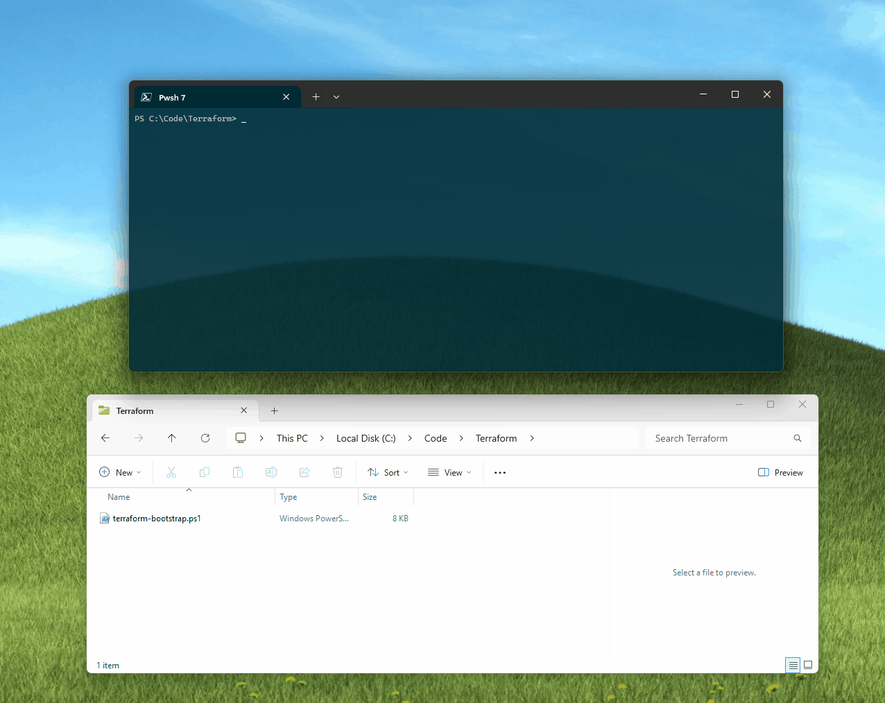
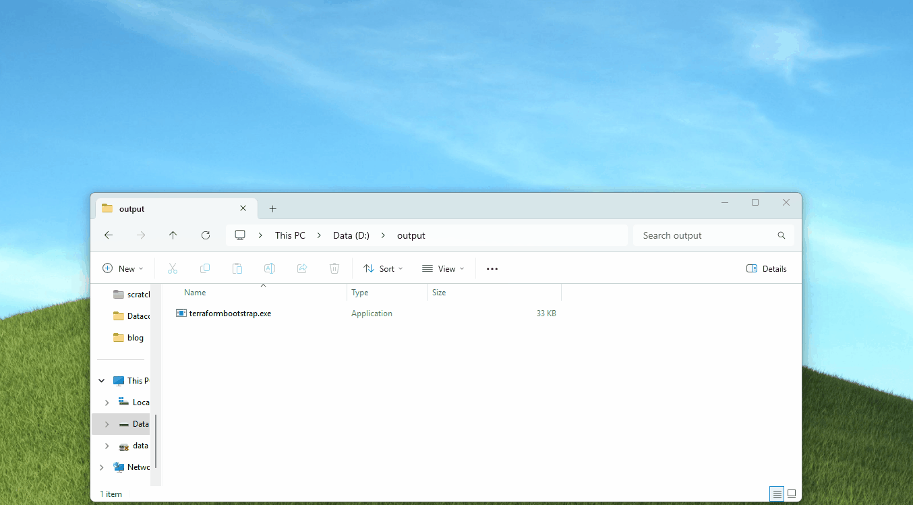

Today, we will implement a Terraform bootstrap script that will install Terraform and create directories where we can place our Terraform project, which will then run a plan against and deploy. This script will be written in PowerShell to bootstrap a new Terraform project.

> "Bootstrapping usually refers to a self-starting process that is supposed to continue or grow without external input. Many analytical techniques are often called bootstrap methods in reference to their self-starting or self-supporting implementation" ~ Wikipedia.

{/* truncate */}

## 📜 Script Overview

Inspired by the [ALZ Accelerator](https://github.com/Azure/ALZ-PowerShell-Module) bootstrap script, this script will:

1. Install-Terraform
- Downloads and installs Terraform if not present
- Handles version management
- Supports Windows/Mac/Linux detection
- Adds Terraform to PATH
2. Creates required directories (config and output)
- Copies *.tf and *.tfvars files from config to output
- Validate file contents and paths
3. Invoke-Terraform
- Initializes Terraform
- Creates execution plan
- Handles apply/destroy with optional auto-approve
- Manages working directory context

And I've tested it on my Windows 11 machine and a Linux Codespace. In my examples, I am using it to run some base Terraform to deploy a new Resource Group and Storage Account in the New Zealand North Azure region.



:::tip
You could also look at turning it into an executable using something like [PS2EXE](https://github.com/MScholtes/PS2EXE), and then you can run it like any other executable, as below:


:::

## 📋 Prerequisites

- PowerShell 5.1 or PowerShell Core 6.0+
- Internet connectivity for downloading Terraform
- Azure CLI is installed and logged in (`az login`). It is only required if deploying to Azure.
- Write permissions to the directory where you'll run the script

## 🎯 Usage Examples

Basic usage with default parameters:

```powershell
.\Terraform-Bootstrap.ps1
```

Custom paths and auto-approved apply:

```powershell
.\Terraform-Bootstrap.ps1 -terraformPath "C:\terraform" -configPath "C:\tf-configs" -outputPath "C:\tf-output" -autoApprove
```

Using a specific Terraform version:

```powershell
.\Terraform-Bootstrap.ps1 -terraformPath "C:\terraform" -configPath "C:\tf-configs" -outputPath "C:\tf-output"
```

## 💻 PowerShell Script

```powershell title="Terraform-Bootstrap.ps1"
<#
    .SYNOPSIS
    Bootstraps Terraform environment and runs specified Terraform commands.

    .DESCRIPTION
    This script ensures Terraform is installed, sets up the Terraform workspace, and runs specified Terraform commands.
    It supports downloading the latest version of Terraform, creating necessary directories, and copying configuration files.
    The script is intended to be used to bootstrap Terraform environments for testing and development purposes and once-off deployments of any code in the Config directory.

    .NOTES
    Version:        1.0
    Author:         luke.geek.nz
    Creation Date:  10/01/25
    Purpose/Change: 
    14/05/17 - Initial script creation

    .PARAMETER terraformPath
    The path where Terraform will be installed.

    .PARAMETER terraformVersion
    The version of Terraform to install. Defaults to "latest".

    .PARAMETER configPath
    The path to the directory containing Terraform configuration files.

    .PARAMETER outputPath
    The path to the directory where Terraform will be executed.

    .PARAMETER autoApprove
    Automatically approve Terraform apply and destroy actions.

    .EXAMPLE
    .\Terraform-Bootstrap.ps1 -terraformPath ".\terraform" -terraformVersion "latest" -configPath ".\config" -outputPath ".\output"
#>

[CmdletBinding()]
param (
    [Parameter(Mandatory = $false)]
    [string]$terraformPath = ".\terraform",
    
    [Parameter(Mandatory = $false)]
    [string]$terraformVersion = "latest",
    
    [Parameter(Mandatory = $false)]
    [string]$configPath = ".\config",
    
    [Parameter(Mandatory = $false)]
    [string]$outputPath = ".\output",
    
    [Parameter(Mandatory = $false)]
    [switch]$autoApprove
)

# Function to ensure Terraform is installed
function Install-Terraform {
    param (
        [string]$version,
        [string]$path
    )
    
    # Get latest version if not specified
    if ($version -eq "latest") {
        $versionResponse = Invoke-WebRequest -Uri "https://checkpoint-api.hashicorp.com/v1/check/terraform"
        $version = ($versionResponse).Content | ConvertFrom-Json | Select-Object -ExpandProperty current_version
    }

    # Check if Terraform is already installed
    $tfCommand = Get-Command -Name terraform -ErrorAction SilentlyContinue
    if ($tfCommand) {
        Write-Verbose "Terraform already installed at $($tfCommand.Path)"
        return
    }

    # Create tools directory
    if (!(Test-Path $path)) {
        New-Item -ItemType Directory -Path $path | Out-Null
    }

    # Download and extract Terraform
    $os = if ($IsWindows) { "windows" } else { if ($IsMacOS) { "darwin" } else { "linux" } }
    $arch = if ([System.Environment]::Is64BitOperatingSystem) { "amd64" } else { "386" }
    
    $url = "https://releases.hashicorp.com/terraform/$($version)/terraform_$($version)_${os}_${arch}.zip"
    $zipFile = Join-Path $path "terraform.zip"
    $extractPath = Join-Path $path "terraform_$version"

    Write-Verbose "Downloading Terraform from $url"
    Invoke-WebRequest -Uri $url -OutFile $zipFile
    
    Write-Verbose "Extracting Terraform to $extractPath"
    Expand-Archive -Path $zipFile -DestinationPath $extractPath -Force
    Remove-Item $zipFile

    # Add to PATH
    $env:PATH = "$extractPath;$env:PATH"
}

# Function to run Terraform commands
function Invoke-Terraform {
    param (
        [string]$workingDirectory,
        [string]$command,
        [switch]$autoApprove
    )

    Push-Location $workingDirectory
    try {
        # Initialize
        Write-Host "Initializing Terraform..." -ForegroundColor Green
        terraform init

        # Run specified command
        Write-Host "Running terraform $command..." -ForegroundColor Green
        if ($command -eq "apply" -or $command -eq "destroy") {
            terraform plan -out=tfplan
            
            if (!$autoApprove) {
                $confirmation = Read-Host "Do you want to proceed with terraform $command? (y/n)"
                if ($confirmation -ne 'y') {
                    Write-Host "Operation cancelled" -ForegroundColor Yellow
                    return
                }
            }
            
            if ($command -eq "apply") {
                terraform apply -auto-approve tfplan
            }
            else {
                terraform destroy -auto-approve
            }
        }
        else {
            terraform $command
        }
    }
    finally {
        Pop-Location
    }
}

# Main script
try {
    # Create required directories
    if (!(Test-Path $configPath)) {
        New-Item -ItemType Directory -Path $configPath -Force | Out-Null
        Write-Host "Config directory created at $configPath. Please place Terraform files into this directory and press any key to continue..." -ForegroundColor Yellow
        Read-Host
    }
    if (!(Test-Path $outputPath)) {
        New-Item -ItemType Directory -Path $outputPath -Force | Out-Null
    }

    # Install Terraform
    Write-Host "Ensuring Terraform is installed..." -ForegroundColor Green
    Install-Terraform -version $terraformVersion -path $terraformPath

    # Copy Terraform files from config to output directory
    Write-Host "Setting up Terraform workspace..." -ForegroundColor Green
    
    # Convert to absolute paths
    $configPathFull = Resolve-Path $configPath -ErrorAction Stop
    $outputPathFull = Resolve-Path $outputPath -ErrorAction Stop
    
    Write-Verbose "Config Path: $configPathFull"
    Write-Verbose "Output Path: $outputPathFull"
    
    $configFiles = Get-ChildItem -Path $configPathFull -Recurse -File -Filter "*.tf" -ErrorAction Stop
    $varFiles = Get-ChildItem -Path $configPathFull -Recurse -File -Filter "*.tfvars" -ErrorAction Stop
    
    Write-Verbose "Found $($configFiles.Count) .tf files"
    
    foreach ($file in $configFiles) {
        Write-Verbose "Processing file: $($file.FullName)"
        
        # Verify source file
        if (!(Test-Path $file.FullName)) {
            Write-Error "Source file not found: $($file.FullName)"
            continue
        }
        
        # Check file content
        $content = Get-Content $file.FullName -Raw
        if ([string]::IsNullOrWhiteSpace($content)) {
            Write-Warning "File is empty: $($file.FullName)"
            continue
        }
        
        Write-Host "Copying $($file.Name) to $outputPathFull" -ForegroundColor Green
        Copy-Item -Path $file.FullName -Destination $outputPathFull -Force
        
        # Verify copy succeeded
        $destFile = Join-Path $outputPathFull $file.Name
        if (!(Test-Path $destFile)) {
            Write-Error "Failed to copy file to: $destFile"
        }
    }
    
    foreach ($file in $varFiles) {
        Write-Verbose "Processing var file: $($file.FullName)"
        Write-Host "Copying $($file.Name) to $outputPathFull" -ForegroundColor Green
        Copy-Item -Path $file.FullName -Destination $outputPathFull -Force
    }

    
    # Run Terraform
    Write-Host "Running Terraform..." -ForegroundColor Green
    Invoke-Terraform -workingDirectory $outputPath -command "apply" -autoApprove:$autoApprove

}
catch {
    Write-Error "Error occurred: $_"
    exit 1
}
```

This script can also be found on GitHub [here](https://github.com/lukemurraynz/PowerOfTheShell/blob/master/Other/Terraform-Bootstrap.ps1), if you wanted to fork, or open up a Pull Request with changes.

Hopefully this is useful for you, having a script like this means I can quickly deploy resources that are coded in Terraform _(HCL)_.

## 📂 Example Terraform Files

For those interested, here is the base Terraform code I am using in my example:

```hcl title="config/main.tf"
resource "azurerm_resource_group" "example" {
  name     = "example-stgaccount-rg"
  location = "New Zealand North"
}

resource "azurerm_storage_account" "example" {
  name                     = "stgacctfboot1"
  resource_group_name      = azurerm_resource_group.example.name
  location                 = azurerm_resource_group.example.location
  account_tier             = "Standard"
  account_replication_type = "LRS"

  tags = {
    environment = "staging"
  }
}
```

```hcl title="config/providers.tf"
terraform {
  required_providers {
    azurerm = {
      source = "hashicorp/azurerm"
      version = "4.15.0"
    }
  }
}

provider "azurerm" {
  subscription_id = "9dc6cc8c-5b10-403b-9a2f-5192497ca1ed"

  features {}

}
```
