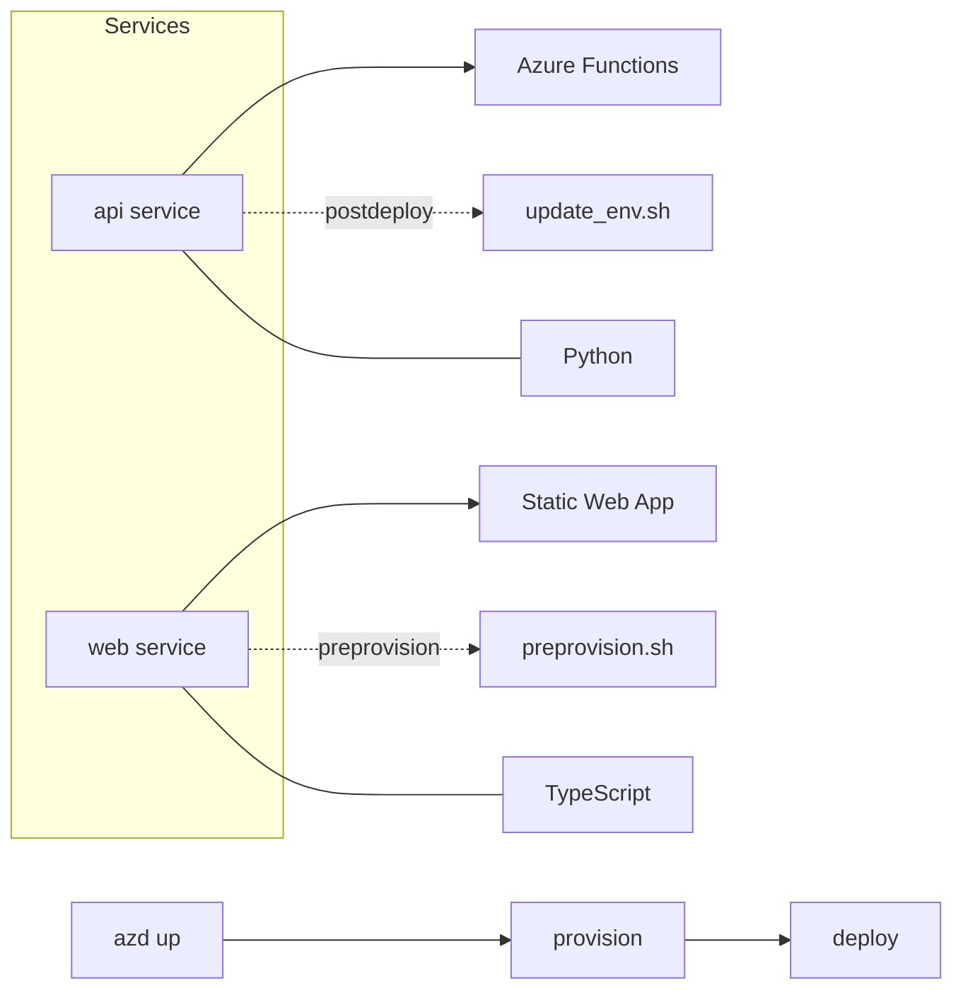

The [Azure Developer CLI (azd)](https://learn.microsoft.com/azure/developer/azure-developer-cli/overview?tabs=windows&WT.mc_id=AZ-MVP-5004796) is an open-source tool that accelerates provisioning and deploying app resources on Azure, it is great for deploying resources quickly and easily - especially in a proof of concept, or rapid innovation scenario.

One of the resources you can deploy _(both Infrastructure and Application)_ is a [Azure Static Web App](https://learn.microsoft.com/azure/static-web-apps/overview?WT.mc_id=AZ-MVP-5004796) recently, I ran into an issue where I was deploying a backend [Azure Function](https://learn.microsoft.com/azure/azure-functions/functions-overview?pivots=programming-language-python&WT.mc_id=AZ-MVP-5004796), and I needed a react web application front end hosted on the Azure Static WebApp to pull the function app URL and function key from the runtime environment variables, and quickly realized that React does not support runtime environment variables - only build-time environment variables.

{/* truncate */}

It makes a bit of sense when you step back - React is a front-end framework, and the environment variables are injected at build time, so the front end can be built with the correct values, especially for a static web app - that isn't dynamically generated at runtime. 

> [Adding Custom Environment Variables](https://create-react-app.dev/docs/adding-custom-environment-variables/). The environment variables are embedded during the build time. Since Create React App produces a static HTML/CSS/JS bundle, it can’t possibly read them at runtime. To read them at runtime, you would need to load HTML into memory on the server and replace placeholders in runtime, as [described here](https://create-react-app.dev/docs/title-and-meta-tags#injecting-data-from-the-server-into-the-page). Alternatively you can rebuild the app on the server anytime you change them.

So, if that is the case, how can I get the Azure Function URL and Function Key into the React front end? When the name of the function app, and the Static WebApp are dynamically created each time I deploy?

:::warning
The method below leaves the endpoint and key in the source code, which is not recommended for production applications. Please look at other forms of authentication to a backend API service, such as the built-in [Azure Static API support](https://learn.microsoft.com/azure/static-web-apps/apis-overview?WT.mc_id=AZ-MVP-5004796).
:::

To get around the limitation of the dynamic variables, I made use of the [Azure Developer CLI (azd)](https://learn.microsoft.com/azure/developer/azure-developer-cli/overview?tabs=windows&WT.mc_id=AZ-MVP-5004796) postdeploy feature, which allows you to run a script after a deployment has completed.

My setup looks like this:



Essentially, once the API _(Python)_ has been deployed, Azure Developer CLI will run an update_env.sh script, which will update the React `.env.production` file with the correct values for the Azure Function URL and Function Key.

So my azure.yaml file looks like this:

```yaml
services:
  api:
    project: ./src/api
    language: python
    host: function
    hooks:
      postdeploy:
        posix:
          shell: sh
          run: ../../hooks/update_env.sh
          interactive: true
          continueOnError: false
```

And inside my update_env.sh script, I have the following:

```bash
#!/bin/bash
set -e

# Fetch the Function App name and Resource Group from azd environment
AZD_VALUES=$(azd env get-values --output json)
echo "AZD_VALUES: $AZD_VALUES"

FUNCTION_APP_NAME=$(echo $AZD_VALUES | jq -r '.AZURE_FUNCTION_NAME')
RESOURCE_GROUP=$(echo $AZD_VALUES | jq -r '.AZURE_RESOURCE_GROUP')
FUNCTION_APP_URL=$(echo $AZD_VALUES | jq -r '.AZURE_FUNCTION_URI')

echo "Function App Name: $FUNCTION_APP_NAME"
echo "Resource Group: $RESOURCE_GROUP"

# Get the Function App URL
echo "Function App URL: $FUNCTION_APP_URL"

# Get the Function App key
FUNCTION_APP_KEY=$(az functionapp keys list --name $FUNCTION_APP_NAME --resource-group $RESOURCE_GROUP --query functionKeys.default -o tsv)
echo "Function App Key: $FUNCTION_APP_KEY"

# Update the .env.production file
sed -i "s|^REACT_APP_API_URL=.*|REACT_APP_API_URL=$FUNCTION_APP_URL/api|" ../web/.env.production

echo "Function App Name: $FUNCTION_APP_NAME"
echo "Resource Group: $RESOURCE_GROUP"
echo "Function App URL: $FUNCTION_APP_URL"
```

To utilize the script, I need to make sure I am authenticated to Azure _(az login)_ and the script runs as part of my deployment.

I also made sure I was outputting the Resource Group, FunctionApp name etc as part of my main.bicep file, so it was able to be picked up by the Azure Developer CLI variables.

Then, after the script ran and the `.env.production` file updated, Azure Developer CLI was able to continue on to the second part of my deployment - building the React website and then deploying it to the Azure Static WebApp.

