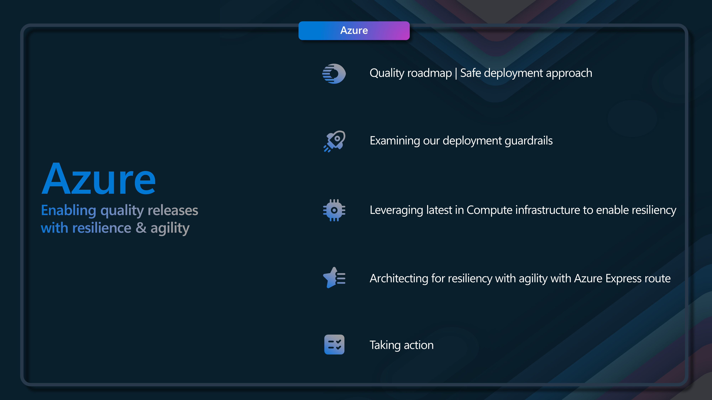
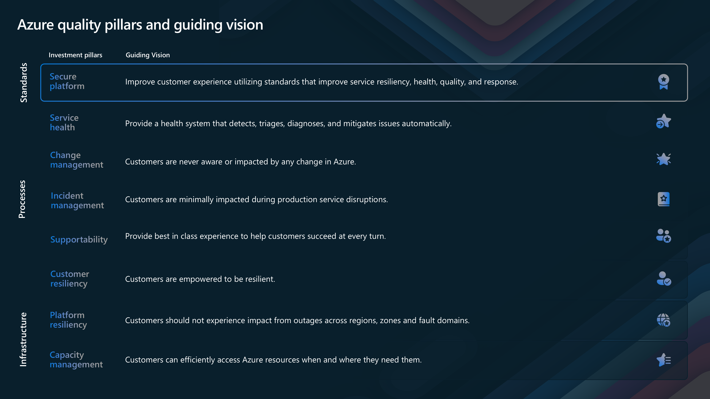
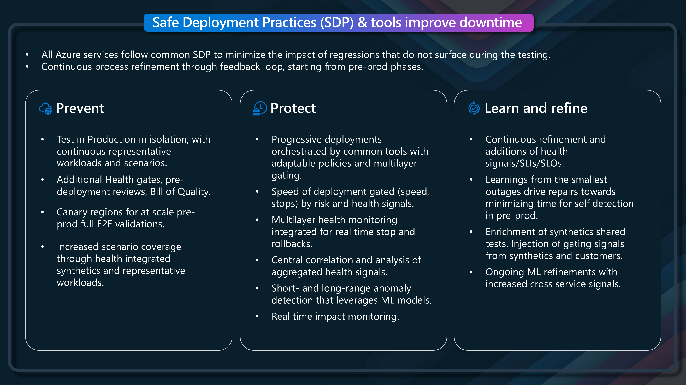
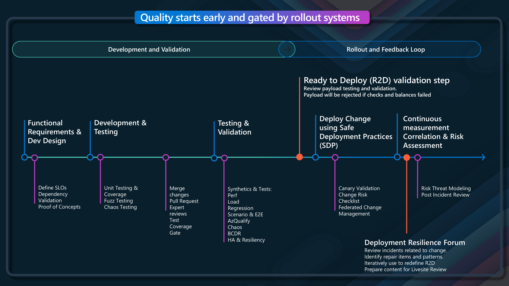
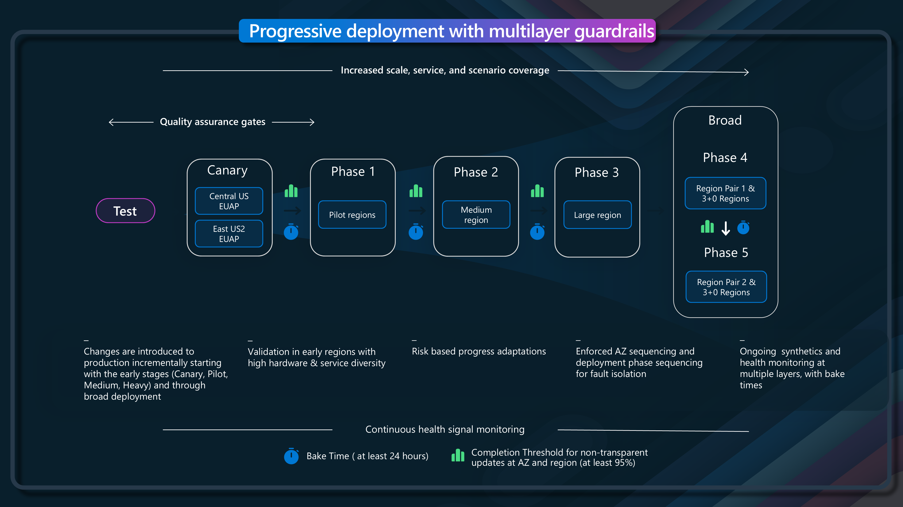
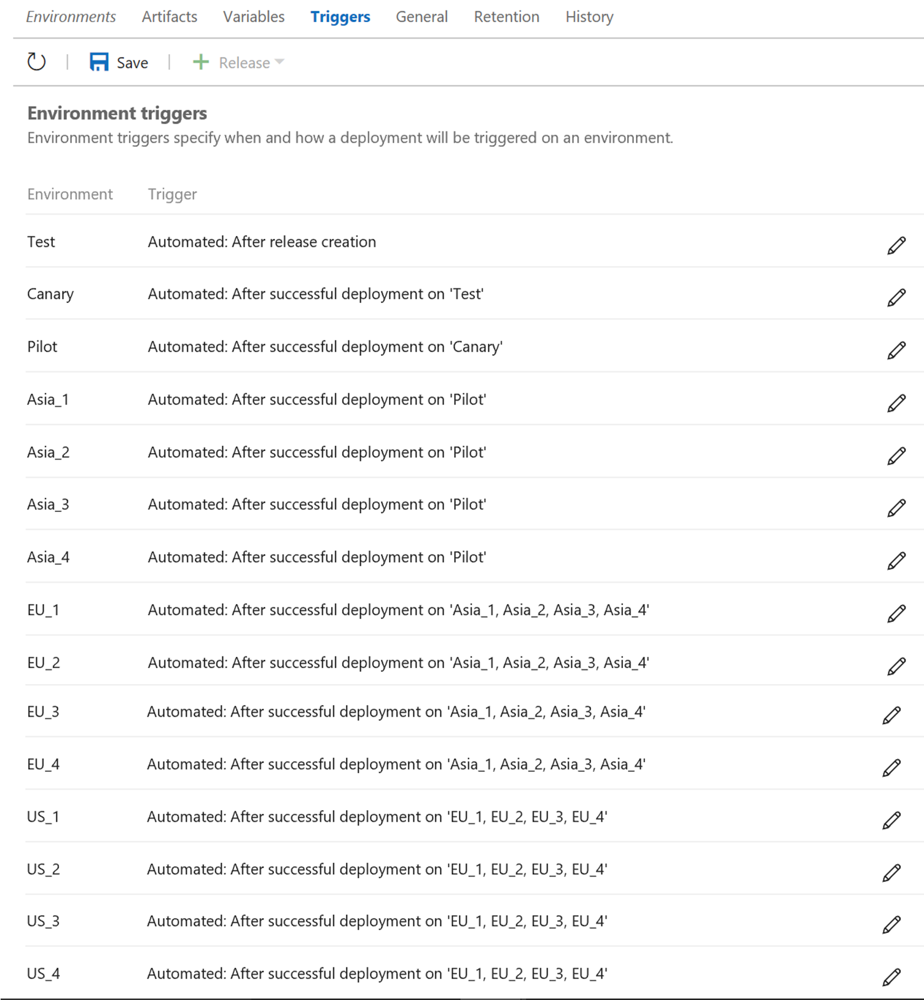

Today, we will touch on how Microsoft releases changes globally across the Microsoft Azure ecosystem. It always amazes me how Microsoft can release changes daily across Azure without customers noticing _(the majority of the time)_, yet they benefit from new capabilities swiftly. 

Microsoft has implemented several quality stages for Azure, and they are continuously enhancing platform automation and processes to ensure Azure service changes have zero impact on customer workloads. Let's take a look at how Microsoft is achieving this.

Would you like to know how Azure releases changes to Production while maintaining high Quality and Agility? Azure implements hundreds of changes daily without customers noticing, yet they benefit from new capabilities swiftly. You can learn about the quality stages for Azure and how they are learning to help ensure Microsoft continuously enhances platform automation and processes to ensure Azure service changes have zero impact on customer workloads.

{/* truncate */}

## 🎯 Azure Well-Architected Framework Integration

The Well-Architected Framework has an entire pillar dedicated to [Reliability](https://learn.microsoft.com/azure/well-architected/reliability/?WT.mc_id=AZ-MVP-5004796) and [Operational excellence](https://learn.microsoft.com/azure/well-architected/operational-excellence/?WT.mc_id=AZ-MVP-5004796), so lets take a look at how these pillars are adapted to work with the deployment of core Azure platform and service deployments, along with elements of [safe deployment practices](https://learn.microsoft.com/devops/operate/safe-deployment-practices?WT.mc_id=AZ-MVP-5004796) that are used to deploy Azure services/payloads at a global scale.

## 🏗️ Azure Investment Pillars

Let's take a look at the aspiration that Microsoft has with the Azure ecosystem and how they are working to ensure that they can deliver changes to the platform without impacting customers, with the aspiration of '0 changes impact production, and they cause 0 outages' as a north star.

To get there, Microsoft is working on a number of key areas, including the following investment pillars:

* Secure platform
* Service health
* Change management
* Incident management
* Supportability
* Customer resiliency
* Platform resiliency
* Capacity management

## 🛡️ Safe Deployment Practices

Lets take a look at how the [safe deployment practices](https://learn.microsoft.com/devops/operate/safe-deployment-practices?WT.mc_id=AZ-MVP-5004796) work in the context of the Azure platform, and how they are used to ensure that changes are deployed safely and securely, with 3 key areas of focus:

* Prevention
* Protection
* Learn and refine

Prevention is about:

* Testing in Production in isolation, with continuous representative workloads and scenarios. 
* Having Additional Health gates, pre-deployment reviews, and a Bill of Quality.
* Utilising Canary regions for at-scale pre-prod full E2E validations.
* Having increased scenario coverage through health integrated synthetics and representative workloads.

Protection is about:

* Progressive deployments orchestrated by standard tools with adaptable policies and multilayer gating.
* Speed of deployment gated (speed, stops) by risk and health signals.
* Multilayer health monitoring integrated for real-time stops and rollbacks.
* Central correlation and analysis of aggregated health signals.
* Short- and long-range anomaly detection that leverages ML models.
* Real-time impact monitoring.

Learn and refine is about:

* Continuous refinement and additions of [health signals/SLIs/SLOs](https://learn.microsoft.com/azure/well-architected/design-guides/health-modeling?WT.mc_id=AZ-MVP-5004796).
* Learnings from the smallest outages drive repairs towards minimizing the time for self-detection in pre-prod.
* Enrichment of synthetics shared tests. Injection of gating signals from synthetics and customers.
* Ongoing ML refinements with increased cross-service signals.

These areas of focus help to define rollout systems and processes that are used to ensure that changes are deployed safely and securely, with the ability to roll back changes if they are not successful, emphasizing quality and ready-to-deploy validation steps.

## 🎯 Quality Gates and Release Process

Once the quality gates and processes, the rollout of the payload occurs across Canary _(no Production workloads)_, Pilot regions, Medium and large before being deployed further to the rest of the areas, with 24-hour 'bake time' before each deployment, with the ability to rollback changes if they are not successful, and the processes and quality gates are started again.

## 📚 References

* [Configuring your release pipelines for safe deployments](https://devblogs.microsoft.com/devops/configuring-your-release-pipelines-for-safe-deployments/?WT.mc_id=AZ-MVP-5004796)
* [How Microsoft Azure ensures high-Quality releases with Agility](https://ignite.microsoft.com/en-US/sessions/BRK243)
* [Deployment and testing for mission-critical workloads on Azure](https://learn.microsoft.com/azure/architecture/reference-architectures/containers/aks-mission-critical/mission-critical-deploy-test?WT.mc_id=AZ-MVP-5004796)
* [Advancing safe deployment practices](https://azure.microsoft.com/blog/advancing-safe-deployment-practices/?WT.mc_id=AZ-MVP-5004796)
