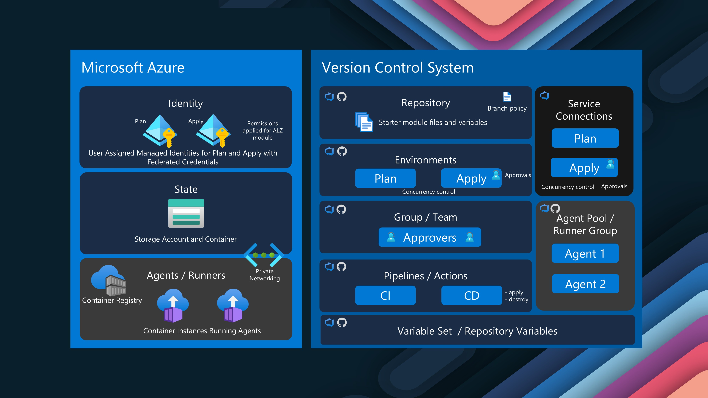
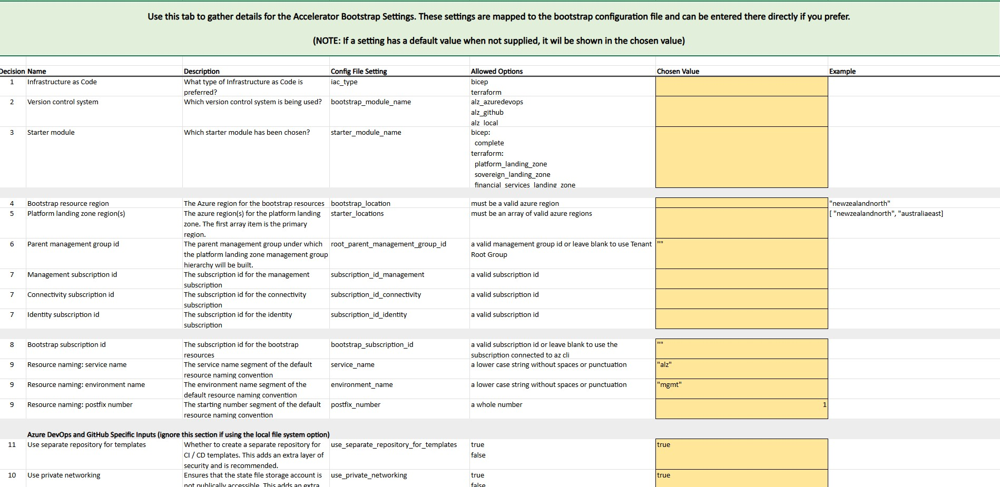
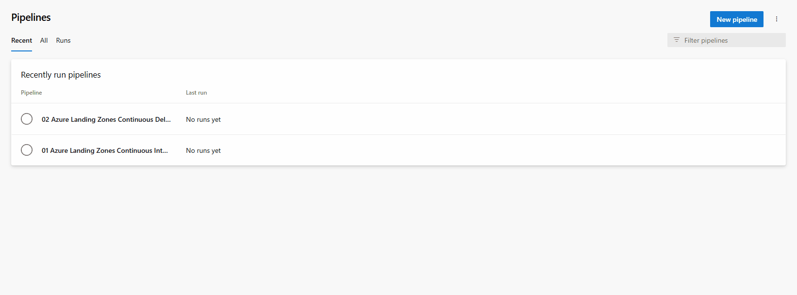

As part of the [Azure Back to School](https://azurebacktoschool.github.io/) event for 2025, we are here to take a look at [Azure Landing Zones](https://learn.microsoft.com/azure/cloud-adoption-framework/ready/landing-zone/?WT.mc_id=AZ-MVP-5004796), specifically [Platform Landing Zones](https://learn.microsoft.com/azure/cloud-adoption-framework/ready/landing-zone/?WT.mc_id=AZ-MVP-5004796#platform-landing-zones-vs-application-landing-zones), and the deployment of the Platform Landing Zone, using an [accelerator](https://azure.github.io/Azure-Landing-Zones/accelerator/) and Azure DevOps for the CI/CD.


{/* truncate */}

## 🏗️ Introduction to Azure Landing Zones

[Azure Landing Zones](https://learn.microsoft.com/azure/cloud-adoption-framework/ready/landing-zone/?WT.mc_id=AZ-MVP-5004796) provide a structured approach for designing and implementing cloud environments in Azure. They are essential for organizations looking to migrate, modernize, and innovate their applications at scale, mainly because of the considerations you make in designing and implementating them, considerations such as how your workloads are going to connect to the internet, how each service connects, and importantely, how your organisation will use Cloud - I saw a comment from someone the other day _(Cloud is not WHERE you work, its HOW you work)_. 

:::info
An Azure landing zone is an environment that follows key design principles across eight design areas. These design principles accommodate all application portfolios and enable application migration, modernization, and innovation at scale. An Azure landing zone uses subscriptions to isolate and scale application and platform resources. Subscriptions for application resources are called application landing zones, and subscriptions for platform resources are called platform landing zones.

An Azure landing zone architecture is scalable and modular to meet various deployment needs. The repeatable infrastructure allows you to consistently apply configurations and controls to every subscription. Modules make deploying and modifying specific Azure landing zone architecture components easy as your requirements evolve.


:::

More information on Azure Landing Zones, can be found in the [Microsoft Cloud Adoption Framework for Azure](https://learn.microsoft.com/en-us/azure/cloud-adoption-framework/?WT.mc_id=AZ-MVP-5004796), Landing Zones specifically sits under the Ready phase.

## 🚀 Understanding Azure Landing Zone Accelerators

[Azure Landing Zone Accelerators](https://azure.github.io/Azure-Landing-Zones/accelerator/) are automation frameworks designed to expedite the deployment of Azure Landing Zone architecture. They come in two flavors:

* Bicep Accelerator
* Terraform Accelerator
* Portal Accelerator

These Accelerators, adopt a best-practice approach _(but also opinionated)_ to deploy an Azure Landing Zone, from scratch, whether Brownfield _(already existing)_ or Greenfield _(new)_, and they have been going through a transformation, from previous accelerators _(marked as vNext)_ to adopt a more moduler approach with both Bicep and Terraform deployments aligned to [Azure Verified Modules](https://azure.github.io/Azure-Verified-Modules/). These Accelerators are what Microsoft would run in a VBD workshop _(I believe they would use the Portal accelerator)_.

I want to make clear, these just like the Cloud Adoption Framework, are best pratices but also gernalized to support multiple types of organisations, so make sure you adjust them to suit your needs and organisations, or even mark it as a northstar to aim towards, but not necessary what you need in that moment, but also consider strategically where you want to go, ie platform engineering, de-centralized or centralized operations, all these decisions will determine how your Landing Zone structure is based and used _(ie if you don't like the word Online, change it to Public, your business needs to understand where to put workloads and how they will work _(not spending the time fighing over what something is named)_)_.

With Landing Zones, theres the Platform Landing Zone and the Application Landing Zone, the Platform Landing Zone is the shared services like identity, connectivity, and management, where as the Application Landing Zone is specific environments for particular applications or workloads _(consider Arc, maybe APIM, anything generazlied - this is really where your business logic and IP sits)_.


For this article, we will be discussing the:

* Bootstrap of our environment (into Azure DevOps)
* Deployment of Azure platform Landing Zone components using Terraform


## 🔄 Deploying Azure Landing Zones with Terraform

### 🛠️ Bootstrap

It begins with a Bootstrap process, which is the initial setup of the Azure DevOps environment, including creating a new project, repository, and service connection. This process is automated using a mix of PowerShell and Terraform.


To bootstrap, we will make use of the:[ALZ-PowerShell-Module](https://github.com/Azure/ALZ-PowerShell-Module), this script will help bring together the different dependencies and Terraform bootstraping to setup our Azure DevOps environment, Terraform state storage account and bring in the necessary Platform Landing Zone library files for our deployment.



The bootstrap for Azure DevOps includes [self-hosted agents](https://learn.microsoft.com/azure/devops/pipelines/agents/agents?view=azure-devops&tabs=yaml%2Cbrowser&WT.mc_id=AZ-MVP-5004796#self-hosted-agents) _([Container Apps](https://learn.microsoft.com/azure/container-apps/overview?WT.mc_id=AZ-MVP-5004796) or [Container Instances](https://learn.microsoft.com/azure/container-instances/container-instances-overview?WT.mc_id=AZ-MVP-5004796))_ as optional, and preconfigured pipelines, including validation and branch policies with approval steps, so a foundational platform to work towards.

| Component | Description | Notes |
|-----------|-------------|-------|
| **Azure Resources** |||
| Resource Group for State | Container for Terraform state storage resources | Terraform only |
| Storage Account and Container for State | Stores Terraform state files securely | Terraform only |
| Resource Group for Identity | Container for managed identity resources | |
| User Assigned Managed Identities (UAMI) with Federated Credentials | Identities for secure pipeline execution | For Plan and Apply |
| Permissions for the UAMI | RBAC assignments needed for deployment | On state storage container, subscriptions, and management groups |
| [Optional] Container Registry for Azure DevOps Agent Image | Stores custom agent container images | For self-hosted agents |
| [Optional] Container Instances hosting Azure DevOps Agents | Runs pipeline jobs in your Azure environment | For self-hosted agents |
| [Optional] Virtual network, subnets, private DNS zone, and private endpoint | Network resources for private connectivity | For enhanced security |
| **Azure DevOps Resources** |||
| Project (can be supplied or created) | Azure DevOps project for Landing Zone resources | Can use existing or create new |
| Repository for the Module | Stores Landing Zone Terraform code | Main implementation repository |
| Repository for the Pipeline Templates | Stores CI/CD pipeline definitions | Enables template reuse |
| Starter Terraform module with tfvars | Pre-configured Terraform configuration | Customizable baseline |
| Branch policy | Ensures code quality and reviews | Prevents direct main branch changes |
| Pipeline for Continuous Integration | Validates and plans Terraform changes | Non-destructive verification |
| Pipeline for Continuous Delivery | Implements Terraform changes in Azure | Creates/updates resources |
| Environment for Plan | Isolated context for planning stage | Separates planning permissions |
| Environment for Apply | Isolated context for apply stage | Separates deployment permissions |
| Variable Group for Backend | Stores Terraform backend configuration | Used across pipelines |
| Service Connections with Workload identity federation for Plan and Apply | Securely connects Azure DevOps to Azure | Uses OIDC for enhanced security |
| Service Connection Approvals, Template Validation, and Concurrency Control | Provides governance for deployments | Ensures controlled changes |
| Group and Members for Apply Approval | Team responsible for approving changes | Change control mechanism |
| [Optional] Agent Pool | Collection of build/release agents | For self-hosted agents |

:::tip
Make sure you check out the following resources for more information on the Azure Landing Zone Accelerator and Azure Landing Zone Library, these are your sources of truth:

* [Azure Landing Zones Documentation](https://aka.ms/alz/acc)
* [Azure Landing Zones Library](https://azure.github.io/Azure-Landing-Zones-Library/)

If you have issues, you can also raise them on the [ALZ-PowerShell-Module](https://github.com/Azure/ALZ-PowerShell-Module/issues) GitHub repository.
:::

Before we get started, we need some pre-requisites 

* 3 Azure subscriptions _(1 for Connectivity, 1 for Identity, and 1 for Connectivity) - (for this demo, I will be using a single subscription)_ we will also need the bootstrap and Terraform deployment IDs.
Permissions Required for Management Group and Subscriptions:

* Owner on your chosen parent management group:

The owner account will grant permissions to the identities running the management group deployment. Owner on each of your 3 Azure landing zone subscriptions.

* A PAT token for the creation of a Service Connection in Azure DevOps _(Agent Pools (Read & manage)_, Build _(Read & execute)_, Code _(Full)_, Environment _(Read & manage)_, Graph _(Read & manage)_, Pipeline Resources _(Use & manage)_, Project and Team _(Read, write & manage)_, Service Connections _(Read, query & manage)_, and Variable Groups _(Read, create & manage)_.)_  This token is only needed for the duration required to bootstrap the environment and can be revoked after.

Once we have those pre-requisites, we can proceed with the bootstrapping process. 

:::tip
I recommend starting with the [Azure Landing Zone Accelerator Checklist](https://azure.github.io/Azure-Landing-Zones/examples/tf/accelerator/config/checklist.xlsx), this will help you understand the requirements and dependencies for the deployment, and ensure you have everything you need before you start the process.


:::

We will bootstrap the environment, to create our Azure DevOps environment, and then deploy the base components for a [Platform Landing Zone](https://learn.microsoft.com/azure/cloud-adoption-framework/ready/landing-zone/?WT.mc_id=AZ-MVP-5004796#platform-landing-zones-vs-application-landing-zones) and the associated [archetypes](https://learn.microsoft.com/azure/cloud-adoption-framework/ready/landing-zone/tailoring-alz?WT.mc_id=AZ-MVP-5004796#what-is-a-landing-zone-archetype-in-azure-landing-zones) for the fictional company of Contoso. To do this, we will be using the Terraform - Azure Verified Modules for [Platform Landing Zone (ALZ) starter modules](https://azure.github.io/Azure-Landing-Zones/accelerator/startermodules/terraform-platform-landing-zone/) and configuration in the Australia East Azure region.

:::info
Before you start, make sure you request a parallelism grant for Azure DevOps, by default, Azure DevOps has a limit of 1 concurrent job, to request a free parallelism grant, please fill out the following form https://aka.ms/azpipelines-parallelism-request
:::

### 📋 Bootstrap Process

1. First login to Azure 'az login' and then run the following commands:
2. Next we need the ALZ PowerShell Module, so we will install that:

```powershell
# Check if the ALZ module is installed
$module = Get-InstalledModule -Name ALZ -ErrorAction SilentlyContinue

if ($null -eq $module) {
    # If the module is not installed, install it
    Install-Module -Name ALZ -Force
    Write-Output "ALZ module installed successfully."
} else {
    # If the module is installed, update it
    Update-Module -Name ALZ
    Write-Output "ALZ module updated successfully."
}
```


:::info
Three sets of configuration can be supplied to the accelerator to pre-configure it.

The available configuration inputs are:

* [Bootstrap Configuration File](https://azure.github.io/Azure-Landing-Zones/accelerator/userguide/2_start/#bootstrap-configuration-file)
* [Platform Landing Zone Configuration File](https://azure.github.io/Azure-Landing-Zones/accelerator/userguide/2_start/#platform-landing-zone-configuration-file)
* [Platform Landing Zone Library (lib) Folder](https://azure.github.io/Azure-Landing-Zones/accelerator/userguide/2_start/#platform-landing-zone-library-lib-folder)
:::

We will start with th bootstrap configuration file, this will be used to create the Azure DevOps environment, and the Terraform state storage account and container, then we adjust the Platform Landing Zone configuration file to control what Azure resources we will need to deploy _(ie Hub and Spoke, or Virtual WAN, Bastion etc)_ and the Platform Landing Zone library folder, which will contain the Archetype definitions and policy assignments for greater flexibility.

3. Let's create the local configuration files for the bootstrap and Platform Landing Zone deployment:

```powershell
New-Item -ItemType "file" c:\Code\accelerator\config\inputs.yaml -Force
New-Item -ItemType "file" c:\Code\accelerator\config\platform-landing-zone.tfvars -Force  # Exclude this line if using FSI or SLZ starter modules
New-Item -ItemType "directory" c:\Code\accelerator\config\lib 
New-Item -ItemType "directory" c:\Code\accelerator\output
---

4. Now we need to open the inputs.yaml file and add the following configuration found here: [inputs-azure-devops.yaml](https://raw.githubusercontent.com/Azure/alz-terraform-accelerator/refs/heads/main/templates/platform_landing_zone/examples/bootstrap/inputs-azure-devops.yaml).

It should look something like below:

```yaml
# For detailed instructions on using this file, visit:
# https://aka.ms/alz/accelerator/docs

# Basic Inputs
iac_type: "terraform"
bootstrap_module_name: "alz_azuredevops"
starter_module_name: "platform_landing_zone"

# Shared Interface Inputs
bootstrap_location: "australiaeast"
starter_locations: ["australiaeast"]
root_parent_management_group_id: "Contoso"
subscription_id_management: "00000000-0000-4000-8000-000000000001"
subscription_id_identity: "00000000-0000-4000-8000-000000000002"
subscription_id_connectivity: "00000000-0000-4000-8000-000000000003"

# Bootstrap Inputs
azure_devops_personal_access_token: "xxxxxxxxxxxxxxxxxxxxxxxxxxxxxxxxxxxxxxxxxxxxxxxxxxxxxxxxxxxx"
# azure_devops_agents_personal_access_token: "<token-2>"
azure_devops_organization_name: "yourorganization"
use_separate_repository_for_templates: true
bootstrap_subscription_id: "00000000-0000-4000-8000-000000000004"
service_name: "plz"
environment_name: "mgmt"
postfix_number: 1
azure_devops_use_organisation_legacy_url: false
azure_devops_create_project: true
azure_devops_project_name: "ADO-PALZ"
use_self_hosted_agents: false
use_private_networking: true
allow_storage_access_from_my_ip: false
apply_approvers: ["luke@contoso.com"]
create_branch_policies: true

# Advanced Inputs
bootstrap_module_version: "latest"
starter_module_version: "latest"
output_folder_path: "c:/Code/accelerator/output"
```

:::tip
For further customisation, make sure you take a look at the [variables.tf](https://github.com/Azure/accelerator-bootstrap-modules/blob/main/alz/local/variables.tf) file directly in the accelerator bootstrap modules GitHub, it can show further options that you can add to the bootstrap, such as the storage account replicatin type for your Terraform state files, or additinal custom roles and resource naming.
:::

Now that we have configured the variables required for our bootstrap, let us define the Terraform variables for the Platform Landing Zone deployment, this will be used to determine the Azure resources we will deploy, such as the Hub and Spoke, Virtual WAN, Bastion, etc, and this is the platform-landing-zone.tfvars file. I recommend copying one from one of the [already pre-existing Scenarios](https://azure.github.io/Azure-Landing-Zones/accelerator/startermodules/terraform-platform-landing-zone/scenarios/) and modifying to suit your needs. For my purposes, I will be going with a Single region hub and spoke VNET with [Azure Firewall](https://azure.github.io/Azure-Landing-Zones/accelerator/startermodules/terraform-platform-landing-zone/scenarios/single-region-hub-and-spoke-vnet-with-azure-firewall/).

5. Open the platform-landing-zone.tfvars file and add the configuration and modify for your needs, for my purposes, I will be using the following configuration: [platform_landing_zone/examples/full-single-region/hub-and-spoke-vnet.tfvars](https://raw.githubusercontent.com/Azure/alz-terraform-accelerator/refs/heads/main/templates/platform_landing_zone/examples/full-single-region/hub-and-spoke-vnet.tfvars).

:::info
The `platform-landing-zone.tfvars` file is a crucial configuration for deploying an Azure Landing Zone using the Azure Landing Zones Accelerator with Terraform. This file defines the variables that customize your Azure foundation by your requirements, and this file will be your main configuration file for the deployment of the Platform Landing Zone.

## Key Components of the File

### Built-in Replacements

The file uses a templating system with `$${variable_name}` syntax to reference predefined values, such as:

- Azure locations (e.g., `$${starter_location_01}`)
- Subscription IDs (e.g., `$${subscription_id_management}`)
- Management group IDs

These built-in replacements help maintain consistency throughout the configuration.

### Custom Replacements

The configuration defines custom naming patterns and references for:

1. **Resource Names** - Standardizing naming conventions for:
   - Resource groups
   - Virtual networks
   - Azure Firewall
   - Log Analytics workspace
   - And many other resources

2. **IP Address Spaces** - Defining network address spaces for the hub network:
   - Virtual network address space
   - Subnet address prefixes
   - Firewall subnet

### Management Resources

This section configures core management resources including:

- Log Analytics workspace
- Automation account
- Azure Monitor Agent settings
- Data Collection Rules for monitoring

### Management Groups and Policy

The file configures:

- Management group hierarchy structure
- Policy assignments and overrides, for example Defender for Cloud Settings
- Subscription placement within management groups

### Connectivity Resources

The hub-and-spoke network topology is defined with:

- DDoS protection plan
- Virtual network configuration
- Azure Firewall and routing tables
- Virtual network gateways (ExpressRoute and VPN)
- Private DNS zones and resolver
- Azure Bastion

## How to Modify This File

### 1. Customize Basic Information

- **Email Contacts**: Update security contact email addresses
- **Tags**: Modify organization-specific tags

```hcl
tags = {
  deployed_by = "terraform"
  technical_contact = "your-email@company.com"
  environment = "production"
  business_unit = "finance"
}
```

### 2. Adjust Network Addressing

Modify the IP address ranges to match your organization's network plan:

```hcl
primary_hub_address_space = "10.100.0.0/16"
primary_hub_virtual_network_address_space = "10.100.0.0/22"
```

### 3. Change Resource Naming

Update naming conventions to align with your organization's standards:

```hcl
log_analytics_workspace_name = "law-prod-eastus"
automation_account_name = "aa-prod-eastus"
```

### 4. Modify Policy Settings

Adjust policy enforcement levels for your compliance requirements:

```hcl
Enable-DDoS-VNET = {
  enforcement_mode = "Default" # or "DoNotEnforce"
}
```

### 5. Add or Remove Resources

You can customize which components are deployed by adding or removing sections:

- Remove the VPN gateway if not needed
- Add additional hub networks for multi-region deployments
- Modify Azure Firewall SKU based on requirements

Also make sure you run a `terraform validate` and `terraform fmt` to validate the configuration and the Terraform formatting is correct on the file.

**Make sure to check out the [Options](https://azure.github.io/Azure-Landing-Zones/accelerator/startermodules/terraform-platform-landing-zone/options/) page for the Terraform Platform Landing Zone, as it will give you more information on the common scenarios, such as turning off DDOS protection plans, adding additional IP ranges etc.**

:::

And don't worry if you don't get this right the first time, you can always adjust and redeploy, this is the beauty of Infrastructure as Code. I work in an iterative approach, so it's always good to get something working, then adjust and improve, rather than trying to get it perfect the first time, and the Terraform plan and validate pipelines help with this approach.

6. We are close, the last thing we will add is a custom library folder. This isn't required for base Platform Landing Zones, however, I recommend adding it in, for additional flexibility, especially as you start to deploy more complex environments and archetypes within your organization. You can refer to the [Azure Landing Zones Library](https://azure.github.io/Azure-Landing-Zones-Library/) for more information on how to create your own custom library and additional information. Still, for now we are going to copy the alz folder from the [Azure Landing Zones Library](https://github.com/Azure/Azure-Landing-Zones-Library/tree/main/platform) and place it in the lib folder in our config directory.

By default, the architecture that will be deployed will be _(you can also refer to the README file in the lib folder for more information)_:


You can adujust the Management Group names and parent/child relationships by editing the `alz.alz_architecture_definition.json` file in the lib\architecture_definitions folder, and th architectype definitions allow you to configure the type of policy definitions, role assignments that are deployed to specific Management Groups with a certain archetype, for example you could have workload Landing Zones of 'Workload' archetype with specific policy definitions and role assignments, that may be different from the root or Platform groups, and Management Groups could share this same archetype, so you can have a consistent policy and role assignment across your environment.

:::tip
Not required, but make the [alzlibtool](https://github.com/Azure/alzlib) tool, this is a tool that can help you create and manage your own custom library for your Azure Landing Zones, and can be used to check policy and Azure Landing Zone architecture definition structure, and document your own custom library.
:::

7. Now that the configuration files for the bootstrap, Terraform are in place, and the architectures, it's time to start the bootstrap. Run the following command to start the bootstrap process:

:::tip
If you need to make any last-minute changes, after the Terraform plan and before the application, you can make manual changes to the Terraform code. Check your local output folder. It is not something I would rely on - ideally the platform tfvars and yaml input file should be updated, but in a pinch, you can make manual changes. I had to do this recently, when deloying a Landing Zone into New Zealand North, and had tomanually update the location of the Log Analytics workspace, as it was not supported in that region yet. However, for Platform resources, you can also make this change once the code is in the repository.
:::

```powershell
Deploy-Accelerator `
  -inputs "C:\Code\accelerator\config\inputs.yaml", "C:\Code\accelerator\config\platform-landing-zone.tfvars" `
  -starterAdditionalFiles "C:\Code\accelerator\config\lib" `
  -output "C:\Code\accelerator\output"
```


Once completed, in Azure, you should have two resource groups - one for your Managed identities that will be linked to 2 Service Connections in Azure DevOps for Plan and Apply, and one for your Terraform state file.


And in Azure DevOps, you should have a new project, repository, and service connection, with the pipelines and environments setup for the Plan and Apply stages.


:::info
The plz acronym I am using, is meant to indicate 'Platform Landing Zone'.
:::

And Pipelines preconfigured - Continuous Integration _(ie Terraform Validate and Plan)_ and Continuous Delivery _(ie Terraform Apply)_ with the approvers and branch policies in place.


:::tip
I recommend renaming the pipelines, in Azure DevOps, so they are more descriptive, ie, 'Terraform Plan' and 'Terraform Apply' - pretty simplified, but can make more sense to people consuming the pipelines.


:::

Now, let's run the Continuous Integration pipeline to see what the Terraform plan looks like.


As we can see, it validates and will deploy our full hub and spoke _(both expressroute and VPN gateways)_ so that would need tweaking for my environment, but this is the beauty of Infrastructure as Code, you can see what is going to be deployed before it is deployed, and make the necessary adjustments, by opening up a new branch and adjusting the the platform-landing-zone.auto.tfvars, and run validate and plan on that branch until correct.


So, now let's deploy. Once you are happy with the plan, you can run the Continuous Delivery pipeline to deploy the Platform Landing Zone. 

:::warning
Be aware that the initial deployment could take a while, especially if deploying all the default policies, and DNS zones. As such, the full deployment is not shown in the GIF below, but you can see the new Platform Management Groups and core hub resources start to get created.
:::


And once completed, you should have a full Platform Landing Zone deployed, with the Management Groups, Policies, and core resources in place.

:::info
You can rerun the Continuous Delivery pipeline, and select Destroy if you want to remove all the platform resources and start your deployment from scratch, in a production scenario, I recommend removing that, but not the additional approval step so that you can have a manual check before the Apply stage. The approval is done in Azure DevOps at the Service Connection, under Approval and Checks.
:::


## ✅ Conclusion

The [Azure Landing Zone Terraform Accelerator](https://techcommunity.microsoft.com/blog/azuretoolsblog/azure-landing-zones-accelerators-for-bicep-and-terraform-announcing-general-avai/4029866?WT.mc_id=AZ-MVP-5004796) offers a powerful foundation for organizations looking to implement a well-architected Azure environment. 

Through this article, we've explored how to:

1. Bootstrap your environment with automation using the [ALZ PowerShell module](https://github.com/Azure/ALZ-PowerShell-Module)
2. Configure and deploy [Platform Landing Zone components](https://learn.microsoft.com/azure/cloud-adoption-framework/ready/landing-zone/?WT.mc_id=AZ-MVP-5004796#platform-landing-zones-vs-application-landing-zones) using Infrastructure as Code _([Terraform](https://www.terraform.io/))_
3. Establish governance through management groups, policies, and controlled [Azure DevOps pipelines](https://learn.microsoft.com/azure/devops/pipelines/get-started/what-is-azure-pipelines?view=azure-devops&WT.mc_id=AZ-MVP-5004796).

### Next Steps After Deployment

Once your Platform Landing Zone is established, consider these important follow-up activities:

- Document your environment: Create detailed documentation explaining your Landing Zone design choices and customizations _(make sure to checkout [alzlibtool](https://github.com/Azure/alzlib/tree/main))
- Establish operational procedures: Define processes for managing the environment, including approvals and adjustments to platform
- Plan your Application Landing Zones: Design the specific landing zones for your workloads based on your organization's needs and investigate [Subscription vending](https://learn.microsoft.com/azure/cloud-adoption-framework/ready/landing-zone/design-area/subscription-vending?WT.mc_id=AZ-MVP-5004796).

### Resources for Continued Learning

- [AWESOME Azure Architecture](http://aka.ms/AwesomeAzureArchitecture)
- [Azure Landing Zones Library](https://azure.github.io/Azure-Landing-Zones-Library/)
- [Azure landing zone design areas and conceptual architecture](https://learn.microsoft.com/azure/cloud-adoption-framework/ready/landing-zone/design-areas?WT.mc_id=AZ-MVP-5004796)
- [Azure Management Guide](https://learn.microsoft.com/azure/cloud-adoption-framework/manage/azure-management-guide/?WT.mc_id=AZ-MVP-5004796)
- [Azure Verified Modules](https://azure.github.io/Azure-Verified-Modules/)
- [Enterprise-scale architecture GitHub repo](https://github.com/Azure/Enterprise-Scale)

For the GitHub repos, remember to view the Issues and Pull Requests, you can learn alot from what other people have contributed to the initiatives, and the Issues being raised. 

Remember, the Landing Zone is not a one-time deployment but an evolving foundation that grows with your organization's cloud journey. Regular reviews and updates will ensure it continues to support your changing business needs while maintaining security and governance standards, and how the business plans on consuming this - is not to be underestimated in the design and implementation of this.
