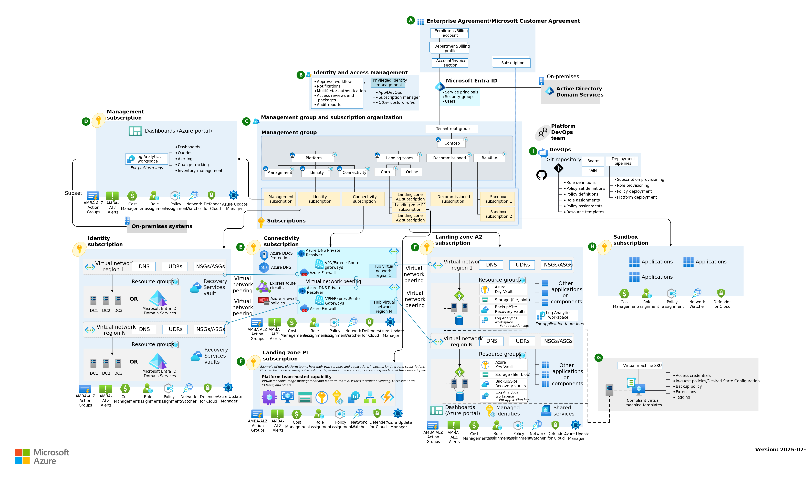
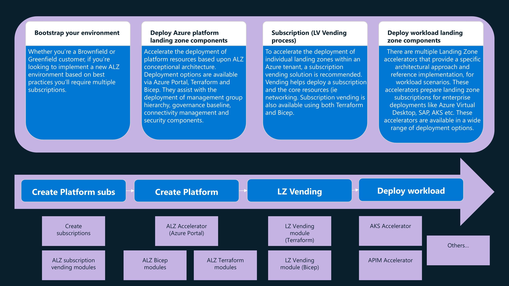
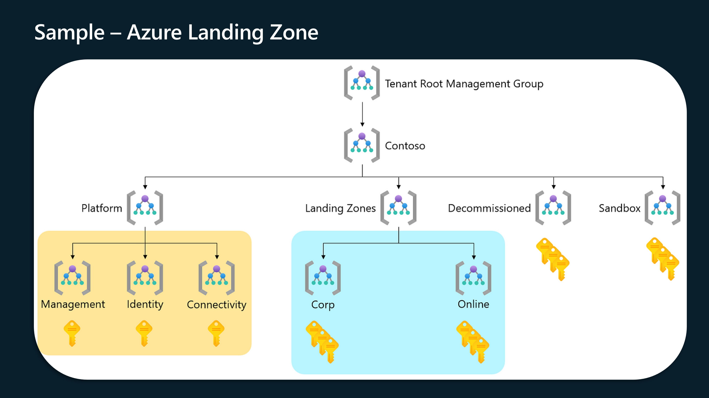
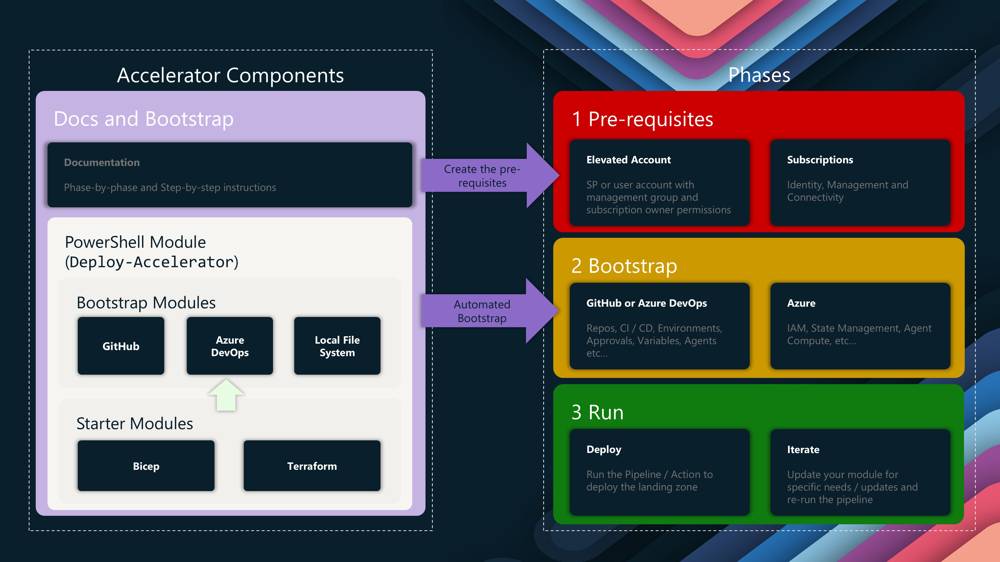
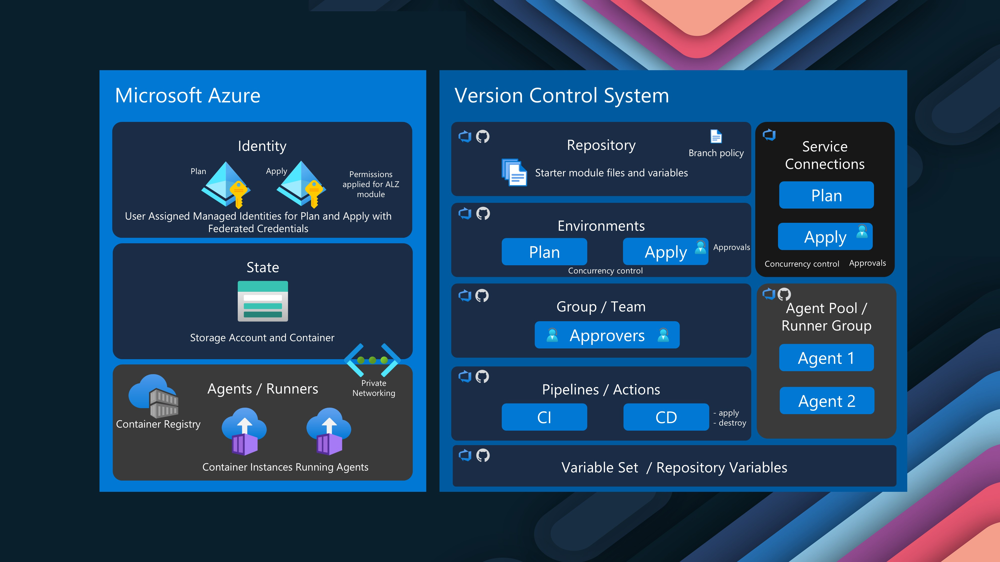

As part of the [Azure Back to School](https://azurebacktoschool.github.io/) event for 2025, we are here to take a look at [Azure Landing Zones](https://learn.microsoft.com/azure/cloud-adoption-framework/ready/landing-zone/?WT.mc_id=AZ-MVP-5004796), specifically [Platform Landing Zones](https://learn.microsoft.com/azure/cloud-adoption-framework/ready/landing-zone/?WT.mc_id=AZ-MVP-5004796#platform-landing-zones-vs-application-landing-zones), and the deployment of the Platform Landing Zone, using an [accelerator](https://azure.github.io/Azure-Landing-Zones/accelerator/) and Azure DevOps for the CI/CD.

{/* truncate */}

## Introduction to Azure Landing Zones

[Azure Landing Zones](https://learn.microsoft.com/azure/cloud-adoption-framework/ready/landing-zone/?WT.mc_id=AZ-MVP-5004796) provide a structured approach for designing and implementing cloud environments in Azure. They are essential for organizations looking to migrate, modernize, and innovate their applications at scale, mainly because of the considerations you make in designing and implementating them, considerations such as how your workloads are going to connect to the internet, how each service connects, and importantely, how your organisation will use Cloud - I saw a comment from someone the other day _(Cloud is not WHERE you work, its HOW you work)_. 

:::info
An Azure landing zone is an environment that follows key design principles across eight design areas. These design principles accommodate all application portfolios and enable application migration, modernization, and innovation at scale. An Azure landing zone uses subscriptions to isolate and scale application resources and platform resources. Subscriptions for application resources are called application landing zones, and subscriptions for platform resources are called platform landing zones.

An Azure landing zone architecture is scalable and modular to meet various deployment needs. The repeatable infrastructure allows you to apply configurations and controls to every subscription consistently. Modules make it easy to deploy and modify specific Azure landing zone architecture components as your requirements evolve.

:::

More information on Azure Landing Zones, can be found in the [Microsoft Cloud Adoption Framework for Azure](https://learn.microsoft.com/en-us/azure/cloud-adoption-framework/?WT.mc_id=AZ-MVP-5004796), Landing Zones specifically sits under the Ready phase.

## Understanding Azure Landing Zone Accelerators

[Azure Landing Zone Accelerators](https://azure.github.io/Azure-Landing-Zones/accelerator/) are automation frameworks designed to expedite the deployment of Azure Landing Zone architecture. They come in two flavors:

* Bicep Accelerator
* Terraform Accelerator
* Portal Accelerator

These Accelerators, adopt a best-practice approach _(but also opinionated)_ to deploy an Azure Landing Zone, from scratch, whether Brownfield _(already existing)_ or Greenfield _(new)_, and they have been going through a transformation, from previous accelerators _(marked as vNext)_ to adopt a more moduler approach with both Bicep and Terraform deployments aligned to [Azure Verified Modules](https://azure.github.io/Azure-Verified-Modules/). These Accelerators are what Microsoft would run in a VBD workshop _(I believe they would use the Portal accelerator)_.

I want to make clear, these just like the Cloud Adoption Framework, are best pratices but also gernalized to support multiple types of organisations, so make sure you adjust them to suit your needs and organisations, or even mark it as a northstar to aim towards, but not necessary what you need in that moment, but also consider strategically where you want to go, ie platform engineering, de-centralized or centralized operations, all these decisions will determine how your Landing Zone structure is based and used _(ie if you don't like the word Online, change it to Public, your business needs to understand where to put workloads and how they will work _(not spending the time fighing over what something is named)_)_.

With Landing Zones, theres the Platform Landing Zone and the Application Landing Zone, the Platform Landing Zone is the shared services like identity, connectivity, and management, where as the Application Landing Zone is specific environments for particular applications or workloads _(consider Arc, maybe APIM, anything generazlied - this is really where your business logic and IP sits)_.

For the purpose of this article, we will be discussing the:

* Bootstrap of our environment (into Azure DevOps)
* Deploy of Azure platform Landing Zone componnets using Terraform

## Deploying Azure Landing Zones with Terraform

### Bootstrap

It begins with a Bootstrap process, which is the initial setup of the Azure DevOps environment, including the creation of a new project, repository, and service connection. This process is automated using a mix of PowerShell and Terraform.

To bootstrap, we will make use of the:[ALZ-PowerShell-Module](https://github.com/Azure/ALZ-PowerShell-Module), this script will help bring together the different depdencies and Terraform bootstraping to setup our Azure DevOps environment, Terraform state storage account and bring in the necessary Platform Landing Zone library files for our deployment.

The bootstrap for Azure DevOps, also includes self-hosted agents _(Container Apps or Container Instances)_ as optional, and preconfigured pipelines, including validation and branch policies with approval steps, so a great foundational platform to then work towards.

:::tip
Make sure you checkout the following resources for more information on the Azure Landing Zone Accelerator and Azure Landing Zone Library, these are your soureces of truth:

* [Azure Landing Zones Documentation](https://aka.ms/alz/acc)
* [Azure Landing Zones Library](https://azure.github.io/Azure-Landing-Zones-Library/)

If you have issues, you can also raise them on the [ALZ-PowerShell-Module](https://github.com/Azure/ALZ-PowerShell-Module/issues) GitHub repository.
:::

Before we get started 
---

Pre-requisites: Configure credentials and subscriptions

Bootstrap: Set up CI/CD pipelines (supports GitHub and Azure DevOps)

Run: Deploy the Azure Landing Zone architecture2

Terraform Landing Zone Vending Module
Designed for deploying individual landing zones

Capabilities include:

Subscription creation and management group placement

Networking (hub & spoke, vWAN, mesh peering)

Role assignments

Resource provider registration

Resource group creation

User-assigned managed identity creation3

## Best Practices for Azure Landing Zone Implementation

Start with the Azure Landing Zone Accelerator for most scenarios

Consider multiple-region deployments for resilience

Implement centralized logging and monitoring

Utilize management groups and Azure Policy for governance

Regularly review and update your landing zone configuration6