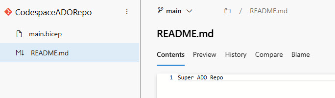

I've talked about [GitHub Codespaces](https://luke.geek.nz/azure/Getting-Started-with-GitHub-Codespaces/) before, but what I haven't covered - is using a GitHub Codespace to connect to a repository in Azure DevOps. It's classed as 'Remote Repository' in the Codespace, however, it's something that can be done.

{/* truncate */}

To start with, we have a repository in Azure DevOps, and we want to connect to it using a GitHub Codespace. I've created a repository in Azure DevOps called 'CodespaceADORepo' for demo purposes. This repo contains two files _(README.md and a main.bicep file)_ although it doesn't matter what the repository has.



To make this work, we need to add the following feature to our Codespace: [codespace-features/external-repository](https://github.com/microsoft/codespace-features/pkgs/container/codespace-features%2Fexternal-repository). This feature allows you to connect to a repository that is not hosted in GitHub.

To add this feature, you need to create a `.devcontainer` folder in the root of your repository. Inside this folder, you need to create a `devcontainer.json` file. This file is used to configure the Codespace, and in this case, we are adding the feature to connect to an external repository.

First we need to grab the clone URL.


Then we need to add the URL to the devcontainer.json

```json
"features": {
		"ghcr.io/microsoft/codespace-features/external-repository:latest": {
			"cloneUrl": "https://luke0153@dev.azure.com/luke0153/CodespaceDemo/_git/CodespaceADORepo",
			"folder": "/workspaces/ado-repos"
		}
}
```
:::info
You can add a PAT token to authenticate by adding: "cloneSecret": "ADO_PAT", to the feature settings, but storing your PAT token in plain text in a repo is not recommended.
:::

And then add in: 

```json
"initializeCommand": "mkdir -p ${localWorkspaceFolder}/../ado-repos",
  "postStartCommand": "external-git clone",
  "postAttachCommand": "external-git config",
```


Once done, it's time to run your Codespace, as normal. It will ignore the GitHub repo that you are running it in, then clone the ADO repo, once authenticated - in this case, because I haven't specified a PAT token, it will prompt for user authentication, then mount the repo.


And the original git repo is ignored.

For full reference to the devcontainer.json I am using:

```json

{
	"name": "Default Linux Universal",
	"image": "mcr.microsoft.com/devcontainers/universal:2-linux",
	"features": {
		"ghcr.io/microsoft/codespace-features/external-repository:latest": {
			"cloneUrl": "https://contoso@dev.azure.com/contosoOORG/CodespaceDemo/_git/CodespaceADORepo",
			"folder": "/workspaces/ado-repos"
		},
		  "ghcr.io/prulloac/devcontainer-features/pre-commit:1.0.3": {},	
	},
	"workspaceFolder": "/workspaces/ado-repos",
	"initializeCommand": "mkdir -p ${localWorkspaceFolder}/../ado-repos",
  "postStartCommand": "external-git clone",
  "postAttachCommand": "external-git config",

	"customizations": {
		"vscode": {
			"extensions": [
				"GitHub.copilot",
				"GitHub.copilot-chat",
			]
		}
	}
}
```
