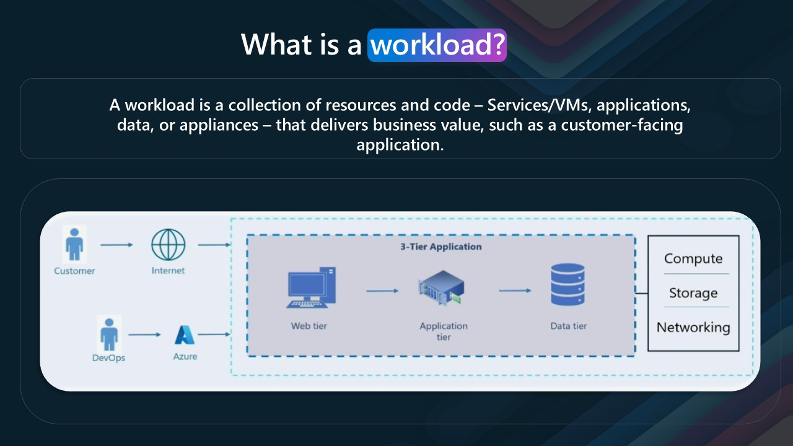
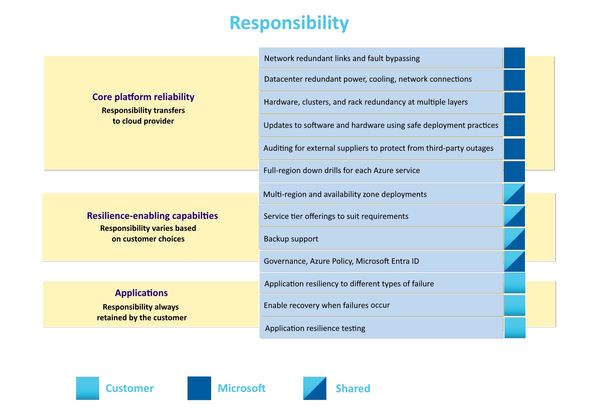
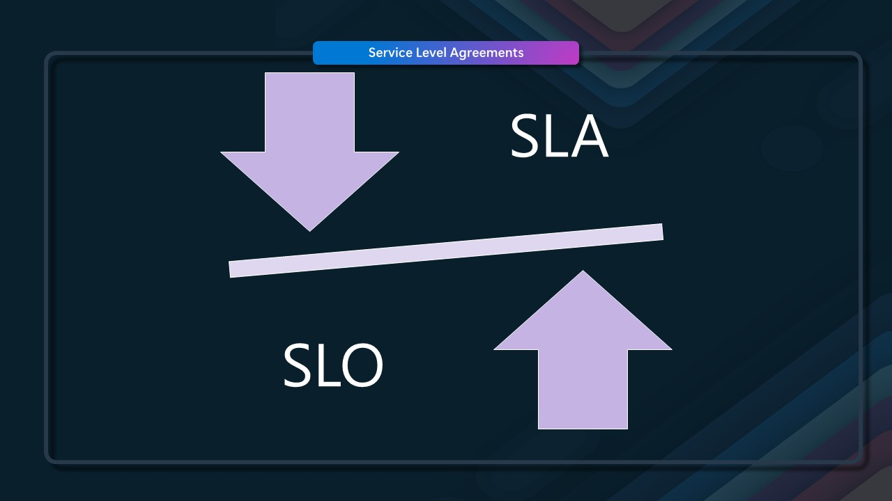
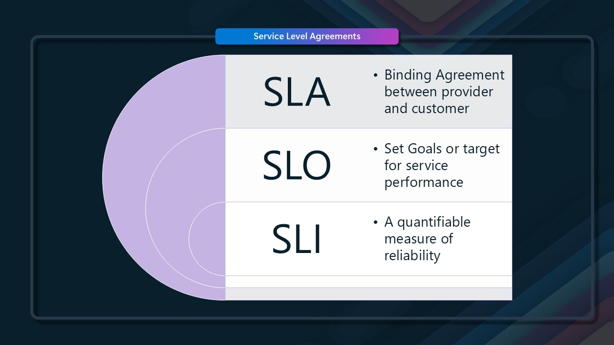
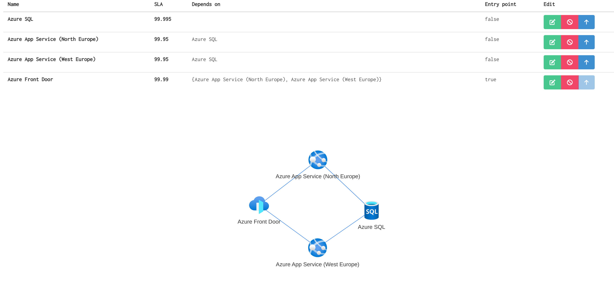
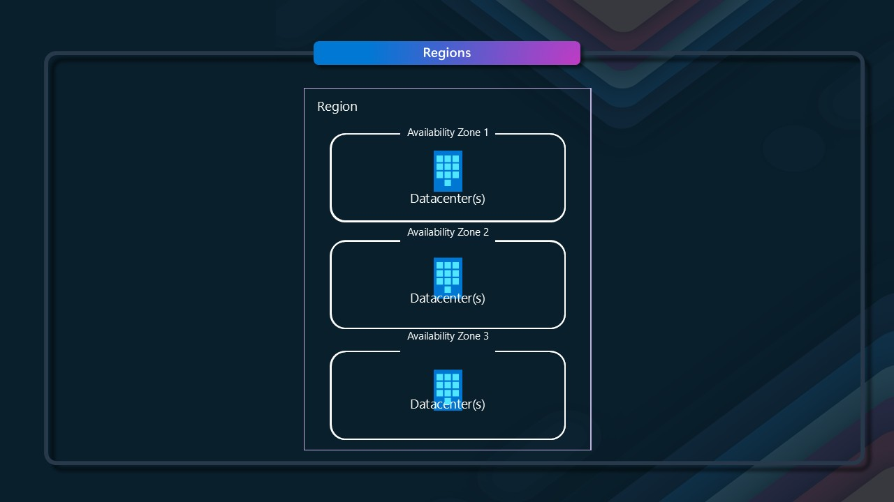
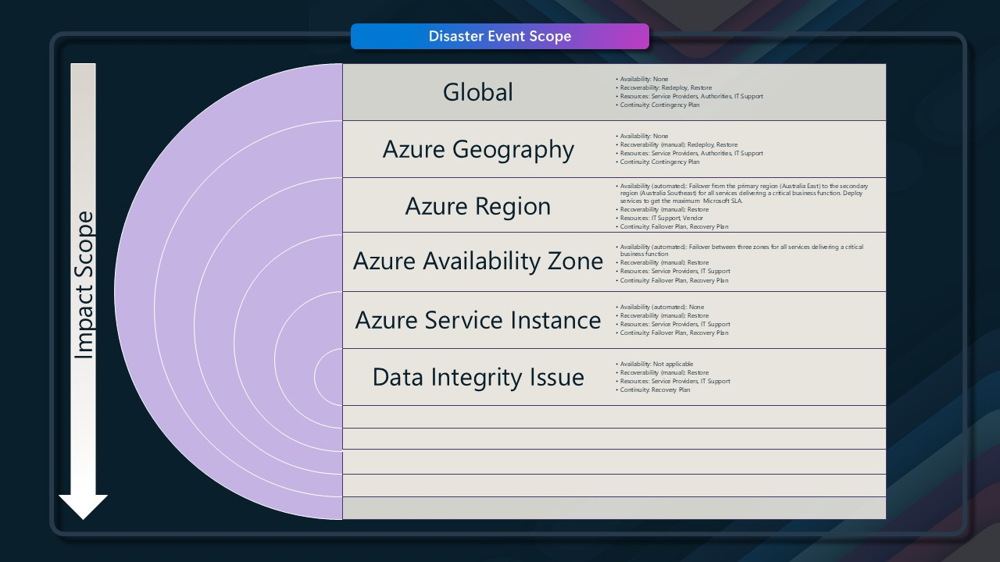

# 🔍 Understanding Workload Criticality in the Cloud

Today, we are going to take a look at something a little different. We are going to talk about workload criticality, methods to assess how critical your workload is, and the ramifications of that criticality in terms of the Cloud.

{/* truncate */}

## 📦 Defining a Workload

First, let's define Workload.

:::info
A workload is a collection of resources and code – Services/VMs, applications, data, or appliances – that delivers business value, such as a customer-facing application.
:::

.

All these resources in the Microsoft Azure Cloud can be designed to work together to deliver a service or application. The resources can be anything from a simple web app to a complex multi-tier application with multiple services and databases.

In the Microsoft Azure Cloud, these resources can be deployed in different regions, availability zones, and resource groups. This allows for high availability and disaster recovery options to be built into the application architecture.

## 🤝 Shared Responsibility in the Cloud

Let us delve into the [Reliability](https://learn.microsoft.com/azure/well-architected/reliability/?WT.mc_id=AZ-MVP-5004796) and Availability of these workloads by looking at the [Shared responsibility model](https://learn.microsoft.com/azure/reliability/concept-shared-responsibility?WT.mc_id=AZ-MVP-5004796).

There is some overlap in the responsibility of your workloads in the Cloud, and this is where the criticality of your workload comes into play. The more critical the workload, the more responsibility you have regarding availability and reliability, and the more you need to consider the implications of that criticality in your architecture and design. Before I jump ahead, let's assume Microsoft's responsibility as the customer and us as the cloud provider.

:::info
Microsoft is solely responsible for [core platform reliability](https://learn.microsoft.com/en-us/azure/reliability/concept-shared-responsibility?WT.mc_id=AZ-MVP-5004796#core-platform-reliability). Microsoft is also responsible for providing [resilience-enhancing capabilities](https://learn.microsoft.com/en-us/azure/reliability/concept-shared-responsibility?WT.mc_id=AZ-MVP-5004796#resilience-enhancing-capabilities) that you can use. You're responsible for selecting and using the appropriate components.
:::

The configuration of each of the resources that make up your workload determines how reliable and available it is. The more critical the workload, the more you need to consider its implications for your architecture and design.

## 📝 Service Level Agreements (SLAs)

> Understanding the service level agreements (SLAs) for each Azure service is important. SLAs provide essential information on the expected uptime of the service and any conditions you need to meet to be eligible for the SLA. For SLAs for each service, see [Service Level Agreements (SLA) for Online Services](https://www.microsoft.com/licensing/docs/view/Service-Level-Agreements-SLA-for-Online-Services).

So, let's delve a little deeper into SLAs and how they relate to the criticality of your workload.

An SLA _(Service Level Agreement)_ is a contract between you and the service provider that defines the level of service you can expect from the provider. It typically includes information on the availability of the service, the response time for support requests, and any penalties for not meeting the SLA. In the context of Azure resources, an SLA guarantees that the service will be available for a certain percentage of time over a given period. For example, an SLA of 99.9% means that the service is guaranteed to be available for 99.9% over a given period.

This means that the service can be down for a maximum of 43.2 minutes per month, or 8.76 hours per year. If the service is down for longer than this, you may be eligible for a credit on your bill. 

There are some considerations however, and these are outlined in the SLA for each service. For example, if you are using a service that the SLA does not cover, or if you are not meeting the conditions of the SLA, you may not be eligible for a credit, and by meeting conditions, I mean the configuration of the resources that make up your workload - for example, if you are using a single instance of a service, and not Zone redundant, you may not be eligable for a credit, as the SLA may not match. There is a difference between an outage of one availability zone vs an entire region. Virtual Machines come to mind where the Disk type selected can impact the SLA of your resource.

## 🎯 SLO and SLI: Beyond SLAs

We won't go into detail about SLO (Service Level Objective) or SLI (Service Level Indicator) in this post, but they are important to understand when assessing the SLA of your workload. 

An SLO is a target for the level of service you want to achieve, and an SLI measures the level of service you are achieving. The SLO and SLI can be used to measure the performance of your workload and help you identify areas for improvement, for Microsoft Azure cloud services, the SLO and SLIs are managed within Microsoft, however if you are looking at offering SLAs to your customers based on the services you are using, you will need to consider the SLO and SLI of the services you are using. How they relate to the SLA of your workload, the same is true in the context of OLAs _(Organisation Level Agreements)_.

## 🧩 Composite SLAs

What we will touch on is [Composite SLAs](https://learn.microsoft.com/en-us/azure/well-architected/reliability/metrics?WT.mc_id=AZ-MVP-5004796#define-composite-slo-targets), which are a combination of the SLAs of the individual resources that make up your workload. For example, if you have a web app that is using an SQL database, the SLA for the web app and the SLA for the SQL database will determine the overall SLA for your workload. The composite SLA is calculated by multiplying the individual SLAs together. For example, if the web app has an SLA of 99.95% and the SQL database has an SLA of 99.99%, the composite SLA for the workload would be 99.94% _(Maximum acceptable downtime /Year: 315m 33s)_.
That's lower than the individual SLAs, which isn't surprising because an application that relies on multiple services has more potential failure points.

A few resources that are useful for working out Composite SLA's are:

- [Azure Composite SLA Estimator](https://slaestimator.aztoso.com/)
- [SLA Calculator](https://wiki.unosd.com/slacalculator/)

For more Active/Active workloads, you can have a parallel SLA _(Parallel SLA = 100% - (ServiceA unavailability * ServiceB unavailability))_.

## 🌐 Regions and Availability Zones

I've alluded to it but not touched on it - let us discuss [Regions](https://learn.microsoft.com/azure/reliability/regions-overview?WT.mc_id=AZ-MVP-5004796) and [Avaliability Zones](https://learn.microsoft.com/azure/reliability/availability-zones-overview?tabs=azure-cli&WT.mc_id=AZ-MVP-5004796), which are key considerations when looking at how your Azure Cloud workloads are architected.

An Azure Region - such as [New Zealand North](https://datacenters.microsoft.com/globe/explore?info=region_newzealandnorth) - is a set of datacenters _(3 or more)_ deployed within a latency-defined perimeter and connected through a low-latency network, datacenters is a term I try to avoid when talking about the Microsoft Azure Cloud, as it is a little misleading, as the datacenters are not just a single building, but a collection of buildings and resources that make up the region, each called an Avaliability Zone, and each one designed to run independently of the others. This means that if one zone goes down, the other zones are still available, and your workload can continue to run. This is a key consideration when looking at the criticality of your workload, as it allows for a level of high availability and disaster recovery options to be built into the application architecture _(think Tier 4, from a datacenter tier/classification perspective)_. 

:::tip
There isn't a 1:1 mapping of physical and logical _(ie, what you see in the Portal)_ mapping to your availability zones; the mapping is generated at the time that the subscription gets created, so Availability Zone 1 in one subscription may not be Availability Zone 1 in another. Refer to a previous article of mine for more information: [Azure Availability Zone Peering](https://luke.geek.nz/azure/azure-availability-zone-peering/).
:::

Whether you use Availability Zones or cross-regions can depend a lot on the criticality of your workload and the SLA of your workload with your customers. A lot of redundancy is built into multiple layers, from the selection of the location for the data centers to be built through the hardware in the racks to the Azure fabric itself. However, issues do happen, and you need to consider your risk profile.

:::tip
I suggest reading the Azure architecture center [Cloud design patterns](https://learn.microsoft.com/azure/architecture/patterns/?WT.mc_id=AZ-MVP-5004796) for recommendations on how to design your workloads, with patterns like retry, sharding, and bulkhead. I also touched on some design patterns in a previous article [Cloud Design Patterns](https://luke.geek.nz/azure/cloud-design-patterns/) and video [Cloud Design Patterns](https://youtu.be/nnuo_mxPcNw).
:::

## ⚠️ Risk Assessment

When considering the business criticality and plans, you need to consider the likelihood of an outage, and the impact and risk of that outage _(RISK = IMPACT x	PROBABILITY)_:

| Risk               | Example                                 | Likelihood      |
|--------------------|-----------------------------------------|----------------|
| **Hardware outage** | Host reboot, node failure             | 🟠🟠🟠🟠🟠 Very likely |
| **Datacentre outage** | Power, cooling or network failure  | 🟠🟠 Unlikely  |
| **Region outage** | Major natural disaster affecting wide area | 🟠 Very unlikely |

And then, compare those risks to the design and SLA of your workload in accordance with the [Azure Well-Architected Framework](https://learn.microsoft.com/azure/well-architected/?WT.mc_id=AZ-MVP-5004796) pillars for guidance, as there are tradeoffs between the pillars and the criticality of your workload:

|                          | Locally redundant | Zonal (pinned) | Zone-redundant | Multi-region |
|--------------------------|------------------|---------------|----------------|--------------|
| **Reliability**         | 🔴 Low           | 🔵 Depends    | 🟢 High        | 🟢 High      |
| **Cost Optimization**   | 🟢 Low           | 🔵 Depends    | 🟡 Moderate    | 🔴 High      |
| **Performance Efficiency** (for most workloads) | 🟢 Acceptable  | 🟢 Good       | 🟢 Acceptable  | 🔵 Depends    |
| **Operational Excellence** | 🟢 Easy          | 🔴 Complex    | 🟢 Easy        | 🔴 Complex   |
| **Data Residency**      | 🟢 Strong        | 🟢 Strong     | 🟢 Strong      | 🔵 Depends   |

## ❓ How to Determine Workload Criticality

So, we've discussed SLA, some of the technical considerations for your workloads - lets take a look at how do you know - that your workload is critical?

This is always a hard question to answer, and it is up to the business to determine—it's a risk/benefit analysis. For example, in Health, is there a Clinical Risk to patients? In finance, is there a financial risk to the business? In retail, is there a reputational risk to the business? The criticality of your workload can be determined by looking at the impact of an outage on the business and the cost of that outage.

## 🏆 Criticality Classification Framework

However, for those starting out or don't know where to start with classifying your workload criticality, we can use the [Cloud Adoption Framework workload priority](https://learn.microsoft.com/azure/cloud-adoption-framework/manage/protect?WT.mc_id=AZ-MVP-5004796#manage-reliability) as a base.

> Enterprise organizations typically have an extensive application portfolio, but not all applications are of equal importance. Applications can be classified based on a criticality scale. For example, business-critical applications are designed to prevent financial losses, and safety-critical applications are focused on costs associated with the loss of human life. Mission-critical applications cover both aspects that can be impacted by unavailability or underperformance. Criticality should be identified and classified to direct investment of business continuity, monitoring, support, and other resources appropriately. It should be noted that certain business functions within applications may also be more critical than others.

| **Tier**   | **Criticality**                       | **Business View**                                                                                                                                   | **Financial** | **Brand Reputation** | **Customer Trust** | **Customer Experience** | **Injury / Loss of Life** | **Employee Productivity** |  
|------------|---------------------------------------|-----------------------------------------------------------------------------------------------------------------------------------------------------|---------------|-----------------------|--------------------|--------------------------|---------------------------|---------------------------|  
| **Tier 1** | Mission Critical       | Affects the company's mission and might noticeably affect corporate profit-and-loss statements.                                                   | n/a           | Yes                   | Yes                | Yes                      | No                        | Yes                       |  
| **Tier 1** | Business Critical      | Can lead to financial losses for the organization.                                                                                                 | > $250k       | Yes                   | Yes                | Yes                      | No                        | Yes                       |  
| **Tier 1** | Compliance Critical    | In heavily regulated industries, some applications might be critical as part of an effort to maintain compliance requirements.                     | n/a           | Yes                   | Yes                | Yes                      | No                        | Yes                       |  
| **Tier 1** | Safety Critical        | When the lives or physical safety of employees and customers is at risk during an outage, it can be wise to classify applications as safety-critical. | n/a           | Yes                   | Yes                | Yes                      | Yes                       | Yes                       |  
| **Tier 1** | Security Critical      | Some applications might not be mission critical, but outages could result in loss of data or unintended access to protected information.           | n/a           | Yes                   | Yes                | Yes                      | No                        | Yes                       |  
| **Tier 1** | Unit Critical          | Affects the mission of a specific business unit and its profit-and-loss statements.                                                                | > $250k       | Yes                   | Yes                | Yes                      | No                        | Yes                       |  
| **Tier 2** | High                | Might not hinder the mission, but affects high-importance processes. Measurable losses can be quantified in the case of outages.                   | < $250k       | Yes                   | Yes                | Yes                      | No                        | Yes                       |  
| **Tier 3** | Medium               | Impact on processes is likely. Losses are low or immeasurable, but brand damage or upstream losses are likely.                                     | < $100k       | No                    | Yes                | Yes                      | No                        | Yes                       |  
| **Tier 4** | Low                   | Impact on business processes isn't measurable. Neither brand damage nor upstream losses are likely. A localized impact on a single team is likely.   | < $50k        | No                    | Yes                | Yes                      | No                        | Yes                       |  
| **Tier 5** | Unsupported           | No business owner, team, or process that's associated with this application can justify any investment in the ongoing management of the application. | $0            | No                    | No                 | No                       | No                        | No                        |  

The most successfully organisations I have seen implement criticality assessments, have a clear understanding of the business impact of an outage - they also have a review process that takes into effect an unbiased view of the workload, and the impact of the workload on the business, and not just the technical impact of the workload. 

:::tip
Ideally, the criticality of your workload should be assessed at the time of the design of the workload and not AFTER the system is in production or in use. The criticality SHOULD determine how the workload is designed and built, and not the other way around. However, in my career, I have found that this is not always the case. The criticality of the workload is assessed after the fact, and this can lead to issues down the line, as the workload may not be designed to be critical (or not), and this can lead to issues with availability and reliability and cost expenditure on the wrong workloads.
:::

## 📋 Key Criticality Assessment Considerations

Areas to consider when looking at the criticality of your workload:

* Reputational damage
* Industry regulations
* Legal and compliance
* Security
* Customer satisfaction
* Financial
* Loss of life or injury.
* Employee morale 
* Perceived outage acceptance _(ie, how long is acceptable for the workload to be down, are there any workarounds or manual processes)_
* Support hours and costs _(ie if the system is only a 9-5 system, then the support costs may be lower than a 24/7 system, and as such its a lower criticality if it goes down over the weekend)_

:::tip
For more questions and considerations for architecting solutions on Azure - including business context questions that can help you with criticality, consider the Solution Requirement Consideration Checklist I made a few years ago! Its open for Pull Requests, yuou can read more here: [Azure Architecture - Solution Requirement Consideration Checklist](https://luke.geek.nz/azure/azure-architecture-solution-requirement-consideration-checklist/).
:::

## 💡 Conclusion

Hopefully, that has given you a glimpse into the world of workload criticality and how it can impact your workloads in the Microsoft Azure Cloud. There is a lot to consider when looking at the criticality of your workload, and it is important to understand the implications of that criticality in terms of your architecture and design. **The more critical the workload, the more you need to consider the implications of that criticality in terms of your architecture and design, cost, and complexity. The question I leave you is - Do you really need that second region?**

