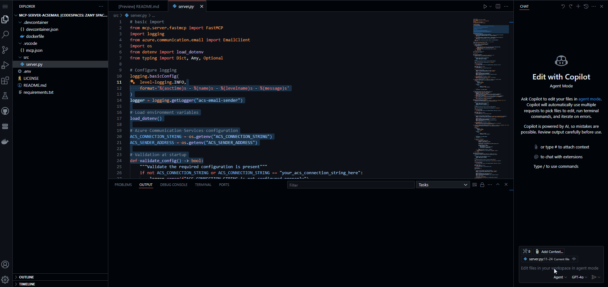
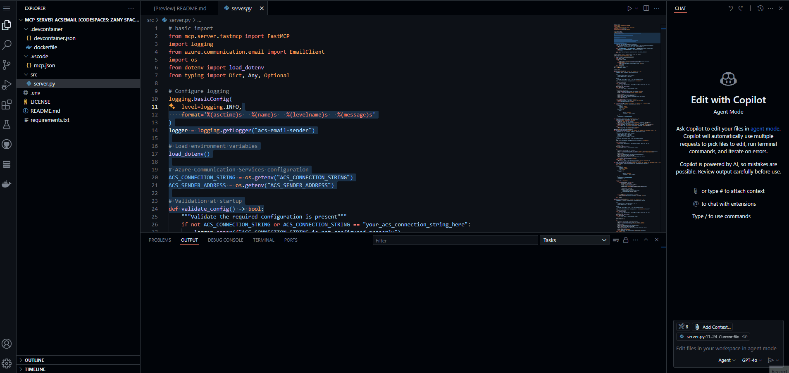

No doubt, you've heard the acronymn 'MCP' before or [Model Context Protocol _(MCP)_](https://modelcontextprotocol.io/), opensourced by Anthropic in November of 2024 it has quickly become the goto standard for connecting AI assistants to systems of various types.

> The Model Context Protocol is an open standard that enables developers to build secure, two-way connections between their data sources and AI-powered tools. The architecture is straightforward: developers can either expose their data through MCP servers or build AI applications (MCP clients) that connect to these servers.

Today we are going to use the MCP protocol to connect to [Azure Communication Services](https://learn.microsoft.com/azure/communication-services/overview?WT.mc_id=AZ-MVP-5004796) and send an email from an MCP client and server running on a GitHub Codespace from GitHub Copilot.

{/* truncate */}

The MCP protocol has 2 different transport layers:

* Stdio transport: This is the default transport layer. It uses standard input and output to communicate between the MCP client and server. This is useful for local development and testing.
* HTTP transport: This transport layer uses HTTP to communicate between the MCP client and server. This is useful for production environments where the MCP client and server are running on different machines.

In our usecase, we are going to use the Stdio transport layer. This is because we are running both the MCP client and server on the same machine (GitHub Codespace). 

There are also different types of primitives, that an MCP server can expose:

* Resources are a core primitive in the Model Context Protocol (MCP) that allow servers to expose data and content that can be read by clients and used as context for LLM interactions.
* Prompts enable servers to define reusable prompt templates and workflows that clients can easily surface to users and LLMs. They provide a powerful way to standardize and share common LLM interactions.
* Tools are a powerful primitive in the Model Context Protocol (MCP) that enable servers to expose executable functionality to clients. Through tools, LLMs can interact with external systems, perform computations, and take actions in the real world.


_(Image credit: [blog.dailydoseofds.com](https://blog.dailydoseofds.com/p/visual-guide-to-model-context-protocol))_

We are going to use the `Tool` primitive to expose a tool that will send an email using Azure Communication Services. The tool will be exposed by the MCP server and will be used by the MCP client to send the email, when we prompt it in GitHub Copilot chat.

The MCP server will be running on a GitHub Codespace and will be used to send an email using Azure Communication Services. The MCP client will be running on the same Codespace and will be used to send the email using GPT-4o.
 
 Using Python, we are going to use the [MCP Python SDK](https://github.com/modelcontextprotocol/python-sdk) to do alot of the heavy lifting for us. The SDK is a wrapper around the MCP protocol and allows us to easily create an MCP server, and thanks to a recent update by [GitHub Model Context Protocol (MCP) is now avaliable in Public preview in GitHub Copilot](https://github.blog/news-insights/product-news/github-copilot-agent-mode-activated/#model-context-protocol-mcp-is-now-available-in-public-preview), which allows us us to use the MCP protocol straight from GitHub Copilot chat without needing Claude Desktop for example, installed.

We are going to create 3 tools:

1. send_email
Purpose: Sends a simple email to a single recipient.
Parameters:
* recipient: The email address of the recipient.
* subject: The subject line of the email.
* content: The HTML or plain text content of the email.
Usage: This tool is used for sending basic emails without attachments.

2. send_email_with_attachments
Purpose: Sends an email with file attachments to a single recipient.
Parameters:
* recipient: The email address of the recipient.
* subject: The subject line of the email.
* content: The HTML or plain text content of the email.
* attachments: A list of file paths to attach to the email.
Usage: This tool is used when you need to send documents, images, or other files along with the email.

3. send_bulk_email
Purpose: Sends the same email to multiple recipients in a single operation.
Parameters:
* recipients: A list of email addresses to send the email to.
* subject: The subject line of the email.
* content: The HTML or plain text content of the email.
Usage: This tool is ideal for sending announcements, updates, or newsletters to a group of recipients.

Each tool will be implemented as a function in Python, and we will use the MCP Python SDK to expose these functions as tools in the MCP server. The MCP client will then be able to call these tools to send emails using Azure Communication Services based on the prompts we provide in GitHub Copilot chat.


:::info
You can find the ACS Email MCP server code on my GitHub repo here: [lukemurraynz/mcp-server-acsemail](https://github.com/lukemurraynz/mcp-server-acsemail). Feel free to clone it, run it, and open any Pull Requests if you find any issues or have suggestions for improvements.
:::

Due to the python depedencies, we will be using a devcontainer, using the [python:3.12-bullseye](https://hub.docker.com/r/microsoft/devcontainers-python) image as our base image. This will allow us to use the latest version of Python, and the postCreateCommand we will install the python depedencies using pip.

```txt
mcp
azure-communication-email
python-dotenv
```
Assuming you have the Azure Communication Services Email resource created, and the connection string saved in a `.env` file in the root of your project. The connection string should look something like this:

```txt
# Azure Communication Services credentials
ACS_CONNECTION_STRING=endpoint='https://azcommunicationservicestest.australia.communication.azure.com/;accesskey=FPipiKEH95KCHYQnJOxqMV0P7ZpP3qcKWZHaAhulbKCWI3fPyQZQJQQJ99BDACULyCphGPgtAAAAAZCS58g3'
ACS_SENDER_ADDRESS='DoNotReply@58b87ce7-7f73-444a-ba0b-d754677503cf.azurecomm.net'
```
The `ACS_SENDER_ADDRESS` is the email address that will be used to send the email. This is the email address that will appear in the "From" field of the email.

The Python code for the MCP server is as follows:

```python
# basic import 
from mcp.server.fastmcp import FastMCP
import logging
from azure.communication.email import EmailClient
import os
from dotenv import load_dotenv
from typing import Dict, Any, Optional

# Configure logging
logging.basicConfig(
    level=logging.INFO,
    format='%(asctime)s - %(name)s - %(levelname)s - %(message)s'
)
logger = logging.getLogger("acs-email-sender")

# Load environment variables
load_dotenv()

# Azure Communication Services configuration
ACS_CONNECTION_STRING = os.getenv("ACS_CONNECTION_STRING")
ACS_SENDER_ADDRESS = os.getenv("ACS_SENDER_ADDRESS")

# Validation at startup
def validate_config() -> bool:
    """Validate the required configuration is present"""
    if not ACS_CONNECTION_STRING or ACS_CONNECTION_STRING == "your_acs_connection_string_here":
        logger.error(f"ACS_CONNECTION_STRING is not configured properly")
        return False
    
    if not ACS_SENDER_ADDRESS or ACS_SENDER_ADDRESS == "DoNotReply@your-domain.azurecomm.net":
        logger.error(f"ACS_SENDER_ADDRESS is not configured properly")
        return False
    
    logger.info(f"Email configuration validated. Sender: {ACS_SENDER_ADDRESS}")
    return True

# Cache the email client to avoid recreating it for each request
_email_client: Optional[EmailClient] = None

def get_email_client() -> Optional[EmailClient]:
    """Get or create an EmailClient instance"""
    global _email_client
    if _email_client is None:
        try:
            _email_client = EmailClient.from_connection_string(ACS_CONNECTION_STRING)
            logger.info("Email Client initialized successfully")
        except Exception as e:
            logger.error(f"Failed to initialize Email Client: {str(e)}")
            return None
    return _email_client

# instantiate an MCP server client
mcp = FastMCP("Email Sender")

# DEFINE TOOLS

@mcp.tool(name="send_email")  
def send_email(recipient: str, subject: str, content: str) -> str:
    """Send all emails using Azure Communication Services
    
    Args:
        recipient: Email address of the recipient
        subject: Subject line of the email
        content: HTML content of the email
        
    Returns:
        A message indicating the status of the email sending operation
    """
    logger.info(f"Starting email sending process to: {recipient}")
    
    # Validate configuration
    if not validate_config():
        return "Error: Email service is not configured properly. Check your .env file."
    
    # Get email client
    email_client = get_email_client()
    if not email_client:
        return "Error: Unable to initialize email client"
    
    try:
        # Create the email message
        logger.info(f"Creating email message with subject: {subject}")
        message = create_email_message(recipient, subject, content)
        
        # Send the email
        logger.info(f"Beginning email send operation")
        poller = email_client.begin_send(message)
        logger.info(f"Email send operation initiated, waiting for result")
        result = poller.result()
        
        return process_email_result(result, recipient)
    except Exception as e:
        logger.error(f"Failed to send email: {str(e)}", exc_info=True)
        return f"Failed to send email: {str(e)}"

def create_email_message(recipient: str, subject: str, content: str) -> Dict[str, Any]:
    """Create an email message for Azure Communication Services"""
    return {
        "content": {
            "subject": subject,
            "plainText": content,
            "html": content
        },
        "recipients": {
            "to": [
                {
                    "address": recipient,
                    "displayName": "Email Recipient"
                }
            ]
        },
        "senderAddress": ACS_SENDER_ADDRESS
    }

def process_email_result(result: Any, recipient: str) -> str:
    """Process the result from an email send operation"""
    if isinstance(result, dict) and 'id' in result:
        message_id = result.get('id', 'unknown')
        logger.info(f"Email sent successfully to {recipient}. Message ID: {message_id}")
        return f"Email sent to {recipient} successfully! Message ID: {message_id}"
    elif hasattr(result, 'message_id'):
        logger.info(f"Email sent successfully to {recipient}. Message ID: {result.message_id}")
        return f"Email sent to {recipient} successfully! Message ID: {result.message_id}"
    else:
        logger.info(f"Email sent successfully to {recipient}.")
        return f"Email sent to {recipient} successfully!"

@mcp.tool(name="send_email_with_attachments")
def send_email_with_attachments(recipient: str, subject: str, content: str, attachments: list) -> str:
    """Send email with file attachments using Azure Communication Services
    
    Args:
        recipient: Email address of the recipient
        subject: Subject line of the email
        content: HTML content of the email
        attachments: List of file paths to attach
        
    Returns:
        A message indicating the status of the email sending operation
    """
    logger.info(f"Starting email sending process with attachments to: {recipient}")
    
    # Validate configuration
    if not validate_config():
        return "Error: Email service is not configured properly. Check your .env file."
    
    # Get email client
    email_client = get_email_client()
    if not email_client:
        return "Error: Unable to initialize email client"
    
    try:
        # Create the email message with attachments
        logger.info(f"Creating email message with subject: {subject} and {len(attachments)} attachments")
        message = create_email_message_with_attachments(recipient, subject, content, attachments)
        
        # Send the email
        logger.info(f"Beginning email send operation with attachments")
        poller = email_client.begin_send(message)
        logger.info(f"Email send operation initiated, waiting for result")
        result = poller.result()
        
        return process_email_result(result, recipient)
    except Exception as e:
        logger.error(f"Failed to send email with attachments: {str(e)}", exc_info=True)
        return f"Failed to send email with attachments: {str(e)}"

def create_email_message_with_attachments(recipient: str, subject: str, content: str, attachments: list) -> Dict[str, Any]:
    """Create an email message with attachments for Azure Communication Services"""
    import base64
    
    message = {
        "content": {
            "subject": subject,
            "plainText": content,
            "html": content
        },
        "recipients": {
            "to": [
                {
                    "address": recipient,
                    "displayName": "Email Recipient"
                }
            ]
        },
        "senderAddress": ACS_SENDER_ADDRESS,
        "attachments": []
    }
    
    for file_path in attachments:
        try:
            with open(file_path, "rb") as file:
                file_content = file.read()
                filename = os.path.basename(file_path)
                
                # Base64 encode the file content
                encoded_content = base64.b64encode(file_content).decode('utf-8')
                
                # Add attachment to message
                message["attachments"].append({
                    "name": filename,
                    "contentType": "application/octet-stream",
                    "contentInBase64": encoded_content
                })
                
                logger.info(f"Added attachment: {filename}")
        except Exception as e:
            logger.warning(f"Failed to add attachment {file_path}: {str(e)}")
    
    return message

@mcp.tool(name="send_bulk_email")
def send_bulk_email(recipients: list, subject: str, content: str) -> str:
    """Send email to multiple recipients using Azure Communication Services
    
    Args:
        recipients: List of email addresses to send to
        subject: Subject line of the email
        content: HTML content of the email
        
    Returns:
        A message indicating the status of the email sending operation
    """
    logger.info(f"Starting bulk email sending process to {len(recipients)} recipients")
    
    # Validate configuration
    if not validate_config():
        return "Error: Email service is not configured properly. Check your .env file."
    
    # Get email client
    email_client = get_email_client()
    if not email_client:
        return "Error: Unable to initialize email client"
    
    success_count = 0
    failed_recipients = []
    
    try:
        # Create the email message for multiple recipients
        logger.info(f"Creating bulk email message with subject: {subject}")
        message = create_bulk_email_message(recipients, subject, content)
        
        # Send the email
        logger.info(f"Beginning bulk email send operation")
        poller = email_client.begin_send(message)
        logger.info(f"Bulk email send operation initiated, waiting for result")
        result = poller.result()
        
        success_count = len(recipients)
        return f"Bulk email sent successfully to {success_count} recipients!"
    except Exception as e:
        logger.error(f"Failed to send bulk email: {str(e)}", exc_info=True)
        return f"Failed to send bulk email: {str(e)}"

def create_bulk_email_message(recipients: list, subject: str, content: str) -> Dict[str, Any]:
    """Create an email message for multiple recipients using Azure Communication Services"""
    to_list = []
    for recipient in recipients:
        to_list.append({
            "address": recipient,
            "displayName": "Email Recipient"
        })
    
    return {
        "content": {
            "subject": subject,
            "plainText": content,
            "html": content
        },
        "recipients": {
            "to": to_list
        },
        "senderAddress": ACS_SENDER_ADDRESS
    }


# execute and return the stdio output
if __name__ == "__main__":
    # Validate configuration at startup
    if not validate_config():
        logger.warning("Starting with invalid configuration - email sending will fail")
    
    logger.info("Starting MCP server for ACS Email Sender")
    mcp.run(transport="stdio")
```

To allow GitHub Copilot to recognise and run the server, a `.vscode/mcp.json` file is created to run the server.

```json
{
    "servers": {
        "email": {
            "command": "python",
            "args": [
                "/workspaces/mcp-server-acsemail/src/server.py",
            ]
        }
    }
}
```

So lets test this, first we will test an email of the selection using the `send_email` tool. 


Next lets test the same, but to multiple recipients using the `send_bulk_email` tool.



Last - lets try with sending the readme as an attachment using the `send_email_with_attachments` tool.



Hopefully that gives you a glimpse of how to use the MCP protocol to connect to [Azure Communication Services](https://learn.microsoft.com/azure/communication-services/overview?WT.mc_id=AZ-MVP-5004796) and send emails using GitHub Copilot chat. The MCP protocol is a powerful tool that allows you to connect AI assistants to systems of various types, and with the recent updates to GitHub Copilot, it is now easier than ever to use! This was just my first test usecase, can't wait to see what else we can do with it!
