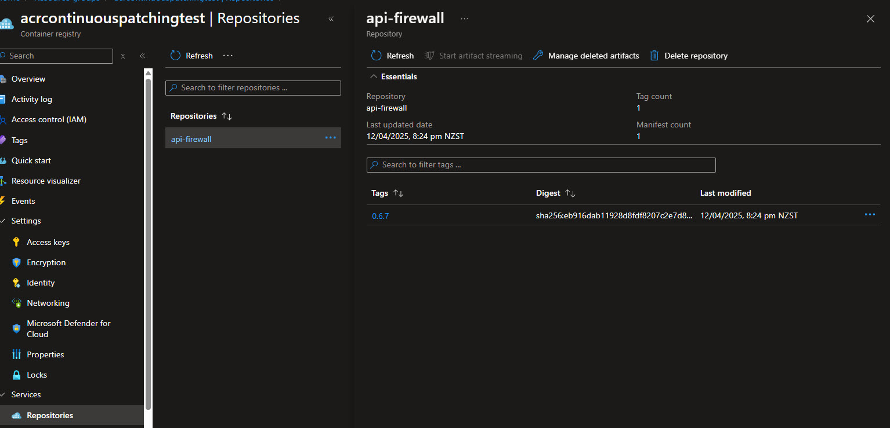
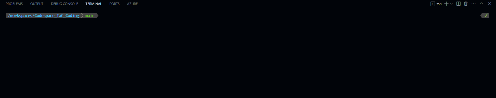

Last year, I blogged about [Container Patching with Azure DevOps, Trivy and Copacetic](https://luke.geek.nz/azure/automate-container-patching-with-trivy-copacetic-azure-devops/), and how to use Azure DevOps to automate the patching of your container images using Trivy and Copacetic. This was a great solution, but it required a lot of manual work to set up and maintain. Today I am going to take a look at Continous Patching with Azure Container Registry (ACR) and how to use it to automate the patching of your container images.

{/* truncate */}

:::warning
At the time of writing this is a **Preview feature**, so the experience we run through today, may change in the future or the feature may be removed enitrely.

The following limitations apply:

* Windows-based container images aren't supported.
* Only "OS-level" vulnerabilities that originate from system packages will be patched. This includes system packages in the container image managed by an OS package manager such as "apt” and "yum”. Vulnerabilities that originate from application packages, such as packages used by programming languages like Go, Python, and NodeJS are unable to be patched.
* End of Service Life (EOSL) images are not supported by Continuous Patching. EOSL images refer to images where the underlying operating system is no longer offering updates, security patches, and technical support. Examples include images based on older operating system versions such as Debian 8 and Fedora 28. EOSL images will be skipped from the patch despite having vulnerabilities - the recommended approach is to upgrade your the underlying operating system of your image to a supported version.
:::

:::info
[Azure Container Registry](https://learn.microsoft.com/azure/container-registry/container-registry-intro?WT.mc_id=AZ-MVP-5004796)'s Continuous Patching feature automates the detection and remediation of operating system(OS) level vulnerabilities in container images. By scheduling regular scans with [Trivy](https://trivy.dev/) and applying security fixes using [Copa](https://project-copacetic.github.io/copacetic/website/), you can maintain secure, up-to-date images in your registry—without requiring access to source code or build pipelines. Simply customize the schedule and target images to keep your Azure Container Registry(ACR) environment safe and compliant.

Here are a few scenarios to use Continuous Patching:

* Enforcing container security and hygiene: Continuous Patching enables users to quickly fix OS container CVEs without the need to fully rebuild from upstream.
* Speed of Use: Continuous Patching removes the dependency on upstream updates for specific images by updating packages automatically. Vulnerabilities can appear every day, while popular image publishers may only offer a new release once a month. With Continuous Patching, you can ensure that container images within your registry are patched as soon as the newest set of OS vulnerabilities are detected.
:::

In my testing, I am going to use the: [api-firewall](https://hub.docker.com/_/api-firewall) image, version [0.6.7 _(3 years old)_](https://hub.docker.com/layers/library/api-firewall/0.6.7/images/sha256-eb916dab11928d8fdf8207c2e7d8a936a70055e219d9e92807315fb4c4380ba9) that I have pushed to my Azure Container Registry.



So lets take a look at how this will work.

Continuous Patching in ACR creates a new image per patch, ACR relies on a tag convention to version and identify patched images. The two main approaches are incremental and floating.

| Feature | Incremental Tagging | Floating Tagging |
| ------- | ------------------- | ---------------- |
| **How It Works** | Adds numerical suffix (-1, -2, etc.) to original tag | Uses single mutable tag "-patched" that always points to latest version |
| **Example** | If base is python:3.11:<br>- First patch: python:3.11-1<br>- Second patch: python:3.11-2 | If base is python:3.11:<br>- All patches use: python:3.11-patched |
| **Special Rules** | - Tags -1 to -999 are considered patch tags<br>- Tags with -x where x > 999 are treated as original tags<br>- Avoid pushing your own tags ending with -1 to -999<br>- Errors if -999 versions are reached | Tag automatically updates with each new patch |
| **Version History** | Preserved (each patch gets unique tag) | Not preserved (single tag is updated) |


Incremental (default) is great for environments where auditability and rollbacks are critical, since each new patch is clearly identified with an unique tag.

Floating is ideal if you prefer a single pointer to the latest patch for your CI/CD pipelines. Reduces complexity by removing the need to update references in downstream applications per patch, but sacrifices strict versioning, making it difficult to rollback.

In the demo today, I am going to use the Incremental tagging method.

So lets get started. To start with I am going to use my [Codespace_IaC_Coding](https://github.com/lukemurraynz/Codespace_IaC_Coding) Codespace configuration, which already has the pre-requsites I need - ie [Azure CLI](https://learn.microsoft.com/cli/azure/what-is-azure-cli?WT.mc_id=AZ-MVP-5004796).

To start we need to install the CLI extension for ACR Continous Patching:

```bash
az extension add --source https://acrcssc.z5.web.core.windows.net/acrcssc-1.1.1rc7-py3-none-any.whl
```



Then we need to login to our Azure Container Registry:

```bash
az login
az acr login -n <myRegistry>
```


Now we need to prepare the JSON schema that we will use to configure our Continuous Patching.

This schema defines which repositories and tags to patch, when to patch them, and how to tag the patched images.

The schema includes these key components:

* `version` - Used by the ACR team to track schema versions. Don't modify this unless instructed.
* `tag-convention` - Optional field that specifies the tagging method. Values can be "incremental" (default) or "floating".
* `repositories` - An array of objects containing:
  * `repository` - The name of the repository to patch
  * `tags` - Array of specific tags to patch (use wildcard `*` to include all tags)
  * `enabled` - Boolean (true/false) to enable or disable patching for this repository

For example:

```json
{
  "version": "v1",
  "tag-convention": "incremental",
  "repositories": [
    {
      "repository": "api-firewall",
      "tags": ["0.6.7", "latest"],
      "enabled": true
    }
  ]
}
```

So let us create the file as below:

```bash
cat <<EOF > continuouspatching.json
{
  "version": "v1",
  "tag-convention": "incremental",
  "repositories": [
    {
      "repository": "api-firewall",
      "tags": ["0.6.7", "latest"],
      "enabled": true
    }
  ]
}
EOF
```

Next we can run a dry run of the supply-chain workflow to validate that our repository and tags are correct:

```bash
az acr supply-chain workflow create -r myRegistry -g myResourceGroup -t continuouspatchv1 --config ./continuouspatching.json --schedule 1d --dry-run   
```


You an also view the run in the Azure Portal, and see it pull the cssc _(Microsoft's Containers Secure Supply Chain (CSSC) framework)_ image to run the workflow.


:::tip
You can use the `az acr supply-chain workflow update` command to update the workflow configuration, if needed at a later stage.
:::

Now let us run the workflow for real.

Before we do, let's understand how scheduling works in ACR Continuous Patching.

> The scheduling system works like a calendar with fixed dates each month, not like a countdown timer!

The `--schedule` parameter sets how many days between patch runs, but these always align to fixed days counting from the 1st of each month. Think of it like marking specific dates on a calendar.

For example, if you choose `--schedule 7d`, patching will run on the 1st, 8th, 15th, 22nd, and 29th of each month (every 7 days from the 1st).

Here's what happens with different schedule values:

| Schedule | Runs on these days each month | Example |
|----------|-------------------------------|---------|
| `1d` | Every day | Patches run daily |
| `3d` | 1st, 4th, 7th, 10th, 13th, 16th, 19th, 22nd, 25th, 28th, 31st | If today is the 5th, next run is on the 7th |
| `7d` | 1st, 8th, 15th, 22nd, 29th | If today is the 10th, next run is on the 15th |
| `14d` | 1st, 15th, 29th | If today is the 20th, next run is on the 29th |
| `30d` | 1st, 31st (if month has 31 days) | Runs at the beginning and end of the month |

When you add the `--run-immediately` flag, a patch happens right away, and then the next one follows the regular schedule.

Remember: The schedule always resets at the beginning of each month. So if your last patch in January was on the 29th with a `7d` schedule, the next one will be on February 1st, not February 5th.

 

Now let's run the workflow:

```bash
az acr supply-chain workflow create -r myRegistry -g myResourceGroup -t continuouspatchv1 --config ./continuouspatching.json --schedule 14d --run-immediately --verbose
```

:::warning
If you get the following warning: 

`Failed to validate and deploy template: (DeploymentFailed) At least one resource deployment operation failed. Please list deployment operations for details. Please see https://aka.ms/arm-deployment-operations for usage details.
Code: DeploymentFailed
Message: At least one resource deployment operation failed. Please list deployment operations for details. Please see https://aka.ms/arm-deployment-operations for usage details.
Target: /subscriptions/11b74992-d520-46e1-a9e9-b55c57d2e890/resourceGroups/acrcontinuouspatchingtest/providers/Microsoft.Resources/deployments/continuouspatchingdeployment
Exception Details:      (RoleAssignmentUpdateNotPermitted) Tenant ID, application ID, principal ID, and scope are not allowed to be updated.
        Code: RoleAssignmentUpdateNotPermitted
        Message: Tenant ID, application ID, principal ID, and scope are not allowed to be updated.      (RoleAssignmentUpdateNotPermitted) Tenant ID, application ID, principal ID, and scope are not allowed to be updated.
        Code: RoleAssignmentUpdateNotPermitted
        Message: Tenant ID, application ID, principal ID, and scope are not allowed to be updated.`

It may mean that the Tasks have existed before, but if the Tasks were deleted in the portal, then it won't have removed the permission assignments.

You can check the permissions in the Access control (IAM) portal, and if they exist, you can delete them manually from the portal. 

If you run the following workflow delete command _(preferred)_, it will delete the assigned RBAC permissions as well:

```bash
az acr supply-chain workflow delete -r myRegistry -g myResourceGroup -t continuouspatchv1 --yes --verbose
```
:::


```bash

az acr supply-chain workflow create -r acrcontinuouspatchingtest -g acrcontinuouspatchingtest -t continuouspatchv1 --config ./continuouspatching.json --schedule 14d --run-immediately --verbose