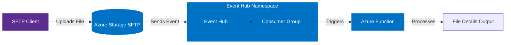
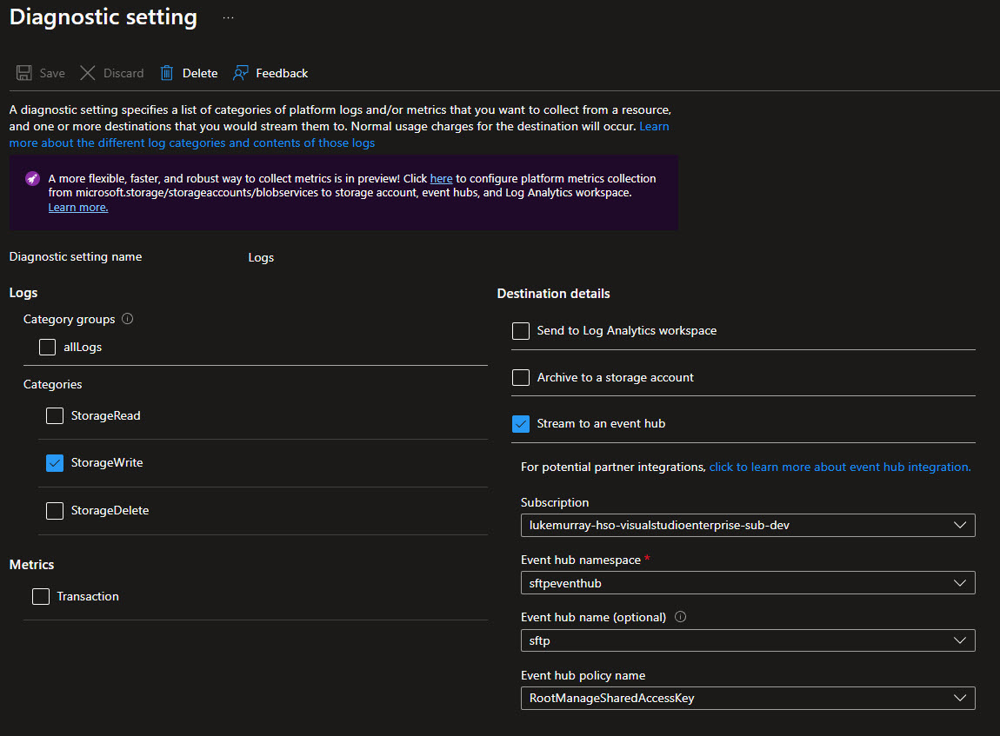
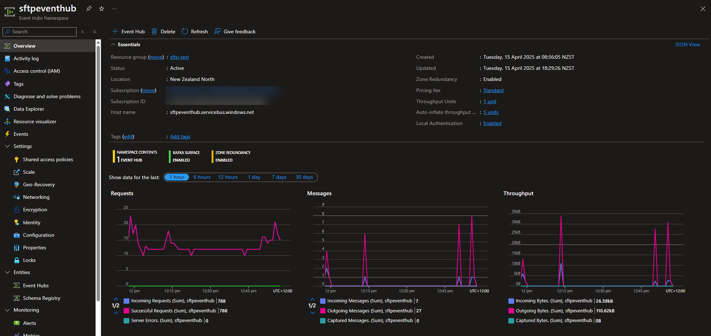
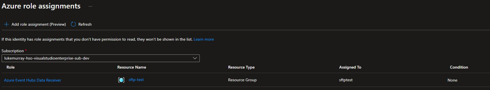
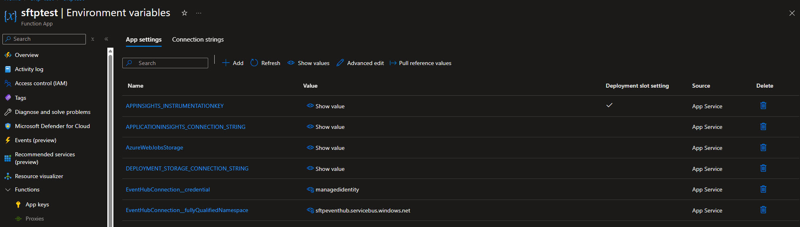
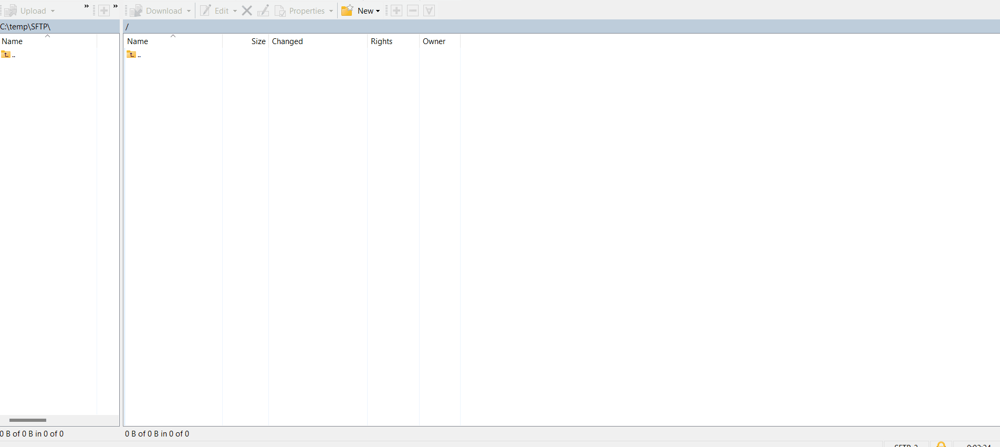
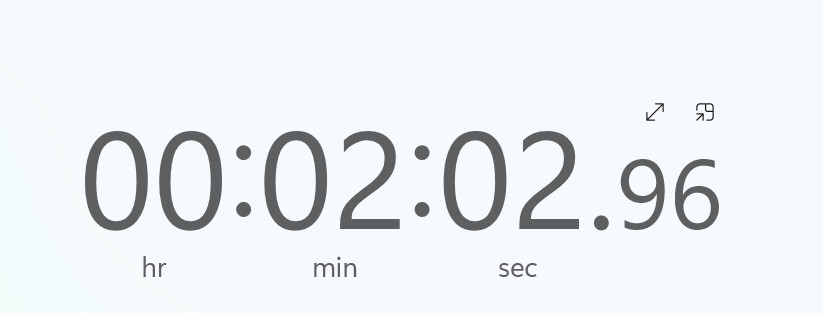

Today, we are going to use the [Azure Storage SFTP functionality](https://learn.microsoft.com/azure/storage/blobs/secure-file-transfer-protocol-support?WT.mc_id=AZ-MVP-5004796) and an [Event Hub](https://learn.microsoft.com/azure/event-hubs/event-hubs-about?WT.mc_id=AZ-MVP-5004796) to trigger an [Azure Function](https://learn.microsoft.com/azure/azure-functions/functions-overview?WT.mc_id=AZ-MVP-5004796). The Azure Function will then process the Write Logs, and output the File name, SFTP Local User name, Agent header and the SFTP Client IP address to the host, from there you can do whatever you want with the data.

{/* truncate */}

## 🚀 Processing SFTP Events with Azure Functions and Event Hub

## 🏗️ Environment Overview

So for my environment, I have a:

- A SFTP Hierarchical namespace-enabled storage account
- A Flex Consumption Azure Function App
- A Standard Event Hub Namespace with an event hub instance with 1 partition and 1 consumer group

These resources are hosted in the New Zealand North Azure region.



So I've already pre-created these resources, but is there some more information about the resource configuration that you can follow along with?

## 📦 Storage Account Configuration

For the Azure Storage account with SFTP enabled, I'm using the following configuration:

- **Name**: sftptestluketest
- **Location**: New Zealand North
- **Performance**: Standard
- **Redundancy**: Locally-redundant storage (LRS)
- **Account kind**: StorageV2 (general purpose v2)
- **Access tier**: Hot
- **Key features enabled**:
  - Hierarchical namespace (HNS) ✅
  - SFTP support ✅
  - Local user authentication ✅
- **Security settings**:
  - Minimum TLS version: 1.2
  - Public blob access: Disabled
  - Network access: Public (default action: Allow)
  - HTTPS only: Enabled
  - Azure services bypass: Enabled
  - Shared key access: Enabled
- **Diagnostic settings**:

  - StorageWrite logs sent to Event Hub Namespace
  - Configured to capture StorageWrite logs for all blob operations

  

The hierarchical namespace (HNS) is a prerequisite for SFTP support in Azure Storage. This enables the directory and subdirectory structure that SFTP clients expect when connecting.

With SFTP and local users enabled, you can create local SFTP users that can authenticate with password and/or SSH key authentication, and assign them permissions to specific containers and directories within your storage account.

## 📡 Event Hub Namespace Configuration

For receiving and processing the Azure Storage SFTP events, I've set up an Event Hub Namespace with the following configuration:

- **Name**: sftpeventhub
- **Location**: New Zealand North
- **Pricing tier**: Standard
- **Throughput capacity**: 1 throughput unit (base capacity)
- **Key features**:
  - Auto-inflate enabled ✅
  - Maximum throughput units: 5 (scales automatically as needed)
  - Zone redundant ✅
  - Kafka support enabled ✅
- **Security settings**:
  - Minimum TLS version: 1.2
  - Network access: Public

Within this namespace, I've created an Event Hub instance with a single partition and a dedicated consumer group that will be used by the Azure Function to process SFTP events.



## ⚙️ Function App Configuration

For processing the SFTP events from the Event Hub, I've set up an Azure Function App with the following configuration:

- **Name**: sftptest
- **Location**: Australia East (Different from Storage and Event Hub to demonstrate cross-region capability)
- **Hosting plan**: FlexConsumption (serverless)
- **Runtime stack**: PowerShell 7.4
- **Operating system**: Linux
- **Key features**:
  - Application Insights enabled ✅
  - HTTPS only ✅
  - System-assigned managed identity ✅
- **Scaling configuration**:
  - Maximum instance count: 100
  - Instance memory: 2048 MB
- **Security settings**:
  - Public network access: Enabled
  - Client certificate mode: Required

## 🔒 Authentication Setup

The Function App connects to the Event Hub namespace using the System Managed Identity of the Function App, which is granted the `Azure Event Hubs Data Receiver` role on the Event Hub namespace.



## 🛠️ Function App Settings

To use the Event Hub trigger in the Azure Function with Managed Identity authentication, you need to add the following settings to the Function App settings :

```json
{
  "EventHubConnection__credential": managedIdentity
  "EventHubConnection__fullyQualifiedNamespace": "<Your Event Hub Namespace>.servicebus.windows.net"
}
```



## 📋 Function Configuration File

The namespace, Consumer Group, and identity type will need to be updated in the function.json file.

```json
{
  "bindings": [
    {
      "type": "eventHubTrigger",
      "name": "eventHubMessages",
      "direction": "in",
      "eventHubName": "sftp",
      "connection": "EventHubConnection",
      "cardinality": "many",
      "consumerGroup": "$Default",
      "identity": "SystemAssigned",
      "fullyQualifiedNamespace": "sftpeventhub.servicebus.windows.net"
    }
  ]
}
```

## 💻 PowerShell Code

Here is my run.ps1 file for the Azure Function:

```powershell
param($eventHubMessages, $TriggerMetadata)

Write-Host "PowerShell SFTP event hub trigger function called"

## Process each message
$eventHubMessages | ForEach-Object {
    # Get the records array from the message
    if ($_ -is [System.Management.Automation.OrderedHashtable] -or $_ -is [hashtable]) {
        if ($_.ContainsKey('records')) {
            Write-Host "Processing SFTP Storage events..."

            # Filter for StorageWrite operations with status code 200
            $filteredRecords = $_.records | Where-Object {
                $_.category -eq "StorageWrite" -and $_.statusCode -eq 200 -and $_.operationName -eq "SftpCreate"
            }

            Write-Host "Found $($filteredRecords.Count) StorageWrite 200 operations"

            # Display only the requested information
            foreach ($record in $filteredRecords) {
                $output = [ordered]@{
                    'Operation'     = $record.operationName
                    'FileName'      = if ($record.properties.objectKey -match '^(?:[^/]*/){3}(.*)$') { $matches[1] } else { $record.properties.objectKey }
                    'UserID'        = $record.identity.requester.objectId
                    'UserIPAddress' = $record.callerIpAddress
                    'UserAgent'     = $record.properties.userAgentHeader
                    'Time'          = $record.time
                }

                # Output in a clean table format
                Write-Host "----------------------------------------"
                foreach ($key in $output.Keys) {
                    Write-Host "$($key.PadRight(12)): $($output[$key])"
                }
            }

            if ($filteredRecords.Count -gt 0) {
                Write-Host "----------------------------------------"
            }
        }
    }
    else {
        Write-Host "Message wasn't in the expected format"
    }
}
```

:::info
You can find the Function App code in the following GitHub repository [lukemurraynz/SFTPEventHubFunction](https://github.com/lukemurraynz/SFTPEventHubFunction) for this blog post.
:::

## 🔍 See it in Action!

So let us take a look at it in action!



## ⏱️ Performance Considerations

_(On average, I have seen this take about 2 minutes, from the initial file upload, to the Function execution)_.



## 🚀 Next Steps and Extensions

Hopefully, that's given you the base to work from; you could potentially add logic around if a file from x user, do this, or notify the user of receipt based on a map lookup, etc.
