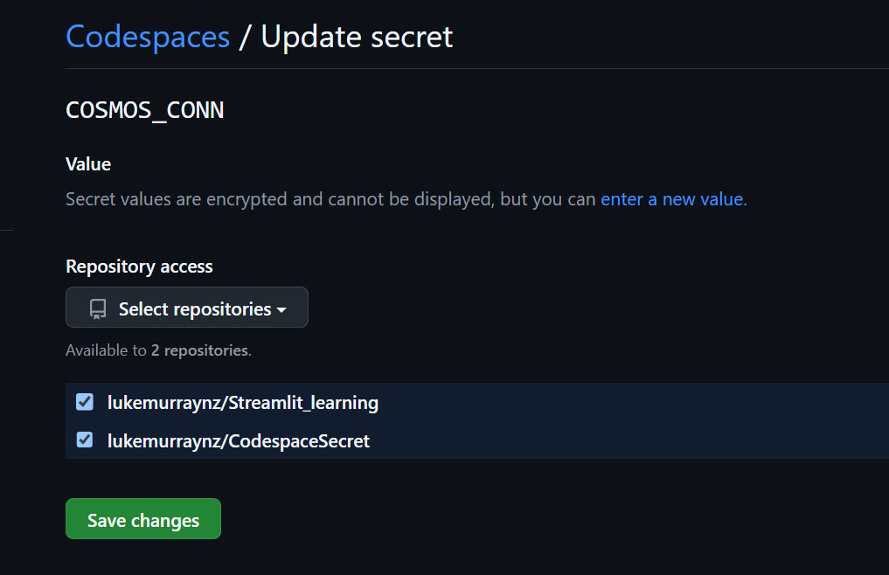
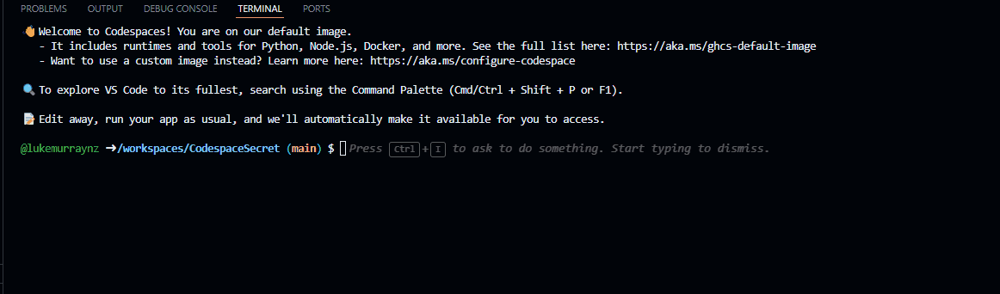
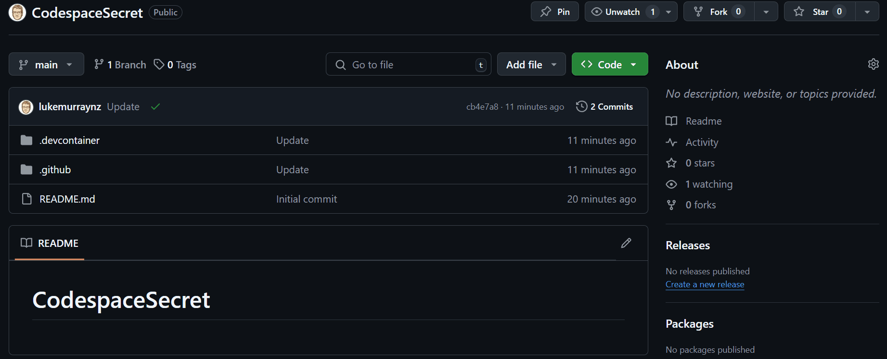
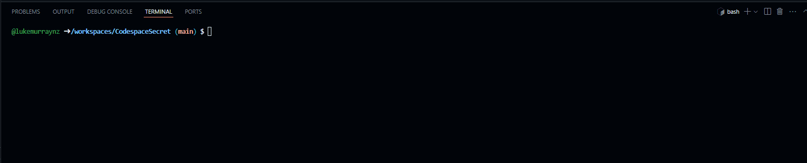
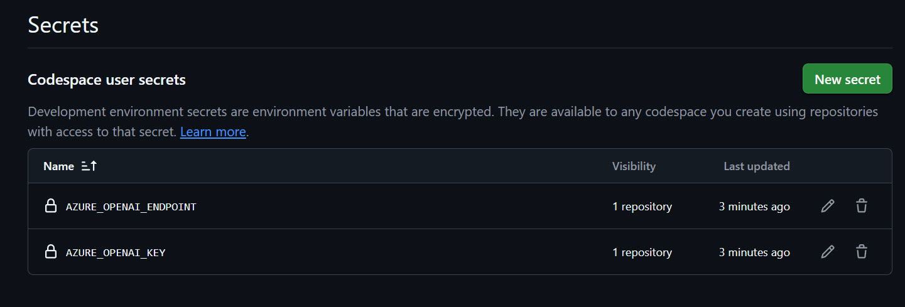
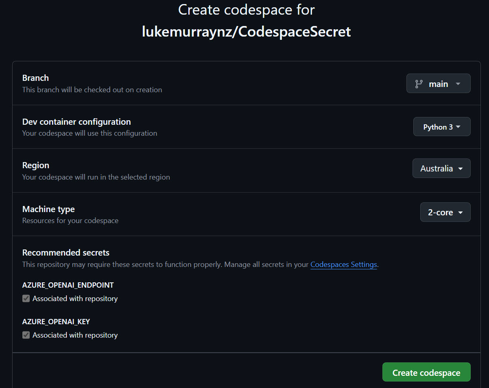

Today, we are going to look at Codespace Secrets.

{/* truncate */}

GitHub Codespaces secrets are environment variables that are securely stored in your GitHub account and made available to your Codespace environment. They help you manage sensitive information without hardcoding it in your repository.

This is a root-level configuration, so it's at the same level as features.

These are [account-specific secrets](https://docs.github.com/en/codespaces/managing-your-codespaces/managing-your-account-specific-secrets-for-github-codespaces).

You can configure them from your [Codespace account settings](https://github.com/settings/codespaces) and allow them for specific repositories.



And when you open up a Codespace, and run a command like 'printenv' you can see the value as environment variables, you can then call.



However, thats not scalable, as it requires everyone to add in the secrets to their secrets ahead of time. 

You can configure the name of these secrets in your devcontainer.json file, as below:

```json
"secrets": {
		"AZURE_OPENAI_ENDPOINT": {},
		"AZURE_OPENAI_KEY": {}
	},
```

This is a root-level configuration, just like Features and customizations, so it sits at the same level, like below:.

```json
{
	"name": "Python 3",
	"image": "mcr.microsoft.com/devcontainers/python:1-3.12-bullseye",
	"secrets": {
		"AZURE_OPENAI_ENDPOINT": {},
		"AZURE_OPENAI_KEY": {}
	},
	 "features": {}
}
```

This allows you to prompt for the secrets as part of the Codespace build.



It is accessed normally through the environment variables as well:



For those with a keen eye, will also realise that the environment variables are now entered into your Secrets Account settings, scoped to your repository:



From there, you can change the value.

Then you can use a link like below _(replace your repo with your own)_ to point users directly to your Codespace, with the Secret field:

[https://github.com/codespaces/new?hide_repo_select=true&ref=main&repo=lukemurraynz/CodespaceSecret&machine=basicLinux32gb&devcontainer_path=.devcontainer%2Fdevcontainer.json](https://github.com/codespaces/new?hide_repo_select=true&ref=main&repo=lukemurraynz/CodespaceSecret&machine=basicLinux32gb&devcontainer_path=.devcontainer%2Fdevcontainer.json)



Then you can call the values in your script and applications as needed.

:::warning
These are not encrypted, even though they are scoped to your account only. If you output these in text, they will be shown, so be careful with their use in your application.
:::

PowerShell example:

```PowerShell
# Get environment variables for AZURE_OPENAI_KEY and AZURE_OPENAI_ENDPOINT
$azureOpenAiEndpoint = $env:AZURE_OPENAI_ENDPOINT
$azureOpenAiKey = $env:AZURE_OPENAI_KEY
Write-Host "AZURE_OPENAI_ENDPOINT: $azureOpenAiEndpoint"
Write-Host "AZURE_OPENAI_KEY: $azureOpenAiKey"
```
Python example: 

```python
import os
azure_openai_endpoint = os.environ.get("AZURE_OPENAI_ENDPOINT")
azure_openai_key = os.environ.get("AZURE_OPENAI_KEY")
print(f"AZURE_OPENAI_ENDPOINT: {azure_openai_endpoint}")
print(f"AZURE_OPENAI_KEY: {azure_openai_key}")
```
