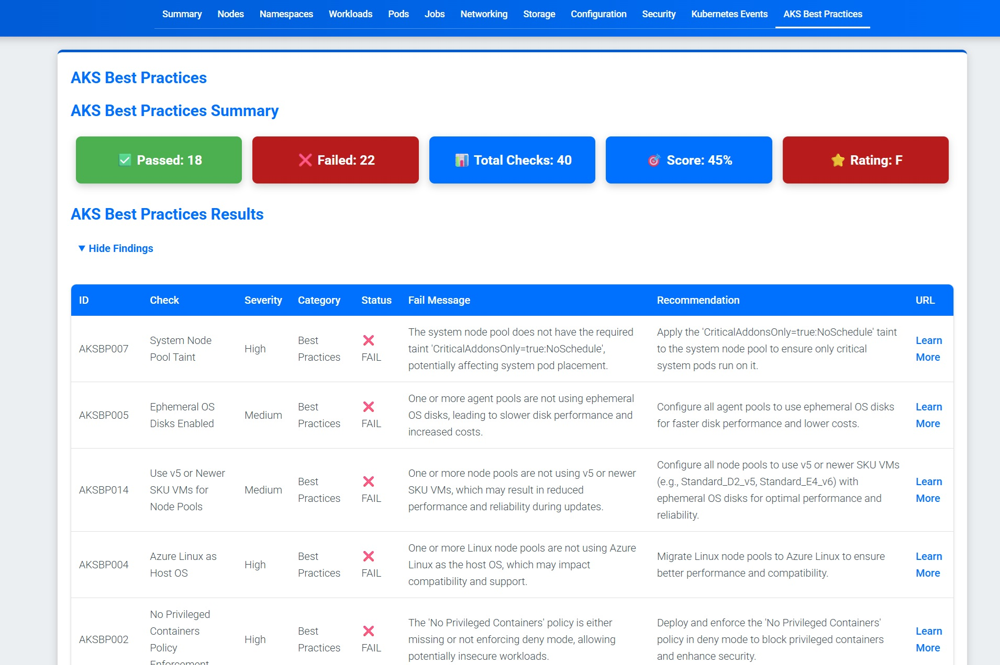

---
title:
metaDescription:
tags:
  - Azure
  - Misc
categories:
  - Misc
authors:
  - Luke
slug: azure/
keywords:
  - Azure
description:
---

Today, we are going to look at [KubeBuddy](https://kubebuddy.kubedeck.io/).


The tag line of KubeBuddy is:

> Kubernetes says your cluster is healthy. It’s probably not.

## Overview

Developed by Microsoft Azure MVP, Richard Hooper - let us take a look at KubeBuddy against an [Azure Kubernetes Cluster _(AKS)_](https://learn.microsoft.com/azure/aks/what-is-aks?WT.mc_id=AZ-MVP-5004796).

{/* truncate */}

:::info
[KubeBuddy](https://kubebuddy.kubedeck.io/) powered by [Kubedeck](https://github.com/kubedeckio) is a comprehensive diagnostic tool designed to address the hidden issues within Kubernetes clusters. It aims to solve problems related to node failures, pod crashes, security risks, and networking issues. By running externally via your terminal or Docker, KubeBuddy ensures no cluster intrusion, providing clean execution without agents or Helm charts. It generates actionable reports in HTML, JSON, or CLI formats, offering quick insights and sharing capabilities. KubeBuddy's stateless design means scans don't persist anything, ensuring no runtime footprint or security baggage. It can be used locally, in CI/CD, or on a jump host, making it versatile for various work environments.
:::

Today, we are going to run it locally, against an [Azure Kubernetes Cluster _(AKS)_](https://learn.microsoft.com/azure/aks/what-is-aks?WT.mc_id=AZ-MVP-5004796) - using [PowerShell](https://learn.microsoft.com/powershell/scripting/overview?view=powershell-7.5&WT.mc_id=AZ-MVP-5004796). If you are so inclined you can go down the [docker](https://kubebuddy.kubedeck.io/usage/docker-usage/) route.

## ⚙️ Connect & Scan

KubeBuddy uses your existing kubeconfig to scan your cluster externally, no agents required. So, let us get started.

I have an AKS cluster. This AKS cluster is deployed in the Australia East region, it has a System Node Pool size of Standard_DS2_v2, and a User Node Pool size of: Standard_D4as_v5. I will be running this on a GitHub Codespace, running Ubuntu 20.04.6 LTS and PowerShell 7.5.1 with kubectl and Azure CLI installed.

First up - let's install the KubeBuddy module.

```powershell
Install-Module -Name KubeBuddy -Scope CurrentUser -Force -AllowClobber
```


Once installed, we need to login to Azure using the Azure CLI, and then connect to the AKS cluster.

```powershell
# =========================
# Variables
# =========================
$resourceGroup      = "aksdrasi-mvp-vscode"
$clusterName        = "drasiaksmvp"
$subscriptionId     = "11b74992-d520-46e1-a9e9-b55c57d2e890"
# =========================
# Helper Functions
# =========================
function Write-Log {
    param([string]$message)
    Write-Host "$(Get-Date -Format o): $message"
}
# =========================
# Main Logic
# =========================
Write-Log "Setting Azure subscription context..."
az account set --subscription $subscriptionId
Write-Log "Getting AKS credentials for cluster '$clusterName' in resource group '$resourceGroup'..."
az aks get-credentials --resource-group $resourceGroup --name $clusterName
Write-Log "AKS credentials setup."
```


Once we have the AKS credentials and set the kuberconfig, we can run KubeBuddy.

```powershell
# =========================
# Variables
# =========================
$resourceGroup      = "aksdrasi-mvp-vscode"
$clusterName        = "drasiaksmvp"
$subscriptionId     = "11b74992-d520-46e1-a9e9-b55c57d2e890"

# =========================
# Helper Functions
# =========================
function Write-Log {
    param([string]$message)
    Write-Host "$(Get-Date -Format o): $message"
}
# =========================
# Main Logic
# =========================
Write-Log "Invoking KubeBuddy for AKS cluster management..."
Invoke-KubeBuddy -Aks -SubscriptionId $subscriptionId -ResourceGroup $resourceGroup -ClusterName $clusterName
Write-Log "KubeBuddy invocation complete."
```


## 📈 Deliver Insights

Generates clear, actionable reports in HTML, JSON, or CLI format for immediate action.

Now that we can run KubeBuddy, we can start to look at the results. KubeBuddy will run a series of tests against the AKS cluster and return the results. Instead of the interactive mode shown earlier, we are going to have it generate a HTML report with the AKS check results _(assuming we have the kubeconfig connected as part of earlier steps)_.

```powershell
Invoke-KubeBuddy -HtmlReport
```


We can clearly see that my Kubernetes cluster is not healthy. There are issues with the AKS cluster, and the HTML report includes recommended actions.

::warning
So far, the alerts and reports are only Kubernetes-based for the HTML reports, if we are using Docker, we will have to authenticate using a Service Principal for the Aks health checks, but with the PowerShell method, we are already authenticated so we can simply add the Aks switch.
:::

And run the KubeBuddy report command again, with the AKS switch:

```powershell
Invoke-KubeBuddy -AKS -SubscriptionId $subscriptionId -ResourceGroup $resourceGroup -ClusterName $clusterName -HtmlReport
```



## 🔎 Analyze Issues

Detects hidden problems like misconfigurations, security risks, and resource failures in seconds.

Now that we have scanned our cluster and retrieved the reports, its time to review and analyse the issues we have encountered.
