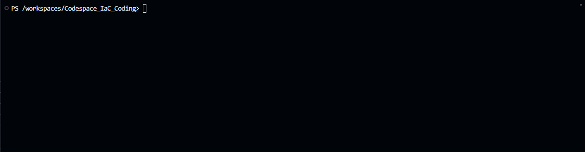
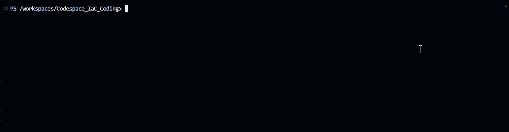

Today, we are going to look at [KubeBuddy](https://kubebuddy.kubedeck.io/).


The tag line of KubeBuddy is:

> Kubernetes says your cluster is healthy. It’s probably not.

## Overview

Developed by Microsoft Azure MVP, Richard Hooper - let us take a look at KubeBuddy against an [Azure Kubernetes Cluster _(AKS)_](https://learn.microsoft.com/azure/aks/what-is-aks?WT.mc_id=AZ-MVP-5004796).

{/* truncate */}

:::info
[KubeBuddy](https://kubebuddy.kubedeck.io/) powered by [Kubedeck](https://github.com/kubedeckio) is a comprehensive diagnostic tool designed to address the hidden issues within Kubernetes clusters. It aims to solve problems related to node failures, pod crashes, security risks, and networking issues. By running externally via your terminal or Docker, KubeBuddy ensures no cluster intrusion, providing clean execution without agents or Helm charts. It generates actionable reports in HTML, JSON, or CLI formats, offering quick insights and sharing capabilities. KubeBuddy's stateless design means scans don't persist anything, ensuring no runtime footprint or security baggage. It can be used locally, in CI/CD, or on a jump host, making it versatile for various work environments.
:::

Today, we are going to run it locally, against an [Azure Kubernetes Cluster _(AKS)_](https://learn.microsoft.com/azure/aks/what-is-aks?WT.mc_id=AZ-MVP-5004796) - using [PowerShell](https://learn.microsoft.com/powershell/scripting/overview?view=powershell-7.5&WT.mc_id=AZ-MVP-5004796). If you are so inclined you can go down the [docker](https://kubebuddy.kubedeck.io/usage/docker-usage/) route.

## ⚙️ Connect & Scan

KubeBuddy uses your existing kubeconfig to scan your cluster externally, no agents required. So, let us get started. 

I have an AKS cluster. This AKS cluster is deployed in the Australia East region, it has a System Node Pool size of Standard_DS2_v2, and a User Node Pool size of: Standard_D4as_v5. I will be running this on a GitHub Codespace, running Ubuntu 20.04.6 LTS and PowerShell 7.5.1 with kubectl and Azure CLI installed.

First up - lets install the KubeBuddy module.

```powershell
Install-Module -Name KubeBuddy -Scope CurrentUser -Force -AllowClobber
```


Once installed, we need to login to Azure using the Azure CLI, and then connect to the AKS cluster.

```powershell
# =========================
# Variables
# =========================
$resourceGroup      = "aksdrasi-mvp-vscode"
$clusterName        = "drasiaksmvp"
$subscriptionId     = "11b74992-d520-46e1-a9e9-b55c57d2e890"
# =========================
# Helper Functions
# =========================
function Write-Log {
    param([string]$message)
    Write-Host "$(Get-Date -Format o): $message"
}
# =========================
# Main Logic
# =========================
Write-Log "Setting Azure subscription context..."
az account set --subscription $subscriptionId
Write-Log "Getting AKS credentials for cluster '$clusterName' in resource group '$resourceGroup'..."
az aks get-credentials --resource-group $resourceGroup --name $clusterName
Write-Log "AKS credentials setup."
```


Once we have the AKS credentials and set the kuberconfig, we can run KubeBuddy.

```powershell
# =========================
# Variables
# =========================
$resourceGroup      = "aksdrasi-mvp-vscode"
$clusterName        = "drasiaksmvp"
$subscriptionId     = "11b74992-d520-46e1-a9e9-b55c57d2e890"

# =========================
# Helper Functions
# =========================
function Write-Log {
    param([string]$message)
    Write-Host "$(Get-Date -Format o): $message"
}
# =========================
# Main Logic
# =========================
Write-Log "Invoking KubeBuddy for AKS cluster management..."
Invoke-KubeBuddy -Aks -SubscriptionId $subscriptionId -ResourceGroup $resourceGroup -ClusterName $clusterName
Write-Log "KubeBuddy invocation complete."
```


## 🔎 Analyze Issues

Detects hidden problems like misconfigurations, security risks, and resource failures in seconds.

Now that we can run KubeBuddy, we can start to look at the results. KubeBuddy will run a series of tests against the AKS cluster and return the results. Instead of the interactive mode shown earlier, we are going to have it generate a HTML report with the AKS check results _(assuming we have the kubeconfig connected as part of earlier steps)_.

```powershell
Invoke-KubeBuddy -HtmlReport
```



We can clearly see that my Kubernetes cluster is not healthy. We can see that there are issues with the AKS cluster, and we can see the issues in the HTML report, including recommended actions.

Now if we want AKS checks as well, then we can run the following command:

```powershell
$resourceGroup      = "aksdrasi-mvp-vscode"
$clusterName        = "drasiaksmvp"
$subscriptionId     = "11b74992-d520-46e1-a9e9-b55c57d2e890"
Invoke-KubeBuddy -SubscriptionId $subscriptionId -ResourceGroup $resourceGroup -ClusterName $clusterName -HtmlReport
```

:::warning
So far, the alerts and reports are only Kubernetes based for the HTML reports, unlike the interactive mode earlier that allowed us to run AKS specific health check. To do this, we need to authenticate to the cluster using a Service Principal. For AKS clusters, you need a Service Principal (SPN) with permissions to read cluster metadata and all Kubernetes resources, including secrets.
:::

So lets run through the process of configuring the Service Principal (SPN) for the AKS cluster, for our Report.

```bash
az ad sp create-for-rbac --name "KubeBuddySPN" --output json
```
Save these values for later use, be wary of the secure nature of the password:

* appId
* password
* tenant

Now we need to create a Custom Role, that we will assign to the Service Principal (SPN). **Make sure to update the subscription ID with your own subscription where the AKS Cluster is held**.

```PowerShell
$kubeBuddyReaderJson = @'
{
  "Name": "KubeBuddy Reader",
  "Description": "Grants read-only access to all Kubernetes resources in an AKS cluster, including secrets, for KubeBuddy reporting.",
  "Actions": [
    "Microsoft.Authorization/*/read",
    "Microsoft.Resources/subscriptions/operationresults/read",
    "Microsoft.Resources/subscriptions/read",
    "Microsoft.Resources/subscriptions/resourceGroups/read"
  ],
  "NotActions": [],
  "DataActions": [
    "Microsoft.ContainerService/managedClusters/apps/*/read",
    "Microsoft.ContainerService/managedClusters/autoscaling/*/read",
    "Microsoft.ContainerService/managedClusters/batch/*/read",
    "Microsoft.ContainerService/managedClusters/configmaps/read",
    "Microsoft.ContainerService/managedClusters/endpoints/read",
    "Microsoft.ContainerService/managedClusters/events/*/read",
    "Microsoft.ContainerService/managedClusters/extensions/*/read",
    "Microsoft.ContainerService/managedClusters/limitranges/read",
    "Microsoft.ContainerService/managedClusters/namespaces/read",
    "Microsoft.ContainerService/managedClusters/networking.k8s.io/*/read",
    "Microsoft.ContainerService/managedClusters/pods/*/read",
    "Microsoft.ContainerService/managedClusters/policy/*/read",
    "Microsoft.ContainerService/managedClusters/secrets/read",
    "Microsoft.ContainerService/managedClusters/services/read",
    "Microsoft.ContainerService/managedClusters/storage.k8s.io/*/read"
  ],
  "NotDataActions": [],
  "AssignableScopes": [
    "/subscriptions/11b74992-d520-46e1-a9e9-b55c57d2e890"
  ]
}
'@
Set-Content -Path "KubeBuddyReader.json" -Value $kubeBuddyReaderJson
```
Then we can create the custom role using the JSON file we just created:

```bash
az role definition create --role-definition KubeBuddyReader.json
```

Then we can assign the role to the Service Principal (SPN) we created earlier _(with the SPN_CLIENT_ID as the appId from the JSON output earlier when the SPN was created)_:

```bash
$resourceGroup   = "aksdrasi-mvp-vscode"
$clusterName    = "drasiaksmvp"
$subscriptionId  = "11b74992-d520-46e1-a9e9-b55c57d2e890"
$spn_client_id    = "46c9b1bb-a0ec-43b1-a49a-22e0d6505c8f"
$location         = "australiaeast" # Default to 'australiaeast' per guidance

# Set Azure subscription context
az account set --subscription $subscriptionId

# Get AKS resource ID
$aks_id = az aks show `
    --resource-group $resourceGroup `
    --name $clusterName `
    --subscription $subscriptionId `
    --query id --output tsv

# Assign roles (idempotent, safe for CI/CD)
$roles = @(
    "KubeBuddy Reader"
)

foreach ($role in $roles) {
    az role assignment create --role $role --assignee $spnClientId --scope $aks_id --only-show-errors
    if ($LASTEXITCODE -ne 0) {
        Write-Warning "Role '$role' may already be assigned or there was an error."
    } else {
        Write-Host "Assigned role '$role' to SPN '$spnClientId' on AKS '$clusterName'."
    }
}

```
Now test the SPN connectivity to the AKS cluster:

```bash
az aks get-credentials --resource-group "aksdrasi-mvp-vscode" --name "drasiaksmvp" --subscription "11b74992-d520-46e1-a9e9-b55c57d2e890"
kubectl get pods --all-namespaces
```
And run the KubeBuddy report command again, with the AKS switch:

```powershell
Invoke-KubeBuddy -AKS -SubscriptionId $subscriptionId -ResourceGroup $resourceGroup -ClusterName $clusterName -HtmlReport
```

## 📈 Deliver Insights

Generates clear, actionable reports in HTML, JSON, or CLI format for immediate action.