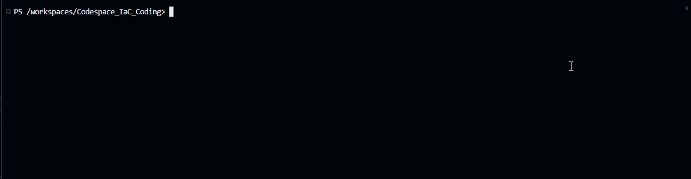
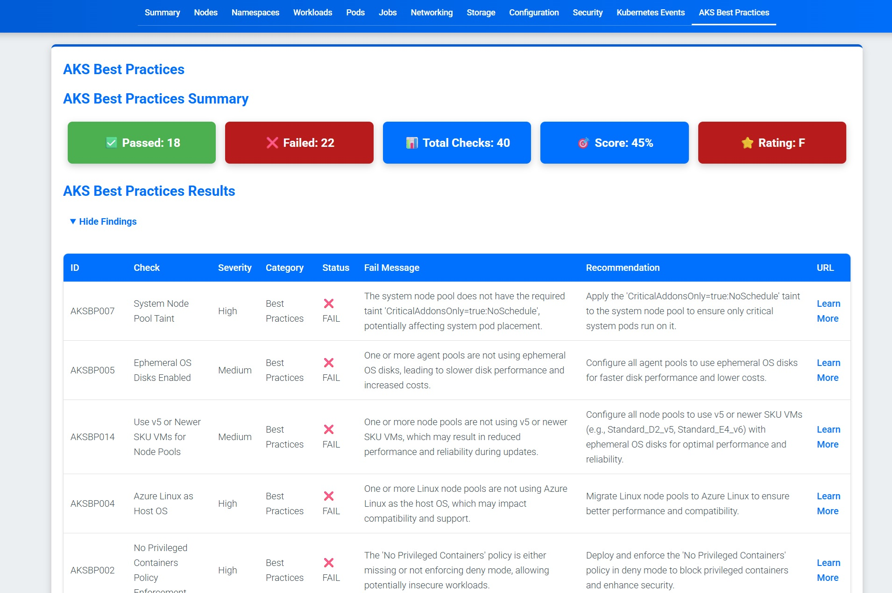
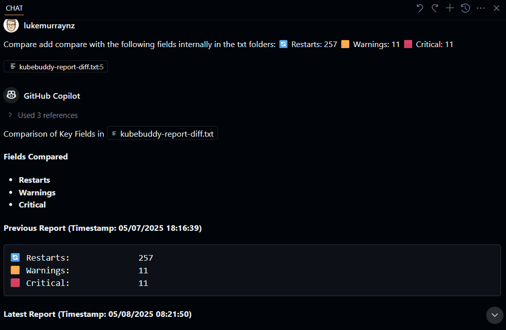

Today, we will look at [KubeBuddy](https://kubebuddy.kubedeck.io/).


The tag line of KubeBuddy is:

> Kubernetes says your cluster is healthy. It’s probably not.

{/* truncate */}

## Overview

Developed by Microsoft Azure MVP, [Richard Hooper](https://www.linkedin.com/in/%E2%98%81-richard-hooper/) - let us take a look at KubeBuddy against an [Azure Kubernetes Cluster _(AKS)_](https://learn.microsoft.com/azure/aks/what-is-aks?WT.mc_id=AZ-MVP-5004796).

:::info
[KubeBuddy](https://kubebuddy.kubedeck.io/), powered by [Kubedeck](https://github.com/kubedeckio), is a comprehensive diagnostic tool designed to address the hidden issues within Kubernetes clusters. It aims to solve problems related to node failures, pod crashes, security risks, and networking issues. By running externally via your terminal or Docker, KubeBuddy ensures no cluster intrusion, providing clean execution without agents or Helm charts. It generates actionable reports in HTML, JSON, or CLI formats, offering quick insights and sharing capabilities. KubeBuddy's stateless design means scans don't persist anything, ensuring no runtime footprint or security baggage. It can be used locally, in CI/CD, or on a jump host, making it versatile for various work environments.
:::

Today, we are going to run it locally, against an [Azure Kubernetes Cluster _(AKS)_](https://learn.microsoft.com/azure/aks/what-is-aks?WT.mc_id=AZ-MVP-5004796) - using [PowerShell](https://learn.microsoft.com/powershell/scripting/overview?view=powershell-7.5&WT.mc_id=AZ-MVP-5004796). If you are so inclined, you can go down the [docker](https://kubebuddy.kubedeck.io/usage/docker-usage/) route.

## ⚙️ Connect & Scan

KubeBuddy uses your existing Kubeconfig to scan your cluster externally; no agents are required. So, let's get started.

I have an AKS cluster. This cluster is deployed in the Australia East region. Its System Node Pool size is Standard_DS2_v2, and its User Node Pool size is Standard_D4as_v5. I will run this on a GitHub Codespace, running Ubuntu 20.04.6 LTS and PowerShell 7.5.1 with kubectl and Azure CLI installed, but from the PowerShell terminal.

First, let's install the KubeBuddy module.

```powershell
Install-Module -Name KubeBuddy -Scope CurrentUser -Force -AllowClobber
```


Once installed, we need to log in to Azure using the Azure CLI and then connect to the AKS cluster.

```powershell
# =========================
# Variables
# =========================
$resourceGroup      = "akscluster-rg"
$clusterName        = "lukesakscluster"
$subscriptionId     = "7a30b0c4-5b48-419e-8e57-439b127b69d2"
# =========================
# Helper Functions
# =========================
function Write-Log {
    param([string]$message)
    Write-Host "$(Get-Date -Format o): $message"
}
# =========================
# Main Logic
# =========================
Write-Log "Setting Azure subscription context..."
az account set --subscription $subscriptionId
Write-Log "Getting AKS credentials for cluster '$clusterName' in resource group '$resourceGroup'..."
az aks get-credentials --resource-group $resourceGroup --name $clusterName
Write-Log "AKS credentials setup."
```


Once we have the AKS credentials and set the kuberconfig, we can run KubeBuddy.

```powershell
# =========================
# Variables
# =========================
$resourceGroup      = "akscluster-rg"
$clusterName        = "lukesakscluster"
$subscriptionId     = "7a30b0c4-5b48-419e-8e57-439b127b69d2"

# =========================
# Helper Functions
# =========================
function Write-Log {
    param([string]$message)
    Write-Host "$(Get-Date -Format o): $message"
}
# =========================
# Main Logic
# =========================
Write-Log "Invoking KubeBuddy for AKS cluster management..."
Invoke-KubeBuddy -Aks -SubscriptionId $subscriptionId -ResourceGroup $resourceGroup -ClusterName $clusterName
Write-Log "KubeBuddy invocation complete."
```


## 📈 Deliver Insights

Generates clear, actionable reports in HTML, JSON, or CLI format for immediate action.

Now that we can run KubeBuddy, we can look at the results. KubeBuddy will run a series of tests against the AKS cluster and return the results. Instead of the interactive mode shown earlier, we are going to have it generate a HTML report with the AKS check results _(assuming we have the kubeconfig connected as part of earlier steps)_.

```powershell
Invoke-KubeBuddy -HtmlReport
```




We can see that my Kubernetes cluster is not healthy. The AKS cluster has issues, and the HTML report includes recommended actions.

:::warning
So far, the alerts and reports are only Kubernetes-based for the HTML reports. If we are using Docker, we will have to authenticate using a Service Principal for the Aks health checks, but with the PowerShell method, we are already authenticated, so we can simply add the Aks switch.
:::

And rerun the KubeBuddy report command, with the AKS switch:

```powershell
Invoke-KubeBuddy -AKS -SubscriptionId $subscriptionId -ResourceGroup $resourceGroup -ClusterName $clusterName -HtmlReport
```



## 🔎 Analyze Issues

Detects hidden problems like misconfigurations, security risks, and resource failures in seconds.

Now that we have scanned our cluster and retrieved the reports, it's time to review and analyse the issues we have encountered.

:::tip
You can do a comparison of 2 different reports to see if you are going up and down:

For example, if you run the following command to do the output as a text file:

```powershell
Invoke-KubeBuddy -txtReport -Aks -SubscriptionId $SubscriptionId -ResourceGroup $ResourceGroup -ClusterName $ClusterName
```

Then run a script similar to the one below to create a comparison file:

```powershell
# =========================

# Variables (snake_case)

# =========================

$report_path_1 = "./kubebuddy-report-20250508-082143.txt"
$report_path_2 = "./kubebuddy-report-20250507-181629.txt"
$output_diff_path = "./kubebuddy-report-diff.txt"

# =========================

# Parameters (camelCase)

# =========================

param(
[string]$reportFile1 = $report_path_1,
    [string]$reportFile2 = $report_path_2,
    [string]$outputFile = $output_diff_path
)

# =========================

# Helper Functions

# =========================

function Validate-FileExists {
param(
[string]$filePath,
        [string]$paramName
)
if (-not (Test-Path $filePath)) {
        throw "File '$filePath' specified by '$paramName' does not exist."
}
}

# =========================

# Main Logic

# =========================

try { # Validate input files
Validate-FileExists -filePath $reportFile1 -paramName "reportFile1"
Validate-FileExists -filePath $reportFile2 -paramName "reportFile2"

    # Compare files (ignoring whitespace differences)
    $diff = Compare-Object `
        -ReferenceObject (Get-Content $reportFile1) `
        -DifferenceObject (Get-Content $reportFile2) `
        -IncludeEqual:$false

    if ($diff) {
        $diff | Out-File -FilePath $outputFile
        Write-Host "Differences found. See $outputFile for details."
    } else {
        Write-Host "No differences found between the reports."
    }

}
catch {
Write-Error $_.Exception.Message
exit 1
}
```

This will generate a diff file, which you can then pass into something like Copilot or another script to do something like this:



:::

You can follow the recommendations, ie, [Use a managed identity in Azure Kubernetes Service (AKS)](https://learn.microsoft.com/azure/aks/use-managed-identity?WT.mc_id=AZ-MVP-5004796) that the reports give you. Be aware that some of the issues can only be resolved during the cluster creation. So, ideally, you would run this report as early in the lifecycle as possible, during the proof of technology phase, and take the recommendations into account as part of provisioning any UAT or Production workloads.

Give [KubeBuddy](https://kubebuddy.kubedeck.io/) a go today!
