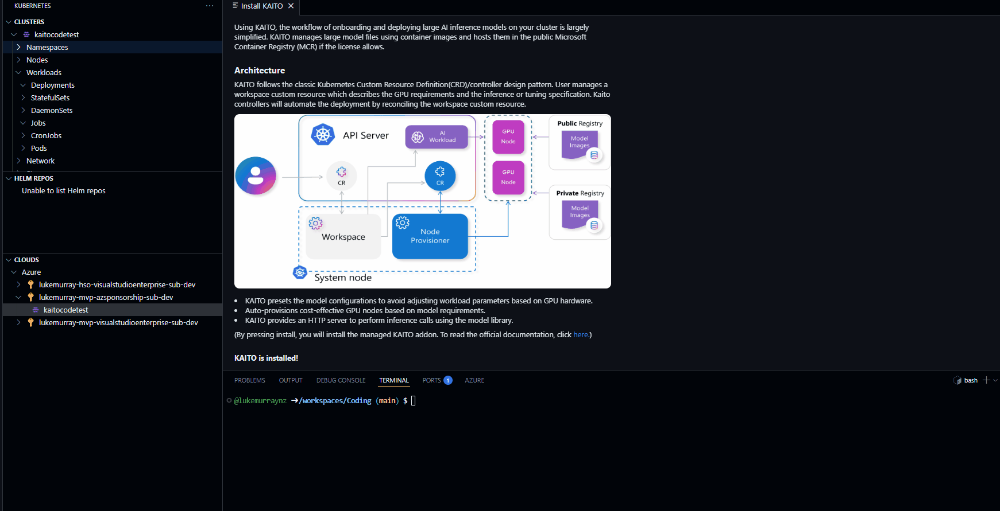
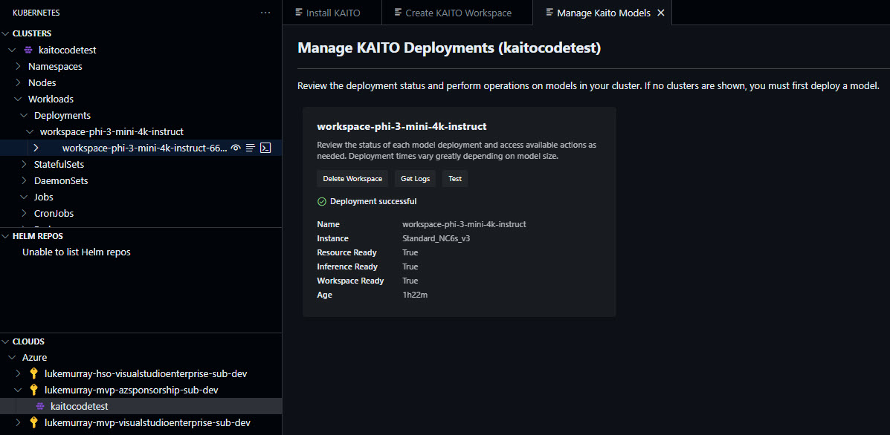
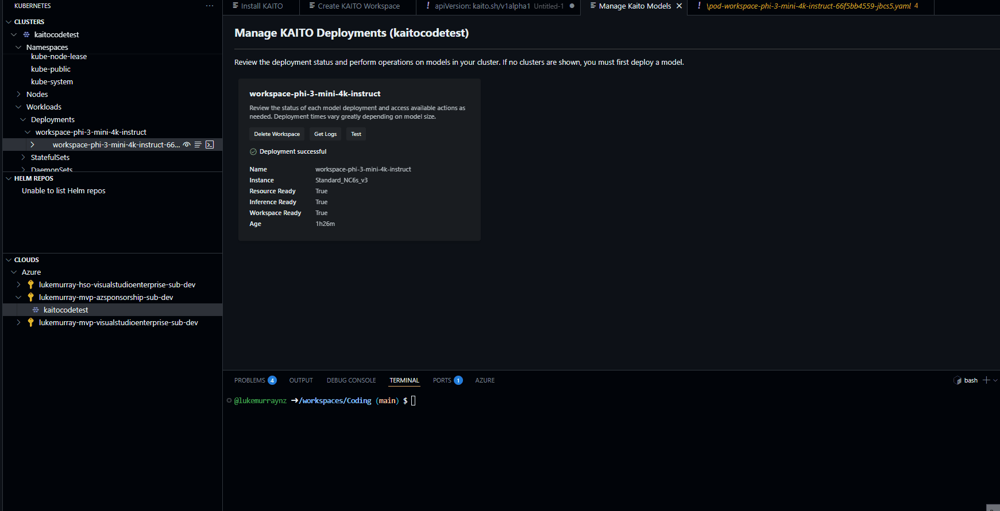

Today, we will look at deploying Kubernetes AI Toolchain Operator _(KAITO)_ straight from Visual Studio Code

{/* truncate */}

Last year I wrote a blog article on [Deploying Large Language Models on AKS with KAITO](https://luke.geek.nz/azure/run-local-llm-aks/), and since then, the KAITO team has been working hard to make it easier to deploy and manage AI workloads on Kubernetes - and in this case, straight from Visual Studio Code using the [Azure Kubernetes Service (AKS) extension](https://learn.microsoft.com/azure/aks/aks-extension-vs-code?WT.mc_id=AZ-MVP-5004796).

So let's look at how to deploy KAITO straight from Visual Studio Code. 

> I almost didn't write this article, due to the ease of deployment - but noticed that there were a few people searching for KAITO on my site, so I thought I would write this article to help those who are looking for a way to deploy KAITO on AKS.

I have the following prerequisites already set up:

- An Azure account with an AKS cluster configured for KAITO, such as:
  - Name: `KAITOcodetest`
  - Location: `australiaeast`
  - Kubernetes version: `1.31.7`
  - System pool: 2x `Standard_D8ds_v5` (autoscaling 2-5, 300GB ephemeral OS disk, zone 1, taint: `CriticalAddonsOnly=true:NoSchedule`)
  - User pool: 2x `Standard_D8ds_v5` (autoscaling 2-100, 300GB ephemeral OS disk, zone 1)
  - RBAC enabled, OIDC issuer enabled, Azure Policy and Container Insights enabled
  - Network: Azure CNI Overlay, Standard Load Balancer
  - Workload Identity enabled
- Visual Studio Code installed
- The Azure Kubernetes Service extension installed in Visual Studio Code

:::warning
[AKS Automatic clusters](https://learn.microsoft.com/azure/aks/intro-aks-automatic?WT.mc_id=AZ-MVP-5004796) are not supported by the KAITO extension at this stage. You must use a standard AKS cluster.
:::

So lets get started. First we need to install the KAITO workspace.

After authentication to Azure, we should be able to see the AKS cluster under your specific subscription. If you don't see it, you may need to refresh the view, or go and create the cluster first.

Lets install the [KAITO addon](https://learn.microsoft.com/azure/aks/ai-toolchain-operator?WT.mc_id=AZ-MVP-5004796) into the cluster first and setup the federated credentials - _(this can take a few minutes to complete)_.


Once the KAITO addon is installed, we can create a new KAITO workspace. This will create a new namespace in the cluster and install the KAITO operator into that namespace.



As you can see, you can customise the CRD for the workspace, such as the name, VM compute etc. In my case, I am going to use the base Standard_NC6s_v3 VM SKU, which is a 6 vCPU, 24GB RAM VM with 100GB ephemeral OS disk. This deployment can take 20-40 minutes or more to complete, so be patient.

Once completed, you will see the deployment in the AKS extension view, and you can see the status of the workspace, in my example it is running.



Now - let us test.



Now lets test outside of Visual Studio Code. We can use the [kubectl](https://learn.microsoft.com/azure/aks/ai-toolchain-operator-cli?WT.mc_id=AZ-MVP-5004796) to interact with the KAITO workspace.

```bash
kubectl get svc workspace-phi-3-mini-4k-instruct -o jsonpath='{.spec.clusterIP}'
export SERVICE_IP=$(kubectl get svc workspace-phi-3-mini-4k-instruct -o jsonpath='{.spec.clusterIP}')
kubectl run -it --rm --restart=Never curl --image=curlimages/curl -- curl -X POST http://$SERVICE_IP/chat -H "accept: application/json" -H "Content-Type: application/json" -d "{\"prompt\":\"What is your favorite ice cream flavor?\"}"
```
