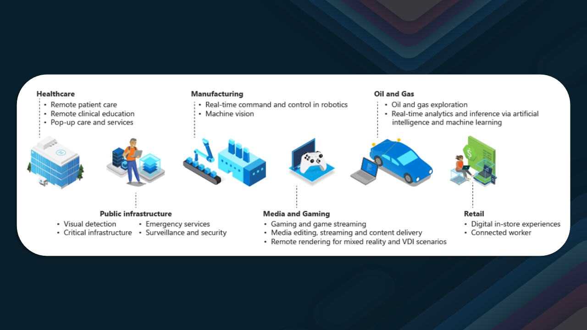
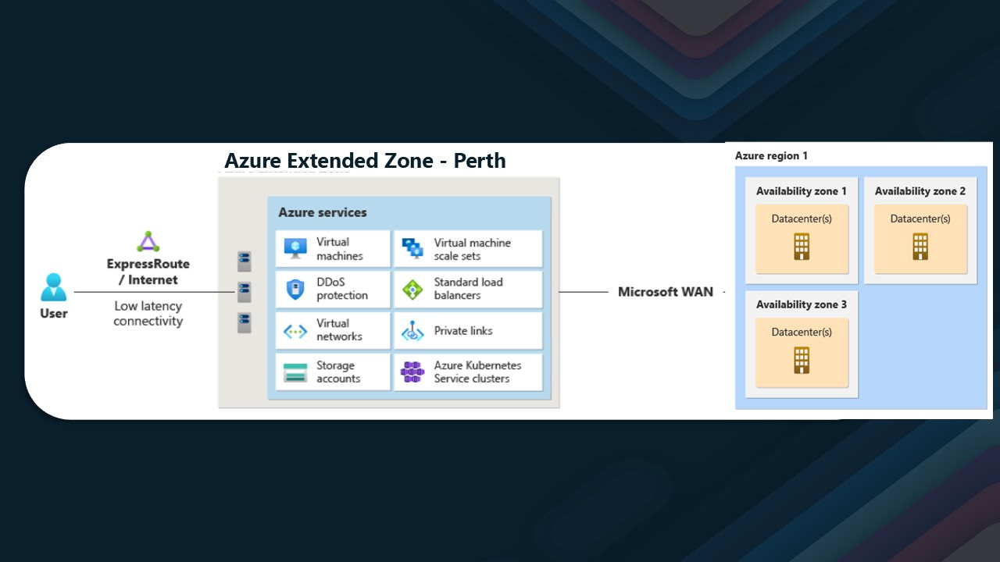
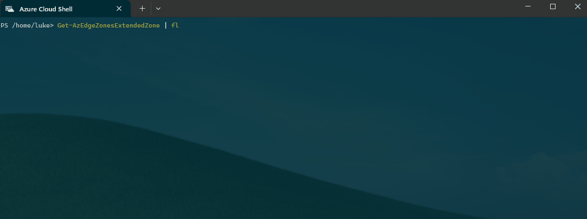
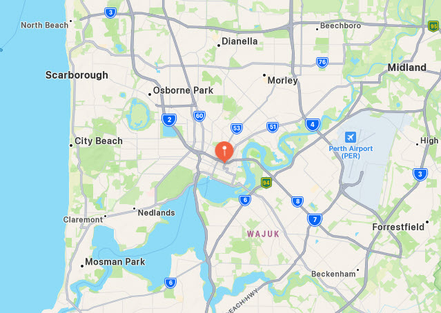
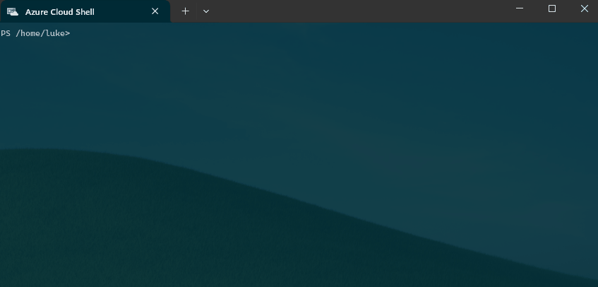
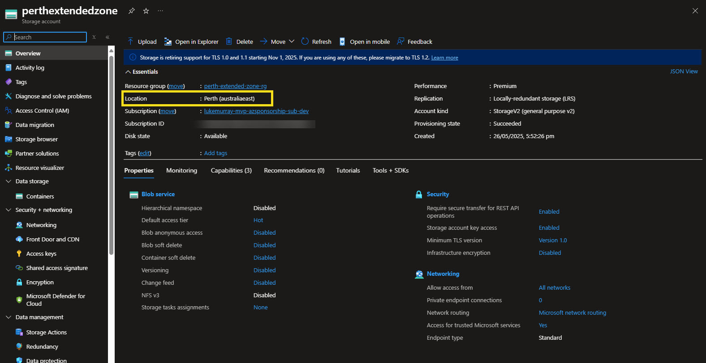
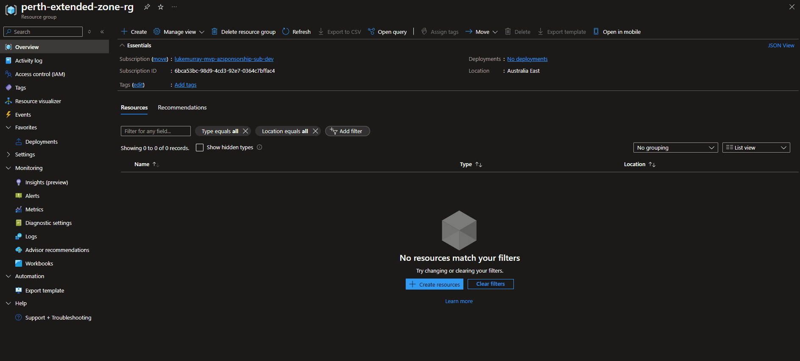

[Azure Extended Zones](https://learn.microsoft.com/azure/extended-zones/overview?WT.mc_id=AZ-MVP-5004796) are small-footprint extensions of Azure placed in metros, industry centers, or a specific jurisdiction to serve low-latency and data-residency workloads. Azure Extended Zones supports virtual machines (VMs), containers, storage, and a selected set of Azure services and can run latency-sensitive and throughput-intensive applications close to end users and within approved data residency boundaries.

Recently announced [Azure Extended Zones in Perth, Australia](https://azure.microsoft.com/en-gb/updates?id=492737?WT.mc_id=AZ-MVP-5004796), provide a new option for customers to run their workloads _(**make note only a subset of [resources are compatible](https://learn.microsoft.com/en-us/azure/extended-zones/overview?WT.mc_id=AZ-MVP-5004796#service-offerings-for-azure-extended-zones)**)_ closer to home. 

This is particularly beneficial for industries that require low latency and data residency, such as finance, healthcare, and government.



{/* truncate */}

## 🏙️ Azure Extended Zones in Perth: Details

So let us dig a bit deeper into the details of Azure Extended Zones in Perth, Australia.

Located in Perth _(location undisclosed)_, the Azure Extended Zones in Perth are designed to provide low latency and high availability for applications that require data residency within Australia. The zones are connected to the Azure backbone network, ensuring fast and reliable connectivity to other Azure regions. However, they are not self-sufficient and require a connection to an Azure region _(classed as the parent region)_.



The parent region for the Extended Zones in Perth is the Australia East region, which is located in Sydney. This means that the Extended Zones in Perth are connected to the Australia East region, allowing customers to take advantage of the full range of Azure services available in that region. The metadata for the resources in the Extended Zones will be stored in the Australia East region, but the data itself will remain in the Extended Zones in Perth.

## 🌐 Where Are Azure Extended Zones Available?

At the moment, there are 2 Extended Zones:

* Los Angeles
* Perth

## 🛠️ Viewing Extended Zone Details

If we run a `Get-AzEdgeZonesExtendedZone` command, we can see the details of the Extended Zones in Perth:

```powershell
Get-AzEdgeZonesExtendedZone | fl 
```


This command will return the details of the Extended Zones in Perth, including the name, location, parent _(Home)_ region, longitude, and latitude.



## 📝 Registering the Extended Zone

Before we can deploy a resource into the Extended Zone, we first need to register the Extended Zone in our subscription. We can do this by running the following command:

```powershell
Register-AzEdgeZonesExtendedZone -Name 'Perth'
```

Once the registration is complete, you will see the `RegistrationState` change to `Registered`.

## 📦 Deploying Resources to Perth Extended Zone

Once deployed, you can create resources in the Extended Zone using the Azure portal, Azure CLI, or Azure PowerShell. For our purposes, we will use Azure PowerShell to create a Storage account in the Perth Extended Zone.

```powershell
$rgName = 'perth-extended-zone-rg'
New-AzResourceGroup -Name $rgName -Location 'Australia East'
$storageAccountName = 'perthextendedzone'
New-AzStorageAccount -ResourceGroupName $rgName -Name $storageAccountName -Location 'Australia East' -SkuName Premium_LRS -EdgeZone 'Perth'
``` 

Once created, we can run a `Get-AzStorageAccount` command to see the details of the Storage account:

```powershell
Get-AzStorageAccount -ResourceGroupName $rgName -Name $storageAccountName | Select-Object Location, @{Name='ExtendedLocation';Expression={$_.ExtendedLocation.Name}}
```



If we view the storage account in the portal, we can see that the storage account is deployed in the Perth Extended Zone, with the metadata stored in the Australia East region:



Creating a Resource in the Azure Portal is simple: select a supported resource, select the primary region, and select the Extended Zone.



## ⚠️ Important Considerations

It's worth noting that if there is an issue in the Australia East region, the Extended Zones in Perth may continue to operate temporarily for existing workloads. However, they are not fully self-sufficient and rely on a connection to the Australia East region for resource creation and management. Until the issue in the Australia East region is resolved, you may face limitations in creating or managing resources in the Extended Zones.

Also worth noting, that the Extended Zones in Perth are not a replacement for the Azure regions in Australia, but rather an extension of the Azure regions to provide low latency and data residency for applications that require it - for example The Extended Zones in Perth are not designed to be used as a disaster recovery site for the Azure regions in Australia - note that the Storage account in the Extended Zone is not geo-replicated or zone-resilient, so consider resiliency and availability when deploying resources in the Extended Zones.

## 🏁 Conclusion

In conclusion, Azure Extended Zones in Perth, Australia, provide a new option for customers to run their workloads closer to home, with low latency and data residency. The Extended Zones are connected to the Azure backbone network, ensuring fast and reliable connectivity to other Azure regions. However, they are not self-sufficient and require a connection to an Azure region (classed as the parent region).
