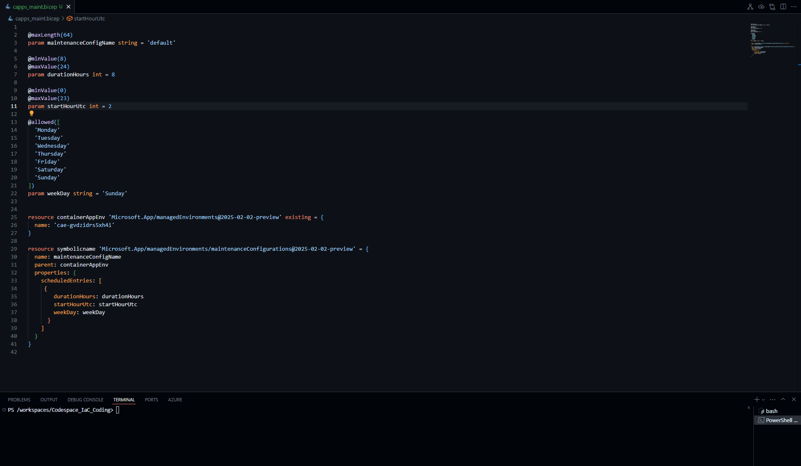
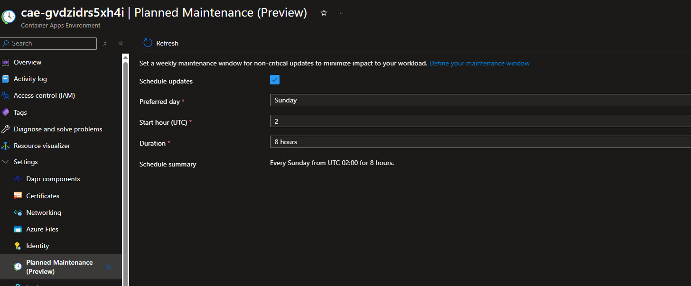

Announced at Microsoft Build 2025, [Planned maintenance is now generally available in Azure Container Apps](https://learn.microsoft.com/azure/container-apps/planned-maintenance?WT.mc_id=AZ-MVP-5004796). This feature allows you to control when non-critical updates are applied to your Container Apps environment to minimize downtime and impact to applications. Non-critical updates include minor security patches, bug fixes, and new releases. 

{/* truncate */}

:::info
Critical and urgent updates, however, are applied as needed to ensure security and reliability compliance, even outside of planned maintenance windows.  

| Update Type  | Description                                                                 | Timing                                                                                  |
|--------------|-----------------------------------------------------------------------------|-----------------------------------------------------------------------------------------|
| Critical     | Urgent fixes that include updates essential to the security and stability of your app. | Anytime – applied as needed to ensure security and reliability compliance.              |
| Noncritical  | Routine security patches, bug fixes, and the introduction of new features.  | If a planned maintenance window is defined, updates only start during that time span.If a maintenance window isn't configured, updates can be applied at any time. |
:::

Let's take a look at how to configure this feature in your Azure Container Apps environment.

You can use the [Azure CLI](https://learn.microsoft.com/azure/container-apps/planned-maintenance?WT.mc_id=AZ-MVP-5004796#add-a-window) to set up a maintenance window for your Container Apps environment. However, today we will focus on using Bicep.

:::warning
* You can only have one maintenance window per environment.
* The minimum duration for a maintenance window is 8 hours.
* Planned maintenance is an optional, best-effort feature that is ideal for environments with interdependent applications seeking added resiliency. When critical updates are available, Container Apps can apply them outside of the maintenance window to ensure the security and reliability of the platform and your applications.
* Maintenance windows are available in all container apps and jobs, except when they run on consumption workload profiles.
:::


In my demo, I have an existing Container Apps environment (a Consumption environment with one Container App), so I will be adding a maintenance window to that. If you are creating a new environment, you can add the maintenance window as part of the environment creation.

```bicep
@maxLength(64)
param maintenanceConfigName string = 'default'

@minValue(8)
@maxValue(24)
param durationHours int = 8

@minValue(0)
@maxValue(23)
param startHourUtc int = 2

@allowed([
  'Monday'
  'Tuesday'
  'Wednesday'
  'Thursday'
  'Friday'
  'Saturday'
  'Sunday'
])
param weekDay string = 'Sunday'


resource containerAppEnv 'Microsoft.App/managedEnvironments@2025-02-02-preview' existing = {
  name: 'cae-gvdzidrs5xh4i'
}

resource symbolicname 'Microsoft.App/managedEnvironments/maintenanceConfigurations@2025-02-02-preview' = {
  name: maintenanceConfigName
  parent: containerAppEnv
  properties: {
    scheduledEntries: [
     {
        durationHours: durationHours
        startHourUtc: startHourUtc
        weekDay: weekDay
      }
    ]
  }
}
```



Once deployed, we can view the maintenance window in the Azure Portal, under the Container Apps environment, in Settings, and under Planned Maintenance.



Then, in the [Diagnose and solve problems blade](https://learn.microsoft.com/en-gb/azure/container-apps/planned-maintenance?WT.mc_id=AZ-MVP-5004796#view-maintenance-history), you can view the configured maintenance window and upgrade events that occurred in the last month.
