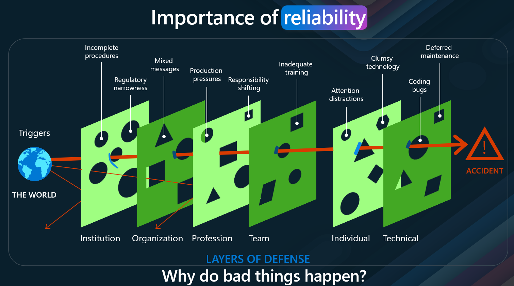
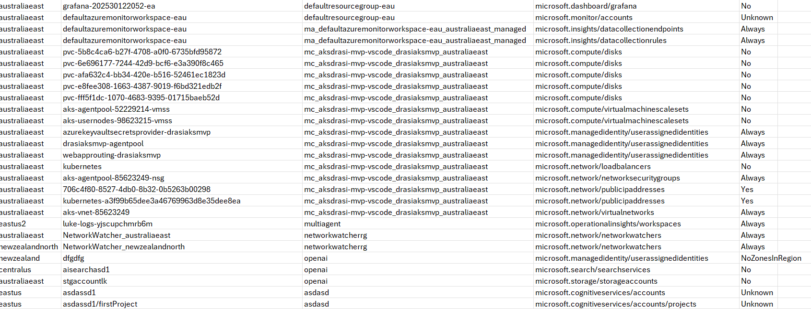

[Reliability](https://learn.microsoft.com/azure/well-architected/reliability/?WT.mc_id=AZ-MVP-5004796) _(Resiliency, availability, recovery)_ is part of one of the main pillars of the [Azure Well-Architected Framework](https://learn.microsoft.com/azure/well-architected/?WT.mc_id=AZ-MVP-5004796). It is essential for ensuring that applications and services remain operational and performant, even in the face of failures or unexpected events. Reliability encompasses various aspects, including fault tolerance, disaster recovery, and high availability.

Reliability is also a shared responsibility between the cloud provider _(ie Microsoft)_ and the customer. While Azure provides a robust infrastructure and services designed for reliability, customers must also implement best practices and strategies to ensure their applications are resilient and can recover from failures.

But a key question arises: **How do we check the reliability _(in this example Zone redundancy of our Workload)_ ?**

One of the tools we can use for this is the: `az zones` command line tool.

{/* truncate */}

:::info
I just want to that Resiliency is not just about the infrastructure, but also about the application design and architecture. It is important to consider how your application will handle failures and how it will recover from them - and there are a lot of layers to take into consideration when running technology.

However, the resiliency platform capabilities, although sometimes not directly visible, are essential for the reliability of your application. They provide the foundation upon which your workload sits.
:::

## 🏢 What Makes Up an Azure Region?

Before we go into the details of the `az zones` command line tool, I want to touch on what the tool will be highlighting for us.

If we go into what an region consists of, we can see that it is made up of multiple availability zones. An availability zone is a physically separate zone within an Azure region, designed to be isolated from failures in other zones. Each availability zone _(one ore more datacenters)_ has its own power, cooling, and networking infrastructure, ensuring that if one zone experiences an outage, the others remain operational.

## 🛡️ Designing for Reliability with Availability Zones

When designing your workloads for reliability within Azure, it is crucial to consider the availability zones. By deploying resources across multiple availability zones, you can achieve higher levels of fault tolerance and availability. This means that even if one zone goes down, your application can continue to function using resources in other zones.

:::tip
If your interested in more about Workload criticality, refer to a previous blog post I did: [Understanding Workload Criticality in the Cloud
](https://luke.geek.nz/azure/business-critical-workloads/). This goes a bit deeper into SLA, SLO, and composite SLAs
:::

## 🔍 How Do You Know If Your Workload Is Zone Redundant?

So how do you know, that your workload is zone redundant? This is where the `az zones` command line tool comes in handy.

:::warning
This extension is in active development. While an effort has been made to include the most common resource types and their zone redundancy configuration, there are still plenty of resource types missing. More will be added in future releases. In the meantime, if you need specific resources added or have found errors, please raise a [Github issue](https://github.com/Azure/azure-cli-extensions/issues). The extension still has missing resource types. These are shown as Unknown in the results. It is essential that you validate zone redundancy of these resources yourself, since your whole application is only zone redundant is all resources are zone redundant.
:::

## 🧩 Understanding Zone Redundancy Status

This CLI Extension helps validate the zone redundancy status of resources within a specific scope. For each resource, one of the following statuses will be returned:

| Status          | Description                                                                           |
| --------------- | ------------------------------------------------------------------------------------- |
| Unknown         | Unable to verify status. You'll need to check the resource manually.                  |
| Yes             | Resource is configured for zone redundancy                                            |
| Always          | Resource is always zone redundant, no configuration needed                            |
| No              | Resource is not configured for zone redundancy, but could be in another configuration |
| Never           | Resource cannot be configured for zone redundancy                                     |
| Dependent       | Resource is zone redundant if parent or related resource is zone redundant            |
| NoZonesInRegion | The region the resource is deployed in does not have Availability Zones               |

By running this against a specific resource group that contains your production resources, you can be sure that you have not overlooked any resources in your quest for zone redundancy. If the results show 'No' on one of your resources, that means that you need to change the configuration to enable ZR. If it shows 'Never', that probably means you need to deploy multiple of those resources to the different zones manually.

> Zonal services are considered to be Zone Redundant if they are deployed to at least 2 zones.

## 🚀 Getting Started with `az zones validate`

So lets get going - with the [Azure CLI](https://learn.microsoft.com/cli/azure/install-azure-cli?view=azure-cli-latest&WT.mc_id=AZ-MVP-5004796) installed, its time to run a validate command - this will prompt the Azure CLI to install the extension.

Make sure you login with: `az login`
Then type: `az zones validate`

This will prompt the zones extension to be installed and run the validate command.

## 📊 Output Formats and Exporting Results

Next lets run it again - this time in a Table format:

`az zones validate -o table`

The Table format makes it easier to read in my opinion, and then we could export and then open it up in Excel for example to view outside of the terminal ` az zones validate -o table > ZonesOutput.csv`.

As we can see I have a range of resource types in my Azure environment:

I can see that I have User Assigned Managed Identitties with the class of: Always - meaning it is [zone-redundant](https://learn.microsoft.com/azure/storage/common/storage-redundancy?WT.mc_id=AZ-MVP-5004796#zone-redundant-storage) and no other changes are needed.
I can see that I have Disks - which are not zone redundant. THis means that they are not Zone-Redundant _(remember zone redundant is deployed to 2 or more zones) - in this case I would have to change the configuration from an [LRS _(Locally Redundant storage)_](https://learn.microsoft.com/azure/storage/common/storage-redundancy?WT.mc_id=AZ-MVP-5004796#locally-redundant-storage) to [ZRS _(Zone reundant storage)\_](https://learn.microsoft.com/azure/storage/common/storage-redundancy?WT.mc_id=AZ-MVP-5004796#zone-redundant-storage) SKU or adjust the system using the disk - to be redundant, ie failover cluster.
I can see I have an Expressroute circuit with the status of Unknown, this means that the zones CLI extension isn't able to verify this resource type. So you would need to check manually - make sure your [virtual network gateways are zone-redundant](https://learn.microsoft.com/en-us/azure/vpn-gateway/about-zone-redundant-vnet-gateways?WT.mc_id=AZ-MVP-5004796). Its worth noting - that Virtual Networks are zone-redundant by default.

## 🎯 Scoping Your Validation

Now its worth noting that when we ran `az zones validate` it ran across all resources across subscriptions in the tenant we have access to, if we wanted to limit the scope of the scan - we can.

We can limit it by Resources with a specific tag only:

`az zones validate --tags Environment=dev'

_(Its worth noting the Tag value pair is case sensative.)_

And we can also limit it by Resource Group or Subscription:

`az zones validate --resource-groups defaultresourcegroup-eau`

`az zones validate --subscription lukemurray-mvp-visualstudioenterprise-sub-dev`

## 🧹 Additional Options and Filtering

You can also use the `--omit-dependent` to remove resource dependencies from the scan and output.

You can also use a JMESPath custom query ie, if I wanted to only view the resiliency of my disks: `az zones validate --output table --query "[?resourceType=='microsoft.compute/disks'].{Resource:name, Location:location, ZoneRedundant:zoneRedundant}"`

