[Drasi](https://drasi.io/) _(named after the Greek word for 'Action')_ is a change data processing platform that automates real-time detection, evaluation, and meaningful reaction to events in complex, event-driven systems, created as part of the [Azure Incubation Teams, Drasi](https://azure.microsoft.com/blog/drasi-microsofts-newest-open-source-project-simplifies-change-detection-and-reaction-in-complex-systems/?WT.mc_id=AZ-MVP-5004796) was accepted in to the [Cloud Native Computing Foundation, at the Sandbox Maturity level in January of 2025](https://www.cncf.io/projects/drasi/).

I was fortunate enough to witness a demo of this in action and wondered how I might learn to use Drasi with something I am familiar with - the Microsoft Azure ecosystem. The Azure Role Assignment Monitor with Drasi was born.

{/* truncate */}

## 🚀 Introduction to Drasi

:::info
[Drasi](https://drasi.io/) is a Data Change Processing platform that makes it easier to build dynamic solutions that detect and react to data changes that occur in existing databases and software systems (i.e., not only new systems built using Drasi). Drasi’s change detection capabilities extend beyond simply reporting add, update, and delete operations, as typically provided by database transaction/change logs and message-based change notification solutions. Instead, Drasi’s low-code query-based approach enables you to write rich graph queries through which you can express sophisticated rules describing the types of changes you want to detect and the data you want to distribute about those changes to downstream systems.

Here are some examples of scenarios where Drasi’s functionality can be applied to existing systems to detect and react to changing data:

* Observing data from building sensors and automatically adjusting HVAC settings to maintain a comfortable environment for building occupants.
* Risk management through early awareness of company employees, facilities, and assets that are at risk due to emerging incidents occurring in their current location.
* Optimizing the delivery of orders to customers when they arrive in a curbside pickup zone.
* Improving infrastructure threat detection by raising alerts when a container with known security threats is deployed to a Kubernetes Cluster.

## 📋 Understanding Drasi Components

The power of Drasi is the components:

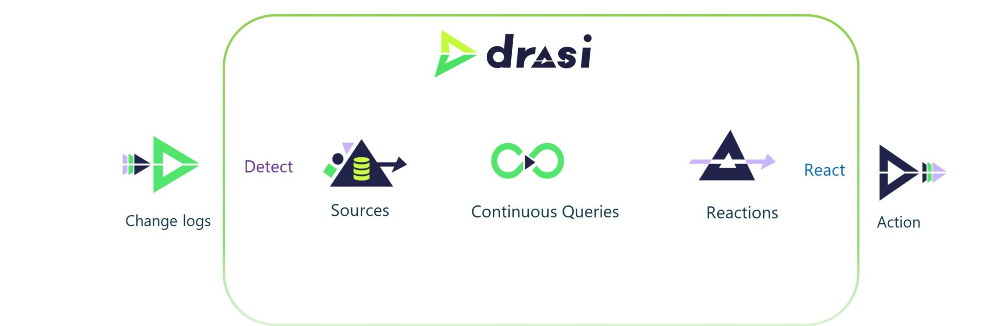

* Sources
* Continuous queries
* Reactions

You can have multiple sources, which are the data sources that Drasi monitors for changes. These can be databases, message queues, or any other system that can provide change data. A number of provided sources exist out of the box - CosmosDB, MySQL, PostgreSQL, Event Hub, SQL Server, Kubernetes, Dataverse.

These [sources](https://drasi.io/concepts/sources/) are monitored for changes, and when a change is detected, it is processed by a continuous query. Sources act like skilled translators. They watch a system’s native log or feed, convert inserts/updates/deletes into a consistent graph form, and push only the meaningful deltas to the engine.
A [continuous query](https://drasi.io/concepts/continuous-queries/) is a query that runs continuously and processes the changes detected by the source. The continuous query can be used to filter, transform, and aggregate the data from the source. Drasi leverages a subset of the Cypher graph query language because it excels at expressing patterns—entities and relationships—across multiple data sources. You write a one-time MATCH/WHERE/RETURN query that continually runs under the covers.
[Reactions](https://drasi.io/concepts/reactions/) are the actions that are taken when a change is detected and processed by the continuous query. Reactions can be used to send notifications, update other systems, or trigger other actions. Drasi provides a number of reactions out of the box - Azure Functions, Logic Apps, Webhooks, and more. Reactions subscribe to one or more Continuous Queries and trigger real-world actions when those queries’ result sets change. Because Reactions consume the structured “Query Result Change” payload—detailing exactly which nodes or relationships were added, updated, or removed—they can make fully informed decisions without re-polling underlying systems.

Imagine a smart-building scenario:

* Source: Drasi watches Azure Cosmos DB for room-temperature updates and PostgreSQL for occupancy schedules.
* Continuous Query: A single Cypher query joins rooms, sensors, and schedules to detect “occupied room < 18°C” conditions.
* Reaction: When that condition appears in the CQ’s result set, a Reaction module fires a heating command via MQTT; when it no longer applies, another Reaction module stops the heater.

Because Sources supply clean graph events, the CQ keeps an always-correct view without heavy polling, and Reactions act on precise change notifications, the entire pipeline runs at low latency and minimal operational overhead. No custom glue code. No brittle cron jobs.
:::

## 🎯 Our Azure Bastion Automation Scenario

In my scenario, I wanted to monitor the Azure Role Assignments in my Azure Subscription, my example is the use of the [Azure Bastion](https://learn.microsoft.com/azure/bastion/bastion-overview?WT.mc_id=AZ-MVP-5004796) Service, this services allows secure RDP and SSH connectivity to virtual machines in your Azure Virtual Network without the need for a public IP address on the virtual machine. This is a great service, it does require a role assignment to be able to use it, and its a pay as you go service - so I may not necessarily need it running all the time, wasting cost. Because I might require this service very ad-hoc, I couldn't rely on a schedule-type system I'd usually use _(ie, tag the resource with the schedule, have an Azure runbook create and delete the resource)_. There are other ways to monitor Azure Role Assignments, but I wanted to use Drasi to monitor the changes in real-time and react to them, in a way that could be expanded.

So my scenario is: 

When Sarah from Marketing needs access to a VM:

* An admin assigns her "VM Administrator Login" role _(manually or via a PIM assignment)_
* Automatically, this system detects the change
* Automatically, it creates a secure Bastion host
* Sarah can now securely connect to the VM
* When her access is revoked, the Bastion is automatically cleaned up

📋 Azure Activity Logs → 📨 Event Hub → 🔍 Drasi → 📧 Event Grid → ⚡ Azure Function → 🛡️ Create/Delete Bastion _(or Ignore)_

Azure Activity Logs: Every action in Azure _(like assigning roles)_ gets logged
Event Hub: Collects these logs in real-time
Drasi Source: Reads events from the Event Hub
Drasi Continuous Query: Filters for role assignment events we care about
Drasi Reaction: Sends notifications to Event Grid when matches are found
Azure Function: Receives the notification and takes action, adds additional logic as needed to filter results and take action
Bastion Management: Creates or removes Azure Bastion hosts as needed

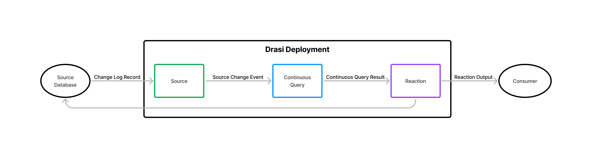

:::warning
There is a delay between the diagnostic logs being written to the Event Hub; it can take a few minutes for the role assignment changes to be logged. This is not a Drasi issue, but an Azure Event Hub/Azure Monitor export issue, it can take up to 5 minutes for the logs to be written to the Event Hub _(but once they are, Drasi picks it up within seconds)_. In my testing, I was able to fast-track my testing by publishing the Event Hub message directly into the Event Hub data explorer, without needing to go and manually wait for the role assignment to be created or deleted.
:::

## 🛠️ Setting Up Drasi Environment

So, first things first, let's get [Drasi](https://drasi.io/) up and running! To do this, I am going to use a [GitHub Codespace](https://github.com/features/codespaces) - you can find my devcontainer setup [here](https://github.com/lukemurraynz/Drasi-RoleAssignmentMonitor/blob/main/.devcontainer/devcontainer.json) - this will allow me to run Drasi in a container via docker if I want, but the main part is - it will already install the latest Drasi CLI, and have all the dependencies I need to deploy Drasi to my Azure Kubernetes Service, and manage it - such as the [Drasi Visual Studio Code extension](https://marketplace.visualstudio.com/items?itemName=DrasiProject.drasi) - all the code in this example is in this repository as well _(ie Drasi query, Function App)_.


To do this, I am going to deploy to an Azure Kubernetes Service cluster. The size of the cluster will depend on your use case. For my purposes, I am going with the following resources:

## 🏗️ Azure Resources Required

| Resource Type | Name | Region | Configuration | Purpose |
|---------------|------|---------|---------------|---------|
| **AKS Cluster** | `drasi-aks` | New Zealand North | • Standard Cluster • System Pool: Standard_D4ds_v5 • User Pool: Standard_D4s_v5 • Workload Identity enabled • Namespace: `drasi-system` | Hosts Drasi and runs query host for Continuous Queries |
| **User Assigned Managed Identity** | `drasi-mi` | New Zealand North | • Role: `Azure Event Hubs Data Receiver` • OIDC connection to AKS | Authentication for Drasi to access Event Hub |
| **Event Hub Namespace** | `azrole` | New Zealand North | • Standard tier • 1 throughput unit • Hub name: `drasieventhub1` | Drasi source - collects Azure Activity Logs |
| **Event Grid Topic** | `drasi-eventgrid-topic` | New Zealand North | • Basic tier • Schema: CloudEvents v1.0 • Azure Function subscription | Drasi reaction - sends notifications when changes detected |
| **Azure Function App** | `drasi-function-app` | Australia East* | • Linux Flex Consumption plan • PowerShell Core runtime | Creates/deletes Azure Bastion based on role assignments |

\* *Australia East region used as this SKU is not available in New Zealand North*

### Important Notes

- **AKS VM Sizing**: If you encounter errors with the Drasi API and query host starting, check your User pool VM size. Standard_D4s_v5 works well, but smaller sizes may cause issues with Drasi and Dapr runtime.
- **Workload Identity**: The AKS cluster must have [Workload identity enabled](https://learn.microsoft.com/azure/aks/workload-identity-deploy-cluster?WT.mc_id=AZ-MVP-5004796) for proper authentication.

I won't go through the creation of these resources individually; instead, I will focus on how they are used in relation to our Drasi Azure Role Assignment Monitor setup.

## 🚀 Installing Drasi on AKS

So we have our Azure resources created, and we can now deploy Drasi to our AKS cluster. To do this, we will use the [Drasi CLI](https://drasi.io/docs/cli/), which is installed in the devcontainer I mentioned earlier. Alternatively, you can install it locally if you prefer.

First, we will connect to our AKS cluster and confirm we can see the namespace before running the drasi init command to deploy Drasi to our AKS cluster:


```bash
# Install kubectl if not already installed
sudo az aks install-cli

# Login to Azure and get cluster credentials
az login
az aks get-credentials --resource-group <your-resource-group> --name <your-cluster-name>

# Check Drasi version
drasi version

# Initialize Drasi on Kubernetes
drasi init --namespace drasi-system --version 0.3.4

# Verify installation
kubectl get pods -n drasi-system
``` 


## 📊 Configuring Azure Activity Logs

Now that we have Drasi running in our AKS cluster, we can start the additional configuration. Let us configure our Azure Activity Logs to be sent to our Event Hub, so that Drasi can monitor them for changes. To do this, we will need to create a diagnostic setting on our subscription and configure it to send the Activity Logs to our Event Hub.

Role-based assignments are an Administrative category, so we will need to select the `Administrative` category when creating the diagnostic setting. You can do this via the Azure Portal by navigating to your subscription, selecting Activity Log, select Export Activity Logs, and then selecting the Event Hub you created earlier.


Once you have created the diagnostic setting, you can verify that the logs are being sent to the Event Hub by using the [Azure Event Hub Data Explorer](https://learn.microsoft.com/azure/event-hubs/event-hubs-data-explorer?WT.mc_id=AZ-MVP-5004796). It can take a few minutes for the logs to start appearing.

## 🔐 Setting Up Authentication with Workload Identity

Next, it's time to configure our Drasi source to read from the Event Hub. We are going to use Entra ID authentication to authenticate Drasi to the Event Hub, and this is where the Workload Identity we created earlier comes in. We will need to create a User Assigned Managed Identity and assign it the `Azure Event Hubs Data Receiver` role on the Event Hub namespace.

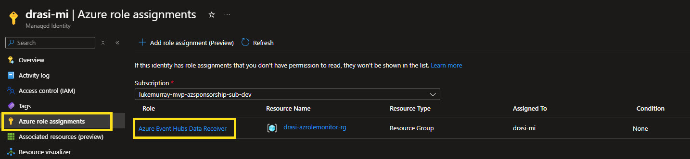

Now we need to grab the Issuer URL and Client ID of the User Assigned Managed Identity, we will need these to configure our federated credential, and configure out federated credential. Make sure to update for your own environment, the source name needs to align with your source name, and the service account to your namespace.

```bash
# Variables
AKS_NAME="drasi-azroleassignment-aks"
RG_NAME="drasi-azrolemonitor-rg"
MI_NAME="drasi-mi"
FC_NAME="drasi-eventhub"
SUBJECT="system:serviceaccount:drasi-system:source.azure-role-eventhub-source"
AUDIENCE="api://AzureADTokenExchange"

# Get the OIDC issuer URL for the AKS cluster
ISSUER_URL=$(az aks show --name "$AKS_NAME" --resource-group "$RG_NAME" --query "oidcIssuerProfile.issuerUrl" -o tsv)

# Create federated credential
az identity federated-credential create \
    --name "$FC_NAME" \
    --identity-name "$MI_NAME" \
    --resource-group "$RG_NAME" \
    --issuer "$ISSUER_URL" \
    --subject "$SUBJECT" \
    --audience "$AUDIENCE"
```

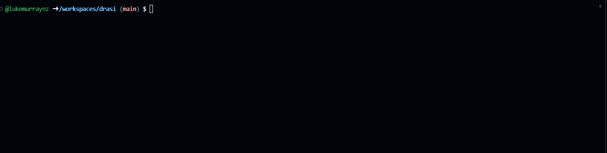

## 📡 Creating Drasi Event Hub Source

Now we can create our Drasi source:

```yaml title="eventhubsource.yaml"
kind: Source
apiVersion: v1
name: azure-role-eventhub-source
spec:
  kind: EventHub
  identity:
    kind: MicrosoftEntraWorkloadID
    clientId: 50421fa8-277f-4c22-a085-d5880422dc52
  properties:
    host: azrole.servicebus.windows.net
    eventHubs:
      - drasieventhub1
    bootstrapWindow: 5
```

Update the `clientId` with your User Assigned Managed Identity Client ID, and the `host` with your Event Hub namespace. You can then apply this source to your Drasi cluster:

```bash
drasi apply -f eventhubsource.yaml
```

Then check the status of the source:

```bash
drasi list source
# Output should show the source is Available.
```

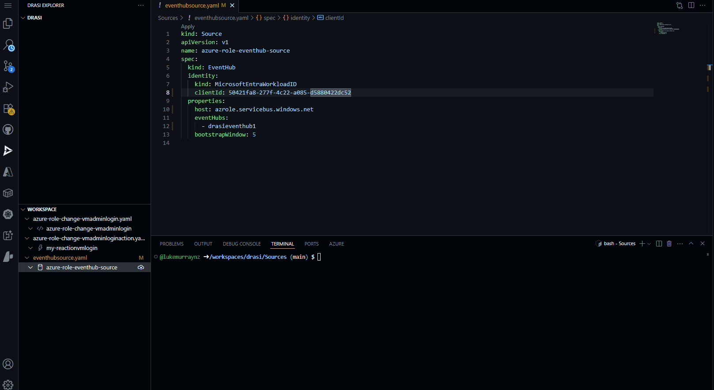

## 🔍 Building the Continuous Query

Now that we have our source configured. It's time to create our Continuous Query. This is the query that will filter the Azure Activity Logs for the role assignment events we care about. We will use the Cypher query language to do this. It's worth noting that Drasi uses a subset of the Cypher query language (https://drasi.io/reference/query-language/), so not all Cypher queries will work. 

Make sure to update to the source name to match your source name, and the label to match the label _(ie, the name of the Event Hub (the hub, not the namespace))_ you want to use for the role assignment events.

```yaml title="azure-role-change-vmadminlogin.yaml"
kind: ContinuousQuery
apiVersion: v1
name: azure-role-change-vmadminlogin
spec:
  mode: query
  sources:
    subscriptions:
      - id: azure-role-eventhub-source
        nodes:
          - sourceLabel: drasieventhub1
        pipeline:
          - extract-role-assignments
    middleware:
      - name: extract-role-assignments
        kind: unwind
        drasieventhub1:
          - selector: $.records[?(@.operationName == 'MICROSOFT.AUTHORIZATION/ROLEASSIGNMENTS/WRITE' || @.operationName == 'MICROSOFT.AUTHORIZATION/ROLEASSIGNMENTS/DELETE')]
            label: RoleAssignment
            key: $.time
            properties:
              time: $.time
              resourceId: $.resourceId
              operationName: $.operationName
              operationType: $.resultType
              category: $.category
              level: $.level
              correlationId: $.correlationId
              caller: $.identity.claims.name
              callerIpAddress: $.callerIpAddress
              tenantId: $.tenantId
              subscriptionId: $.identity.authorization.scope
              status: $.resultSignature
              subStatus: $.resultType
              durationMs: $.durationMs
              properties: $.properties
              entity: $.properties.entity
              requestBody: $.properties.requestbody
              resourceType: "Microsoft.Authorization/roleAssignments"
              resourceProviderName: "Microsoft.Authorization"
  query: |
    MATCH (r:RoleAssignment)
    RETURN r.correlationId AS correlationId,
           r.time AS timestamp,
           r.resourceId AS resourceId,
           r.operationName AS operationName,
           r.operationType AS operationType,
           r.category AS category,
           r.level AS level,
           r.callerIpAddress AS callerIpAddress,
           r.caller AS caller,
           r.tenantId AS tenantId,
           r.subscriptionId AS subscriptionId,
           r.status AS status,
           r.subStatus AS subStatus,
           r.durationMs AS durationMs,
           r.properties AS properties,
           r.entity AS entity,
           r.resourceType AS resourceType,
           r.resourceProviderName AS resourceProviderName,
           r.requestBody AS requestBody
```

## 🧠 Understanding the Continuous Query Logic

This configuration leverages Drasi's event-driven streaming capabilities to track and analyze Azure role assignment changes in real time. Let's walk through what's happening:

The file starts by declaring a `ContinuousQuery` named `azure-role-change-vmadminlogin`. This tells Drasi to continuously process incoming data streams for relevant events. It then connects to an Azure Event Hub source (`drasieventhub1`) that streams Azure activity logs. The pipeline extracts only those records where the operation is either a role assignment creation (`WRITE`) or deletion (`DELETE`).

A middleware step called `extract-role-assignments` uses JSONPath selectors to:
- Filter for role assignment events.
- Extract key properties such as timestamp, resource ID, operation details, caller identity, IP address, tenant and subscription IDs, and more.
- Label each event as a `RoleAssignment` node for downstream querying.

The core query than matches all `RoleAssignment` nodes and returns a rich set of fields for each event, including:
- Correlation and resource IDs
- Operation details (name, type, status)
- Caller and network information
- Entity and resource metadata
- Raw request body for further analysis

It is worth calling out - that the key: $.time line under the extract-role-assignments middleware specifies that the event's timestamp (from the $.time field in each Azure log record) is used as the unique key for each extracted RoleAssignment node. Using the time as a key helps Drasi maintain a consistent view of the data stream, ensuring that each event is processed only once - the problem with using the correlationId as the key is that it is not unique, and can be reused for multiple events, ie the status of a Role back assignment goes from Created, Started, Success and each of these events share the same correlationId, which overwrites the previous event in the graph - and not all statuses have the same properties _(ie role definition Id which we need as part of our filtering in the Function App later on)_.

```bash
drasi apply -f azure-role-change-vmadminlogin.yaml
```
Then check the status of the query:

```bash
drasi list query
# Output should show the query is Running. Any errors, such as syntax in the query, will be displayed here in the Error Message column.
```

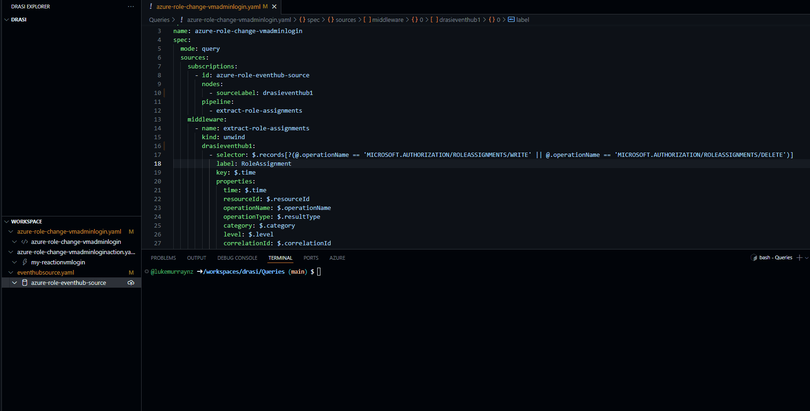

## ⚡ Creating the Event Grid Reaction

Now that we have our source and continuous query configured, we can create our Drasi reaction. This is the action that will be taken when a role assignment event is detected. In this case, we will use an Azure Event Grid, which will send a notification to our Azure Function when a role assignment event is detected that matches our query.
To do this, we will create a Drasi reaction that subscribes to our continuous query, and sends a notification to our Event Grid topic. Make sure that the query matches the name of the Continous query you want it to respond to and the Event Grid URI and Key are updated to match your Event Grid topic.

```yaml title="azure-role-assignment-eventgrid-reaction.yaml"
kind: Reaction
apiVersion: v1
name: my-reactionvmlogin
spec:
  kind: EventGrid
  queries:
    azure-role-change-vmadminlogin:
  properties: 
    eventGridUri: https://drasi-eventgrid-topic.newzealandnorth-1.eventgrid.azure.net/api/events
    eventGridKey: 95zOYGFPN8rl3XlbgN00YFPSSl4wcM6FN0z9ootjSlYmUFIzKvkoJQQJ99BFACkRTxVXJ3w3AAABAZEGPUfe
    format: unpacked
```

You can also use Entra ID authenticate to connect to the Event Grid topic, but for simplicity _(and I was also testing this in a docker build of Drasi, so its good to highlight different methods to connect)_, I am using a shared access key in this example.

```bash
drasi apply -f azure-role-assignment-eventgrid-reaction.yaml
```
Then check the status of the query:

```bash
drasi list reaction
# Output should show the query is Available. 
```

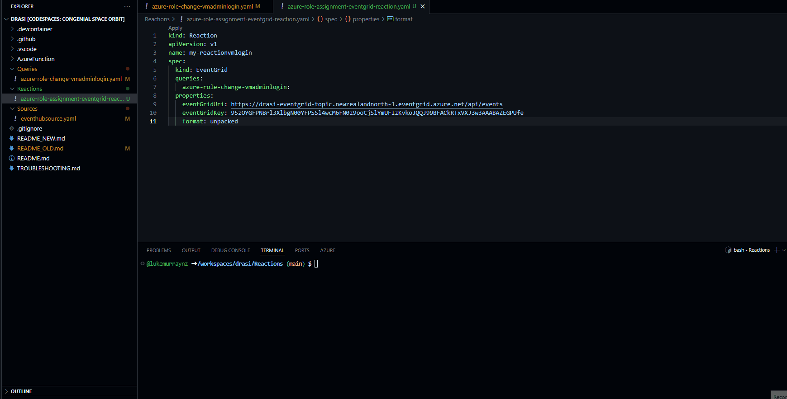

## 🔧 Building the Azure Function App

Now we have our Drasi source, continuous query, and reaction configured, it's time to move to our Azure Function. This function will be triggered by the Event Grid notification when a role assignment event is detected that matches our query. The function will then create or delete the Azure Bastion host based on the role assignment event.
The Azure Function is written in PowerShell and uses the Azure PowerShell module to create and delete the Azure Bastion host. The function will check the operation type of the role assignment event, and if it is a `WRITE` operation, it will create the Azure Bastion host. If it is a `DELETE` operation, it will delete the Azure Bastion host. You can add some additional logic here around additional checks, such as checking if the role assignment is for a specific user, or adding additional roles.

The Function App code is configured to use the system-managed identity of the Function App, which is assigned the `Contributor` role on the Subscription where the Azure Bastion host will be created. This allows the function to create and delete the Azure Bastion host without needing to store any credentials in the function code.

The Function App is configured to be expandable:

## 📝 Function App Architecture

- The entry point is `run.ps1`, receives Event Grid results, and orchestrates the response.
- It then parses it to an `EventProcessor.ps1`, which then handles the event processing logic.
- After the logic matches the event, it calls `ActionHandlers.ps1` to create or delete the Azure Bastion host.

With a config.json file to store the configuration settings for the Function App, such as the Azure Bastion host name, resource group name, location, and subscription to target, these values will be used by the ActionHandlers to create/delete the Bastion resource in the specific subscription/resource group you want.

:::info
You can find the complete code for the Function App and Drasi queries here: [lukemurraynz/Drasi-RoleAssignmentMonitor](https://github.com/lukemurraynz/Drasi-RoleAssignmentMonitor).
:::

import Tabs from '@theme/Tabs';
import TabItem from '@theme/TabItem';

<Tabs>
<TabItem value="config" label="config.json">

```json title="config.json"
{
  "global": {
    "enableLogging": true,
    "defaultSubscriptionId": "6bca53bc-98d9-4cd3-92e7-0364c7bffac4",
    "defaultResourceGroupName": "rg-11B74992",
    "tags": {
      "CreatedBy": "Drasi-AutoBastion",
      "Purpose": "Automated-RBAC-Response"
    }
  },
  "actions": {
    "CreateBastion": {
      "enabled": true,
      "parameters": {
        "bastionNamePrefix": "bastion-auto",
        "subnetAddressPrefix": "10.0.1.0/26",
        "publicIpNamePrefix": "pip-bastion-auto",
        "subscriptionId": "<your-subscription-id>",
        "resourceGroupName": "<your-resource-group>",
        "bastionName": "<your-bastion-name>"
      }
    },
    "CleanupBastion": {
      "enabled": true,
      "parameters": {
        "preserveIfOtherAssignments": true,
        "gracePeriodMinutes": 5,
        "subscriptionId": "<your-subscription-id>",
        "resourceGroupName": "<your-resource-group>"
      }
    }
  },
  "roleMappings": {
    "/providers/Microsoft.Authorization/roleDefinitions/1c0163c0-47e6-4577-8991-ea5c82e286e4": "Virtual Machine Administrator Login",
    "/providers/Microsoft.Authorization/roleDefinitions/fb879df8-f326-4884-b1cf-06f3ad86be52": "Virtual Machine User Login"
  }
}
```

</TabItem>

<TabItem value="run" label="run.ps1">

```powershell title="run.ps1"
param($eventGridEvent, $TriggerMetadata)

# Handle Drasi.ControlSignal events
if ($eventGridEvent.type -eq 'Drasi.ControlSignal') {
    $payload = $eventGridEvent.data.payload
    $kind = $payload.kind
    $source = $payload.source
    if ($null -ne $source -and ($source -is [hashtable] -or $source -is [psobject])) {
        $sourceStr = $source | ConvertTo-Json -Compress
    } else {
        $sourceStr = $source
    }
    Write-Host "[DRASI CONTROL SIGNAL] kind: $kind, source: $sourceStr"
    return
}

Write-Host "=== Starting Drasi RBAC Action Handler ==="
$modulesPath = Join-Path $PSScriptRoot '..' 'Modules'

Import-Module (Join-Path $modulesPath 'Az.Accounts' '5.1.0' 'Az.Accounts.psd1') -Force
Import-Module (Join-Path $modulesPath 'Az.Resources' '8.0.0' 'Az.Resources.psd1') -Force
Import-Module (Join-Path $modulesPath 'Az.Network' '7.17.0' 'Az.Network.psd1') -Force
Import-Module (Join-Path $modulesPath 'Az.Compute' '10.0.1' 'Az.Compute.psd1') -Force

try {
    # Load required modules - look in parent directory
    $functionDir = Split-Path $PSScriptRoot -Parent
    $eventProcessorPath = Join-Path $functionDir "EventProcessor.ps1"
    $actionHandlersPath = Join-Path $functionDir "ActionHandlers.ps1"
    $configPath = Join-Path $functionDir "config.json"
    
    if (-not (Test-Path $eventProcessorPath)) {
        throw "EventProcessor.ps1 not found at: $eventProcessorPath"
    }
    
    if (-not (Test-Path $actionHandlersPath)) {
        throw "ActionHandlers.ps1 not found at: $actionHandlersPath"
    }
    
    if (-not (Test-Path $configPath)) {
        throw "config.json not found at: $configPath"
    }
    
    # Load modules
    . $eventProcessorPath
    . $actionHandlersPath
    
    Write-Host "[INFO] Modules loaded successfully"
    
    # Check authentication context
    $currentContext = Get-AzContext -ErrorAction SilentlyContinue
    if ($currentContext) {
        Write-Host "[INFO] Azure authentication context found:"
        Write-Host "  - Account: $($currentContext.Account.Id)"
        Write-Host "  - Subscription: $($currentContext.Subscription.Name) ($($currentContext.Subscription.Id))"
        Write-Host "  - Tenant: $($currentContext.Tenant.Id)"
    } else {
        Write-Warning "[WARNING] No Azure authentication context found"
        # Try to re-authenticate using MSI
        if ($env:MSI_SECRET) {
            Write-Host "[INFO] Attempting to authenticate with MSI..."
            try {
                Disable-AzContextAutosave -Scope Process | Out-Null
                $connectResult = Connect-AzAccount -Identity -ErrorAction Stop
                Write-Host "[INFO] Successfully authenticated with MSI: $($connectResult.Context.Account.Id)"
            } catch {
                Write-Error "[ERROR] Failed to authenticate with MSI: $($_.Exception.Message)"
            }
        } else {
            Write-Warning "[WARNING] No MSI_SECRET environment variable found"
        }
    }
    
    # Initialize configuration manager
    $configManager = [ConfigurationManager]::new($configPath)
    $globalConfig = $configManager.GetGlobalConfiguration()
    
    # Log event details if logging is enabled
    if ($globalConfig.enableLogging) {
        Write-Host "=== Event Grid Event Data ==="
        $eventGridEvent | ConvertTo-Json -Depth 10 | Write-Host
        
        if ($eventGridEvent.data) {
            Write-Host "=== Event Data ==="
            $eventGridEvent.data | ConvertTo-Json -Depth 5 | Write-Host
        }
    }
    
    # Parse the Drasi event
    Write-Host "[INFO] Parsing Drasi event..."
    $parsedEvent = Parse-DrasiEvent $eventGridEvent
    
    if (-not $parsedEvent.isValid) {
        Write-Warning "Event validation failed. This may not be a role assignment event."
        Write-Host "=== Parsed Event Details ==="
        $parsedEvent | ConvertTo-Json -Depth 10 | Write-Host
        return
    }
    
    # Log parsed event details
    $roleName = $configManager.GetRoleName($parsedEvent.roleDefinitionId)
    Write-Host "[INFO] Valid RBAC event detected:"
    Write-Host "  - Role: $roleName"
    Write-Host "  - Operation: $($parsedEvent.operationType)"
    Write-Host "  - Scope: $($parsedEvent.scope)"
    Write-Host "  - Principal ID: $($parsedEvent.principalId)"
    Write-Host "  - Correlation ID: $($parsedEvent.correlationId)"
    
    # Initialize action orchestrator and process event
    $orchestrator = [ActionOrchestrator]::new($configManager)
    $results = $orchestrator.ProcessEvent($parsedEvent)
    
    # Log results
    Write-Host "=== Action Results ==="
    foreach ($result in $results) {
        $status = if ($result.success) { "SUCCESS" } else { "FAILED" }
        Write-Host "[$status] $($result.action): $($result.message)"
        
        if ($result.details -and $globalConfig.enableLogging) {
            Write-Host "  Details: $($result.details | ConvertTo-Json -Depth 2)"
        }
    }
    
    # Summary
    $successCount = ($results | Where-Object { $_.success }).Count
    $totalCount = $results.Count
    Write-Host "[INFO] Action execution completed: $successCount/$totalCount successful"
    
}
catch {
    Write-Error "[ERROR] Function execution failed: $($_.Exception.Message)"
    Write-Host "Stack trace: $($_.ScriptStackTrace)"
    
    # Still log the original event for debugging
    Write-Host "=== Original Event (for debugging) ==="
    $eventGridEvent | ConvertTo-Json -Depth 10 | Write-Host
}

Write-Host "=== Drasi RBAC Action Handler Complete ==="
```

</TabItem>

<TabItem value="eventprocessor" label="EventProcessor.ps1">

```powershell title="EventProcessor.ps1"
# Modular action handlers for Azure resource automation

# Configuration management class
class ConfigurationManager {
    [hashtable]$Config
    [string]$ConfigPath
    
    ConfigurationManager([string]$configPath) {
        $this.ConfigPath = $configPath
        $this.LoadConfiguration()
    }
    
    [void] LoadConfiguration() {
        if (Test-Path $this.ConfigPath) {
            $configContent = Get-Content $this.ConfigPath -Raw | ConvertFrom-Json
            $this.Config = $this.ConvertPSObjectToHashtable($configContent)
        } else {
            throw "Configuration file not found: $($this.ConfigPath)"
        }
    }
    
    [hashtable] ConvertPSObjectToHashtable([object]$inputObject) {
        $output = @{}
        if ($inputObject -is [PSCustomObject]) {
            foreach ($property in $inputObject.PSObject.Properties) {
                if ($property.Value -is [PSCustomObject]) {
                    $output[$property.Name] = $this.ConvertPSObjectToHashtable($property.Value)
                } elseif ($property.Value -is [array]) {
                    $output[$property.Name] = @()
                    foreach ($item in $property.Value) {
                        if ($item -is [PSCustomObject]) {
                            $output[$property.Name] += $this.ConvertPSObjectToHashtable($item)
                        } else {
                            $output[$property.Name] += $item
                        }
                    }
                } else {
                    $output[$property.Name] = $property.Value
                }
            }
        } else {
            return $inputObject
        }
        return $output
    }
    
    [hashtable] GetGlobalConfiguration() {
        return $this.Config.global
    }
    
    [hashtable] GetActionConfiguration([string]$actionName) {
        return $this.Config.actions.$actionName
    }
    
[string] GetRoleName([string]$roleDefinitionId) {
    if ($this.Config.roleMappings) {
        foreach ($key in $this.Config.roleMappings.Keys) {
            # Match if the roleDefinitionId ends with the mapping key (handles any prefix)
            if ($roleDefinitionId -like "*$key") {
                return $this.Config.roleMappings.$key
            }
        }
    }
    return "Unknown Role ($roleDefinitionId)"
}
}

# Event parsing function for Drasi events
function Parse-DrasiEvent {
    param([hashtable]$eventGridEvent)
    $result = @{
        isValid = $false
        operationType = $null
        roleDefinitionId = $null
        scope = $null
        principalId = $null
        correlationId = $null
        timestamp = $null
        callerIpAddress = $null
        azureOperationName = $null  # Add this field
    }
    
    try {
        # Check if this is a Drasi ChangeEvent
        if ($eventGridEvent.type -ne 'Drasi.ChangeEvent') {
            return $result
        }
        
        $data = $eventGridEvent.data
        if (-not $data -or -not $data.payload -or -not $data.payload.after) {
            return $result
        }
        
        $payload = $data.payload.after
        
        # Capture the actual Azure operation name
        $result.azureOperationName = $payload.operationName
        
        # Check if this is a role assignment operation (CREATE or DELETE)
        $isRoleWrite = $payload.operationName -eq 'MICROSOFT.AUTHORIZATION/ROLEASSIGNMENTS/WRITE'
        $isRoleDelete = $payload.operationName -eq 'MICROSOFT.AUTHORIZATION/ROLEASSIGNMENTS/DELETE'
        
        if (-not ($isRoleWrite -or $isRoleDelete)) {
            return $result
        }
        
        $result.isValid = $true
        $result.operationType = $data.op # 'i' for insert/create, 'd' for delete
        $result.correlationId = $payload.correlationId
        $result.timestamp = $payload.timestamp
        $result.callerIpAddress = $payload.callerIpAddress
        
        if ($isRoleWrite -and $payload.properties.requestbody) {
            # Parse the request body to get role assignment details for CREATE operations
            $requestBody = $payload.properties.requestbody | ConvertFrom-Json
            $result.roleDefinitionId = $requestBody.Properties.RoleDefinitionId
            $result.scope = $requestBody.Properties.Scope
            $result.principalId = $requestBody.Properties.PrincipalId
        } elseif ($isRoleDelete) {
            # For DELETE operations, extract from the resource ID and response body
            $resourceId = $payload.resourceId
            if ($resourceId -match '/subscriptions/([^/]+)') {
                $extractedSubId = $Matches[1]
                # Validate the subscription ID format before using it
                if ($extractedSubId -match '^[0-9a-fA-F]{8}-[0-9a-fA-F]{4}-[0-9a-fA-F]{4}-[0-9a-fA-F]{4}-[0-9a-fA-F]{12}$') {
                    $result.scope = "/subscriptions/$extractedSubId"
                } else {
                    # If the extracted subscription ID is malformed, don't set scope
                    # Let the action classes handle this using their config values
                    Write-Warning "Extracted subscription ID '$extractedSubId' is not in valid GUID format, scope will be handled by action configuration"
                }
            }

            # Try to extract role definition from response body if available
            try {
                # Ensure responseBody is parsed from string if needed
                $responseBodyRaw = $payload.properties.responseBody
                if ($responseBodyRaw -is [string]) {
                    $responseBody = $responseBodyRaw | ConvertFrom-Json
                } else {
                    $responseBody = $responseBodyRaw
                }
                $result.roleDefinitionId = $responseBody.properties.roleDefinitionId
                $result.principalId = $responseBody.properties.principalId
            } catch {
                # Fallback to VM Admin Login role assumption
                $result.roleDefinitionId = "/providers/Microsoft.Authorization/roleDefinitions/1c0163c0-47e6-4577-8991-ea5c82e286e4"
                $result.principalId = "unknown"
            }
            # Fallback values for DELETE operations without response body (if above fails)
            if (-not $result.roleDefinitionId) {
                $result.roleDefinitionId = "/providers/Microsoft.Authorization/roleDefinitions/1c0163c0-47e6-4577-8991-ea5c82e286e4"
            }
            if (-not $result.principalId) {
                $result.principalId = "unknown"
            }
        }
        
        return $result
    }
    catch {
        Write-Warning "Failed to parse Drasi event: $($_.Exception.Message)"
        return $result
    }
}

# Action orchestrator class
class ActionOrchestrator {
    [ConfigurationManager]$ConfigManager
    
    ActionOrchestrator([ConfigurationManager]$configManager) {
        $this.ConfigManager = $configManager
    }
    
    [array] ProcessEvent([hashtable]$parsedEvent) {
        $results = @()
        $globalConfig = $this.ConfigManager.GetGlobalConfiguration()
        
        # Determine which actions to execute based on the event
        $actionsToExecute = $this.DetermineActions($parsedEvent)
        
        if ($actionsToExecute.Count -eq 0) {
            $results += [ActionResult]::new($true, "No actions determined for this event", @{
                reason = "Event did not match action criteria"
                roleDefinitionId = $parsedEvent.roleDefinitionId
                operationType = $parsedEvent.operationType
                azureOperationName = $parsedEvent.azureOperationName
            })
            return $results
        }
        
        foreach ($actionName in $actionsToExecute) {
            try {
                $actionConfig = $this.ConfigManager.GetActionConfiguration($actionName)
                if (-not $actionConfig) {
                    $results += [ActionResult]::new($false, "Configuration not found for action: $actionName", @{})
                    continue
                }
                
                if (-not $actionConfig.enabled) {
                    $results += [ActionResult]::new($true, "Action skipped (disabled): $actionName", @{
                        action = $actionName
                        skipped = $true
                    })
                    continue
                }
                
                # Create action instance
                $action = New-Action -ActionName $actionName -Config $actionConfig -GlobalConfig $globalConfig
                
                # Create context for action execution
                $context = @{
                    scope = $parsedEvent.scope
                    principalId = $parsedEvent.principalId
                    roleDefinitionId = $parsedEvent.roleDefinitionId
                    operationType = $parsedEvent.operationType
                    correlationId = $parsedEvent.correlationId
                }
                
                # Execute action
                $result = $action.Execute($context)
                $result.Details.action = $actionName
                $results += $result
            }
            catch {
                $results += [ActionResult]::new($false, "Failed to execute action $actionName`: $($_.Exception.Message)", @{
                    action = $actionName
                    error = $_.Exception.Message
                    stackTrace = $_.ScriptStackTrace
                })
            }
        }
        
        return $results
    }


[array] DetermineActions([hashtable]$parsedEvent) {
    $actions = @()
    $globalConfig = $this.ConfigManager.GetGlobalConfiguration()
    
    $vmAdminLoginRoleId = "/providers/Microsoft.Authorization/roleDefinitions/1c0163c0-47e6-4577-8991-ea5c82e286e4"

    # Debug: Log all relevant information
    Write-Host "[DEBUG] DetermineActions: operationType=$($parsedEvent.operationType), azureOperationName=$($parsedEvent.azureOperationName), roleDefinitionId=$($parsedEvent.roleDefinitionId)"

    # Check if this is a VM Admin Login role
    if ($parsedEvent.roleDefinitionId -like "*$vmAdminLoginRoleId*") {
        # Use the actual Azure operation name to determine action
        $azureOperationName = $parsedEvent.azureOperationName
        
        if ($azureOperationName -like "*DELETE*") {
            Write-Host "[DEBUG] Scheduling CleanupBastion action for DELETE operation"
            $actions += "CleanupBastion"
        } elseif ($azureOperationName -like "*WRITE*") {
            Write-Host "[DEBUG] Scheduling CreateBastion action for WRITE operation"
            $actions += "CreateBastion"
        } else {
            Write-Host "[DEBUG] Unknown Azure operation: $azureOperationName"
        }
    } else {
        Write-Host "[DEBUG] Role $($parsedEvent.roleDefinitionId) is not VM Admin Login role"
    }
    
    Write-Host "[DEBUG] Determined actions: $($actions -join ', ')"
    return $actions
}

[string] GetAzureOperationFromEvent([hashtable]$parsedEvent) {
    # This method should extract the actual Azure operation name from the parsed event
    # You'll need to pass this information through from the original event parsing
    # For now, we'll use a simplified approach and check if we have context about the operation
    
    # If the parsed event contains operation context, use it
    if ($parsedEvent.ContainsKey('azureOperationName')) {
        return $parsedEvent.azureOperationName
    }
    
    # Fallback: if we have a principalId of "unknown", it's likely a DELETE operation
    # since DELETE operations don't contain the principal ID in the response
    if ($parsedEvent.principalId -eq "unknown") {
        return "MICROSOFT.AUTHORIZATION/ROLEASSIGNMENTS/DELETE"
    }
    
    # Default to WRITE operation
    return "MICROSOFT.AUTHORIZATION/ROLEASSIGNMENTS/WRITE"
}


    
}

class ActionResult {
    [bool]$Success
    [string]$Message
    [hashtable]$Details
    
    ActionResult([bool]$success, [string]$message, [hashtable]$details = @{}) {
        $this.Success = $success
        $this.Message = $message
        $this.Details = $details
    }
}

class BaseAction {
    [hashtable]$Config
    [hashtable]$GlobalConfig
    
    BaseAction([hashtable]$config, [hashtable]$globalConfig) {
        $this.Config = $config
        $this.GlobalConfig = $globalConfig
    }
    
    [ActionResult] Execute([hashtable]$context) {
        throw "Execute method must be implemented by derived classes"
    }
    
    [void] LogInfo([string]$message) {
        if ($this.GlobalConfig.enableLogging) {
            Write-Host "[INFO] $message"
        }
    }
    
    [void] LogWarning([string]$message) {
        if ($this.GlobalConfig.enableLogging) {
            Write-Warning "[WARNING] $message"
        }
    }
    
    [void] LogError([string]$message) {
        if ($this.GlobalConfig.enableLogging) {
            Write-Error "[ERROR] $message"
        }
    }
}

class CreateBastionAction : BaseAction {
    CreateBastionAction([hashtable]$config, [hashtable]$globalConfig) : base($config, $globalConfig) {}
    
    [ActionResult] Execute([hashtable]$context) {
        $this.LogInfo("Starting CreateBastion action for scope: $($context.scope)")
        
        try {
            # Extract resource information from scope
            $resourceInfo = $this.ParseScope($context.scope)
            if (-not $resourceInfo) {
                return [ActionResult]::new($false, "Could not parse resource scope", @{})
            }
            
            # Check if Bastion already exists
            $existingBastion = $this.FindExistingBastion($resourceInfo.ResourceGroupName, $resourceInfo.SubscriptionId)
            if ($existingBastion) {
                $this.LogInfo("Bastion already exists: $($existingBastion.Name)")
                return [ActionResult]::new($true, "Bastion already exists", @{
                    action = "CreateBastion"
                    existingBastion = $existingBastion.Name
                    skipped = $true
                })
            }
            
            # Create Bastion
            $result = $this.CreateBastion($resourceInfo)
            
            return [ActionResult]::new($true, "Bastion created successfully", @{
                action = "CreateBastion"
                bastionName = $result.Name
                resourceGroup = $resourceInfo.ResourceGroupName
                subscriptionId = $resourceInfo.SubscriptionId
            })
        }
        catch {
            $this.LogError("Failed to create Bastion: $($_.Exception.Message)")
            return [ActionResult]::new($false, "Failed to create Bastion: $($_.Exception.Message)", @{
                error = $_.Exception.Message
            })
        }
    }
    
    [hashtable] ParseScope([string]$scope) {
        # Always use config values - completely ignore parsed scope
        $subscriptionId = $null
        $resourceGroupName = $null

        $this.LogInfo("ParseScope called for CreateBastion - ignoring scope parameter and using config values only")

        # Debug the global config structure
        $this.LogInfo("GlobalConfig keys: $($this.GlobalConfig.Keys -join ', ')")
        $this.LogInfo("GlobalConfig.defaultSubscriptionId exists: $($this.GlobalConfig.ContainsKey('defaultSubscriptionId'))")
        $this.LogInfo("GlobalConfig.defaultResourceGroupName exists: $($this.GlobalConfig.ContainsKey('defaultResourceGroupName'))")

        # Always use global config values first (most reliable and consistent)
        if ($this.GlobalConfig.ContainsKey('defaultSubscriptionId') -and $this.GlobalConfig.defaultSubscriptionId) {
            $subscriptionId = $this.GlobalConfig.defaultSubscriptionId
            $this.LogInfo("Using default subscription ID from global config: $subscriptionId")
        } elseif ($this.Config.parameters.ContainsKey('subscriptionId') -and $this.Config.parameters.subscriptionId -and $this.Config.parameters.subscriptionId -ne '<your-subscription-id>') {
            $subscriptionId = $this.Config.parameters.subscriptionId
            $this.LogInfo("Using subscription ID from action config: $subscriptionId")
        }

        # Always use global config values first (most reliable and consistent)
        if ($this.GlobalConfig.ContainsKey('defaultResourceGroupName') -and $this.GlobalConfig.defaultResourceGroupName) {
            $resourceGroupName = $this.GlobalConfig.defaultResourceGroupName
            $this.LogInfo("Using default resource group from global config: $resourceGroupName")
        } elseif ($this.Config.parameters.ContainsKey('resourceGroupName') -and $this.Config.parameters.resourceGroupName -and $this.Config.parameters.resourceGroupName -ne '<your-resource-group>') {
            $resourceGroupName = $this.Config.parameters.resourceGroupName
            $this.LogInfo("Using resource group from action config: $resourceGroupName")
        }

        # Validate that we have both required values
        if (-not $subscriptionId) {
            $this.LogError("No subscription ID found in configuration")
            $this.LogError("Global config defaultSubscriptionId: '$($this.GlobalConfig.defaultSubscriptionId)'")
            $this.LogError("Action config subscriptionId: '$($this.Config.parameters.subscriptionId)'")
            $this.LogError("Full GlobalConfig: $($this.GlobalConfig | ConvertTo-Json -Depth 2)")
            return $null
        }

        if (-not $resourceGroupName) {
            $this.LogError("No resource group name found in configuration")
            $this.LogError("Global config defaultResourceGroupName: '$($this.GlobalConfig.defaultResourceGroupName)'")
            $this.LogError("Action config resourceGroupName: '$($this.Config.parameters.resourceGroupName)'")
            $this.LogError("Full GlobalConfig: $($this.GlobalConfig | ConvertTo-Json -Depth 2)")
            return $null
        }

        # Validate subscription ID format
        if (-not ($subscriptionId -match '^[0-9a-fA-F]{8}-[0-9a-fA-F]{4}-[0-9a-fA-F]{4}-[0-9a-fA-F]{4}-[0-9a-fA-F]{12}$')) {
            $this.LogError("Invalid subscription ID format in config: '$subscriptionId'")
            return $null
        }

        $this.LogInfo("Successfully parsed config values for CreateBastion - Subscription: $subscriptionId, ResourceGroup: $resourceGroupName")
        return @{
            SubscriptionId = $subscriptionId
            ResourceGroupName = $resourceGroupName
        }
    }
    
    [object] FindExistingBastion([string]$resourceGroupName, [string]$subscriptionId) {
        try {
            $this.LogInfo("Checking for existing Bastion in RG: $resourceGroupName")
            
            # Set context to correct subscription
            Set-AzContext -SubscriptionId $subscriptionId -ErrorAction SilentlyContinue
            
            # Look for existing Bastion hosts
            $bastions = Get-AzBastion -ResourceGroupName $resourceGroupName -ErrorAction SilentlyContinue
            
            return $bastions | Select-Object -First 1
        }
        catch {
            $this.LogWarning("Could not check for existing Bastion: $($_.Exception.Message)")
            return $null
        }
    }
    
    [object] CreateBastion([hashtable]$resourceInfo) {
        $this.LogInfo("Creating Bastion in subscription: $($resourceInfo.SubscriptionId)")
        # Set context to correct subscription
        Set-AzContext -SubscriptionId $resourceInfo.SubscriptionId

        # Ensure Resource Group exists
        $rg = Get-AzResourceGroup -Name $resourceInfo.ResourceGroupName -ErrorAction SilentlyContinue
        if (-not $rg) {
            $this.LogInfo("Resource group '$($resourceInfo.ResourceGroupName)' does not exist. Creating it.")
            $location = "New Zealand North"  # Default location; optionally make this configurable
            $rg = New-AzResourceGroup -Name $resourceInfo.ResourceGroupName -Location $location -Tag $this.GlobalConfig.tags
        } else {
            $this.LogInfo("Resource group '$($resourceInfo.ResourceGroupName)' already exists.")
            $location = $rg.Location
        }

        # Use bastionName from config if set, else generate
        if ($this.Config.parameters.bastionName -and $this.Config.parameters.bastionName -ne '<your-bastion-name>') {
            $bastionName = $this.Config.parameters.bastionName
        } else {
            $bastionName = "$($this.Config.parameters.bastionNamePrefix)-$(Get-Random -Maximum 9999)"
        }
        $publicIpName = "$($this.Config.parameters.publicIpNamePrefix)-$(Get-Random -Maximum 9999)"
        
        # Create or get virtual network
        $vnet = $this.EnsureVirtualNetwork($resourceInfo.ResourceGroupName, $location)
        
        # Create or get Bastion subnet
        $bastionSubnet = $this.EnsureBastionSubnet($vnet)
        
        # Create public IP
        $publicIp = $this.CreatePublicIp($publicIpName, $resourceInfo.ResourceGroupName, $location)
        
        # Create Bastion
        $this.LogInfo("Creating Bastion host: $bastionName")

        $bastion = New-AzBastion -ResourceGroupName $resourceInfo.ResourceGroupName `
                                 -Name $bastionName `
                                 -PublicIpAddressRgName $resourceInfo.ResourceGroupName `
                                 -PublicIpAddressName $publicIp.Name `
                                 -VirtualNetworkRgName $resourceInfo.ResourceGroupName `
                                 -VirtualNetworkName $vnet.Name `
                                 -Sku "Standard" `
                                 -ScaleUnit 2
        
        $this.LogInfo("Bastion created successfully: $($bastion.Name)")
        return $bastion
    }
    
    [object] EnsureVirtualNetwork([string]$resourceGroupName, [string]$location) {
        # Try to find existing VNet, or create a simple one
        $vnets = Get-AzVirtualNetwork -ResourceGroupName $resourceGroupName -ErrorAction SilentlyContinue
        
        if ($vnets) {
            $this.LogInfo("Using existing VNet: $($vnets[0].Name)")
            return $vnets[0]
        }
        
        # Create a simple VNet for Bastion
        $this.LogInfo("Creating new VNet for Bastion")
        $vnetName = "vnet-bastion-auto-$(Get-Random -Maximum 9999)"
        
        $vnet = New-AzVirtualNetwork -ResourceGroupName $resourceGroupName `
                                     -Location $location `
                                     -Name $vnetName `
                                     -AddressPrefix "10.0.0.0/16" `
                                     -Tag $this.GlobalConfig.tags
        
        return $vnet
    }
    
    [object] EnsureBastionSubnet([object]$vnet) {
        # Check if AzureBastionSubnet exists
        $bastionSubnet = $vnet.Subnets | Where-Object { $_.Name -eq "AzureBastionSubnet" }
        
        if ($bastionSubnet) {
            $this.LogInfo("Using existing AzureBastionSubnet")
            return $bastionSubnet
        }
        
        # Create Bastion subnet
        $this.LogInfo("Creating AzureBastionSubnet")
        $subnetConfig = Add-AzVirtualNetworkSubnetConfig -VirtualNetwork $vnet `
                                                         -Name "AzureBastionSubnet" `
                                                         -AddressPrefix $this.Config.parameters.subnetAddressPrefix
        
        $vnet | Set-AzVirtualNetwork | Out-Null
        
        # Refresh VNet object
        $updatedVnet = Get-AzVirtualNetwork -ResourceGroupName $vnet.ResourceGroupName -Name $vnet.Name
        return $updatedVnet.Subnets | Where-Object { $_.Name -eq "AzureBastionSubnet" }
    }
    
    [object] CreatePublicIp([string]$publicIpName, [string]$resourceGroupName, [string]$location) {
        $this.LogInfo("Creating public IP: $publicIpName")
        
        return New-AzPublicIpAddress -ResourceGroupName $resourceGroupName `
                                     -Location $location `
                                     -Name $publicIpName `
                                     -AllocationMethod Static `
                                     -Sku Standard `
                                     -Tag $this.GlobalConfig.tags
    }
}

class CleanupBastionAction : BaseAction {
    CleanupBastionAction([hashtable]$config, [hashtable]$globalConfig) : base($config, $globalConfig) {}
    
    [ActionResult] Execute([hashtable]$context) {
        $this.LogInfo("Starting CleanupBastion action for scope: $($context.scope)")
        
        try {
            # Extract resource information from scope
            $resourceInfo = $this.ParseScope($context.scope)
            if (-not $resourceInfo) {
                return [ActionResult]::new($false, "Could not parse resource scope", @{})
            }
            
            # Check if we should preserve Bastion due to other assignments
            if ($this.Config.parameters.preserveIfOtherAssignments) {
                $hasOtherAssignments = $this.CheckForOtherRoleAssignments($resourceInfo)
                if ($hasOtherAssignments) {
                    $this.LogInfo("Preserving Bastion due to other role assignments")
                    return [ActionResult]::new($true, "Bastion preserved due to other assignments", @{
                        action = "CleanupBastion"
                        preserved = $true
                        reason = "Other role assignments exist"
                    })
                }
            }
            
            # Find and remove Bastion
            $result = $this.RemoveBastion($resourceInfo)
            
            return [ActionResult]::new($true, "Bastion cleanup completed", @{
                action = "CleanupBastion"
                removed = $result.Removed
                bastionName = $result.BastionName
            })
        }
        catch {
            $this.LogError("Failed to cleanup Bastion: $($_.Exception.Message)")
            return [ActionResult]::new($false, "Failed to cleanup Bastion: $($_.Exception.Message)", @{
                error = $_.Exception.Message
            })
        }
    }
    
    [hashtable] ParseScope([string]$scope) {
        # Always use config values - completely ignore parsed scope  
        $subscriptionId = $null
        $resourceGroupName = $null

        $this.LogInfo("ParseScope called for CleanupBastion - ignoring scope parameter and using config values only")

        # Debug the global config structure
        $this.LogInfo("GlobalConfig keys: $($this.GlobalConfig.Keys -join ', ')")
        $this.LogInfo("GlobalConfig.defaultSubscriptionId exists: $($this.GlobalConfig.ContainsKey('defaultSubscriptionId'))")
        $this.LogInfo("GlobalConfig.defaultResourceGroupName exists: $($this.GlobalConfig.ContainsKey('defaultResourceGroupName'))")

        # Always use global config values first (most reliable and consistent)
        if ($this.GlobalConfig.ContainsKey('defaultSubscriptionId') -and $this.GlobalConfig.defaultSubscriptionId) {
            $subscriptionId = $this.GlobalConfig.defaultSubscriptionId
            $this.LogInfo("Using default subscription ID from global config: $subscriptionId")
        } elseif ($this.Config.parameters.ContainsKey('subscriptionId') -and $this.Config.parameters.subscriptionId -and $this.Config.parameters.subscriptionId -ne '<your-subscription-id>') {
            $subscriptionId = $this.Config.parameters.subscriptionId
            $this.LogInfo("Using subscription ID from action config: $subscriptionId")
        }

        # Always use global config values first (most reliable and consistent)
        if ($this.GlobalConfig.ContainsKey('defaultResourceGroupName') -and $this.GlobalConfig.defaultResourceGroupName) {
            $resourceGroupName = $this.GlobalConfig.defaultResourceGroupName
            $this.LogInfo("Using default resource group from global config: $resourceGroupName")
        } elseif ($this.Config.parameters.ContainsKey('resourceGroupName') -and $this.Config.parameters.resourceGroupName -and $this.Config.parameters.resourceGroupName -ne '<your-resource-group>') {
            $resourceGroupName = $this.Config.parameters.resourceGroupName
            $this.LogInfo("Using resource group from action config: $resourceGroupName")
        }

        # Validate that we have both required values
        if (-not $subscriptionId) {
            $this.LogError("No subscription ID found in configuration")
            $this.LogError("Global config defaultSubscriptionId: '$($this.GlobalConfig.defaultSubscriptionId)'")
            $this.LogError("Action config subscriptionId: '$($this.Config.parameters.subscriptionId)'")
            $this.LogError("Full GlobalConfig: $($this.GlobalConfig | ConvertTo-Json -Depth 2)")
            return $null
        }

        if (-not $resourceGroupName) {
            $this.LogError("No resource group name found in configuration")
            $this.LogError("Global config defaultResourceGroupName: '$($this.GlobalConfig.defaultResourceGroupName)'")
            $this.LogError("Action config resourceGroupName: '$($this.Config.parameters.resourceGroupName)'")
            $this.LogError("Full GlobalConfig: $($this.GlobalConfig | ConvertTo-Json -Depth 2)")
            return $null
        }

        # Validate subscription ID format
        if (-not ($subscriptionId -match '^[0-9a-fA-F]{8}-[0-9a-fA-F]{4}-[0-9a-fA-F]{4}-[0-9a-fA-F]{4}-[0-9a-fA-F]{12}$')) {
            $this.LogError("Invalid subscription ID format in config: '$subscriptionId'")
            return $null
        }

        $this.LogInfo("Successfully parsed config values for CleanupBastion - Subscription: $subscriptionId, ResourceGroup: $resourceGroupName")
        return @{
            SubscriptionId = $subscriptionId
            ResourceGroupName = $resourceGroupName
        }
    }
    
    [bool] CheckForOtherRoleAssignments([hashtable]$resourceInfo) {
        # In a real implementation, you would check for other VM admin role assignments
        # For now, return false to allow cleanup
        $this.LogInfo("Checking for other role assignments (simplified implementation)")
        return $false
    }
    
    [hashtable] RemoveBastion([hashtable]$resourceInfo) {
        try {
            $this.LogInfo("RemoveBastion called with SubscriptionId: $($resourceInfo.SubscriptionId), ResourceGroupName: $($resourceInfo.ResourceGroupName)")
            
            # Validate inputs with detailed error messages
            if (-not $resourceInfo) {
                throw "Resource info is null"
            }
            if (-not $resourceInfo.ContainsKey('SubscriptionId') -or -not $resourceInfo.SubscriptionId) {
                throw "Subscription ID is null or empty. ResourceInfo keys: $($resourceInfo.Keys -join ', ')"
            }
            if (-not $resourceInfo.ContainsKey('ResourceGroupName') -or -not $resourceInfo.ResourceGroupName) {
                throw "Resource Group Name is null or empty. ResourceInfo keys: $($resourceInfo.Keys -join ', ')"
            }
            
            # Validate subscription ID format
            if (-not ($resourceInfo.SubscriptionId -match '^[0-9a-fA-F]{8}-[0-9a-fA-F]{4}-[0-9a-fA-F]{4}-[0-9a-fA-F]{4}-[0-9a-fA-F]{12}$')) {
                throw "Invalid subscription ID format: $($resourceInfo.SubscriptionId)"
            }
            
            # Check current context first
            $currentContext = Get-AzContext -ErrorAction SilentlyContinue
            if ($currentContext) {
                $this.LogInfo("Current Azure context: Subscription=$($currentContext.Subscription.Id), Account=$($currentContext.Account.Id)")
                
                # If we're already in the correct subscription, don't change context
                if ($currentContext.Subscription.Id -eq $resourceInfo.SubscriptionId) {
                    $this.LogInfo("Already in correct subscription context, skipping Set-AzContext")
                } else {
                    $this.LogInfo("Need to switch from subscription $($currentContext.Subscription.Id) to $($resourceInfo.SubscriptionId)")
                    # Set context to correct subscription with proper error handling
                    try {
                        $context = Set-AzContext -SubscriptionId $resourceInfo.SubscriptionId -ErrorAction Stop
                        $this.LogInfo("Successfully set Azure context to subscription: $($context.Subscription.Name) ($($context.Subscription.Id))")
                    } catch {
                        # If setting by subscription ID fails, try to list available subscriptions for debugging
                        try {
                            $this.LogInfo("Failed to set context to subscription $($resourceInfo.SubscriptionId). Listing available subscriptions:")
                            $availableSubscriptions = Get-AzSubscription -ErrorAction SilentlyContinue
                            if ($availableSubscriptions) {
                                foreach ($sub in $availableSubscriptions) {
                                    $this.LogInfo("Available subscription: $($sub.Name) ($($sub.Id))")
                                }
                            } else {
                                $this.LogWarning("No subscriptions found or unable to list subscriptions")
                            }
                        } catch {
                            $this.LogWarning("Unable to list subscriptions: $($_.Exception.Message)")
                        }
                        throw "Failed to set Azure context for subscription $($resourceInfo.SubscriptionId): $($_.Exception.Message)"
                    }
                }
            } else {
                $this.LogWarning("No current Azure context found - attempting to authenticate with MSI")
                try {
                    # Try to re-authenticate using MSI if no context exists
                    if ($env:MSI_SECRET) {
                        Disable-AzContextAutosave -Scope Process | Out-Null
                        $connectResult = Connect-AzAccount -Identity -ErrorAction Stop
                        $this.LogInfo("Successfully re-authenticated with MSI: $($connectResult.Context.Account.Id)")
                        
                        # Now set the subscription context
                        $context = Set-AzContext -SubscriptionId $resourceInfo.SubscriptionId -ErrorAction Stop
                        $this.LogInfo("Successfully set Azure context to subscription: $($context.Subscription.Name) ($($context.Subscription.Id))")
                    } else {
                        throw "No MSI_SECRET environment variable found and no current context"
                    }
                } catch {
                    throw "Failed to authenticate: $($_.Exception.Message)"
                }
            }
        }
        catch {
            $errorMsg = "Failed to set Azure context for subscription $($resourceInfo.SubscriptionId): $($_.Exception.Message)"
            $this.LogError($errorMsg)
            return @{ Removed = $false; BastionName = $null; Error = $errorMsg }
        }
        
        try {
            # Find Bastion hosts
            $this.LogInfo("Looking for Bastion hosts in resource group: $($resourceInfo.ResourceGroupName)")
            $bastions = Get-AzBastion -ResourceGroupName $resourceInfo.ResourceGroupName -ErrorAction SilentlyContinue
            
            if (-not $bastions) {
                $this.LogInfo("No Bastion hosts found to remove")
                return @{ Removed = $false; BastionName = $null; PublicIpRemoved = $false; PublicIpName = $null }
            }
            
            $this.LogInfo("Found $($bastions.Count) Bastion host(s)")
            
            # Look for auto-created bastions first, otherwise take the first one
            $bastionToRemove = $bastions | Where-Object { $_.Name -like "*auto*" } | Select-Object -First 1
            if (-not $bastionToRemove) {
                $bastionToRemove = $bastions | Select-Object -First 1
                $this.LogInfo("No auto-created Bastion found, will remove first available: $($bastionToRemove.Name)")
            } else {
                $this.LogInfo("Found auto-created Bastion to remove: $($bastionToRemove.Name)")
            }
            
            $publicIpRemoved = $false
            $publicIpName = $null
            
            # Get the public IP resource ID from the Bastion's IP configuration
            if ($bastionToRemove.IpConfigurations -and $bastionToRemove.IpConfigurations.Count -gt 0) {
                $publicIpId = $bastionToRemove.IpConfigurations[0].PublicIpAddress.Id
                if ($publicIpId) {
                    $publicIpName = ($publicIpId -split "/")[-1]
                    $this.LogInfo("Associated Public IP found: $publicIpName")
                }
            }
            
            # Remove Bastion
            $this.LogInfo("Removing Bastion: $($bastionToRemove.Name)")
            Remove-AzBastion -ResourceGroupName $resourceInfo.ResourceGroupName -Name $bastionToRemove.Name -Force -ErrorAction Stop
            $this.LogInfo("Successfully removed Bastion: $($bastionToRemove.Name)")
            
            # Remove the associated Public IP if found
            if ($publicIpName) {
                try {
                    $this.LogInfo("Removing associated Public IP: $publicIpName")
                    Remove-AzPublicIpAddress -ResourceGroupName $resourceInfo.ResourceGroupName -Name $publicIpName -Force -ErrorAction Stop
                    $publicIpRemoved = $true
                    $this.LogInfo("Successfully removed Public IP: $publicIpName")
                }
                catch {
                    $this.LogWarning("Failed to remove Public IP $publicIpName`: $($_.Exception.Message)")
                }
            }
            
            return @{ 
                Removed = $true; 
                BastionName = $bastionToRemove.Name; 
                PublicIpRemoved = $publicIpRemoved; 
                PublicIpName = $publicIpName 
            }
        }
        catch {
            $errorMsg = "Failed to remove Bastion: $($_.Exception.Message)"
            $this.LogError($errorMsg)
            return @{ Removed = $false; BastionName = $null; Error = $errorMsg }
        }
    }
}

# Action factory function
function New-Action {
    param(
        [string]$ActionName,
        [hashtable]$Config,
        [hashtable]$GlobalConfig
    )
    
    switch ($ActionName) {
        "CreateBastion" { 
            return [CreateBastionAction]::new($Config, $GlobalConfig) 
        }
        "CleanupBastion" { 
            return [CleanupBastionAction]::new($Config, $GlobalConfig) 
        }
        default { 
            throw "Unknown action: $ActionName" 
        }
    }
}
```

</TabItem>

<TabItem value="actionhandlers" label="ActionHandlers.ps1">

```powershell title="ActionHandlers.ps1"
# Modular action handlers for Azure resource automation

class ActionResult {
    [bool]$Success
    [string]$Message
    [hashtable]$Details
    
    ActionResult([bool]$success, [string]$message, [hashtable]$details = @{}) {
        $this.Success = $success
        $this.Message = $message
        $this.Details = $details
    }
}

class BaseAction {
    [hashtable]$Config
    [hashtable]$GlobalConfig
    
    BaseAction([hashtable]$config, [hashtable]$globalConfig) {
        $this.Config = $config
        $this.GlobalConfig = $globalConfig
    }
    
    [ActionResult] Execute([hashtable]$context) {
        throw "Execute method must be implemented by derived classes"
    }
    
    [void] LogInfo([string]$message) {
        if ($this.GlobalConfig.enableLogging) {
            Write-Host "[INFO] $message"
        }
    }
    
    [void] LogWarning([string]$message) {
        if ($this.GlobalConfig.enableLogging) {
            Write-Warning "[WARNING] $message"
        }
    }
    
    [void] LogError([string]$message) {
        if ($this.GlobalConfig.enableLogging) {
            Write-Error "[ERROR] $message"
        }
    }
}

class CreateBastionAction : BaseAction {
    CreateBastionAction([hashtable]$config, [hashtable]$globalConfig) : base($config, $globalConfig) {}
    
    [ActionResult] Execute([hashtable]$context) {
        $this.LogInfo("Starting CreateBastion action for scope: $($context.scope)")
        
        try {
            # Extract resource information from scope
            $resourceInfo = $this.ParseScope($context.scope)
            if (-not $resourceInfo) {
                return [ActionResult]::new($false, "Could not parse resource scope", @{})
            }
            
            # Check if Bastion already exists
            $existingBastion = $this.FindExistingBastion($resourceInfo.ResourceGroupName, $resourceInfo.SubscriptionId)
            if ($existingBastion) {
                $this.LogInfo("Bastion already exists: $($existingBastion.Name)")
                return [ActionResult]::new($true, "Bastion already exists", @{
                    action = "CreateBastion"
                    existingBastion = $existingBastion.Name
                    skipped = $true
                })
            }
            
            # Create Bastion
            $result = $this.CreateBastion($resourceInfo)
            
            return [ActionResult]::new($true, "Bastion created successfully", @{
                action = "CreateBastion"
                bastionName = $result.Name
                resourceGroup = $resourceInfo.ResourceGroupName
                subscriptionId = $resourceInfo.SubscriptionId
            })
        }
        catch {
            $this.LogError("Failed to create Bastion: $($_.Exception.Message)")
            return [ActionResult]::new($false, "Failed to create Bastion: $($_.Exception.Message)", @{
                error = $_.Exception.Message
            })
        }
    }
    
    [hashtable] ParseScope([string]$scope) {
        # Always use config values - completely ignore parsed scope
        $subscriptionId = $null
        $resourceGroupName = $null

        $this.LogInfo("ParseScope called for CreateBastion - ignoring scope parameter and using config values only")

        # Debug the global config structure
        $this.LogInfo("GlobalConfig keys: $($this.GlobalConfig.Keys -join ', ')")
        $this.LogInfo("GlobalConfig.defaultSubscriptionId exists: $($this.GlobalConfig.ContainsKey('defaultSubscriptionId'))")
        $this.LogInfo("GlobalConfig.defaultResourceGroupName exists: $($this.GlobalConfig.ContainsKey('defaultResourceGroupName'))")

        # Always use global config values first (most reliable and consistent)
        if ($this.GlobalConfig.ContainsKey('defaultSubscriptionId') -and $this.GlobalConfig.defaultSubscriptionId) {
            $subscriptionId = $this.GlobalConfig.defaultSubscriptionId
            $this.LogInfo("Using default subscription ID from global config: $subscriptionId")
        } elseif ($this.Config.parameters.ContainsKey('subscriptionId') -and $this.Config.parameters.subscriptionId -and $this.Config.parameters.subscriptionId -ne '<your-subscription-id>') {
            $subscriptionId = $this.Config.parameters.subscriptionId
            $this.LogInfo("Using subscription ID from action config: $subscriptionId")
        }

        # Always use global config values first (most reliable and consistent)
        if ($this.GlobalConfig.ContainsKey('defaultResourceGroupName') -and $this.GlobalConfig.defaultResourceGroupName) {
            $resourceGroupName = $this.GlobalConfig.defaultResourceGroupName
            $this.LogInfo("Using default resource group from global config: $resourceGroupName")
        } elseif ($this.Config.parameters.ContainsKey('resourceGroupName') -and $this.Config.parameters.resourceGroupName -and $this.Config.parameters.resourceGroupName -ne '<your-resource-group>') {
            $resourceGroupName = $this.Config.parameters.resourceGroupName
            $this.LogInfo("Using resource group from action config: $resourceGroupName")
        }

        # Validate that we have both required values
        if (-not $subscriptionId) {
            $this.LogError("No subscription ID found in configuration")
            $this.LogError("Global config defaultSubscriptionId: '$($this.GlobalConfig.defaultSubscriptionId)'")
            $this.LogError("Action config subscriptionId: '$($this.Config.parameters.subscriptionId)'")
            $this.LogError("Full GlobalConfig: $($this.GlobalConfig | ConvertTo-Json -Depth 2)")
            return $null
        }

        if (-not $resourceGroupName) {
            $this.LogError("No resource group name found in configuration")
            $this.LogError("Global config defaultResourceGroupName: '$($this.GlobalConfig.defaultResourceGroupName)'")
            $this.LogError("Action config resourceGroupName: '$($this.Config.parameters.resourceGroupName)'")
            $this.LogError("Full GlobalConfig: $($this.GlobalConfig | ConvertTo-Json -Depth 2)")
            return $null
        }

        # Validate subscription ID format
        if (-not ($subscriptionId -match '^[0-9a-fA-F]{8}-[0-9a-fA-F]{4}-[0-9a-fA-F]{4}-[0-9a-fA-F]{4}-[0-9a-fA-F]{12}$')) {
            $this.LogError("Invalid subscription ID format in config: '$subscriptionId'")
            return $null
        }

        $this.LogInfo("Successfully parsed config values for CreateBastion - Subscription: $subscriptionId, ResourceGroup: $resourceGroupName")
        return @{
            SubscriptionId = $subscriptionId
            ResourceGroupName = $resourceGroupName
        }
    }
    
    [object] FindExistingBastion([string]$resourceGroupName, [string]$subscriptionId) {
        try {
            $this.LogInfo("Checking for existing Bastion in RG: $resourceGroupName")
            
            # Set context to correct subscription
            Set-AzContext -SubscriptionId $subscriptionId -ErrorAction SilentlyContinue
            
            # Look for existing Bastion hosts
            $bastions = Get-AzBastion -ResourceGroupName $resourceGroupName -ErrorAction SilentlyContinue
            
            return $bastions | Select-Object -First 1
        }
        catch {
            $this.LogWarning("Could not check for existing Bastion: $($_.Exception.Message)")
            return $null
        }
    }
    
    [object] CreateBastion([hashtable]$resourceInfo) {
        $this.LogInfo("Creating Bastion in subscription: $($resourceInfo.SubscriptionId)")
        # Set context to correct subscription
        Set-AzContext -SubscriptionId $resourceInfo.SubscriptionId

        # Ensure Resource Group exists
        $rg = Get-AzResourceGroup -Name $resourceInfo.ResourceGroupName -ErrorAction SilentlyContinue
        if (-not $rg) {
            $this.LogInfo("Resource group '$($resourceInfo.ResourceGroupName)' does not exist. Creating it.")
            $location = "New Zealand North"  # Default location; optionally make this configurable
            $rg = New-AzResourceGroup -Name $resourceInfo.ResourceGroupName -Location $location -Tag $this.GlobalConfig.tags
        } else {
            $this.LogInfo("Resource group '$($resourceInfo.ResourceGroupName)' already exists.")
            $location = $rg.Location
        }

        # Use bastionName from config if set, else generate
        if ($this.Config.parameters.bastionName -and $this.Config.parameters.bastionName -ne '<your-bastion-name>') {
            $bastionName = $this.Config.parameters.bastionName
        } else {
            $bastionName = "$($this.Config.parameters.bastionNamePrefix)-$(Get-Random -Maximum 9999)"
        }
        $publicIpName = "$($this.Config.parameters.publicIpNamePrefix)-$(Get-Random -Maximum 9999)"
        
        # Create or get virtual network
        $vnet = $this.EnsureVirtualNetwork($resourceInfo.ResourceGroupName, $location)
        
        # Create or get Bastion subnet
        $bastionSubnet = $this.EnsureBastionSubnet($vnet)
        
        # Create public IP
        $publicIp = $this.CreatePublicIp($publicIpName, $resourceInfo.ResourceGroupName, $location)
        
        # Create Bastion
        $this.LogInfo("Creating Bastion host: $bastionName")

        $bastion = New-AzBastion -ResourceGroupName $resourceInfo.ResourceGroupName `
                                 -Name $bastionName `
                                 -PublicIpAddressRgName $resourceInfo.ResourceGroupName `
                                 -PublicIpAddressName $publicIp.Name `
                                 -VirtualNetworkRgName $resourceInfo.ResourceGroupName `
                                 -VirtualNetworkName $vnet.Name `
                                 -Sku "Standard" `
                                 -ScaleUnit 2
        
        $this.LogInfo("Bastion created successfully: $($bastion.Name)")
        return $bastion
    }
    
    [object] EnsureVirtualNetwork([string]$resourceGroupName, [string]$location) {
        # Try to find existing VNet, or create a simple one
        $vnets = Get-AzVirtualNetwork -ResourceGroupName $resourceGroupName -ErrorAction SilentlyContinue
        
        if ($vnets) {
            $this.LogInfo("Using existing VNet: $($vnets[0].Name)")
            return $vnets[0]
        }
        
        # Create a simple VNet for Bastion
        $this.LogInfo("Creating new VNet for Bastion")
        $vnetName = "vnet-bastion-auto-$(Get-Random -Maximum 9999)"
        
        $vnet = New-AzVirtualNetwork -ResourceGroupName $resourceGroupName `
                                     -Location $location `
                                     -Name $vnetName `
                                     -AddressPrefix "10.0.0.0/16" `
                                     -Tag $this.GlobalConfig.tags
        
        return $vnet
    }
    
    [object] EnsureBastionSubnet([object]$vnet) {
        # Check if AzureBastionSubnet exists
        $bastionSubnet = $vnet.Subnets | Where-Object { $_.Name -eq "AzureBastionSubnet" }
        
        if ($bastionSubnet) {
            $this.LogInfo("Using existing AzureBastionSubnet")
            return $bastionSubnet
        }
        
        # Create Bastion subnet
        $this.LogInfo("Creating AzureBastionSubnet")
        $subnetConfig = Add-AzVirtualNetworkSubnetConfig -VirtualNetwork $vnet `
                                                         -Name "AzureBastionSubnet" `
                                                         -AddressPrefix $this.Config.parameters.subnetAddressPrefix
        
        $vnet | Set-AzVirtualNetwork | Out-Null
        
        # Refresh VNet object
        $updatedVnet = Get-AzVirtualNetwork -ResourceGroupName $vnet.ResourceGroupName -Name $vnet.Name
        return $updatedVnet.Subnets | Where-Object { $_.Name -eq "AzureBastionSubnet" }
    }
    
    [object] CreatePublicIp([string]$publicIpName, [string]$resourceGroupName, [string]$location) {
        $this.LogInfo("Creating public IP: $publicIpName")
        
        return New-AzPublicIpAddress -ResourceGroupName $resourceGroupName `
                                     -Location $location `
                                     -Name $publicIpName `
                                     -AllocationMethod Static `
                                     -Sku Standard `
                                     -Tag $this.GlobalConfig.tags
    }
}

class CleanupBastionAction : BaseAction {
    CleanupBastionAction([hashtable]$config, [hashtable]$globalConfig) : base($config, $globalConfig) {}
    
    [ActionResult] Execute([hashtable]$context) {
        $this.LogInfo("Starting CleanupBastion action for scope: $($context.scope)")
        
        try {
            # Extract resource information from scope
            $resourceInfo = $this.ParseScope($context.scope)
            if (-not $resourceInfo) {
                return [ActionResult]::new($false, "Could not parse resource scope", @{})
            }
            
            # Check if we should preserve Bastion due to other assignments
            if ($this.Config.parameters.preserveIfOtherAssignments) {
                $hasOtherAssignments = $this.CheckForOtherRoleAssignments($resourceInfo)
                if ($hasOtherAssignments) {
                    $this.LogInfo("Preserving Bastion due to other role assignments")
                    return [ActionResult]::new($true, "Bastion preserved due to other assignments", @{
                        action = "CleanupBastion"
                        preserved = $true
                        reason = "Other role assignments exist"
                    })
                }
            }
            
            # Find and remove Bastion
            $result = $this.RemoveBastion($resourceInfo)
            
            return [ActionResult]::new($true, "Bastion cleanup completed", @{
                action = "CleanupBastion"
                removed = $result.Removed
                bastionName = $result.BastionName
            })
        }
        catch {
            $this.LogError("Failed to cleanup Bastion: $($_.Exception.Message)")
            return [ActionResult]::new($false, "Failed to cleanup Bastion: $($_.Exception.Message)", @{
                error = $_.Exception.Message
            })
        }
    }
    
    [hashtable] ParseScope([string]$scope) {
        # Always use config values - completely ignore parsed scope  
        $subscriptionId = $null
        $resourceGroupName = $null

        $this.LogInfo("ParseScope called for CleanupBastion - ignoring scope parameter and using config values only")

        # Debug the global config structure
        $this.LogInfo("GlobalConfig keys: $($this.GlobalConfig.Keys -join ', ')")
        $this.LogInfo("GlobalConfig.defaultSubscriptionId exists: $($this.GlobalConfig.ContainsKey('defaultSubscriptionId'))")
        $this.LogInfo("GlobalConfig.defaultResourceGroupName exists: $($this.GlobalConfig.ContainsKey('defaultResourceGroupName'))")

        # Always use global config values first (most reliable and consistent)
        if ($this.GlobalConfig.ContainsKey('defaultSubscriptionId') -and $this.GlobalConfig.defaultSubscriptionId) {
            $subscriptionId = $this.GlobalConfig.defaultSubscriptionId
            $this.LogInfo("Using default subscription ID from global config: $subscriptionId")
        } elseif ($this.Config.parameters.ContainsKey('subscriptionId') -and $this.Config.parameters.subscriptionId -and $this.Config.parameters.subscriptionId -ne '<your-subscription-id>') {
            $subscriptionId = $this.Config.parameters.subscriptionId
            $this.LogInfo("Using subscription ID from action config: $subscriptionId")
        }

        # Always use global config values first (most reliable and consistent)
        if ($this.GlobalConfig.ContainsKey('defaultResourceGroupName') -and $this.GlobalConfig.defaultResourceGroupName) {
            $resourceGroupName = $this.GlobalConfig.defaultResourceGroupName
            $this.LogInfo("Using default resource group from global config: $resourceGroupName")
        } elseif ($this.Config.parameters.ContainsKey('resourceGroupName') -and $this.Config.parameters.resourceGroupName -and $this.Config.parameters.resourceGroupName -ne '<your-resource-group>') {
            $resourceGroupName = $this.Config.parameters.resourceGroupName
            $this.LogInfo("Using resource group from action config: $resourceGroupName")
        }

        # Validate that we have both required values
        if (-not $subscriptionId) {
            $this.LogError("No subscription ID found in configuration")
            $this.LogError("Global config defaultSubscriptionId: '$($this.GlobalConfig.defaultSubscriptionId)'")
            $this.LogError("Action config subscriptionId: '$($this.Config.parameters.subscriptionId)'")
            $this.LogError("Full GlobalConfig: $($this.GlobalConfig | ConvertTo-Json -Depth 2)")
            return $null
        }

        if (-not $resourceGroupName) {
            $this.LogError("No resource group name found in configuration")
            $this.LogError("Global config defaultResourceGroupName: '$($this.GlobalConfig.defaultResourceGroupName)'")
            $this.LogError("Action config resourceGroupName: '$($this.Config.parameters.resourceGroupName)'")
            $this.LogError("Full GlobalConfig: $($this.GlobalConfig | ConvertTo-Json -Depth 2)")
            return $null
        }

        # Validate subscription ID format
        if (-not ($subscriptionId -match '^[0-9a-fA-F]{8}-[0-9a-fA-F]{4}-[0-9a-fA-F]{4}-[0-9a-fA-F]{4}-[0-9a-fA-F]{12}$')) {
            $this.LogError("Invalid subscription ID format in config: '$subscriptionId'")
            return $null
        }

        $this.LogInfo("Successfully parsed config values for CleanupBastion - Subscription: $subscriptionId, ResourceGroup: $resourceGroupName")
        return @{
            SubscriptionId = $subscriptionId
            ResourceGroupName = $resourceGroupName
        }
    }
    
    [bool] CheckForOtherRoleAssignments([hashtable]$resourceInfo) {
        # In a real implementation, you would check for other VM admin role assignments
        # For now, return false to allow cleanup
        $this.LogInfo("Checking for other role assignments (simplified implementation)")
        return $false
    }
    
    [hashtable] RemoveBastion([hashtable]$resourceInfo) {
        try {
            $this.LogInfo("RemoveBastion called with SubscriptionId: $($resourceInfo.SubscriptionId), ResourceGroupName: $($resourceInfo.ResourceGroupName)")
            
            # Validate inputs with detailed error messages
            if (-not $resourceInfo) {
                throw "Resource info is null"
            }
            if (-not $resourceInfo.ContainsKey('SubscriptionId') -or -not $resourceInfo.SubscriptionId) {
                throw "Subscription ID is null or empty. ResourceInfo keys: $($resourceInfo.Keys -join ', ')"
            }
            if (-not $resourceInfo.ContainsKey('ResourceGroupName') -or -not $resourceInfo.ResourceGroupName) {
                throw "Resource Group Name is null or empty. ResourceInfo keys: $($resourceInfo.Keys -join ', ')"
            }
            
            # Validate subscription ID format
            if (-not ($resourceInfo.SubscriptionId -match '^[0-9a-fA-F]{8}-[0-9a-fA-F]{4}-[0-9a-fA-F]{4}-[0-9a-fA-F]{4}-[0-9a-fA-F]{12}$')) {
                throw "Invalid subscription ID format: $($resourceInfo.SubscriptionId)"
            }
            
            # Check current context first
            $currentContext = Get-AzContext -ErrorAction SilentlyContinue
            if ($currentContext) {
                $this.LogInfo("Current Azure context: Subscription=$($currentContext.Subscription.Id), Account=$($currentContext.Account.Id)")
                
                # If we're already in the correct subscription, don't change context
                if ($currentContext.Subscription.Id -eq $resourceInfo.SubscriptionId) {
                    $this.LogInfo("Already in correct subscription context, skipping Set-AzContext")
                } else {
                    $this.LogInfo("Need to switch from subscription $($currentContext.Subscription.Id) to $($resourceInfo.SubscriptionId)")
                    # Set context to correct subscription with proper error handling
                    try {
                        $context = Set-AzContext -SubscriptionId $resourceInfo.SubscriptionId -ErrorAction Stop
                        $this.LogInfo("Successfully set Azure context to subscription: $($context.Subscription.Name) ($($context.Subscription.Id))")
                    } catch {
                        # If setting by subscription ID fails, try to list available subscriptions for debugging
                        try {
                            $this.LogInfo("Failed to set context to subscription $($resourceInfo.SubscriptionId). Listing available subscriptions:")
                            $availableSubscriptions = Get-AzSubscription -ErrorAction SilentlyContinue
                            if ($availableSubscriptions) {
                                foreach ($sub in $availableSubscriptions) {
                                    $this.LogInfo("Available subscription: $($sub.Name) ($($sub.Id))")
                                }
                            } else {
                                $this.LogWarning("No subscriptions found or unable to list subscriptions")
                            }
                        } catch {
                            $this.LogWarning("Unable to list subscriptions: $($_.Exception.Message)")
                        }
                        throw "Failed to set Azure context for subscription $($resourceInfo.SubscriptionId): $($_.Exception.Message)"
                    }
                }
            } else {
                $this.LogWarning("No current Azure context found - attempting to authenticate with MSI")
                try {
                    # Try to re-authenticate using MSI if no context exists
                    if ($env:MSI_SECRET) {
                        Disable-AzContextAutosave -Scope Process | Out-Null
                        $connectResult = Connect-AzAccount -Identity -ErrorAction Stop
                        $this.LogInfo("Successfully re-authenticated with MSI: $($connectResult.Context.Account.Id)")
                        
                        # Now set the subscription context
                        $context = Set-AzContext -SubscriptionId $resourceInfo.SubscriptionId -ErrorAction Stop
                        $this.LogInfo("Successfully set Azure context to subscription: $($context.Subscription.Name) ($($context.Subscription.Id))")
                    } else {
                        throw "No MSI_SECRET environment variable found and no current context"
                    }
                } catch {
                    throw "Failed to authenticate: $($_.Exception.Message)"
                }
            }
        }
        catch {
            $errorMsg = "Failed to set Azure context for subscription $($resourceInfo.SubscriptionId): $($_.Exception.Message)"
            $this.LogError($errorMsg)
            return @{ Removed = $false; BastionName = $null; Error = $errorMsg }
        }
        
        try {
            # Find Bastion hosts
            $this.LogInfo("Looking for Bastion hosts in resource group: $($resourceInfo.ResourceGroupName)")
            $bastions = Get-AzBastion -ResourceGroupName $resourceInfo.ResourceGroupName -ErrorAction SilentlyContinue
            
            if (-not $bastions) {
                $this.LogInfo("No Bastion hosts found to remove")
                return @{ Removed = $false; BastionName = $null; PublicIpRemoved = $false; PublicIpName = $null }
            }
            
            $this.LogInfo("Found $($bastions.Count) Bastion host(s)")
            
            # Look for auto-created bastions first, otherwise take the first one
            $bastionToRemove = $bastions | Where-Object { $_.Name -like "*auto*" } | Select-Object -First 1
            if (-not $bastionToRemove) {
                $bastionToRemove = $bastions | Select-Object -First 1
                $this.LogInfo("No auto-created Bastion found, will remove first available: $($bastionToRemove.Name)")
            } else {
                $this.LogInfo("Found auto-created Bastion to remove: $($bastionToRemove.Name)")
            }
            
            $publicIpRemoved = $false
            $publicIpName = $null
            
            # Get the public IP resource ID from the Bastion's IP configuration
            if ($bastionToRemove.IpConfigurations -and $bastionToRemove.IpConfigurations.Count -gt 0) {
                $publicIpId = $bastionToRemove.IpConfigurations[0].PublicIpAddress.Id
                if ($publicIpId) {
                    $publicIpName = ($publicIpId -split "/")[-1]
                    $this.LogInfo("Associated Public IP found: $publicIpName")
                }
            }
            
            # Remove Bastion
            $this.LogInfo("Removing Bastion: $($bastionToRemove.Name)")
            Remove-AzBastion -ResourceGroupName $resourceInfo.ResourceGroupName -Name $bastionToRemove.Name -Force -ErrorAction Stop
            $this.LogInfo("Successfully removed Bastion: $($bastionToRemove.Name)")
            
            # Remove the associated Public IP if found
            if ($publicIpName) {
                try {
                    $this.LogInfo("Removing associated Public IP: $publicIpName")
                    Remove-AzPublicIpAddress -ResourceGroupName $resourceInfo.ResourceGroupName -Name $publicIpName -Force -ErrorAction Stop
                    $publicIpRemoved = $true
                    $this.LogInfo("Successfully removed Public IP: $publicIpName")
                }
                catch {
                    $this.LogWarning("Failed to remove Public IP $publicIpName`: $($_.Exception.Message)")
                }
            }
            
            return @{ 
                Removed = $true; 
                BastionName = $bastionToRemove.Name; 
                PublicIpRemoved = $publicIpRemoved; 
                PublicIpName = $publicIpName 
            }
        }
        catch {
            $errorMsg = "Failed to remove Bastion: $($_.Exception.Message)"
            $this.LogError($errorMsg)
            return @{ Removed = $false; BastionName = $null; Error = $errorMsg }
        }
    }
}

# Action factory function
function New-Action {
    param(
        [string]$ActionName,
        [hashtable]$Config,
        [hashtable]$GlobalConfig
    )
    
    switch ($ActionName) {
        "CreateBastion" { 
            return [CreateBastionAction]::new($Config, $GlobalConfig) 
        }
        "CleanupBastion" { 
            return [CleanupBastionAction]::new($Config, $GlobalConfig) 
        }
        default { 
            throw "Unknown action: $ActionName" 
        }
    }
}
```

</TabItem>

</Tabs>

## 🚀 Deploying the Function App

Now let's deploy our Function App to Azure. I am just going to publish directly from VS Code.

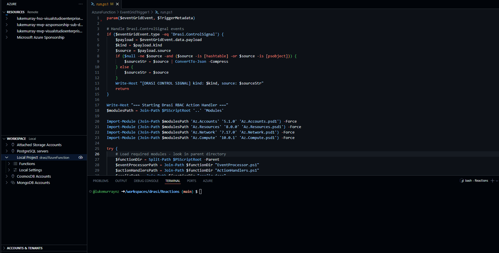

Once pushed, we need to make sure the Trigger is configured to the Event Grid topic by creating a Subscription. I will do this in the Azure Portal.

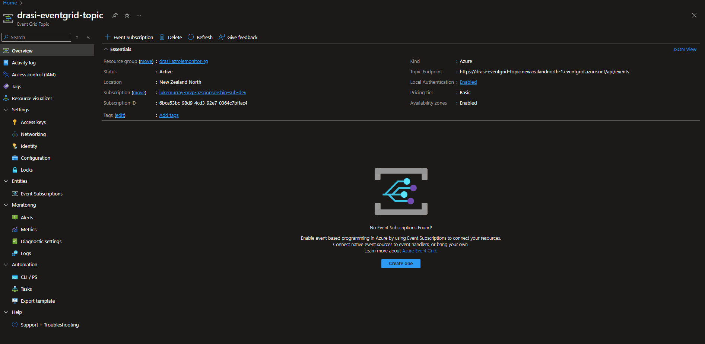

:::warning
If you get [Error] ERROR: The member 'FormatsToProcess' in the module manifest is not valid. I have found republishing the module to the Function App fixes this in the second attempt.
:::

## 🧪 Testing the Complete System

Now - lets test it, by assigning myself the Virtual Machine Administrator Login role, which will then create an [Azure Activity Log](https://learn.microsoft.com/azure/azure-monitor/platform/activity-log-insights?WT.mc_id=AZ-MVP-5004796) entry, which will get pushed to the Event Hub, which will then be picked up by Drasi, processed and flicked through to Event Grid for my [Function App](https://learn.microsoft.com/azure/azure-functions/functions-overview?WT.mc_id=AZ-MVP-5004796) to process. Make sure you set the [RBAC assignment](https://learn.microsoft.com/azure/role-based-access-control/overview?WT.mc_id=AZ-MVP-5004796) to the Subscription scope that is directing its logs to the [Event Hub](https://learn.microsoft.com/azure/event-hubs/event-hubs-about?WT.mc_id=AZ-MVP-5004796), or it will never be picked up, you can have multiple subscriptions sending logs to the same Event Hub _(and the Region doesn't matter). Remember, there may be a delay before the event is added to the Event Hub, so please be patient. I monitor the Event Hub in the Azure Portal to track when the event arrives, using the [Azure Event Hub Data Explorer](https://learn.microsoft.com/azure/event-hubs/event-hubs-data-explorer?WT.mc_id=AZ-MVP-5004796). 

You can always push through an example log entry through the Event Hub directly, especially if you have a previous WRITE or DELETE event you can copy and resend to fast-track your testing. It's worth noting that Bastion can take a few minutes to create itself, be patient, but you can check its status in the Azure Portal. You could trigger a Teams notification from the Azure Function once it's completed.


!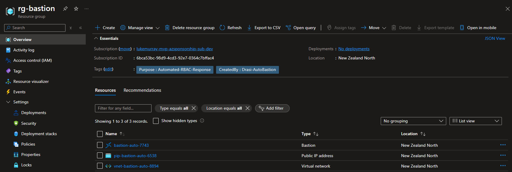

Now, if we remove the old, the DELETE event will be picked up by Drasi, and the Function App will process it, removing the Bastion host and Public IP address.

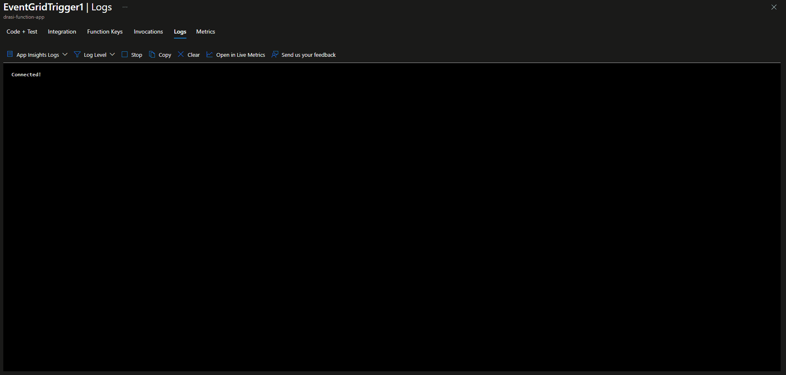
