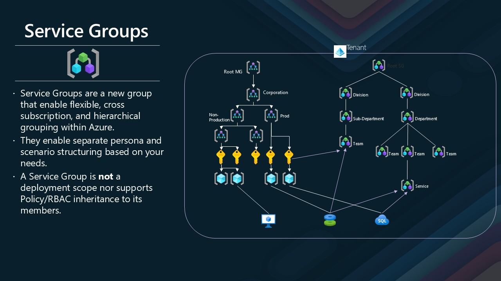

Microsoft recently unveiled [Service Groups](https://learn.microsoft.com/azure/governance/service-groups/overview?WT.mc_id=AZ-MVP-5004796) in Azure, now available in limited public preview—and they’re already shaping up to be a game changer for cloud governance.

If you’ve ever struggled with managing sprawling applications across multiple resource groups, subscriptions, and teams, Service Groups are designed with you in mind.

Where Azure Policy, Resource Graph, Tags, and Management Groups give you compliance, visibility, and hierarchy, Service Groups add an entirely new dimension: flexible, application-centric grouping of your Azure resources—without being limited by deployment boundaries.

Imagine being able to view, report on, and manage an entire application or workload—no matter where its resources live. Whether you’re in FinOps trying to track costs, in Ops trying to view health, or a security lead wanting to understand exposure, Service Groups give you the lens you’ve been missing. 

Today we are going to look at using the [Terraform AzAPI](https://learn.microsoft.com/azure/developer/terraform/overview-azapi-provider?WT.mc_id=AZ-MVP-5004796) to deploy [Service Groups](https://learn.microsoft.com/azure/governance/service-groups/overview?WT.mc_id=AZ-MVP-5004796) in Azure.

{/* truncate */}



:::info
Service Groups support up to 10 levels of nested hierarchy and let you aggregate resources based on projects, services, shared dependencies, or criticality—even across multiple subscriptions or environments.

They don’t change RBAC or policy inheritance—this isn’t a new deployment scope. Instead, they work in parallel to your existing structure, offering clarity and insight without compromising security or control.

Use them to:

* Create workload-centric views
* Track shared service dependencies
* Report and monitor costs across scattered resources
* Visualize health and operational state holistically

As someone who works with complex environments every day, I see Service Groups as a long-overdue capability that simplifies cloud operations and bridges the gap between governance and agility. Make sure you check out a video I did on the [Azure Service Groups](https://youtu.be/64uj-syYv5Y) for further information.
:::

> It’s still early days, but the flexibility, clarity, and insight Service Groups bring are already proving invaluable. If you're managing large Azure estates, [sign up for the preview](https://aka.ms/sgp), test it out, and give feedback to help shape what’s next.

You can find my Terraform code for deploying Service Groups in Azure [lukemurraynz/terraform-azapi-servicegroups](https://github.com/lukemurraynz/terraform-azapi-servicegroups).

Aimed at a draft Platform Engineering team, this example shows how to use Service Groups to create a clear, manageable structure for your Azure resources; the Root Service Group is created by default, however, like Management Groups, you can specify a nested structure in my example I have:

Root (Tenant ID)
├── Platform Engineering
│   ├── Platform Infrastructure
│   ├── Platform DevOps
│   └── Platform Data
├── Application Teams
│   ├── Customer Experience
│   │   ├── E-commerce Platform
│   │   └── Customer Support
│   └── Internal Operations
│       ├── Finance Systems
│       └── Human Resources
└── Security & Compliance
    └── Identity & Access Management

With Service Group members being created for each of the service groups, in this example, I have created a Storage Account as a member of the Identity and Access Management Service Group and a Resource Group called open as a member of the E-commerce Platform _(which includes resources inside that group by default)_.


```hcl
# Azure Service Groups configuration following Platform Engineering best practices
# This configuration demonstrates a typical enterprise structure with:
# - Platform Engineering teams managing infrastructure and shared services
# - Application teams organized by business domains
# - Clear separation of concerns and hierarchical governance

terraform {
  required_providers {
    azapi = {
      source  = "Azure/azapi"
      version = "~> 2.4.0"
    }
  }
  required_version = ">= 1.3.0"
}

provider "azapi" {}

# Local variables for configuration
locals {
  # Tenant ID - used as the root service group ID (automatically created by Azure)
  tenant_id = var.tenant_id
}

# Platform Engineering - Top-level service group for platform teams
resource "azapi_resource" "platform_engineering" {
  type      = "Microsoft.Management/serviceGroups@2024-02-01-preview"
  name      = "platform-engineering"
  parent_id = "/"

  body = {
    properties = {
      displayName = "Platform Engineering"
      parent = {
        resourceId = "/providers/Microsoft.Management/serviceGroups/${local.tenant_id}"
      }
    }
  }
}

# Platform Infrastructure - Core infrastructure services
resource "azapi_resource" "platform_infrastructure" {
  type      = "Microsoft.Management/serviceGroups@2024-02-01-preview"
  name      = "platform-infrastructure"
  parent_id = "/"

  body = {
    properties = {
      displayName = "Platform Infrastructure"
      parent = {
        resourceId = azapi_resource.platform_engineering.id
      }
    }
  }
}

# Platform DevOps - CI/CD, deployment automation, and developer tooling
resource "azapi_resource" "platform_devops" {
  type      = "Microsoft.Management/serviceGroups@2024-02-01-preview"
  name      = "platform-devops"
  parent_id = "/"

  body = {
    properties = {
      displayName = "Platform DevOps"
      parent = {
        resourceId = azapi_resource.platform_engineering.id
      }
    }
  }
}

# Platform Data - Data platform and analytics services
resource "azapi_resource" "platform_data" {
  type      = "Microsoft.Management/serviceGroups@2024-02-01-preview"
  name      = "platform-data"
  parent_id = "/"

  body = {
    properties = {
      displayName = "Platform Data"
      parent = {
        resourceId = azapi_resource.platform_engineering.id
      }
    }
  }
}

# Application Teams - Top-level service group for application teams
resource "azapi_resource" "application_teams" {
  type      = "Microsoft.Management/serviceGroups@2024-02-01-preview"
  name      = "application-teams"
  parent_id = "/"

  body = {
    properties = {
      displayName = "Application Teams"
      parent = {
        resourceId = "/providers/Microsoft.Management/serviceGroups/${local.tenant_id}"
      }
    }
  }
}

# Customer Experience - Customer-facing applications
resource "azapi_resource" "customer_experience" {
  type      = "Microsoft.Management/serviceGroups@2024-02-01-preview"
  name      = "customer-experience"
  parent_id = "/"

  body = {
    properties = {
      displayName = "Customer Experience"
      parent = {
        resourceId = azapi_resource.application_teams.id
      }
    }
  }
}

# E-commerce Platform - E-commerce specific applications
resource "azapi_resource" "ecommerce_platform" {
  type      = "Microsoft.Management/serviceGroups@2024-02-01-preview"
  name      = "ecommerce-platform"
  parent_id = "/"

  body = {
    properties = {
      displayName = "E-commerce Platform"
      parent = {
        resourceId = azapi_resource.customer_experience.id
      }
    }
  }
}

# Customer Support - Customer support applications
resource "azapi_resource" "customer_support" {
  type      = "Microsoft.Management/serviceGroups@2024-02-01-preview"
  name      = "customer-support"
  parent_id = "/"

  body = {
    properties = {
      displayName = "Customer Support"
      parent = {
        resourceId = azapi_resource.customer_experience.id
      }
    }
  }
}

# Internal Operations - Internal business applications
resource "azapi_resource" "internal_operations" {
  type      = "Microsoft.Management/serviceGroups@2024-02-01-preview"
  name      = "internal-operations"
  parent_id = "/"

  body = {
    properties = {
      displayName = "Internal Operations"
      parent = {
        resourceId = azapi_resource.application_teams.id
      }
    }
  }
}

# Finance Systems - Financial applications
resource "azapi_resource" "finance_systems" {
  type      = "Microsoft.Management/serviceGroups@2024-02-01-preview"
  name      = "finance-systems"
  parent_id = "/"

  body = {
    properties = {
      displayName = "Finance Systems"
      parent = {
        resourceId = azapi_resource.internal_operations.id
      }
    }
  }
}

# Human Resources - HR applications
resource "azapi_resource" "human_resources" {
  type      = "Microsoft.Management/serviceGroups@2024-02-01-preview"
  name      = "human-resources"
  parent_id = "/"

  body = {
    properties = {
      displayName = "Human Resources"
      parent = {
        resourceId = azapi_resource.internal_operations.id
      }
    }
  }
}

# Security and Compliance - Cross-cutting security services
resource "azapi_resource" "security_compliance" {
  type      = "Microsoft.Management/serviceGroups@2024-02-01-preview"
  name      = "security-compliance"
  parent_id = "/"

  body = {
    properties = {
      displayName = "Security & Compliance"
      parent = {
        resourceId = "/providers/Microsoft.Management/serviceGroups/${local.tenant_id}"
      }
    }
  }
}

# Identity and Access Management
resource "azapi_resource" "identity_access" {
  type      = "Microsoft.Management/serviceGroups@2024-02-01-preview"
  name      = "identity-access"
  parent_id = "/"

  body = {
    properties = {
      displayName = "Identity & Access Management"
      parent = {
        resourceId = azapi_resource.security_compliance.id
      }
    }
  }
}

# Service Group Member - Storage Account for Security & Compliance
resource "azapi_resource" "storage_account_member" {
  type      = "Microsoft.Relationships/serviceGroupMember@2023-09-01-preview"
  name      = "storage-security-member"
  parent_id = "/subscriptions/11b74992-d520-46e1-a9e9-b55c57d2e890/resourceGroups/openai/providers/Microsoft.Storage/storageAccounts/stgaccountlk"

  # Disable schema validation for this preview resource
  schema_validation_enabled = false

  body = {
    properties = {
      targetId = azapi_resource.security_compliance.id
    }
  }

  depends_on = [
    azapi_resource.security_compliance
  ]
}

# Service Group Member - Resource Group for E-commerce Platform
resource "azapi_resource" "resourcegroup_ecommerce_member" {
  type      = "Microsoft.Relationships/serviceGroupMember@2023-09-01-preview"
  name      = "openai-rg-ecommerce-member"
  parent_id = "/subscriptions/11b74992-d520-46e1-a9e9-b55c57d2e890/resourceGroups/openai"

  # Disable schema validation for this preview resource
  schema_validation_enabled = false

  body = {
    properties = {
      targetId = azapi_resource.ecommerce_platform.id
    }
  }

  depends_on = [
    azapi_resource.ecommerce_platform
  ]
}
```

This code creates a structured hierarchy of service groups, each representing a logical grouping of resources based on their function or ownership. The `azapi_resource` blocks define the service groups, while the `azapi_resource` blocks with type `Microsoft.Relationships/serviceGroupMember` establish relationships between specific Azure resources and the service groups.

## 📚 Additional Resources

- [Azure Service Groups Documentation](https://learn.microsoft.com/azure/governance/service-groups/?WT.mc_id=AZ-MVP-5004796)
- [Platform Engineering Best Practices](https://learn.microsoft.com/platform-engineering/?WT.mc_id=AZ-MVP-5004796)
- [Team Topologies](https://teamtopologies.com/)
- [Azure Well-Architected Framework](https://learn.microsoft.com/azure/well-architected/?WT.mc_id=AZ-MVP-5004796)
