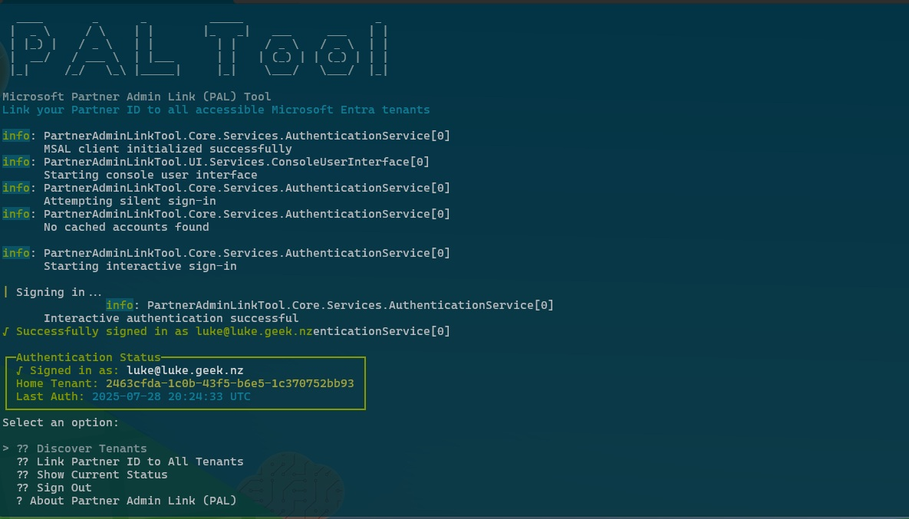

Partner Admin Link (PAL) tool is a .NET application that helps Microsoft partners link their [Partner Admin Link (PAL)](https://learn.microsoft.com/azure/cost-management-billing/manage/link-partner-id?WT.mc_id=AZ-MVP-5004796) to all accessible Microsoft Entra tenants, enabling proper partner recognition and revenue attribution.

[Partner Admin Link (PAL)](https://learn.microsoft.com/azure/cost-management-billing/manage/link-partner-id?WT.mc_id=AZ-MVP-5004796) enables Microsoft to identify and recognize partners who drive Azure customer success. By linking your [Microsoft AI Cloud Partner Program](https://partner.microsoft.com/en-nz/explore?WT.mc_id=AZ-MVP-5004796) (Associated PartnerID) to customer tenants, Microsoft can:

✅ Attribute revenue from your customers' Azure consumption to your organization
✅ Recognize your impact on customer success and business outcomes
✅ Provide insights into your partner engagement effectiveness
✅ Enable partner incentives based on customer growth

{/* truncate */}

This tool has been written for exactly that, scanning the Entra ID tenants you have access to and using the Azure Management APIs to add in the PAL link where needed, or overwrite the existing ones:

🔐 Multiple Authentication Methods: Support for both Interactive and Device Code Flow authentication
🔍 Automatic Tenant Discovery: Finds all Microsoft Entra tenants you have access to
🔗 Bulk Partner ID Linking: Link your Partner ID to multiple tenants at once
📊 Progress Tracking: Real-time progress feedback during bulk operations
🎨 Modern Console UI: Beautiful text-based interface using Spectre.Console

> You can find the tool in my GitHub here: [lukemurraynz/Partner-Admin-Link-Tool](https://github.com/lukemurraynz/Partner-Admin-Link-Tool)

Then you can grab the compiled published executable from [releases](https://github.com/lukemurraynz/Partner-Admin-Link-Tool/releases).

This application isn't signed, so will you get a warning, from Microsoft Defender. You can click More Info, and Run anyway.

Then login 

Once authenticated, you will have the following:

?? Discovery tenants
?? Link Partner ID to All tenants
?? Show Current Status
? About Partner Admin Link (PAL)
? Exit

Discover tenants, simply does a lookup of the TenantIDs you have access to, this could be useful as a quick check to determine if there are any tenants you are also a Guest of, and it can be a good way to get MFA and authentication for other tenants done.
Link Parter ID to All tenants, is where you can specify a new PartnerID to add, and then you can overwrite existing ones - which is useful if you are doing a partnerID move. It will go through and call the Azure Management APIs to add in the PartnerID.
Show Current Status, will do a lookup and show the current partnerID associated with each tenant, this could be useful to assess current state, and find out if you even need to run a PartnerID link.
Finally, About Partner Admin Link, gives you an information screen to describe a bit more about PAL and Exit will close the application, if you are Authenticated, Sign Out will appear, which will keep the PAL Tool open, but sign you out of Entra ID. Useful if you wanted to switch accounts.

During the Discovery Tenants or Link Partner ID to All Tenants process, there may be issues with authenting to some tenants, so after 5 seconds the console will prompt whether or not you want to continue to wait, ie if you have just authenticated or still waiting on the interactive authentication prompt, or skip as it could be a tenant that you may not have access to anymore.

Hopefully the PAL Tool is useful, feel free to contribute, open issues and let me know how you get on using it.
