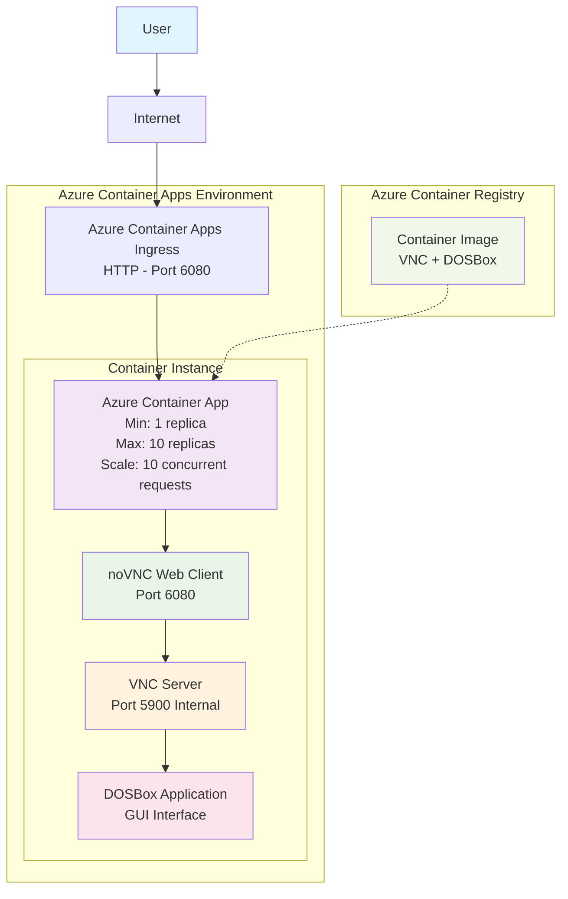
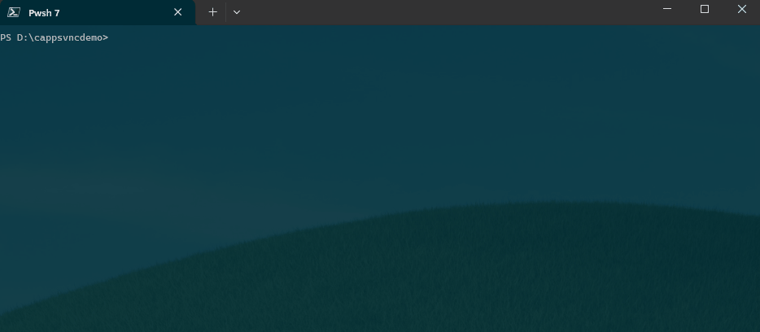
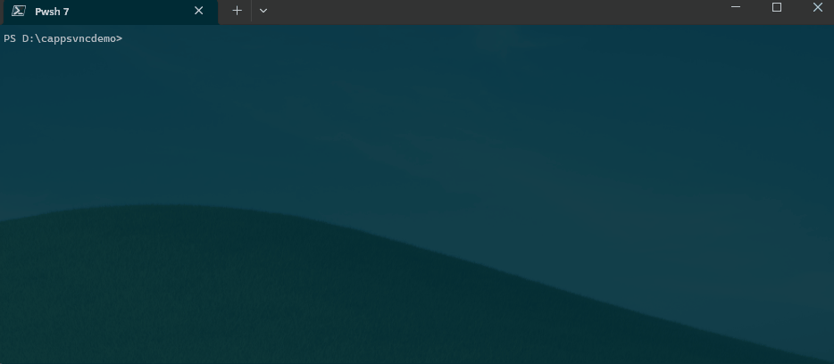
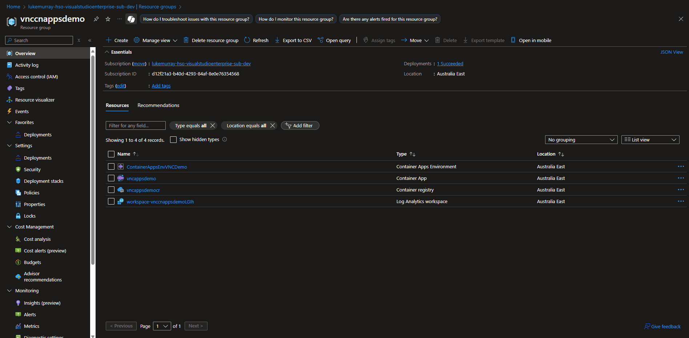

Today we are going to look at hosting a Container in Container Apps, that is used to host a Container, that has VNC server installed, running DOSBox.

Why would you do this? Could be a few reasons, but common reasons might be, looking at running legacy applications that require a GUI (Graphical User Interface) in a more modern and isolated environment, allow for quick internal access to resources -  or just for fun.

{/* truncate */}

## Introduction

In this guide, we will walk through the process of setting up a VNC server with DOSBox in Azure Container Apps. This setup allows you to run DOS applications in a web browser using noVNC, providing a convenient way to access legacy software without needing a dedicated VM or physical machine.

## Solution Architecture

The solution consists of an Azure Container Registry, an Azure Container Apps environment, and an Azure Container App. The Container App will be running a container that has a VNC server installed, and the DOSBox application.

### Configuration Details

My scaling configuration for Azure Container Apps, is set to a minimum of 1 instance, and a maximum of 10 replicas. This is because I want to ensure that the VNC server is always available, and I don't need to scale out for this use case, however my scale out settings were set to 10 concurrent requests.

Ingress was configured, HTTP with the target port of 6080 _(VNC uses port 5900 internally, but its not exposed as we are publishing the noVNC web client on port 6080, which then talks to VNC server on port 5900 internally)_.




## Implementation Steps

So the steps to get this working are as follows:

1. Create the container image with VNC + DOSBox
2. Push to Azure Container Registry
3. Create Container Apps Environment
4. Deploy the Container App with proper ingress configuration
5. Configure scaling rules for concurrent access

## Step 1: Creating the Container Image

I have already completed, Task 1 - creating the container image with VNC and DOSBox, and pushed it to Azure Container Registry. The Dockerfile for this image is as follows:

```dockerfile
# Dockerfile for VNC + DOSBox

FROM ubuntu:22.04

# Metadata
LABEL maintainer="Luke Murray" \
      description="VNC Server with DOSBox"

# Environment setup
ENV DEBIAN_FRONTEND=noninteractive \
    DISPLAY=:1 \
    VNC_RESOLUTION=1024x768 \
    USER=vncuser \
    TZ=Pacific/Auckland

# Install packages
RUN apt-get update && apt-get install -y --no-install-recommends \
    tigervnc-standalone-server \
    tigervnc-common \
    tigervnc-tools \
    xfonts-base \
    xfce4-panel \
    xfce4-session \
    xfce4-settings \
    xfce4-terminal \
    xfwm4 \
    xfdesktop4 \
    thunar \
    dbus-x11 \
    x11-xkb-utils \
    xkb-data \
    keyboard-configuration \
    xfconf \
    desktop-file-utils \
    dosbox \
    novnc \
    websockify \
    tzdata \
    && ln -snf /usr/share/zoneinfo/$TZ /etc/localtime && echo $TZ > /etc/timezone \
    && apt-get clean \
    && rm -rf /var/lib/apt/lists/*

# Create user
RUN groupadd -r vncuser && \
    useradd -r -g vncuser -d /home/vncuser -s /bin/bash vncuser && \
    mkdir -p /home/vncuser/.vnc /home/vncuser/Desktop && \
    chown -R vncuser:vncuser /home/vncuser && \
    chmod 700 /home/vncuser/.vnc

# Switch to non-root user
USER vncuser
WORKDIR /home/vncuser

# Setup startup script
RUN echo '#!/bin/bash\n\
export DISPLAY=:1\n\
export USER=$(whoami)\n\
export HOME=/home/vncuser\n\
export SDL_VIDEODRIVER=x11\n\
\n\
# Create VNC startup script\n\
cat > ~/.vnc/xstartup << EOF\n\
#!/bin/bash\n\
unset SESSION_MANAGER DBUS_SESSION_BUS_ADDRESS\n\
# Start D-Bus session\n\
export \$(dbus-launch)\n\
export DBUS_SESSION_BUS_ADDRESS\n\
# Basic X11 setup\n\
setxkbmap -layout us\n\
xset s off -dpms s noblank\n\
# Start XFCE components in order\n\
xfsettingsd &\n\
sleep 1\n\
# Disable screen savers (ignore errors)\n\
xfconf-query -c xfce4-screensaver -p /saver/enabled -s false 2>/dev/null || true\n\
xfconf-query -c xfce4-screensaver -p /lock/enabled -s false 2>/dev/null || true\n\
# Start thunar without desktop management to avoid errors\n\
thunar --daemon &\n\
sleep 1\n\
# Start XFCE session\n\
exec startxfce4\n\
EOF\n\
chmod +x ~/.vnc/xstartup\n\
\n\
# Create VNC password\n\
echo "vncpassword" | tigervncpasswd -f > ~/.vnc/passwd\n\
chmod 600 ~/.vnc/passwd\n\
\n\
# Start services\n\
vncserver :1 -geometry ${VNC_RESOLUTION:-1024x768} -depth 24 -localhost\n\
sleep 5\n\
websockify --web=/usr/share/novnc 6080 localhost:5901 &\n\
\n\
# Keep alive\n\
while true; do\n\
    if ! ps aux | grep -q "[X]tigervnc"; then\n\
        vncserver :1 -geometry ${VNC_RESOLUTION:-1024x768} -depth 24 -localhost\n\
    fi\n\
    sleep 30\n\
done\n\
' > /home/vncuser/start.sh && chmod +x /home/vncuser/start.sh

# DOSBox setup
RUN mkdir -p dosbox && \
    echo '[sdl]\nfullscreen=false\noutput=surface\nusescancodes=false\n[dosbox]\nmachine=svga_s3\nmemsize=16\n[mixer]\nnosound=true\n[dos]\nkeyboardlayout=us\n[autoexec]\nmount c /home/vncuser/dosbox\nc:' > .dosboxrc && \
    echo '[Desktop Entry]\nVersion=1.0\nType=Application\nName=DOSBox\nComment=DOS Emulator\nExec=dosbox\nIcon=dosbox\nTerminal=false\nCategories=Game;Emulator;\nStartupNotify=false' > Desktop/dosbox.desktop && \
    chmod +x Desktop/dosbox.desktop

EXPOSE 6080

HEALTHCHECK CMD grep -q ':1770 ' /proc/net/tcp

CMD ["./start.sh"]
```
This Dockerfile sets up an Ubuntu-based container with VNC and DOSBox, allowing you to run DOS applications in a GUI environment accessible via a web browser using noVNC.

## Step 2: Pushing to Azure Container Registry

Next, we need to push this image to Azure Container Registry. You can do this using the Azure CLI:

```bash
az acr login -n vncappsdemocr --expose-token
az acr build --registry vncappsdemocr --image vncappsdemo:latest .
```



## Step 3: Deploying to Azure Container Apps

After the Container is built, its time to deploy it to Azure Container Apps. You can do this using the Azure CLI as well:

```bash
# Create the Container Apps environment 
az containerapp env create --name ContainerAppsEnvVNCDemo --resource-group vnccnappsdemo --location australiaeast

# Enable admin user on ACR (if not already enabled)
az acr update --name vncappsdemocr --admin-enabled true

# Create container app with ACR admin credentials
az containerapp create --name vncappsdemo --resource-group vnccnappsdemo --image vncappsdemocr-ctb0aqa3dkhtd2e6.azurecr.io/vncappsdemo:latest --target-port 6080 --ingress external --cpu 0.5 --memory 1.0Gi --min-replicas 1 --max-replicas 10 --environment ContainerAppsEnvVNCDemo --registry-server vncappsdemocr-ctb0aqa3dkhtd2e6.azurecr.io --registry-username vncappsdemocr --registry-password $(az acr credential show --name vncappsdemocr --query "passwords[0].value" -o tsv)
```



## Testing the Solution

Finally - lets test!



