A recent release to Azure API Management is - MCP server support, the ability to expose an existing MCP server through your API Management instance, and expose a [REST API in API Management as an MCP server](https://learn.microsoft.com/en-us/azure/api-management/export-rest-mcp-server?WT.mc_id=AZ-MVP-5004796).

{/* truncate */}

Today we are going to look at how to expose an existing MCP server through your API Management instance, with [Akahu](https://www.akahu.nz/).

## 🚀 Overview

This guide walks through publishing Akahu’s open banking-style REST endpoints through Azure API Management (APIM) and exposing them as an MCP server consumable by compatible developer tools (e.g., VS Code extensions). You’ll configure headers via policies, secure tokens with named values, and register the MCP server locally.

## 🧰 Prerequisites

Before starting, ensure you have:

| Item | Requirement |
|------|-------------|
| Azure Subscription | Contributor (or equivalent) rights to create API Management |
| Azure API Management | Standard tier (Preview features enabled for MCP) |
| Akahu Account | Developer portal access + Demo or real bank connection |
| Akahu Credentials | App Token, User Token, Base URL |
| VS Code | Latest version + MCP-capable extension (e.g., GitHub Copilot supporting MCP) |
| Network Access | Outbound HTTPS to api.akahu.io and your APIM gateway |

## 🗺️ Quick Steps

| Step | Action | Outcome |
|------|--------|---------|
| 1 | Create Akahu demo connection | Obtain App & User tokens |
| 2 | Provision APIM instance | API gateway ready |
| 3 | Add HTTP API (Akahu) | Base operations onboarded |
| 4 | Define operations (accounts, me) | REST surface defined |
| 5 | Test with raw headers | Validate connectivity |
| 6 | Create Named Values | Centralize secrets |
| 7 | Add inbound policy for headers | Automate header injection |
| 8 | Enable MCP Servers (Preview) | Feature available in portal |
| 9 | Expose API as MCP server | Tools generated for operations |
|10 | Add MCP-specific policy | Headers applied to MCP calls |
|11 | Configure local mcp.json | Client can reach MCP endpoint |
|12 | Invoke tools in editor | Accounts/me data accessible |

## 🔎 Why Akahu + MCP?

I've been reading up a lot on [open banking](https://www.consumer.org.nz/articles/what-is-open-banking), which is a system that enables financial apps and technologies to connect securely and directly with customers’ bank accounts with the customer’s consent, and seems to be ahead in Australian banking, but New Zealand banking is catching up, and with an API driven intermediary such as [Akahu](https://www.akahu.nz/), allows me to connect to my bank accounts across various banks, and aggregate my financial data in one place.

So naturally, I wondered how I could expose the Akahu APIs and make them available through an MCP server in Azure API Management.

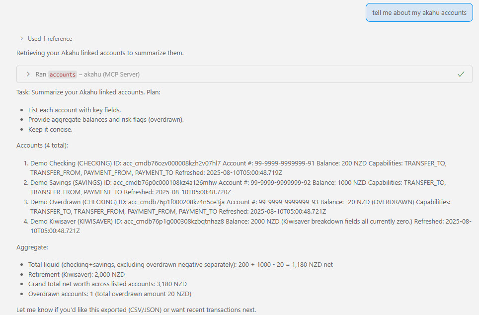
*Figure: Accounts view returned through the Akahu API (demo data).* 

## 🔐 Get Akahu Credentials

To get started, we will need credentials from Akahu to connect.

1. Navigate to the [Akahu](https://www.akahu.nz/).
2. Log in and create an account if you don't have one.
3. Once logged in, navigate to the [Akahu Developer Portal](https://developer.akahu.nz/).
4. Go to Developers and create a new connection, for the purposes of this tutorial, I will be creating a Connection to the Demo bank, but you can have more than one connection to multiple New Zealand-based banks, ANZ, Westpac, including Sharesies and the Inland Revenue Department.

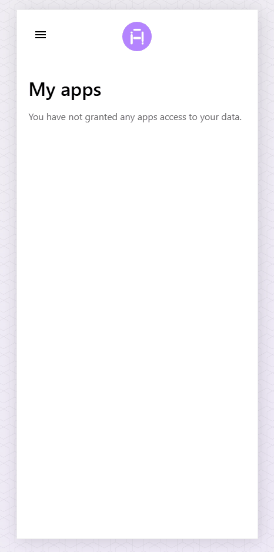
*Figure: Creating a demo bank connection in the Akahu developer portal.*

5. Once the connection has been stood up, make note of the  base URL, App Token, and the User Token as we will need these later.

## 🏗️ Create Azure API Management Instance

Once we have these details, it's time for API Management, so create an [Azure API Management](https://learn.microsoft.com/azure/api-management/api-management-key-concepts?WT.mc_id=AZ-MVP-5004796) instance, in my demo I am using a Standard Tier API Management instance in the New Zealand North Azure region.

## 🌐 Add the Akahu HTTP API

Now we need to add the Akahu APIs into Azure API Management, so add in an HTTP API:

Display name: akahu.nz _(this could be what you want it to be)_
URL: https://api.akahu.io/v1/
Suffix: mcp  _(this could be what you want it to be)_

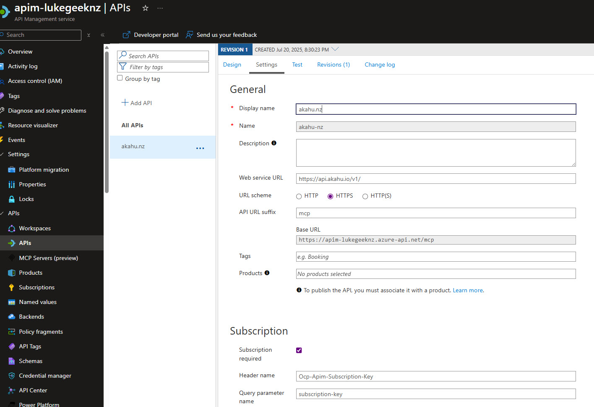
*Figure: Adding the Akahu HTTP API in Azure API Management.*

Then you can add your Operations, because I am using the Akahu Demo bank, I will be adding the following operations:

* accounts
* me

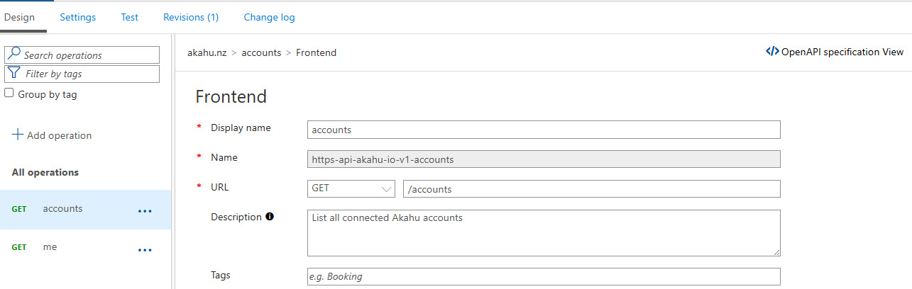
*Figure: Defining the accounts operation.*

## 🧾 Document Operations

Make sure you fill out a description, as this will be parsed through as the description of the MCP Tool.

## 🧪 Test the API (Manual)

Make sure you test the API using the Test functionality directly in API Management, you should get a response back with your accounts, and the details of the account, you will need to specify the X-Akahu-Id and Authorization headers.

The X-Akahu-Id is your app_token
The Authorization is your user token.

Make sure you add Bearer to the front of your user token, so it looks like this: `Bearer <user_token>`

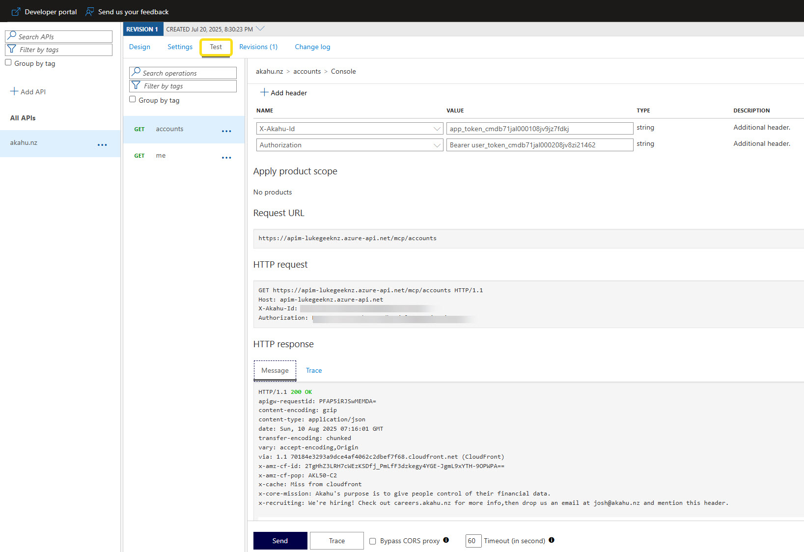
*Figure: Testing the accounts operation with required headers.*

Now that we have tested that the API is working and we can call the Accounts through the rest API via API Management, the next thing we need to do is add the authorization and user tokens as Named Values, so they can be referenced in the MCP calls.

In Azure API Management, select Named values, and add in 2 new values:

* Authorization, which will have the value of the user token.
* X-Akahu-Id, which will have the value of the app token.

_(In a scenario for Production, ideally these values will be stored and referenced in an Azure Key Vault, but for the purposes of this demo, we will be storing them in Named Values.)_

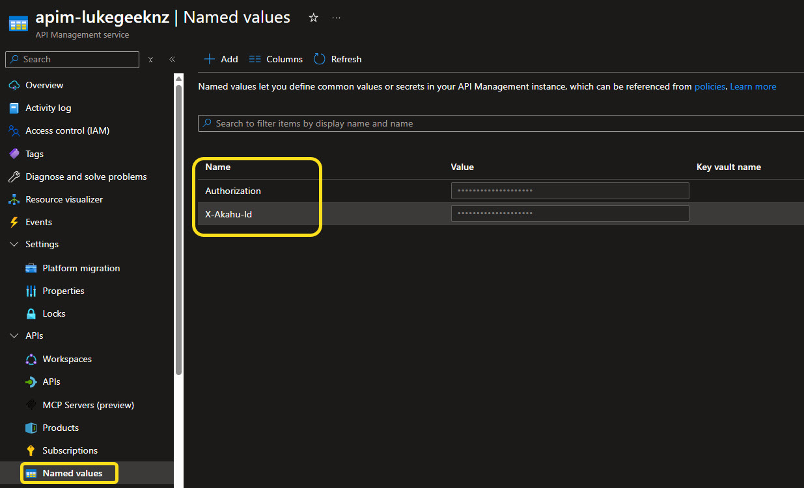
*Figure: Named values configured for secure header injection.*

You could add these values as input into the Header for the MCP Server calls, but in my case, I am using them directly in API Management.

## 🛠️ Add Inbound Headers via Policy

Now that we have added the values, we need to create a new API Management policy so that it will pick up the named values and add them to the header of any future requests.

In API Management, navigate back to your API and select All operations, and select Edit on the Base policy.

Add in the following to the Inbound portion of the policy:

```xml
 <inbound>
        <set-header name="X-Akahu-Id" exists-action="override">
            <value>{{X-Akahu-Id}}</value>
        </set-header>
        <set-header name="Authorization" exists-action="override">
            <value>Bearer {{Authorization}}</value>
        </set-header>
    </inbound>
```

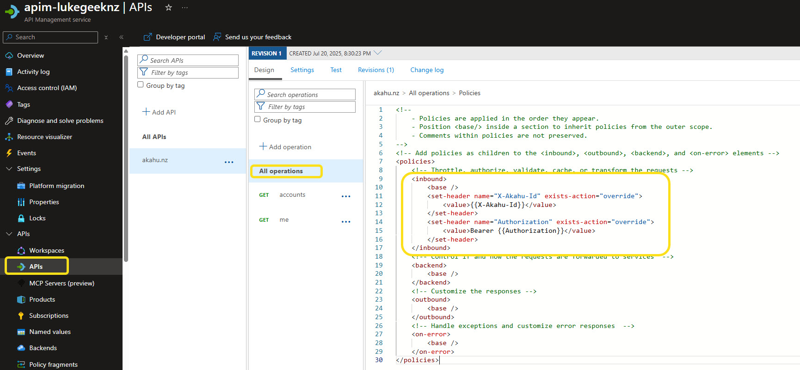
*Figure: Policy editor showing inbound header injection.*

This will ensure that the headers are added to the request when it is made to the Akahu API.

Now you can retest, without needing to add in the Id and Authorization headers, and you should get the same response back as before - 200.

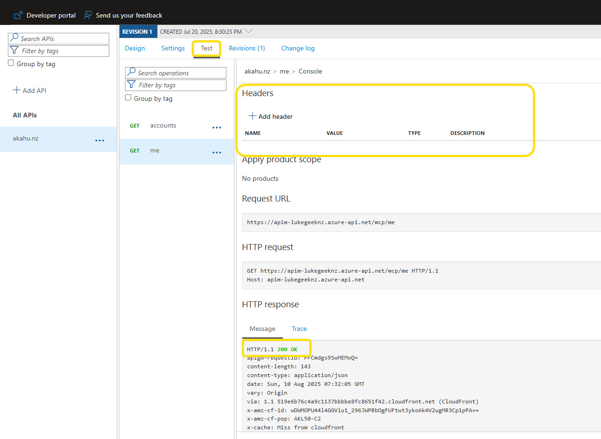
*Figure: Successful 200 response after policy application.*

## ⚙️ Enable MCP Server Support (Preview)

Next up is enabling the MCP server support, so navigate to the API Management instance, and MCP Servers (Preview). 

:::info
If you do not see this, you may be on an older version and need to enable AI Gateway capabilities, so navigate down to Service Updates (preview), select Update Group ,and select AI Gateway Early

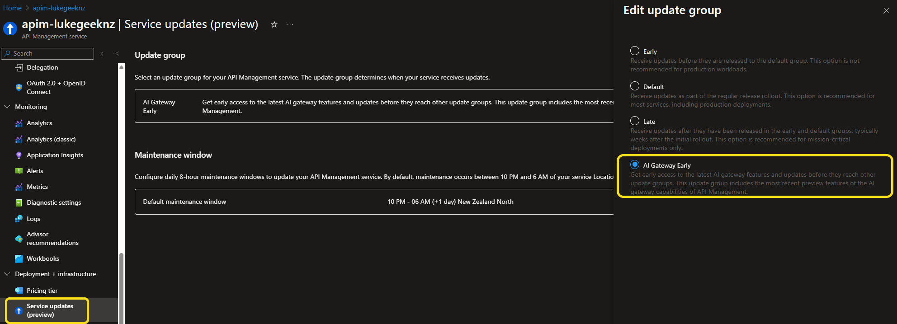
*Figure: Enabling AI Gateway early update group.*

Also, be wary of the maintenance window; you may need to wait for the maintenance window for the update to take effect, even though MCP Servers may display to allow you to add, it had some weird errors until I retried the following day after my maintenance window had passed, and the service had rolled out.
:::

Now click Create MCP server, and select Expose an API as an MCP server, and select the API you created earlier, and give it a name, I will call it akahu-nz-mcp, select the API operations that you want to expose into the MCP Server, these will become the Tools that can be called from from a MCP client.

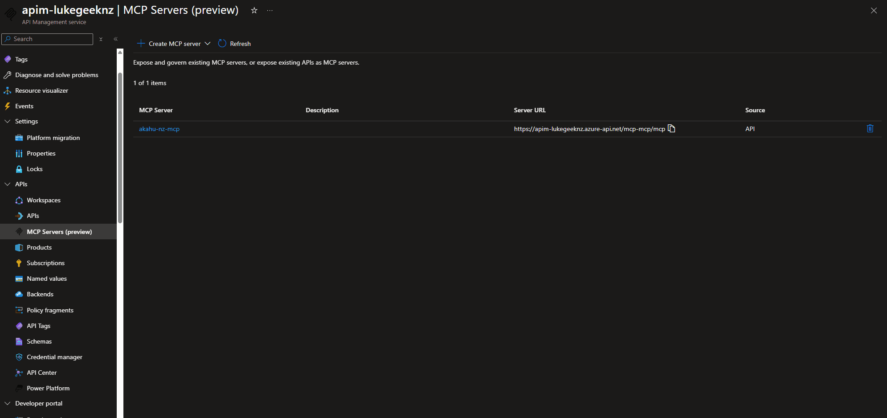
*Figure: Wizard to expose API as an MCP server.*

## 🧩 Add MCP Endpoint Policy

Now navigate to Policies, as you can see, you can have separate policies for MCP endpoints than the API endpoints, so add in the headers again.

```xml
<!--
    - Policies are applied in the order they appear.
    - Position <base/> inside a section to inherit policies from the outer scope.
    - Comments within policies are not preserved.
-->
<!-- Add policies as children to the <inbound>, <outbound>, <backend>, and <on-error> elements -->
<policies>
	<!-- Throttle, authorize, validate, cache, or transform the requests -->
	<inbound>
		<base />
		<set-header name="X-Akahu-Id" exists-action="override">
			<value>{{X-Akahu-Id}}</value>
		</set-header>
		<set-header name="Authorization" exists-action="override">
			<value>Bearer {{Authorization}}</value>
		</set-header>
	</inbound>
	<!-- Control if and how the requests are forwarded to services  -->
	<backend>
		<base />
	</backend>
	<!-- Customize the responses -->
	<outbound>
		<base />
	</outbound>
	<!-- Handle exceptions and customize error responses  -->
	<on-error>
		<base />
	</on-error>
</policies>
```

Once that has been completed and save, the endpoint should be available for use.

## 🖥️ Configure Local MCP Client

So let us test, to do this we will use Visual Studio Code, so launch GitHub Copilot chat, and select Add MCP Server to open the mcp.json file, and add the following MCP server configuration:

```json
{
  "servers": {
    "akahu": {
      "type": "http",
      "url": "https://<your-apim-instance-name>.azure-api.net/akahu-nz-mcp/mcp",
      "headers": {
        "Ocp-Apim-Subscription-Key": "<your-subscription-key>"
      },
      "timeout": 30000
    }
  },
  "inputs": []
}
```

Although we no longer need to add the X-Akahu-Id and Authorization headers, we still need to add the Ocp-Apim-Subscription-Key header, which is the subscription key for your API Management instance, so obtain this from the Azure Portal, navigate to your API Management instance, and select Subscription keys, and copy a key that has access to the API.

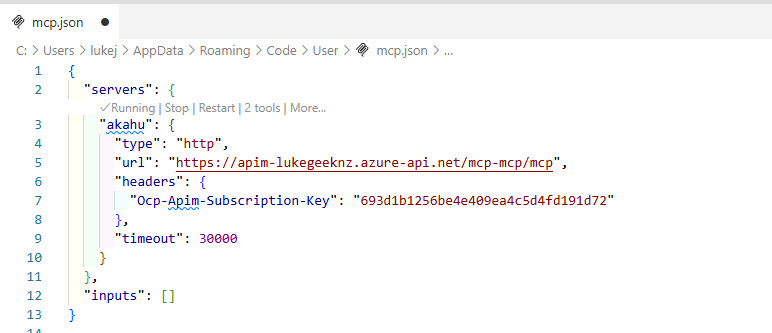
*Figure: Example mcp.json configuration with subscription key.*

## ▶️ Run and Verify

Finally, run the MCP server, and you should be able to see the Akahu accounts exposed as tools you can invoke, allowing you to call the Akahu APIs through the MCP interface.

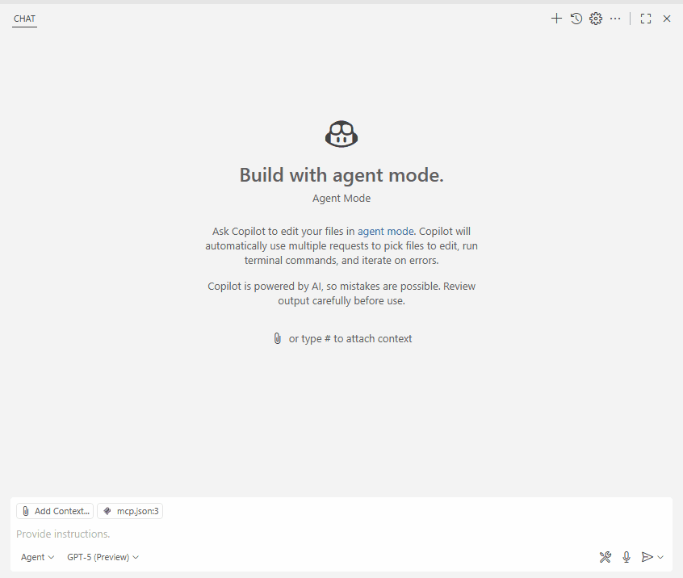
*Figure: MCP client showing available Akahu tools.*


## 🔒 Security & Governance Considerations

- Prefer Azure Key Vault integration with APIM Named Values (secret type) instead of storing tokens directly.
- Rotate Akahu tokens periodically; update Named Values without redeploying APIs.
- Apply rate limiting (e.g., `<rate-limit-by-key>`) to protect upstream Akahu services.
- Use separate APIM Products and subscription keys per environment (dev/test/prod) to isolate usage.
- Log requests (omit sensitive headers) via Application Insights for auditing.
- Avoid over-broad scopes when future Akahu endpoints require granular permissions.
- For production, add validation policies (JSON schema, response caching as appropriate) and observability (tracing, metrics).

## 🧯 Troubleshooting

| Symptom | Cause | Fix |
|---------|-------|-----|
| 401 from Akahu | Missing or malformed Authorization header | Confirm policy injected `Bearer <token>` and token not expired |
| 401 after adding policy | Policy saved at operation not API scope | Ensure change applied at All operations level or MCP policy layer |
| MCP Servers option missing | Preview feature not enabled | Enable AI Gateway Early group and wait for maintenance window |
| Tool not appearing in client | Operation not selected when creating MCP server | Edit MCP server and add operation |
| 429 responses | Exceeded rate limits (Akahu or APIM) | Add/adjust rate-limit / retry-after policies |
| Unexpected empty results | Demo bank seeded data differences | Confirm with direct Akahu call outside APIM |
| Subscription key rejected | Wrong product or key rotated | Re-copy active key from APIM Subscriptions blade |

Hopefully this walkthrough shows the Akahu MCP setup in action and how you can route Akahu API calls via Azure API Management. Combining your financial data (with appropriate consent) and an LLM can assist with generating summaries or draft insights (e.g., spending categories, high‑level comparisons across accounts) without manually crafting each REST call. Always validate model outputs against authoritative data before making financial decisions, and avoid exposing sensitive information beyond what is required for the task.

> Note: Large Language Models can produce inaccuracies or outdated interpretations. Treat generated insights as assistive, not authoritative, and apply appropriate governance and compliance controls for any production scenario.
