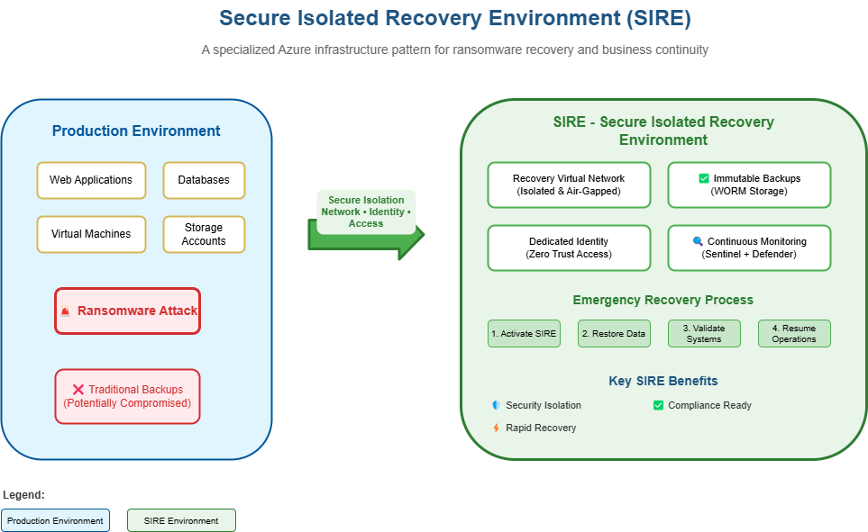
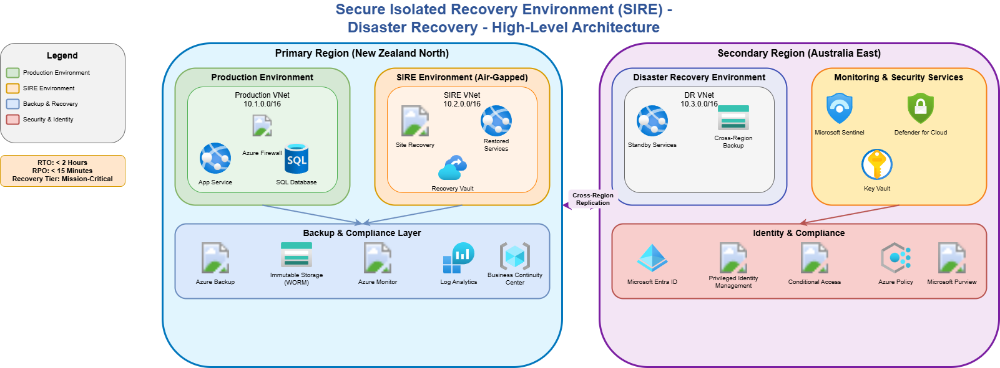
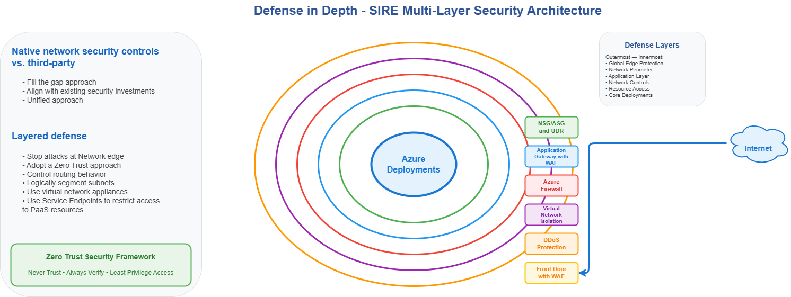
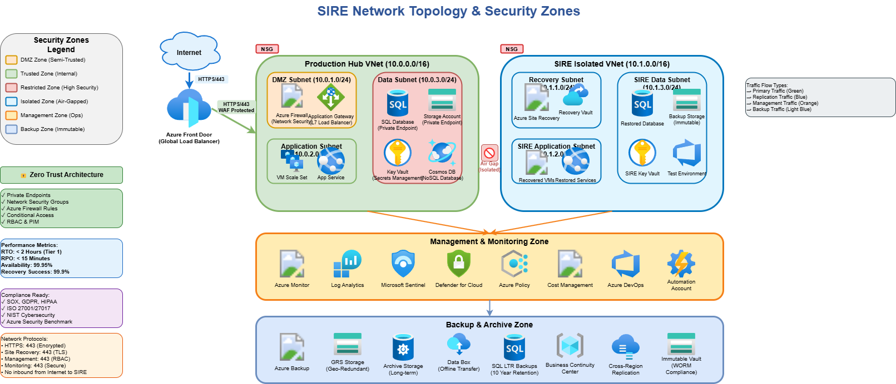
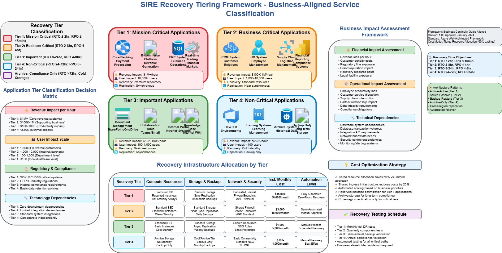
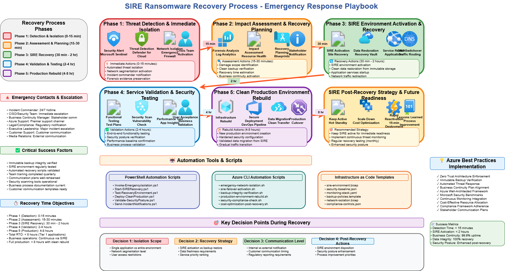

Today, we are going to delve into the importance of a Secure Isolated Recovery Environment (SIRE) for Microsoft Azure, and why organizations should consider implementing this pattern as a critical component of their cybersecurity and business continuity strategy.

A SIRE is designed to ensure that, even in the event of a severe cybersecurity incident—such as a ransomware attack—organizations have a secure, isolated space to recover essential systems and data. This approach is increasingly vital given the evolving threat landscape.

{/* truncate */}

## 🔎 Why SIRE, and why now?

> According to the [Sophos 2025 State of Ransomware Report](https://www.sophos.com/en-us/content/state-of-ransomware), exploited vulnerabilities remain the most common root cause of ransomware incidents, accounting for 32% of attacks. Compromised credentials and email-based attacks also continue to be significant vectors.
>
> Notably, while 97% of organizations that had data encrypted were able to recover it, only 54% restored their data using backups—the lowest rate in six years. Nearly half (49%) paid the ransom to regain access, and 29% relied on "other means" such as public decryption keys.

These statistics highlight a critical consideration: traditional recovery methods are becoming less reliable, and the risk of data loss or extended downtime is increasing. By proactively considering a SIRE, organizations can:

- Ensure recovery capabilities remain un-compromised, even if production environments are breached.
- Reduce reliance on ransom payments or uncertain recovery methods.
- Strengthen overall resilience against evolving cyber threats.

## 🧊 Air‑gapped backups in Azure

It’s worth noting that services such as [Azure Backup](https://learn.microsoft.com/azure/backup/backup-overview?WT.mc_id=AZ-MVP-5004796) are air-gapped—isolated from customer virtual networks—and can provide a secure recovery option in the event of a ransomware attack.

## 🧱 What SIRE is—and isn’t

When we consider a Secure Isolated Recovery Environment (SIRE), we’re talking about a purpose-built environment to facilitate recovery without risk of contamination from the primary environment. At its simplest, it’s a standalone virtual network not peered with anything and created as required. However, there are important considerations around how it’s implemented and, more importantly, how it’s used.

The SIRE environment is not your disaster recovery setup in an Active/Passive scenario—whether in the same or a different region. For those scenarios, you should consider [reliability](https://learn.microsoft.com/azure/well-architected/reliability/principles?WT.mc_id=AZ-MVP-5004796) in your design based on workload criticality and downtime impact.

The SIRE is designed as a last resort: a place to recover from a catastrophic event (for example, a ransomware attack) when the primary environment is compromised. It’s not intended for day-to-day operations. You may replicate critical services to an air‑gapped VNet if required, but you must know the exact moment your environment was compromised—which can be days or even weeks after the initial incident.

## 📚 Read this first

> Before proceeding further, make sure you read [Ransomware protection in Azure](https://learn.microsoft.com/azure/security/fundamentals/ransomware-protection?WT.mc_id=AZ-MVP-5004796) and [Recommendations for designing a disaster recovery strategy](https://learn.microsoft.com/azure/well-architected/reliability/disaster-recovery?WT.mc_id=AZ-MVP-5004796). This article is primarily focused on the [Containment/Mitigation](https://learn.microsoft.com/en-us/azure/security/fundamentals/ransomware-detect-respond?WT.mc_id=AZ-MVP-5004796#containmentmitigation) aspects.

## 🚀 Getting started: SIRE in 8 steps

1. Create a dedicated SIRE subscription and resource groups (separate from production).
2. Deploy an isolated virtual network (no peering). Add a firewall/NVA for controlled egress and logging.
3. Apply Azure Policy: deny VNet peering, require private endpoints for storage/Key Vault, and enforce tags.
4. Enable Azure Bastion with session recording and monitoring for administrator access.
5. Prepare identity: SIRE‑only RBAC groups, custom roles scoped to SIRE RGs, PIM JIT, and break‑glass accounts.
6. Configure immutable backups (WORM) and validate restore points; document restore sources and credentials.
7. Define restore order by tier (use the criticality table) and schedule quarterly SIRE restore tests.
8. Automate with PowerShell/Azure CLI/IaC runbooks: create SIRE infra, execute restores, and isolate compromised links (e.g., disable VPN/peering).

## 🧩 Design principles

* Immutable recovery foundation
  * Ensure that recovery data is immutable and cannot be altered or deleted by malicious actors. Remember [WORM (Write Once Read Many)](https://learn.microsoft.com/en-us/azure/storage/blobs/immutable-storage-overview?WT.mc_id=AZ-MVP-5004796).
  * Implement versioning and retention policies to maintain a history of recoverable data.
  * Infrastructure as Code (IaC) enables consistent, repeatable deployments of both recovery and production environments—preserving the state at the time of the incident.
* Zero Trust security model
  * Never trust, always verify — continuous authentication and authorization
  * Least privilege access — [RBAC](https://learn.microsoft.com/azure/role-based-access-control/overview?WT.mc_id=AZ-MVP-5004796) with [just‑in‑time access](https://learn.microsoft.com/azure/role-based-access-control/pim-integration?WT.mc_id=AZ-MVP-5004796)
  * Continuous monitoring — [Defender for Cloud](https://learn.microsoft.com/azure/defender-for-cloud/defender-for-cloud-introduction?WT.mc_id=AZ-MVP-5004796) and [Microsoft Sentinel](https://learn.microsoft.com/azure/sentinel/overview?tabs=defender-portal&WT.mc_id=AZ-MVP-5004796)
* Air‑gapped isolation
  * [Network isolation](https://learn.microsoft.com/azure/security/fundamentals/isolation-choices?WT.mc_id=AZ-MVP-5004796) — dedicated VNets with controlled connectivity
  * [Data isolation](https://learn.microsoft.com/azure/security/fundamentals/isolation-choices?WT.mc_id=AZ-MVP-5004796) — separate storage with immutable policies
  * [Identity isolation](https://learn.microsoft.com/security/privileged-access-workstations/privileged-access-access-model?WT.mc_id=AZ-MVP-5004796) — strict RBAC boundaries and cloud‑only accounts, with clear separation across data, workload, and management planes
* Automated recovery orchestration
  * [Azure Site Recovery](https://learn.microsoft.com/azure/site-recovery/site-recovery-overview?WT.mc_id=AZ-MVP-5004796) — automated VM and application failover
  * [Azure Business Continuity Center](https://learn.microsoft.com/azure/business-continuity-center/business-continuity-center-overview?WT.mc_id=AZ-MVP-5004796) — unified management of protection estate
  * Recovery automation — PowerShell/Azure CLI scripts for consistent recovery

## 🌍 Same‑region vs. cross‑region

95% of organizations will deploy a SIRE in the same region as their primary environment. This approach enables faster recovery and lower latency by leveraging existing regional capacity and services.

> Secure isolation does NOT require cross‑region deployment. Same‑region SIRE provides enterprise‑grade security isolation while maintaining cost efficiency, compliance simplicity, and operational excellence. Secure isolation is achieved through network segmentation, access controls, and infrastructure — NOT geographic separation. Consider the [Azure policies](https://learn.microsoft.com/azure/governance/policy/overview?WT.mc_id=AZ-MVP-5004796) that may be deployed in your environment.

## 🏗️ SIRE architecture features

* Network air‑gap — dedicated VNets with zero connectivity to production
* Identity isolation — strict RBAC boundaries and Conditional Access
* Storage isolation — immutable backup storage with WORM policies
* Compute isolation — dedicated resource groups and virtual machines
* Access isolation — just‑in‑time (JIT) access via privileged identity management
* Zone‑level separation — different availability zones for physical isolation

| Isolation Method      | Description / Benefits                                                                                  |
|----------------------|--------------------------------------------------------------------------------------------------------|
| Network Isolation    | Dedicated VNets, NSGs, zero connectivity to production; prevents lateral movement and external threats. |
| Identity Isolation   | Strict RBAC boundaries within tenant or separate Entra ID tenant; limits access to only authorized users.|
| Storage Isolation    | Immutable WORM policies, customer-managed key (CMK) encryption; ensures backup integrity and security.  |
| Access Controls      | JIT access, Privileged Access Management (PAM), Conditional Access; reduces attack surface.             |
| Infrastructure Isolation | Dedicated subscriptions/resource groups; isolates resources for better management and security.      |
| Physical Isolation   | Availability zones (datacenters); resilience against physical failures and localized incidents. Plan quotas/capacity ahead of restore. |

🔒 A compromised admin account can access resources in ANY region if identity controls are weak. Strong same‑region isolation with proper RBAC often provides better protection than weak cross‑region controls. Identities used to stand up and restore to the SIRE must be separate from those used in production.

## 👤 Identity and access model

Most organizations should implement SIRE within their existing Microsoft Entra ID tenant using strict RBAC boundaries. This provides enterprise‑grade security while maintaining operational simplicity and cost efficiency.

- Dedicated SIRE security groups — separate groups for SIRE administrators, operators, and forensics analysts
- Custom RBAC roles — granular permissions scoped to SIRE resource groups only
- Conditional Access policies — SIRE‑specific access controls with location/device requirements
- Privileged Identity Management (PIM) — just‑in‑time activation for SIRE administrative roles
- Separate service principals — dedicated managed identities for SIRE automation and services
- Emergency access accounts — break‑glass accounts with SIRE‑only permissions

## 🔒 Network isolation design

Design with zones and segmentation to isolate resources. The SIRE must be completely isolated from production and not peered with any network. You may enable tightly controlled outbound egress through a firewall to monitor any traffic originating from SIRE workloads as part of containment.

Include Azure Policies to restrict peering of your SIRE virtual network to any other virtual networks.

## 🔐 Access into the SIRE

To access workloads restored into the SIRE, plan how administrators will connect and which credentials they will use. These must not be the same credentials used for production. Prefer temporary cloud‑only accounts during recovery and containment. For access, consider [Azure Bastion with session recording and monitoring](https://learn.microsoft.com/azure/bastion/session-recording?WT.mc_id=AZ-MVP-5004796).

## 🧪 Cloud‑native supply chain hygiene

For cloud‑native solutions, follow [secure supply chain frameworks](https://learn.microsoft.com/azure/security/container-secure-supply-chain/articles/container-secure-supply-chain-implementation/containers-secure-supply-chain-overview?WT.mc_id=AZ-MVP-5004796) and separate your container images. Rebuild and patch images, and use tools like [ProjectCopacetic](http://project-copacetic.github.io/copacetic/website/) and [Trivy](https://trivy.dev/latest/). Evaluate dependencies and prefer minimal base images; rebuilding from scratch may be safer than relying on a general‑purpose image.

## 👥 Recovery personas

When planning Identity and Access Management for your SIRE, consider the following personas:

* Recovery Administrator
* Forensics Analyst
* Backup Operator
* Security Reviewer
* Application Tester

Ensure you’ve defined clear roles and responsibilities for each persona, including specific access needs and the resources they’ll interact with during recovery.

## 🧭 Restoration prioritization

You may need to prioritize restoration based on application criticality. A tiered access model helps ensure more critical applications receive stricter access controls and monitoring. Tiering typically reflects an agreed SLA, downtime impact (financial, regulatory, safety), and time to restore. More critical workloads cost more to run but can be restored faster; during a major incident, recovery may need to be expedited.

I usually operate with the following if an organization doesn’t have a defined criticality model:

| Criticality Level   | Business Impact                                         | Availability SLA | RTO Target   | RPO Target   |
|---------------------|--------------------------------------------------------|------------------|--------------|-------------|
| Mission-Critical    | Immediate business shutdown, safety risk, or regulatory violation | 99.99%           | ≤ 1 hour     | ≤ 15 minutes|
| Business-Critical   | Significant business impact, customer service disruption| 99.9%            | 2-8 hours    | 1-4 hours   |
| Important           | Moderate business impact, operational efficiency reduction| 99.5%           | 8-24 hours   | 4-8 hours   |
| Non-Critical        | Minimal business impact, administrative convenience     | 99.0%            | 24-72 hours  | 8-24 hours  |

### 🚨 Mission‑critical: act first

These systems trigger immediate action and the earliest SIRE restores:

- Life safety — Systems that directly impact human safety or emergency response (for example, 111/911 integration, paging/alerting)
- Regulatory compliance — Systems required to meet legal or regulatory obligations (for example, mandated record retention, audit logging)
- Revenue generation — Direct revenue paths and customer‑facing services (for example, checkout APIs, subscription billing jobs)
- Public safety — Services supporting emergency operations or public safety (for example, dispatch, critical notifications)
- Operational dependencies — Foundational platforms everything else needs (for example, identity, DNS, secrets/keys)

### 🏢 Business‑critical: keep the lights on

These keep core operations running and follow closely after mission‑critical restores:

- Core business processes — Primary business applications and workflows (for example, ERP, HRIS)
- Customer service — Support, service delivery, and communications (for example, ticketing, contact center)
- Financial operations — Payment processing, financial reporting, and accounting
- Supply chain — Inventory management, logistics, and vendor relationships
- Employee productivity — Essential workforce tools (for example, email, collaboration, endpoint management)

Use this tiering to drive SIRE restore order, access controls, and monitoring intensity for the first‑wave applications.

## 🔁 Recovery playbook

Consider a playbook for service restoration. In the example below, phases run from Phase 1 (Threat detection) through Phase 5 (Service restoration and rebuild):

## ⚖️ Risk assessment

Risk = Probability × Impact

| Risk Category        | Probability | Impact | Mitigation Strategy                                 |
|----------------------|-------------|--------|-----------------------------------------------------|
| Ransomware Attack    | High        | High   | SIRE implementation, immutable backups              |
| Regional Outage      | Medium      | High   | Multi-region deployment, site recovery              |
| Data Corruption      | Medium      | Medium | Point-in-time recovery, backup validation           |
| Human Error          | High        | Medium | Role-based access, approval workflows               |
| Supply Chain Attack  | Low         | High   | Zero Trust, continuous monitoring                   |

## 🤖 Automate the playbook

> Consider a set of scripts that automate SIRE creation, recovery workflows, and temporary network isolation of production systems from compromised components (for example, disconnect VPN between Azure and on‑premises).