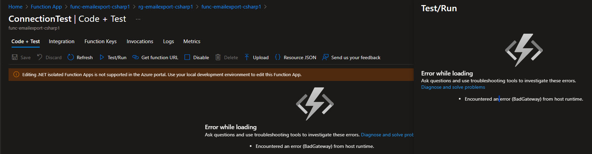

You might be deploying to Azure Functions or attempting to retrieve the Function App URL, and you may encounter errors like:

> - `Encountered an error (BadGateway) from host runtime.`
> - `Encountered an error (InternalServerError) from host runtime.`

{/* truncate */}

I had this recently, with a Function App deployment I was doing, where it was working in a Azure CLI deployment, but as part of transitioning the Azure CLI to Bicep, I encountered this error, when I noticed that my Timer trigger Function was not firing as expected. After some investigation, I found that the issue was due to the Storage account that the Function App was using. The Storage account was not properly configured or accessible, which led to the host runtime errors.

The issue was with the Networking, essentially although I had deployed the storage account, I had failed to specify whether the storage account was to be publicly accessible or not - ie reachable by the Function App. So Public access was off, and the Function App could not access the Storage account, which was causing the errors.

To remediate this, I enabled the public endpoint, validated it worked, then added the Storage account to a Virtual Network with Private endpoints, and enabled VNET (Virtual Network) integration to the Function App, allowing secure connection between the function app and the storage account.
