[Azure Communication Services](https://learn.microsoft.com/azure/communication-services/overview?WT.mc_id=AZ-MVP-5004796) can be used to add voice, video, chat, and SMS and email capabilities to applications. It is a fully managed communication platform that enables developers to build rich communication experiences. Today, we will explore the email capability through an MCP (Model Context Protocol) server hosted on Azure Functions, enabling us to send emails from any MCP client.

{/* truncate */}

We will go through 2 scenarios:

1. Direct MCP Connection to the Function App using the FunctionApp key in our client
2. MCP connection through Azure API Management, authenticating with Entra ID.

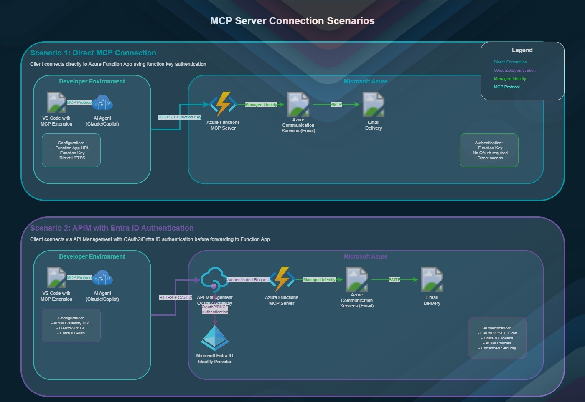

The Azure resources used for this are:

- [Azure Functions (.NET)](https://learn.microsoft.com/azure/azure-functions/functions-overview?WT.mc_id=AZ-MVP-5004796)
- [Azure Communication Services](https://learn.microsoft.com/azure/communication-services/overview?WT.mc_id=AZ-MVP-5004796)
- [Email Communication Service](https://learn.microsoft.com/azure/communication-services/concepts/email/email-overview?WT.mc_id=AZ-MVP-5004796)
- [Email Communication Services Domain](https://learn.microsoft.com/azure/communication-services/concepts/email/email-domain-and-sender-authentication?WT.mc_id=AZ-MVP-5004796)
- [User-assigned managed identity](https://learn.microsoft.com/entra/identity/managed-identities-azure-resources/how-manage-user-assigned-managed-identities?pivots=identity-mi-methods-azp&WT.mc_id=AZ-MVP-5004796)
- [Azure API Management](https://learn.microsoft.com/azure/api-management/api-management-key-concepts?WT.mc_id=AZ-MVP-5004796)

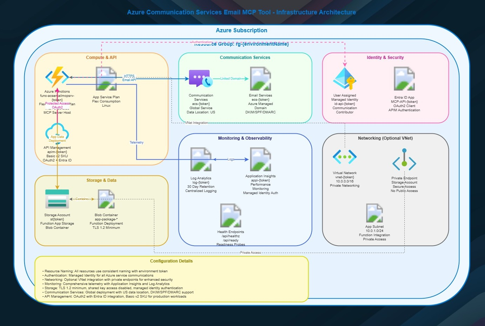

The Function App is a C# .NET 8 MCP (Model Context Protocol) server; it provides advanced email automation tools using Azure Communication Services (ACS), with support for templates, attachments, and robust error handling.

:::info
I based the Function App on the [Azure-Samples/mcp-sdk-functions-hosting-dotnet](https://github.com/Azure-Samples/mcp-sdk-functions-hosting-dotnet) sample.

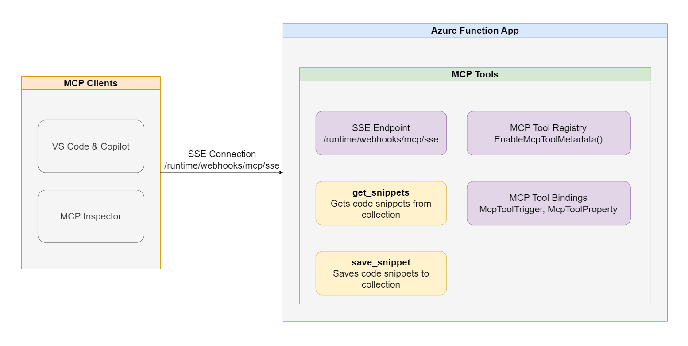

This sample runs the MCP tools by utilising a custom handler.
:::

5 tools can be accessed from this server:

- SendEmail: Send an email with options (HTML/plain text, attachments, sender/recipient names).
- SendSimpleEmail: Send a plain-text email with minimal parameters.
- SendEmailWithMultipleAttachments: Send an email with multiple attachments.
- SendIncidentEmail: Use a predefined incident template for outage notifications.
- ListEmailTemplates: List available templates and required variables.

To deploy this, we will use [Azure Developer CLI](https://learn.microsoft.com/azure/developer/azure-developer-cli/overview?tabs=windows&WT.mc_id=AZ-MVP-5004796) to deploy the Azure resources and the function app code directly to our Azure environment.

:::note
You can find the code here: [lukemurraynz/acs-email-mcp-server](https://github.com/lukemurraynz/acs-email-mcp-server).
> I will be running this from the devcontainer, which contains the Azure Developer CLI that I will use to deploy.
:::

First, we will `azd auth login` to log in to Azure with credentials that can
Then `azd up` to start the deployment.

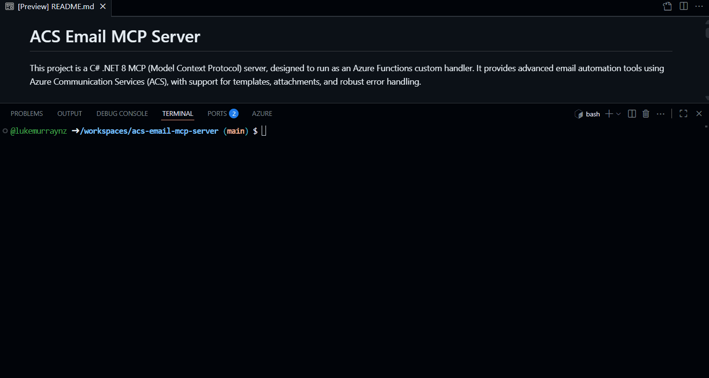

Once up and running, its time to test, to do this we will test the 2 scenarios (direct MCP to Function App and MCP with Entra ID through APIM) using two different MCP clients:

* [LM Studio](https://lmstudio.ai/)
* [Visual Studio Code](https://code.visualstudio.com?WT.mc_id=AZ-MVP-5004796)

Direct MCP to Function App will work on the majority of your MCP clients, as long as you can add in the header API key _(easily done in the `mcp.json` file I will show you shortly)_, however not all clients support Entra ID authentication - but Visual Studio Code with GitHub Copilot does.

In LLM studio, using gpt-oss-20b hosted locally on my computer - I will  add in the following to my mcp.json file:

```json
{
  "mcpServers": {
    "acsemail": {
      "url": "https://func-acsemailmcpsrv-fje7uzz7l2rbc.azurewebsites.net/mcp",
      "headers": {
        "x-functions-key": "Hbuo_sQ-tXt3MobsOGkYDm1G8zVL4Ar2R6vhhJhzkxgTAzFuzpNj0Q=="
      },
      "timeout": 30000
    }
  }
}
```

This is the Function App endpoint and the function key, which you can get from the Azure portal, from the Function App > Functions > Your Function > Function Keys.


Once that is done, we can do some testing, here I am using the `SendEmail` tool to send an email.

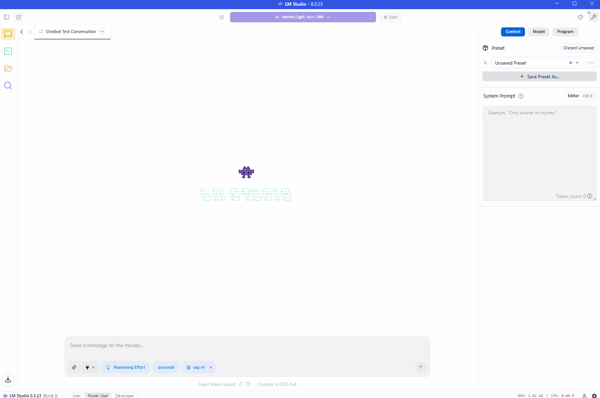

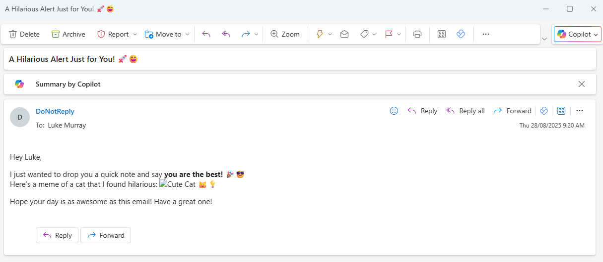

Now, lets test the second scenario, using Visual Studio Code with GitHub Copilot with Entra ID authentication through Azure API Management.

Using Visual Studio Code, I will add in the following to my mcp.json file:

```json
{
  "servers": {
    "acs": {
      "type": "http",
      "url": "https://https://apim-zhk2vuoady55m.azure-api.net/mcp"
    }
  },
  "inputs": []
}
```

As you can see there is no API key, as we will be using Entra ID authentication. Once started, it should prompt you to log in to Entra ID.

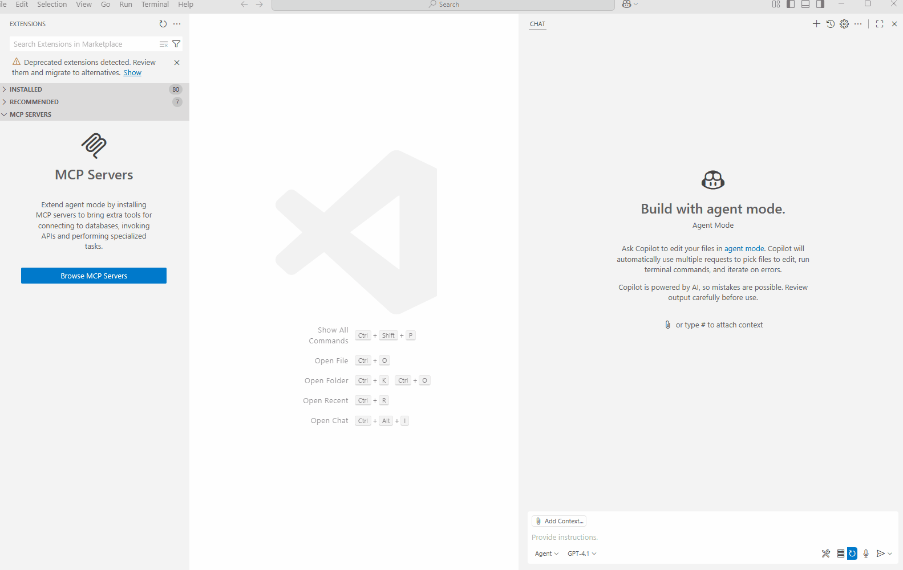

The initial login may fail, and the MCP server will stop - this is because, we haven't been able to authorise your account actually has access to the Azure API Management endpoints for the the Azure Communication Services MCP function app server.

What we need to do is to assign your user account access to the Application Registration, that will allow you to authenticate and use the MCP server. To find this, navigate to the API Management service, navigate to Named Values, and find the McpClientId value, copy the value - this is the ID of the Application Registration, now navigate to Entra ID > Application Registrations, and search for this ID, select it, then select Managed application (on ther Overview pane - right hand side), this will take you to the Enterprise Application for this App Registration, then click on Users and groups, then Add users/groups, select your user account, then click Assign.

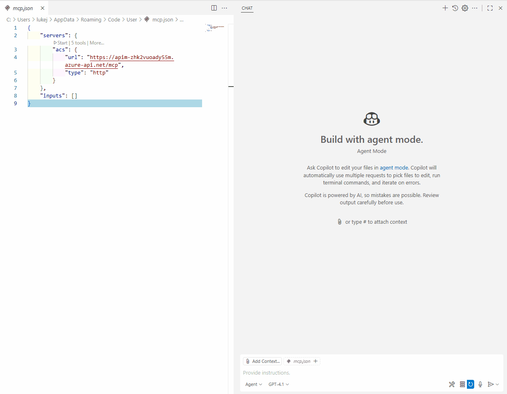

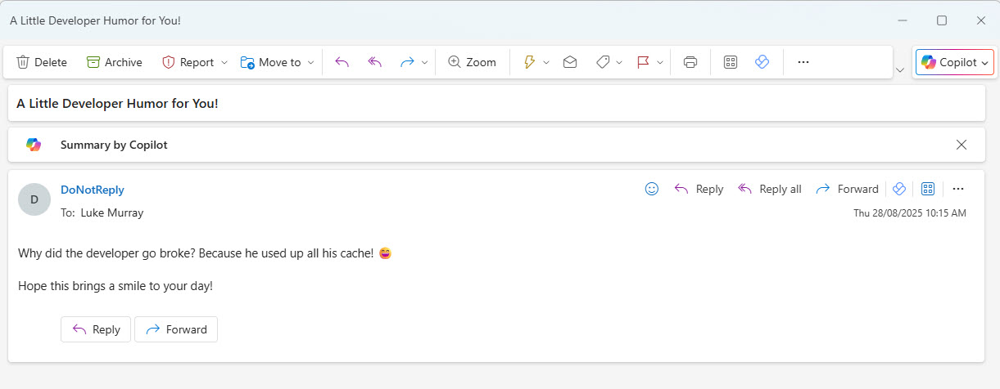

If I wanted to, I could test with a prompt like this:

> send #selection as attachment to luke@luke.geek.nz

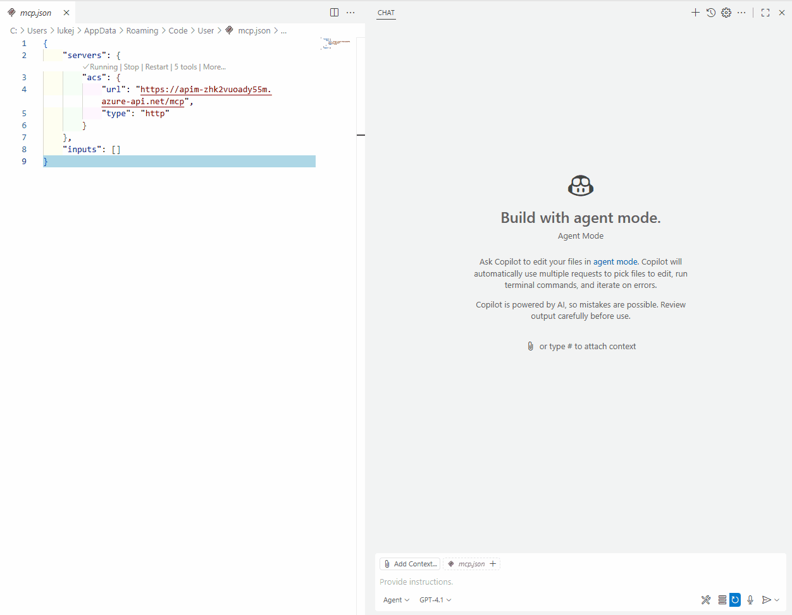

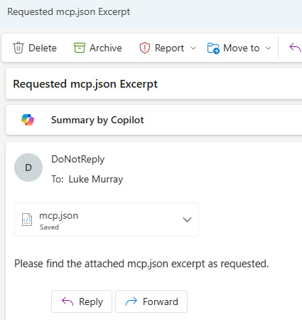

Finally, we will use the ListEmailTemplates tool to see what templates are available, and send an IT System Outage email using the SendIncidentEmail tool.

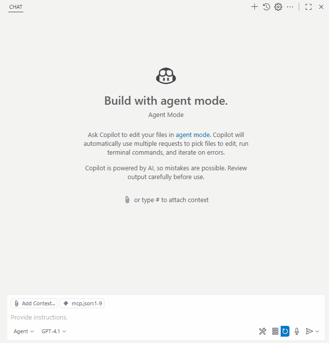

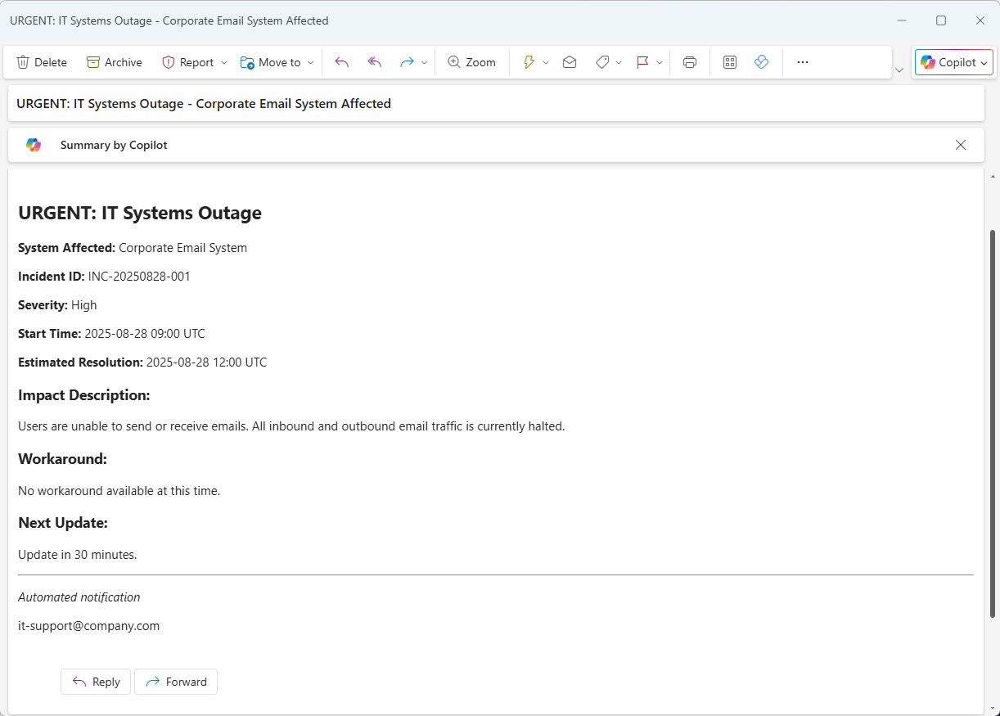

