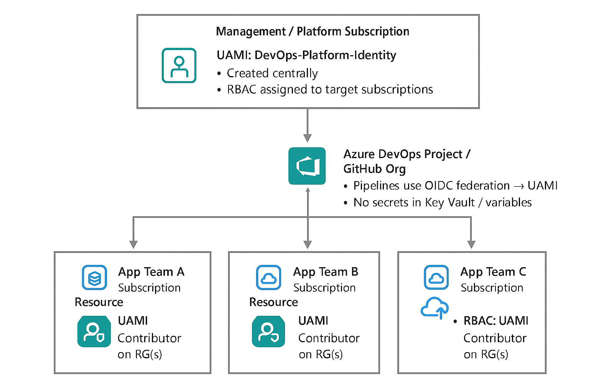

Service Principal vs User‑Assigned Managed Identity? This came up again for me recently while deciding what to standardise on for Infrastructure as Code deployments.

Now that [Workload Identity Federation (WIF)](https://learn.microsoft.com/entra/workload-id/workload-identity-federation?WT.mc_id=AZ-MVP-5004796) is broadly supported, it’s pretty simple to move a traditional service principal off a client secret and onto federated credentials – or create it that way from day one. So why bother with a user‑assigned managed identity (UAMI)?

Because I’ve formed a preference over the last couple of years: for most DevOps / platform automation scenarios, I’ll reach for a User‑Assigned Managed Identity with WIF before I create (yet another) service principal. This post walks through the why, plus where a service principal still makes sense.

{/* truncate */}

:::info
In Microsoft Entra, workload identities are applications, service principals, and managed identities.

An [application](https://learn.microsoft.com/en-us/entra/identity-platform/app-objects-and-service-principals?toc=%2Fazure%2Factive-directory%2Fworkload-identities%2Ftoc.json&bc=%2Fazure%2Factive-directory%2Fworkload-identities%2Fbreadcrumb%2Ftoc.json&WT.mc_id=AZ-MVP-5004796) is an abstract entity, or template, defined by its application object. The application object is the global representation of your application for use across all tenants. The application object describes how tokens are issued, the resources the application needs to access, and the actions that the application can take.

A [service principal](https://learn.microsoft.com/en-us/entra/identity-platform/app-objects-and-service-principals?toc=%2Fazure%2Factive-directory%2Fworkload-identities%2Ftoc.json&bc=%2Fazure%2Factive-directory%2Fworkload-identities%2Fbreadcrumb%2Ftoc.json&WT.mc_id=AZ-MVP-5004796) is the local representation, or application instance, of a global application object in a specific tenant. An application object is used as a template to create a service principal object in every tenant where the application is used. The service principal object defines what the app can actually do in a specific tenant, who can access the app, and what resources the app can access.

A [managed identity](https://learn.microsoft.com/en-us/entra/identity/managed-identities-azure-resources/overview?toc=%2Fazure%2Factive-directory%2Fworkload-identities%2Ftoc.json&bc=%2Fazure%2Factive-directory%2Fworkload-identities%2Fbreadcrumb%2Ftoc.json&WT.mc_id=AZ-MVP-5004796) is a special type of service principal that eliminates the need for developers to manage credentials.
:::

This really started for me when I migrated a Terraform pipeline from OAuth (client ID + secret) to WIF in Azure DevOps. The change itself was easy – tweak the auth step, remove the secret, done.

But then a weird issue cropped up in a long‑running Azure API Management + Application Gateway deployment. The default 1‑hour token lifetime was biting us – failures were happening mid‑deployment (around the 30–40 minute mark). Swapping the service connection over to a user‑assigned managed identity removed the problem. I’m pretty sure it was a transient platform quirk at the time that’s since been ironed out, but it made me re‑examine the operational differences.

Fast forward: platform engineering practices, landing zone vending, and self‑service infrastructure have matured. That’s where the management characteristics of UAMIs really shine.

## User‑Assigned Managed Identity (WIF) vs Service Principal (WIF)

| Aspect                            | User-Assigned Managed Identity (with WIF)                                                                                                                                                                                                                                               | Service Principal (with WIF)                                                                                                                                                                                                                         | References                                                                                                                                                                                                                                                                                                                                                                                                                                                                                                                                |
| --------------------------------- | --------------------------------------------------------------------------------------------------------------------------------------------------------------------------------------------------------------------------------------------------------------------------------------- | ---------------------------------------------------------------------------------------------------------------------------------------------------------------------------------------------------------------------------------------------------- | ----------------------------------------------------------------------------------------------------------------------------------------------------------------------------------------------------------------------------------------------------------------------------------------------------------------------------------------------------------------------------------------------------------------------------------------------------------------------------------------------------------------------------------------- |
| Credential management             | No client secret to store – Azure manages credentials. Tokens obtained via WIF; no static secret ever exists in your repo or key vault.                                                                                                                                                 | No static secret needed when using WIF (federated credential replaces a secret). Traditionally, it required a client secret or certificate that operators rotated.                                                                                              | [Demystifying Service Principals & Managed Identities](https://devblogs.microsoft.com/devops/demystifying-service-principals-managed-identities/); [Managed identities overview](https://learn.microsoft.com/en-us/entra/identity/managed-identities-azure-resources/overview)                                                                                                                                                                                                                                                            |
| Provisioning & governance         | Created as an Azure resource _(portal/CLI/ARM/Terraform)_ inside a subscription/resource group. Anyone with sufficient Azure RBAC (e.g., Contributor) at that scope can create/configure it. Visible in Azure Activity Logs; Azure Policy can allow/deny WIF on UAMIs (built-in policy). | Created by registering an application in Entra ID. Only the app owner or directory roles (Application / Global Administrator, etc.) can add federated credentials. Lives in Entra ID, governed by directory roles & policies rather than Azure RBAC. | [Create UAMI trust](https://learn.microsoft.com/en-us/entra/workload-id/workload-identity-federation-create-trust-user-assigned-managed-identity); [Block WIF via Policy](https://learn.microsoft.com/en-us/entra/workload-id/workload-identity-federation-block-using-azure-policy); [Create app trust](https://learn.microsoft.com/en-us/entra/workload-id/workload-identity-federation-create-trust)                                                                                                                                   |
| Lifecycle & cleanup               | Independent lifecycle: must be explicitly deleted. Reusable across workloads. Deleting the UAMI immediately removes its ability to get tokens.                                                                                                                                          | Persists until manually deleted. Not tied to any Azure resource; can become an orphaned identity if forgotten. Can be multi-tenant (if app is multi-tenant).                                                                                         | [Managed identities overview](https://learn.microsoft.com/en-us/entra/identity/managed-identities-azure-resources/overview); [Demystifying Service Principals & Managed Identities](https://devblogs.microsoft.com/devops/demystifying-service-principals-managed-identities/)                                                                                                                                                                                                                                                            |
| Least privilege & isolation       | You can create one UAMI per workload/environment; assign only minimal Azure RBAC roles. No secrets to leak or rotate. Strong isolation via scoping and deletion.                                                                                                                        | You can create multiple SPs, but all reside in the same tenant. Permissions are entirely from assigned roles. If not cleaned up, it may retain access indefinitely. Requires diligence to avoid privilege creep.                                            | [Demystifying Service Principals & Managed Identities](https://devblogs.microsoft.com/devops/demystifying-service-principals-managed-identities/)                                                                                                                                                                                                                                                                                                                                                                                         |
| Federated identity configuration  | Add Federated Credential to the UAMI _(portal/CLI)_. Up to 20 per identity. Must exactly match issuer & subject (e.g., GitHub repo / env). Propagation delay can cause brief initial failures (AADSTS70021).                                                                             | Add Federated Credential under App Registration > Certificates & secrets > Federated credentials. Same 20 limit & exact-match rules. Requires an appropriate Entra role or ownership. Pipelines use Client ID + Tenant ID (no secret).                  | [Create app trust](https://learn.microsoft.com/en-us/entra/workload-id/workload-identity-federation-create-trust); [WIF considerations](https://learn.microsoft.com/en-us/entra/workload-id/workload-identity-federation-considerations)                                                                                                                                                                                                                                                                                                  |
| Conditional Access & policies     | No Conditional Access support today _(cannot enforce CA like MFA, IP filters)_. Can be targeted by some governance (e.g., access reviews) but not CA enforcement.                                                                                                                        | Supports Conditional Access (block by IP, require compliant device, etc.). Choose this when CA or advanced governance is mandatory.                                                                                                                  | [Conditional Access for workload identities](https://learn.microsoft.com/en-us/entra/identity/conditional-access/workload-identity)                                                                                                                                                                                                                                                                                                                                                                                                       |
| Logging & traceability            | Azure Activity Log records create/update/role assignment operations. Entra ID sign-in logs show each WIF token issuance for the UAMI’s client ID.                                                                                                                                       | Entra ID audit logs capture app creation/updates; sign-in logs show each federated token plus Conditional Access decisions.                                                                                                                          | [Managed identities overview](https://learn.microsoft.com/en-us/entra/identity/managed-identities-azure-resources/overview); [Conditional Access for workload identities](https://learn.microsoft.com/en-us/entra/identity/conditional-access/workload-identity)                                                                                                                                                                                                                                                                          |
| Azure DevOps / GitHub integration | Fully supported: Azure DevOps service connections & GitHub Actions (`azure/login`) can authenticate with UAMI using WIF once federated credentials are configured.                                                                                                                           | Fully supported: Most docs historically show SP path; create federated credential on App Registration and use its client ID. Works identically in pipelines.                                                                                         | [WIF for Azure deployments GA](https://devblogs.microsoft.com/devops/workload-identity-federation-for-azure-deployments-is-now-generally-available/); [GitHub Actions OIDC to Azure](https://learn.microsoft.com/en-us/azure/developer/github/connect-from-azure-openid-connect); [Azure/login action](https://github.com/Azure/login)                                                                                                                                                                                                    |
| Future direction (MS guidance)    | Aligns with Microsoft’s "secret-free" push; recommended for credential-free automation where feasible.                                                                                                                                                                                  Also encouraged to adopt WIF (secretless), as it remains required for scenarios that need Conditional Access, multi-tenant, or cross-cloud functionality.                                                                                                                    | [Managed identities overview](https://learn.microsoft.com/en-us/entra/identity/managed-identities-azure-resources/overview); [WIF for Azure deployments GA](https://devblogs.microsoft.com/devops/workload-identity-federation-for-azure-deployments-is-now-generally-available/); [Conditional Access for workload identities](https://learn.microsoft.com/en-us/entra/identity/conditional-access/workload-identity); [Create app trust](https://learn.microsoft.com/en-us/entra/workload-id/workload-identity-federation-create-trust) |
| Regional / feature constraints    | Some regions _(e.g. at time of writing New Zealand North)_ lack certain WIF support nuances—verify availability.                                                                                                                                                                        | Available wherever App Registrations & WIF are supported (global tenant scope).                                                                                                                                                                      | [WIF considerations](https://learn.microsoft.com/en-us/entra/workload-id/workload-identity-federation-considerations)                                                                                                                                                                                                                                                                                                                                                                                                                     |

Both approaches (UAMI + WIF or Service Principal + WIF) remove static credentials. The decision usually comes down to governance and operational fit.

Pick a **User‑Assigned Managed Identity + WIF** when:

- You want per‑environment / per‑workload isolation without extra directory overhead.
- Azure RBAC alone is enough (no Conditional Access requirement).
- You prefer lifecycle clarity: delete the Azure resource -> access ends.
- You want platform or subscription contributors (not Entra admins) to self‑service.

Choose a **Service Principal _(App Registration)_ + WIF** when:

- You must enforce Conditional Access (IP restrictions, token protection, compliant device, etc.).
- You need multi‑tenant or cross‑cloud scenarios.
- Central directory governance (access reviews, app consent workflows) is mandated.
- Organisation policy limits managed identity creation or requires app registration cataloguing.

Regardless of path:

- Keep least privilege tight (scope RBAC to subscription / RG / resource as needed).
- Monitor Entra sign‑in logs (filter on workload identities) for anomalous patterns.
- Prefer WIF over secrets for anything new – reduce secret rotation toil.

My bias? Management. Service principals pile up. App registrations linger, occasionally over‑privileged, long after the workload is gone. A UAMI is a first‑class Azure resource – visible, taggable, policy‑scannable, and easy to clean up as part of the infrastructure lifecycle.

Here’s a conceptual high‑level view in a platform engineering/landing zone vending model:

In this pattern, a platform‑owned UAMI (in a Management or Platform subscription) is responsible for:

- Creating new subscriptions for application landing zones.
- Creating required RBAC (role-based access control) groups.
- Standing up shared prerequisite resources (for example, standard hub / VNet constructs).
- Creating a second, landing‑zone‑scoped UAMI for the application team.

That second identity is what the application or infrastructure pipelines use. Sometimes I’ll split it further: one identity for Terraform plan (read + validate) and another for apply (write). Those identities are good candidates to wrap with [Deployment Stacks](https://learn.microsoft.com/azure/azure-resource-manager/bicep/deployment-stacks?tabs=azure-powershell&WT.mc_id=AZ-MVP-5004796) to help guard against accidental deletion.

Neither option is "wrong"; in my opinion, a UAMI often keeps things cleaner and closer to the Azure resource lifecycle that your platform teams already manage.
