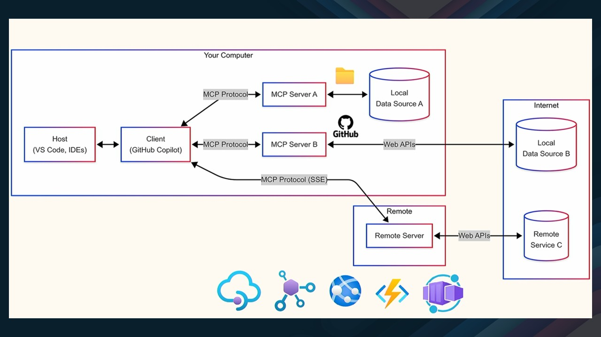

I was recently working on a content discovery app and encountered an annoying problem. The AI component needed access to current Microsoft documentation, but I wasn't keen on scraping their site (and dealing with all that maintenance overhead).

{/* truncate */}

Then I discovered the [Microsoft Learn MCP Server](https://learn.microsoft.com/training/support/mcp?WT.mc_id=AZ-MVP-5004796). Model Context Protocol (MCP) was new to me - it's essentially a standardized method for connecting external data sources to AI applications. Microsoft maintains its own Learn MCP Server, which stays current with its documentation, and this solved my problem perfectly.


The problem was that most [Semantic Kernel](https://learn.microsoft.com/semantic-kernel/overview/?WT.mc_id=AZ-MVP-5004796) examples for [MCP integration](https://learn.microsoft.com/en-us/semantic-kernel/concepts/plugins/adding-mcp-plugins?pivots=programming-language-csharp&WT.mc_id=AZ-MVP-5004796) use Python, but my project is C# (.NET 9). It took a bit of figuring out, but I eventually got it working. Here's the implementation in case it helps someone else.



## Architecture overview

The setup is fairly simple: React frontend → Semantic Kernel backend on [Azure Container Apps](https://learn.microsoft.com/azure/container-apps/overview?WT.mc_id=AZ-MVP-5004796). When users ask questions, SK determines which plugin to use. For Microsoft-related queries, it calls the MCP plugin.

Here's what happens:
1. User: "How do I configure Azure Functions?"
2. SK: "This needs Microsoft docs, let me call the Learn MCP plugin."
3. Learn MCP plugin hits Microsoft's server with the search
4. Fresh documentation comes back
5. SK combines that with its knowledge to answer

```csharp
{
  "MicrosoftLearn": {
    "McpEndpoint": "https://learn.microsoft.com/api/mcp"
  }
}
```
## Implementation

First, add these packages:

```xml
<PackageReference Include="Microsoft.SemanticKernel" Version="1.0.1" />
<PackageReference Include="Microsoft.Extensions.Http" Version="8.0.0" />
```

The other dependencies (`System.Text.Json`, `Microsoft.Extensions.Configuration`, etc.) are likely already in your project.

And the necessary using statements:

```csharp
using System.ComponentModel;
using System.Text;
using System.Text.Json;
using Microsoft.Extensions.Configuration;
using Microsoft.Extensions.Logging;
using Microsoft.SemanticKernel;
```

The plugin class itself is pretty simple - needs an HttpClient and some basic setup:
```csharp
public class MicrosoftLearnMCPPlugin
{
    private readonly HttpClient _httpClient;
    private readonly ILogger<MicrosoftLearnMCPPlugin> _logger;
    private readonly string _mcpEndpoint;
    private readonly JsonSerializerOptions _jsonOptions;
}
```

Constructor just wires up the dependencies:

```csharp
public MicrosoftLearnMCPPlugin(
    HttpClient httpClient,
    ILogger<MicrosoftLearnMCPPlugin> logger,
    IConfiguration configuration)
{
    _httpClient = httpClient;
    _logger = logger;
    _mcpEndpoint = configuration["MicrosoftLearn:McpEndpoint"] ?? "https://learn.microsoft.com/api/mcp";
    _jsonOptions = new JsonSerializerOptions { PropertyNamingPolicy = JsonNamingPolicy.CamelCase };
}
```

## The actual plugin code

This is where it gets interesting. The Learn MCP protocol is just JSON-RPC 2.0 over HTTP, so I built a simple wrapper that Semantic Kernel can call:

```csharp
[KernelFunction("search_microsoft_docs")]
[Description("Searches official Microsoft Learn documentation with language preference support")]
public async Task<string> SearchMicrosoftDocsAsync(
    [Description("Search query")] string query,
    [Description("Max results")] int maxResults = 5,
    [Description("Language locale for localized content (e.g., en-us, es-es, fr-fr)")] string locale = "en-us")
{
    try
    {
        _logger.LogInformation("Searching Microsoft Learn for '{Query}' with locale '{Locale}'", query, locale);

        var request = new
        {
            jsonrpc = "2.0",
            id = Guid.NewGuid().ToString(),
            method = "tools/call",
            @params = new
            {
                name = "microsoft_docs_search",
                arguments = new { query, maxResults, locale }
            }
        };

        var jsonContent = JsonSerializer.Serialize(request, _jsonOptions);
        var content = new StringContent(jsonContent, Encoding.UTF8, "application/json");

        var httpRequest = new HttpRequestMessage(HttpMethod.Post, _mcpEndpoint)
        {
            Content = content
        };
        
        httpRequest.Headers.Accept.Clear();
        httpRequest.Headers.Accept.ParseAdd("application/json");
        httpRequest.Headers.Add("User-Agent", "SemanticKernel-ContentDiscovery/1.0");

        var response = await _httpClient.SendAsync(httpRequest);
        var responseContent = await response.Content.ReadAsStringAsync();

        if (response.IsSuccessStatusCode)
        {
            return responseContent;
        }
        else
        {
            _logger.LogWarning("Learn MCP server returned error {StatusCode}: {Content}", response.StatusCode, responseContent);
            // Note: Return JSON instead of throwing - SK handles this better
            var fallback = new { success = false, error = $"Learn MCP server error: {response.StatusCode}", query = query };
            return JsonSerializer.Serialize(fallback, _jsonOptions);
        }
    }
    catch (Exception ex)
    {
        _logger.LogError(ex, "Error searching Microsoft Learn for '{Query}'", query);
        var fallback = new { success = false, error = ex.Message, query = query };
        return JsonSerializer.Serialize(fallback, _jsonOptions);
    }
}
```

### Getting full pages

Sometimes the search snippets aren't enough, and you need the whole article:

```csharp
[KernelFunction("fetch_microsoft_docs")]
[Description("Fetches full content from a Microsoft Learn documentation page")]
public async Task<string> FetchMicrosoftDocsAsync(
    [Description("URL of the Microsoft Learn page")] string url)
{
    try
    {
        var request = new
        {
            jsonrpc = "2.0",
            id = Guid.NewGuid().ToString(),
            method = "tools/call",
            @params = new
            {
                name = "microsoft_docs_fetch",
                arguments = new { url }
            }
        };

        var jsonContent = JsonSerializer.Serialize(request, _jsonOptions);
        var content = new StringContent(jsonContent, Encoding.UTF8, "application/json");

        var httpRequest = new HttpRequestMessage(HttpMethod.Post, _mcpEndpoint)
        {
            Content = content
        };

        var response = await _httpClient.SendAsync(httpRequest);
        var responseContent = await response.Content.ReadAsStringAsync();

        return response.IsSuccessStatusCode ? responseContent : 
            JsonSerializer.Serialize(new { success = false, error = $"HTTP {response.StatusCode}" }, _jsonOptions);
    }
    catch (Exception ex)
    {
        return JsonSerializer.Serialize(new { success = false, error = ex.Message }, _jsonOptions);
    }
}
```

## Hooking it up

Standard DI registration in `Program.cs`:

```csharp
// Register services
builder.Services.AddSingleton<MicrosoftLearnMCPPlugin>();
builder.Services.AddHttpClient<MicrosoftLearnMCPPlugin>();

// Configure the kernel
builder.Services.AddScoped<Kernel>(serviceProvider =>
{
    var kernel = Kernel.CreateBuilder()
        .AddOpenAIChatCompletion("gpt-4", Environment.GetEnvironmentVariable("OPENAI_API_KEY"))
        .Build();

    // Add the Learn MCP plugin to the kernel
    var mcpPlugin = serviceProvider.GetRequiredService<MicrosoftLearnMCPPlugin>();
    kernel.Plugins.AddFromObject(mcpPlugin, "MicrosoftLearnMCP");

    return kernel;
});
```

## Using it

There are a couple of ways to call this thing:

### Direct invocation

```csharp
// Search for documentation
var searchResult = await kernel.InvokeAsync("MicrosoftLearnMCP", "search_microsoft_docs", 
    new KernelArguments
    {
        ["query"] = "Azure Functions",
        ["maxResults"] = 5,
        ["locale"] = "en-us"
    });

// Fetch a specific page if you need the full content
var fetchResult = await kernel.InvokeAsync("MicrosoftLearnMCP", "fetch_microsoft_docs",
    new KernelArguments
    {
        ["url"] = "https://learn.microsoft.com/en-us/azure/azure-functions/"
    });
```

### Automatic function calling

SK can automatically determine when to use the plugin:

```csharp
var chatHistory = new ChatHistory();
chatHistory.AddUserMessage("I need to learn about Azure Container Apps scaling");

// Enable automatic function calling
var executionSettings = new OpenAIPromptExecutionSettings()
{
    ToolCallBehavior = ToolCallBehavior.AutoInvokeKernelFunctions
};

var response = await kernel.GetRequiredService<IChatCompletionService>()
    .GetChatMessageContentAsync(chatHistory, executionSettings, kernel);

Console.WriteLine(response.Content);
```

### Working with the response

The Learn MCP server sends back JSON that you can parse if you need to do something specific with the results:

```csharp
var searchResult = await kernel.InvokeAsync("MicrosoftLearnMCP", "search_microsoft_docs", 
    new KernelArguments { ["query"] = "Azure Functions" });

// Parse the JSON response
var jsonResponse = JsonSerializer.Deserialize<JsonElement>(searchResult.ToString());

if (jsonResponse.TryGetProperty("result", out var result) && 
    result.TryGetProperty("content", out var content))
{
    var articles = content.EnumerateArray();
    foreach (var article in articles)
    {
        var title = article.GetProperty("title").GetString();
        var url = article.GetProperty("url").GetString();
        Console.WriteLine($"Found: {title} - {url}");
    }
}
```

## What's actually happening on the wire

If you're curious about the protocol details, it's just JSON-RPC 2.0:

### Request Format
```json
{
  "jsonrpc": "2.0",
  "id": "unique-guid",
  "method": "tools/call",
  "params": {
    "name": "microsoft_docs_search",
    "arguments": {
      "query": "Azure Functions",
      "maxResults": 5,
      "locale": "en-us"
    }
  }
}
```

### Response Format
```json
{
  "jsonrpc": "2.0",
  "id": "unique-guid",
  "result": {
    "content": [
      {
        "type": "text",
        "text": "JSON response with search results"
      }
    ]
  }
}
```


## Production notes

### Configuration

Don't hardcode the endpoint URL:

```json
// appsettings.Production.json
{
  "MCP": {
    "MicrosoftLearnEndpoint": "${MCP_MICROSOFT_LEARN_ENDPOINT}",
    "Timeout": "00:00:30",
    "MaxRetries": 3
  }
}
```

### Docker
```dockerfile
# In your Dockerfile
ENV MCP_MICROSOFT_LEARN_ENDPOINT=http://your-mcp-server:3000/mcp
```

### Health checks
Monitor Learn MCP server availability:

```csharp
// In Program.cs
builder.Services.AddHealthChecks()
    .AddCheck<MCPHealthCheck>("mcp-server");

public class MCPHealthCheck : IHealthCheck
{
    private readonly HttpClient _httpClient;
    private readonly IConfiguration _config;
    
    public MCPHealthCheck(HttpClient httpClient, IConfiguration config)
    {
        _httpClient = httpClient;
        _config = config;
    }
    
    public async Task<HealthCheckResult> CheckHealthAsync(
        HealthCheckContext context, 
        CancellationToken cancellationToken = default)
    {
        try
        {
            var endpoint = _config["MCP:MicrosoftLearnEndpoint"];
            using var response = await _httpClient.GetAsync($"{endpoint}/health", cancellationToken);
            
            return response.IsSuccessStatusCode 
                ? HealthCheckResult.Healthy("Learn MCP server is responding")
                : HealthCheckResult.Unhealthy("Learn MCP server returned non-success status");
        }
        catch (Exception ex)
        {
            return HealthCheckResult.Unhealthy($"Learn MCP server check failed: {ex.Message}");
        }
    }
}
```

## Real-world usage

Example query: *"How do I scale my Azure Functions based on queue length?"*

What happens:
1. SK identifies this as an Azure Functions question
2. Calls the Learn MCP plugin to search for current scaling documentation
3. Returns up-to-date information from Microsoft Learn
4. Combines this with the model's existing knowledge

This ensures users get current information rather than potentially outdated training data.


## Wrapping up

This turned out simpler than expected. No scraping, no stale docs, no index maintenance - just direct access to Microsoft's current documentation through their Learn MCP server.

To learn more about Microsoft Learn MCP Server and its capabilities, visit [https://aka.ms/MSLearnMCPServer](https://aka.ms/MSLearnMCPServer).

Beyond my content discovery use case, this approach works well for:
- Support chatbots needing current Azure documentation
- Internal developer tools
- Learning applications requiring up-to-date tutorials
- Any AI system working with Microsoft technologies

The Learn MCP ecosystem is growing, and I expect more providers will adopt it. The protocol's simplicity enables the support of multiple MCP servers within a single application.

For applications requiring Microsoft documentation, this approach is more reliable than scraping or maintaining local caches. The implementation above should provide a solid foundation for further development.


