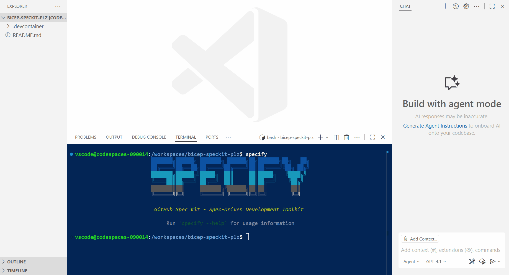
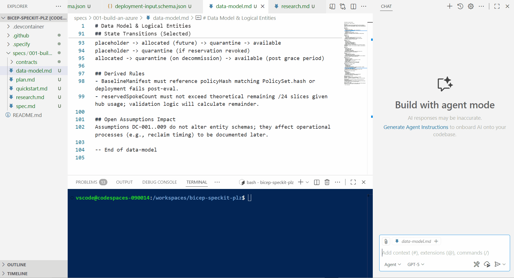

Today, we are going to look at some of the practicalities of Spec Kit and use Spec-Driven Development to create a [Platform Landing Zone](https://learn.microsoft.com/azure/cloud-adoption-framework/ready/?WT.mc_id=AZ-MVP-5004796#platform-landing-zone) aligned to the [Microsoft Cloud Adoption Framework](https://learn.microsoft.com/azure/cloud-adoption-framework/overview?WT.mc_id=AZ-MVP-5004796), using [Bicep](https://learn.microsoft.com/azure/azure-resource-manager/bicep/overview?tabs=bicep&WT.mc_id=AZ-MVP-5004796) as the Infrastructure as Code.

{/* truncate */}

:::info
[GitHub Spec Kit](https://github.com/github/spec-kit) brings a new approach to AI-based software development workflows – instead of vibe coding every new feature and bug fix, teams can preemptively outline the concrete project requirements, motivations, and technical aspects before handing that off to AI agents and have them build exactly what was needed in the first place. If you’ve ever worked with product managers who had to put together Product Requirements Documents (PRDs) that need to be reviewed and then implemented, you might hear some echoes of a familiar process.

Spec-Driven Development, or SDD, is not about writing exhaustive, dry requirements documents that nobody reads. It’s also not about waterfall planning or trying to predict the future through extensive planning exercises. And it’s definitely not about creating more bureaucracy that slows down engineering teams.

SDD is about making your technical decisions explicit, reviewable, and evolvable. Think of it as version control for your thinking. Instead of having crucial architectural decisions trapped in email threads, scattered documents, or locked in someone’s head, you capture the "why" behind your technical choices in a format that can grow with your project and your understanding of the problem space.

Spec-Driven Development (SDD) is a software development approach in which detailed, structured specifications are created first and serve as the single source of truth to guide the entire development process—from planning and design to implementation and testing. This method replaces ambiguity and disparate requirements with precise, executable specifications, which can now be utilized by AI agents to automatically generate working code, tests, and documentation, resulting in greater precision and efficiency. 

You can read more about Spec Kit and Spec-Driven Development [here](https://github.com/github/spec-kit/blob/main/spec-driven.md).
:::

So let's get started.

## 🚀 Getting Started with Spec Kit

First, we need to install Spec Kit. I will be running this from a devcontainer, but you can install the [Specify CLI](https://github.com/github/spec-kit#1-install-specify) directly on your machine if you prefer, or copy the files from the latest set of Releases [github/spec-kit](https://github.com/github/spec-kit/releases). The CLI is not required, but it does help you bootstrap, access the latest prompts, and verify that all necessary dependencies (i.e., you're using the proper IDE and git initialization) are in place.

Spec Kit is a collection of prompts and workflows that guide you through the Spec-Driven Development process. It utilizes AI to assist you in creating and managing specifications, plans, and tasks for your software projects.

### 🛠️ Spec Kit Commands Overview

| Command | Description | Why It's Needed |
|---------|-------------|-----------------|
| `/constitution` | Create or update project governing principles and development guidelines | Establishes immutable architectural principles (9 articles) that ensure consistency, simplicity, and quality across all generated code. Acts as the "DNA" of your project, preventing over-engineering and maintaining architectural integrity. |
| `/specify` | Define what you want to build (requirements and user stories) | Transforms vague feature ideas into comprehensive, structured specifications with automatic repository management. Creates feature branches, proper directory structure, and complete PRDs with user stories and acceptance criteria - focusing on WHAT and WHY, not HOW. |
| `/clarify` | Clarify underspecified areas (must be run before /plan unless explicitly skipped) | Identifies and resolves ambiguities marked with `[NEEDS CLARIFICATION]` tags in specifications. Prevents AI from making incorrect assumptions and ensures all requirements are explicitly defined before technical planning begins. |
| `/plan` | Create technical implementation plans with your chosen tech stack | Converts business requirements into detailed technical architecture and implementation details. Generates supporting documents (data models, API contracts, test scenarios) while ensuring constitutional compliance and architectural principles are followed. |
| `/tasks` | Generate actionable task lists for implementation | Analyzes the implementation plan and converts it into specific, executable tasks. Identifies parallel work streams and creates a structured roadmap that maps directly from specifications to concrete development actions. |
| `/analyze` | Cross-artifact consistency & coverage analysis (run after /tasks, before /implement) | Validates consistency across all specification artifacts, identifies gaps or contradictions, and ensures complete coverage of requirements before implementation begins. Acts as a quality gate to prevent specification drift. |
| `/implement` | Execute all tasks to build the feature according to the plan | Generates working code from the specifications and implementation plans. Follows test-first development (Article III), creates modular libraries (Article I), and ensures all code aligns with the established constitutional principles. |

We will go through the process of creating a new project, defining the constitution, specifying what we want to build, planning the technical implementation, generating tasks, analyzing for consistency, and finally implementing the code for a Platform Landing Zone.

I love that specification development is front and centre, and that the process encourages you to think about the "why" and "what" before jumping into the "how". This is a great way to ensure that the result is actually what was needed, and not just what was easy to implement, so let's get started.

## 🏗️ Project Initialization

First, we will initialize our project and create our constitution. The model I will be using throughout this post is GPT-5, specifically for spec-driven development. When it comes to implementation, we will proceed with GPT-5-Codex.

```bash
specify init .
```



## 📜 Creating the Project Constitution

Now that we have initialized our project, we can create our constitution. The constitution is a set of guiding principles that will govern the development of our project. It is essential to get this right, as it will be used throughout the rest of the process to ensure that all generated code adheres to these principles.

```txt
/constitution create governing principles and development guidelines, a constitution for a new project that will be an Azure Platform Landing Zone aligned to the Microsoft Cloud Adoption Framework (https://learn.microsoft.com/azure/cloud-adoption-framework/ready/landing-zone/design-principles?WT.mc_id=AZ-MVP-5004796), using Bicep as the Infrastructure as Code language. The constitution should include principles for modularity, reusability, security, compliance, and best practices for Azure and Bicep development. The principles should be clear, concise, and actionable, providing a solid foundation for the project's architecture and implementation, while also acknowledging the complexity of Day 2 operations.
```


## 📋 Defining the Specification

A constitution has been generated, covering the following principles, Modular & Composable, Reusability and Idempotent deployments, Security by design, Compliance and governance, Day 2 operations and observability, Resilience and Recovery, Cost Optimization and sustainability, version and change control, testing and validation shift left and documentation and discovery - some of the main principles, when looking at a Platform Landing Zone project. If needed, we can edit the constitution, but this looks good to me, so let's move on to specifying what we actually want to build.

```txt
/specify build an Azure Platform Landing Zone that will be deployed with Azure Bicep and Azure DevOps pipelines. The Landing Zone will use an Azure Firewall, with Hub and Spoke networking (/16 for the entire region) and will be deployed to the New Zealand North Azure region. Although not in the scope of the build, we need to make sure that the Platform Landing Zone will easily allow the addition of Application Landing Zones in the future.
```


We can see that it ran a bash script to create a new branch and switch to it, allowing us to start making changes without affecting the master branch. A spec file has been created for 'our feature', which in this case is an Azure Platform Landing Zone. The spec file contains a high-level description of what we want to build, as well as user stories and acceptance criteria. We can edit the spec file if needed.

Our Primary user story is:

> As a Cloud Platform (central) engineering team member, I need a standardized, governed, regionally-scoped Azure Platform Landing Zone with secure hub-and-spoke networking and central firewall controls so that future application teams can onboard rapidly, safely, and consistently without re‑implementing foundational services.

With an acceptance scenario of:

> **Given** the platform team triggers the automated infrastructure deployment pipeline with an approved specification, **When** the pipeline completes, **Then** the foundational platform resources (management groups scope, hub VNet, spoke placeholder structure, firewall, policies, tagging baseline, address space reservation) are provisioned in the New Zealand North region successfully in a single execution.

:::note
It's worth noting that nothing has been actually created yet, ie, no Bicep etc - this is the benefit of the Spec-Driven Development approach, we are focusing on the "what" and "why" before the "how", and it helps us flesh out the actual requirements.
:::

It looks good enough to me, but there are areas that still need to be clarified, if we search for [NEEDS CLARIFICATION] we can see that there are a few areas that need to be clarified before we can move on to planning the technical implementation.

## 🔍 Clarifying Requirements

This is great, as it ensures that we have a clear understanding of what we want to build before we start planning the technical implementation, and gaps we may have missed or need a decision on, a few highlighted areas in my example are:

* How many future applications should speak to Virtual Networks be considered in the future, to ensure no overlapping address spaces are used?
* What are the logging and monitoring requirements and retention for the Azure Firewall?
* What is the validation process for any Firewall policy changes?

We can edit the spec.md file to add more details, or we can use the `/clarify` command to have the AI help us clarify these areas before we proceed to the Plan stage, which is what we will do.

```txt
/clarify
```

The clarity process gives us a great multi-turn conversation, where we can answer the questions, and the AI will update the spec.md file with the answers. This is a great way to ensure that we have a clear understanding of what we want to build before we start planning the technical implementation, and in some cases, it may even highlight areas we hadn't thought of.


We can continue the clarification process and flesh out the details and potential edge cases, working on some of the low-impact or optional areas later. However, for this Platform Landing Zone, we have enough information to move on to the planning stage.

## 🎯 Technical Planning

```txt 
/plan
```

Plan now will read the constitution, and spec and check if there are any last decisions or clarification needed, and then it will create a technical implementation plan, data models, contracts, and test scenarios. The plan will be created in a new branch, and a PR will be created to merge the plan into the spec branch.

There were some decisions still left, around the timeline of a potential second region, etc, but I proceeded with the Plan by just proceeding without clarification.

We can see the plan.md file has been created, along with a data-models.md file, research.md file, containing the high-level technical approach based on the spec and constitution.

The plan will also contain, assumptions, folder and file structure it will aim to create, a research.md file will be created, with additional research that was done to create the plan, and a data-models.md file will be created, with any data models that were created as part of the plan, ie, for resource diagnostics, should a Bicep module be created, with a diagnostic baseline for firewall, vnet logs over an alternative decision, such as Event Hub export, or the policies to include in the platform landing zone baseline. The data-model.md will contain entitites or data related to the project, and any relationships between them, in our case it contains the entities fields around the Virtual Network address spaces.


:::note
It's still worth noting that no Bicep has been created yet; we are still in the planning stage, and this is a great way to ensure that we have a clear understanding of what we want to build before we start implementing the technical solution. The next step is to generate the tasks, which will break down the plan into actionable tasks, which will then be implemented.
:::

## ✅ Breaking Down Into Tasks

The next stage is to create the tasks, which will break down the plan into actionable tasks.

* Entities → model/module creation tasks
* Schemas → contract validation & test tasks
* Quickstart scenarios → integration test scaffolding
* Constitution principles → quality gates (lint, what-if, policy eval scripts) tasks

```txt
/tasks
```



A tasks.md file has been created, with a list of tasks that need to be completed in order to implement the plan. The tasks are broken down into sections, based on the plan, and each task has a description and acceptance criteria. One thing worth noting is that Spec Kit and generative AI like Tests! Even for this scenario, where we are creating a Platform Landing Zone, there are still tasks around creating test scenarios and test scaffolding, which we may not necessarily need, so now is the time to strip this out, make any final adjustments, and verify that the Tasks that will be completed are what we wanted.

## 🔬 Analyzing for Consistency

Before we proceed to the implementation stage, we can run the analyze command, which will check for consistency across all artifacts and ensure that there are no gaps or contradictions in the specifications, useful if you have run through this in multiple sittings or have adjusted the spec or plan files manually.

```txt
/analyze
```


We can see there is a lot of ambiguity in our spec, ie we have specified a specific region 'New Zealand North' but not specified any Disaster Recovery requirements, or disallowed Resource Type policy will be deployed, but we haven't specified what resources will be allowed, and one of our considerations was 'Cost Optimization and sustainability' but we haven't specified any cost constraints or budget criteria.

For Production use cases, it's worth addressing these areas. However, for this post, we will proceed to the implementation stage, and I will utilize generative AI to provide the best recommendations for these areas by suggesting concrete remediation for any reported issues.


:::warning
Now is the time to make any final adjustments to the spec, plan, or tasks before we proceed to the implementation stage. Once we proceed with implementation, we will generate code based on the functions, so the tasks must be accurate and complete. Now is also the time to confirm the details, i.e., can all resources that will be created based on the Task actually be deployed in the New Zealand North region? For this specific use case, I could have consulted the [Microsoft Learn MCP Server](https://learn.microsoft.com/training/support/mcp?WT.mc_id=AZ-MVP-5004796) throughout the process to verify and confirm, thereby utilizing relevant MCP servers and tools as needed to incorporate external knowledge or functionality. Spec Kit is not perfect, and it will make mistakes, so its important to review and verify the output at each stage, it also does not replace the need to understand what you are building and why you are building it - but it does help to go into the detail, in my opinion its a great assistance _(or Copilot)_ in building out and working on the functionality of what you are building, and considering the end to end functionality of that project or feature you are building, in my opinion you will get more out of it for a specific feature or function, rather than something like this, but it is still a great way to ensure that you have a clear understanding of what you want to build before you start implementing the technical solution and give you the base to then work towards and build out further features - the trick is not to over complicate what you are doing and scope it, the artifacts that Spec Kit generates can be used to tell the story of your project and allow for further modernisation and capability uplift going forward without losing the context that may have been in that one architects mind!
:::

## 💻 Implementation Phase

Now, let's proceed to the implementation stage, where we will generate the Bicep code.

```txt
/implement
```

We can see it break down the tasks into creating the scaffold for Infrastructure as Code, creating the Bicep modules, creating the Bicep main files, creating the Azure DevOps pipelines, and creating the documentation. Remember, all of this is being generated based on the tasks, which were generated based on the plan, which was generated based on the spec, which was generated based on the constitution and your requirements.


## 📁 Examining the Generated Bicep Code

Now, let's take a look at the Bicep it created.


We can see that it has created a Bicep module for the Virtual Network, and a Bicep module for the Azure Firewall, and policies, however its missing Management Group structure, because we haven't specified any management group policies or structure in our spec, which would have been discovered as part of the earlier phases, another thing is - Azure Verified Modules were not used! This is because, as part of the Test phase, it was designated to create a runnable/lintable skeleton quickly, rather than working with the overhead of pulling in external modules.

Long story short, its given me enough of a scaffold to then work from, and I can then go in and adjust the Bicep to use Azure Verified Modules, and add in any additional functionality or configuration that I need, in these cases I would use Spec Kit to focus my attention on the feature enhancements I want to make, vs entirely doing it all from scratch, because we have the constitution already defined, I can now merge my changes from the Bicep scaffold, then use Spec Kit to jump straight into Specify to add the new features I want, and then use the rest of the Spec Kit workflow to implement those changes, and keep the constitution and spec up to date as we work on it.

## 🎓 Lessons Learned and Improvements

If I were to repeat this process from scratch _(outside of this blog article use case where I would take my time to really use Spec Driven Development)_, here are some of the things I would do differently:

* Strengthen the spec.md file, to ensure that all requirements are explicitly defined, and there is less need for clarification _(ie, include Management Group, desired parent-child relationships - this could even have been helped by taking a screenshot of the Enterprise Scale Landing Zone diagram and feeding that into the GitHub Copilot to help draft my spec).
* Be more specific, ie, "ALL Bicep modules must use Azure Verified Modules where possible and make sure they are pinned to a specific version," or "Generate tenant-scope template for management groups before subscription templates," and "declare pipeline stages, safe deployment practices".
* Adding a policy strategy _(ie policy initiatives deployed to management scope scope, vs subscription assignments)_ 
* Remove the need for Tests, or be more specific in the Tests I need (ie, AVM version and retrieval tests, bicep build).
* Reduce Placeholder Debt - ie, I could have specified the exact resources I wanted to create, and the naming conventions, tags, and other configuration details, so there was less need for me to go in and adjust the Bicep after it was generated. If something was a placeholder or not clearly defined in the Research, I could have specified in the Tasks to clean these up at the end.

## 🎯 Conclusion

Hopefully this has given you a good overview of how to use Spec Kit and Spec-Driven Development to create a Platform Landing Zone using Bicep, and how it can help you to focus on the "what" and "why" before the "how", and ensure that you have a clear understanding of what you want to build before you start implementing the technical solution, and some of the gotchas if you don't - in my mind Spec Development is an iterative process, and fast-tracks a lot of the design decisions you would need to make anyway, or know about but may not have documented.
