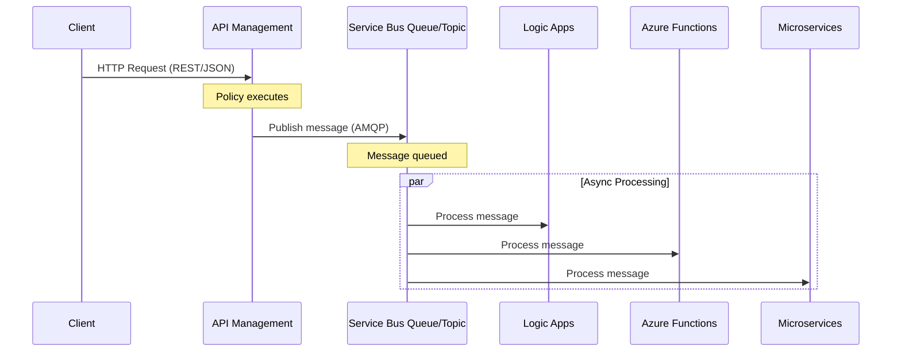
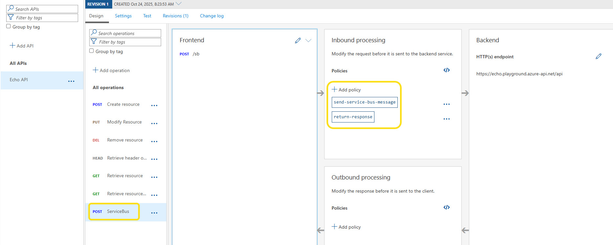
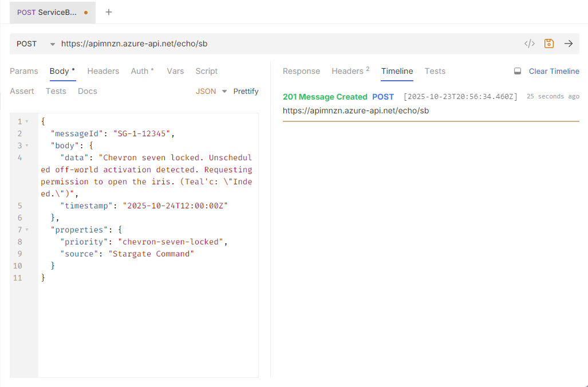
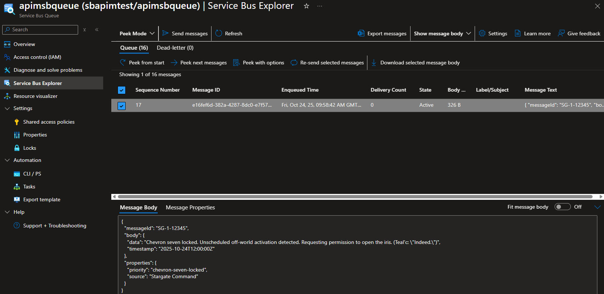
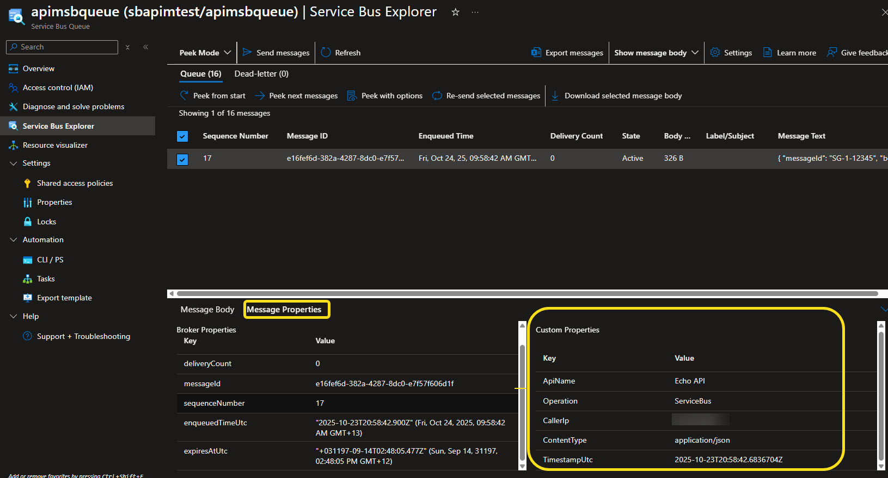

Recently Microsoft announced [native Service Bus message publishing from Azure API Management](https://techcommunity.microsoft.com/blog/integrationsonazureblog/introducing-native-service-bus-message-publishing-from-azure-api-management-prev/4462644?WT.mc_id=AZ-MVP-5004796), today we are going to take a look at this new feature and see how we can use it to publish messages AMQP _(Advanced Message Queuing Protocol)_ to an Azure Service Bus queue or topic directly through an API Management endpoint, without needing middleware to do a transform for you -  allowing external systems and mobile apps that lack native AMQP support can send messages to Service Bus by using standard HTTP/REST APIs via API Management.

{/* truncate */}

:::info
A client sends a standard HTTP request to your API endpoint in API Management. 
The policy executes and sends the payload as a message to the Service Bus. 
Downstream consumers such as Logic Apps, Azure Functions, or microservices process those messages asynchronously. 



All configurations happen in API Management - no code changes or new infrastructure are required.  
:::

The resources I am using for this test are as follows:

* API Management _(Developer tier)_
* Azure Service Bus Namespace with a Queue

These resources were created in the New Zealand North Azure region.

The API Management instance has System Managed identity enabled, and that identity has been granted the `Azure Service Bus Data Sender` role on the Service Bus namespace.

So let us test this out, in my test I have the default `Echo API` enabled in API Management, have created a new API operation called `ServiceBus`, this operation will accept a POST request with a JSON payload, and then publish that payload to the Service Bus queue _(its worth noting there is no backend required for this endpoint as the policy does the heavy lifting here)_.



The policy I have applied to this operation is as follows:

```xml
<!--
    - Policies are applied in the order they appear.
    - Position <base/> inside a section to inherit policies from the outer scope.
    - Comments within policies are not preserved.
-->
<!-- Add policies as children to the <inbound>, <outbound>, <backend>, and <on-error> elements -->
<policies>
    <!-- Throttle, authorize, validate, cache, or transform the requests -->
    <inbound>
        <send-service-bus-message queue-name="your-queue" namespace="your-namespace.servicebus.windows.net">
            <message-properties>
                <message-property name="ApiName">@(context.Api?.Name)</message-property>
                <message-property name="Operation">@(context.Operation?.Name)</message-property>
                <message-property name="CallerIp">@(context.Request.IpAddress)</message-property>
                <message-property name="ContentType">@(context.Request.Headers.GetValueOrDefault("Content-Type","application/json"))</message-property>
                <message-property name="TimestampUtc">@(DateTime.UtcNow.ToString("o"))</message-property>
            </message-properties>
            <payload>@(context.Request.Body.As<string>(preserveContent: true))</payload>
        </send-service-bus-message>
        <return-response>
            <set-status code="201" reason="Message Created" />
        </return-response>
    </inbound>
    <!-- Control if and how the requests are forwarded to services  -->
    <backend />
    <!-- Customize the responses -->
    <outbound />
    <!-- Handle exceptions and customize error responses  -->
    <on-error>
        <base />
    </on-error>
</policies>
```

Note the queue-name and namespace attributes in the `<send-service-bus-message>` policy; these need to match your Service Bus queue name and namespace. You can also add a connection-string attribute if you want to use a specific connection string rather than the managed identity.

You can read more about it here: [Send service bus message](https://learn.microsoft.com/azure/api-management/send-service-bus-message-policy?WT.mc_id=AZ-MVP-5004796).

Now we can test this out. I am using Bruno to send a POST request to the API Management endpoint with a sample JSON payload:

```json
{
  "messageId": "SG-1-12345",
  "body": {
    "data": "Chevron seven locked. Unscheduled off-world activation detected. Requesting permission to open the iris. (Teal'c: \"Indeed.\")",
    "timestamp": "2025-10-24T12:00:00Z"
  },
  "properties": {
    "priority": "chevron-seven-locked",
    "source": "Stargate Command"
  }
}
```



We can see the message was accepted with a `201 Message Created` response, and if we check the Service Bus queue, we can see the message has arrived successfully:



If we navigate to the Message Properties, we can see the custom properties we added in the policy have been applied to the message:



From there, you can easily have downstream consumers such as Logic Apps, Azure Functions, or microservices process those messages.
