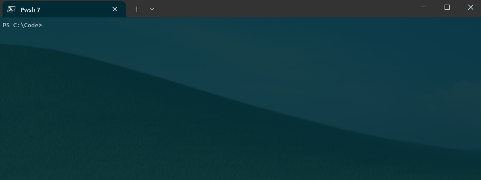
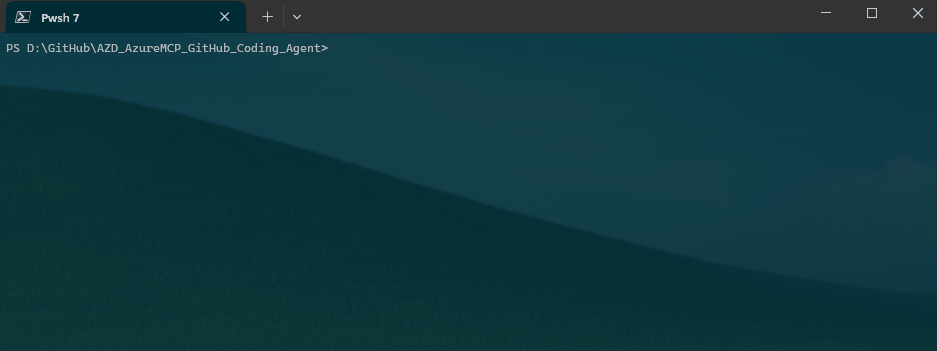
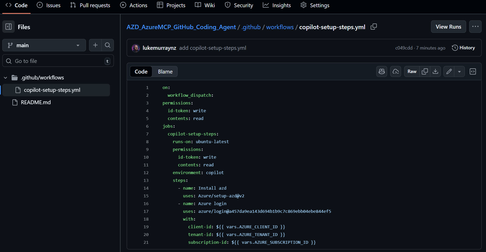
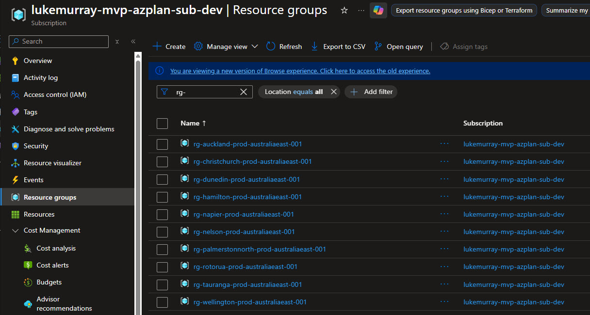
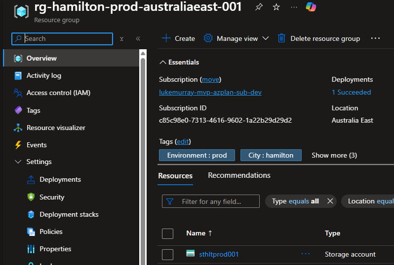

I've blogged and talked about [Azure Developer CLI](https://learn.microsoft.com/azure/developer/azure-developer-cli/overview?tabs=windows&WT.mc_id=AZ-MVP-5004796) before, but this time, I will touch on a functionality as part of the `azure.coding-agent` extension.

This extension automates the deployment and configuration to allow the GitHub Copilot Coding Agent access to Azure resources directly through the use of the [Azure MCP Server](https://learn.microsoft.com/azure/developer/azure-mcp-server/overview?WT.mc_id=AZ-MVP-5004796) .

{/* truncate */}

> The extension creates the managed identity, configures the federated credential, and sets up the GitHub Actions workflow in your repository.

You will need to clone the GitHub repository you want the GitHub Coding Agent to access Azure resources from. In my example, I have: [AZD_AzureMCP_GitHub_Coding_Agent](https://github.com/lukemurraynz/AZD_AzureMCP_GitHub_Coding_Agent).
You will also need to have the [Azure Developer CLI](https://learn.microsoft.com/azure/developer/azure-developer-cli/overview?tabs=windows&WT.mc_id=AZ-MVP-5004796) installed and authenticated to your Azure subscription.

First things first - install the `azure.coding-agent` extension for AZD. Make sure you are running the latest version of Azure Developer CLI, ie to upgrade on your Windows host try: `winget upgrade Microsoft.Azd`.

```bash
azd extension install azure.coding-agent
```


Next, navigate to your cloned GitHub repository and run the following command to configure the GitHub Coding Agent with Azure MCP Server:

```bash
azd coding-agent config
```

The AZD Coding Agent configuration process will prompt and help you set up the following:

* Azure Authentication: verify your Azure login and select a subscription
* Repository Selection: Choose the GitHub repository remote for the coding agent
* Managed Identity: create a new user-assigned managed identity or select an existing one
* Resource Group: create a new resource group or use an existing one
* Role Assignment: configure RBAC roles (defaults to Reader, fully configurable)
* Git Operations: create a branch and push the necessary workflow files
* MCP Server: copy MCP JSON output to GitHub Copilot coding agent settings

Things to note: 

* The configuration sets up least privilege access by default, ie, Reader.
* Passwordless authentication by using OpenID Connect federated credentials
* No secrets stored in GitHub
* Automatic token refresh is configured through the Azure identity platform



If we check the Azure environment, we can see that the Managed Identity has been created and assigned the Reader role to the selected Resource Group.


On GitHub, we can see that a new Environment named 'copilot' has been created, with 3 variables.

* AZURE_CLIENT_ID
* AZURE_SUBSCRIPTION_ID
* AZURE_TENANT_ID

And a new branch is ready to create a Pull Request with the GitHub Actions workflow file to enable the GitHub Copilot Coding Agent to use Azure resources.



Finally, we need to manually copy the MCP Server JSON output from the AZD CLI and paste it into the GitHub Copilot Coding Agent settings for the repository.

```json
{
    "mcpServers": {
        "Azure": {
            "type": "local",
            "command": "npx",
            "args": [
                "-y",
                "@azure/mcp@latest",
                "server",
                "start"
            ],
            "tools": [
                "*"
            ]
        }
    }
}
```


Now we are all set to use the GitHub Copilot Coding Agent with Azure resources in our repository. The User Assigned Managed identity only has Reader access to the specific Resource Group by default, so you may need to adjust the role assignments based on your requirements. You can apply different roles at the time of configuration by using the `--roles` parameter with the `azd coding-agent config` command.

For the purposes of this demo, I have granted the Managed Identity Owner access to the Subscription to allow the Coding Agent to create resources. Please do not do this in production environments.

We can see that once we assign the Issue, Copilot will authenticate with Azure using the Azure MCP Server and begin processing the request.

In my example, I have prompted Copilot to create Resource Groups based on the names of cities in New Zealand, and a Storage account inside each Resource Group—the Azure MCP Server running all necessary tools. In this case, it created Bicep files based on my request, and a deployment script to do the deploy.


I forgot to configure the Firewall settings for the GitHub Runner and Coding Agent to communicate with the Azure Management endpoints, so although it configured and validated the Bicep files, it didn't deploy them. After enabling it, I can add a comment to the Pull Request to do just that.

We can see that it triggers the Azure CLI to start the deployment of the bicep files created by the previous step, if we navigate to Azure, we can see a Deployment has begun, and GitHub Coding Agent does validation of the deployment.


And finally, we can see the resources in the Azure subscription:





Hopefully this gives you a good overview of how to get started with the Azure Developer CLI `azure.coding-agent` extension to enable the GitHub Copilot Coding Agent to access Azure resources securely and efficiently, in my article I showcased how I could use to generate and deploy resources directly in Azure, however this opens up a lot of possibilities for automating and streamlining your Azure development workflows using AI-powered assistance, and can factor in scenarios such as infrastructure as code generation of existing resources, Azure resource reviews, and even troubleshooting assistance directly within your development environment.

Please be sure to follow best practices for security and access management when configuring the managed identity and role assignments to ensure that your Azure resources remain secure while leveraging the capabilities of the GitHub Copilot Coding Agent. You don't want to give this agent more permissions than it needs for the tasks at hand! Remember to monitor and audit the Coding Agent's activities to maintain compliance and security in your Azure environment.

> And remember, "with great power comes great responsibility!"
