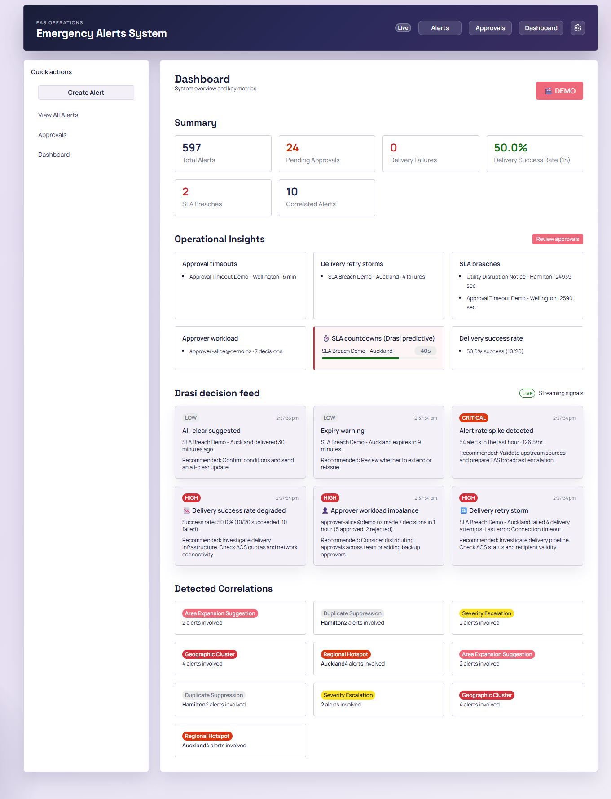
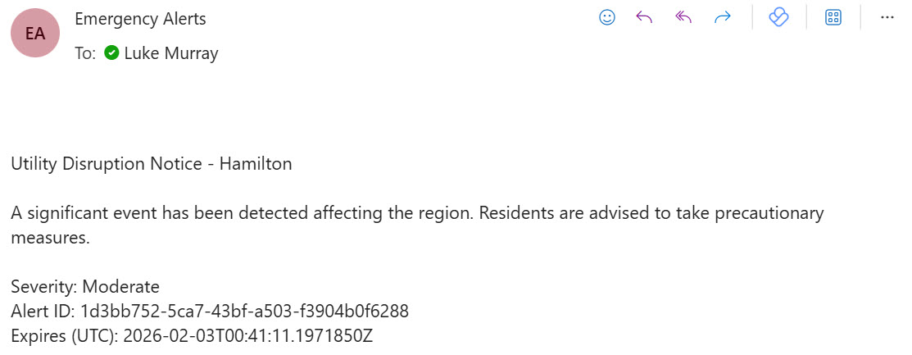
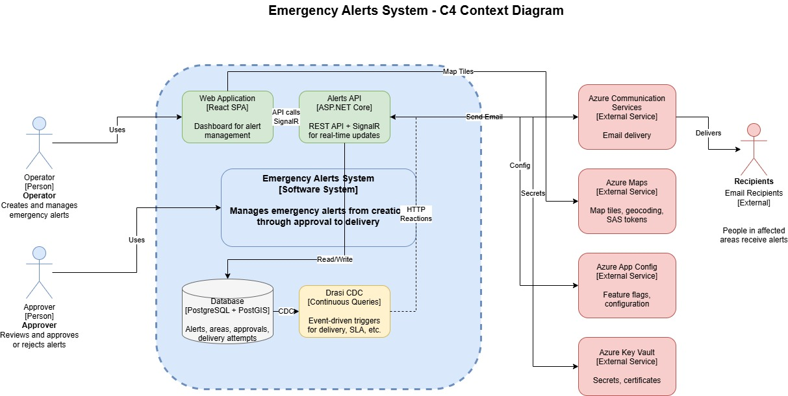
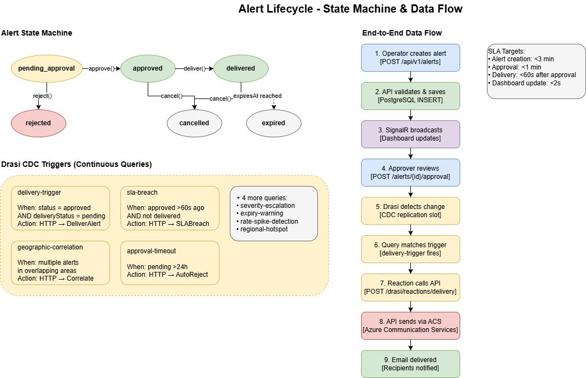
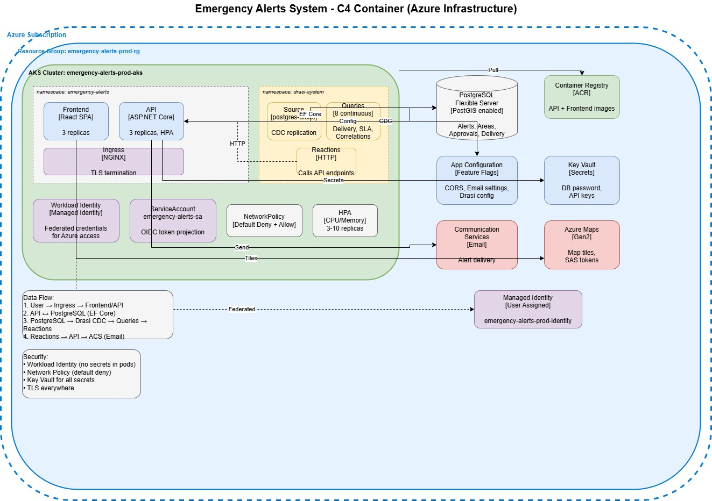
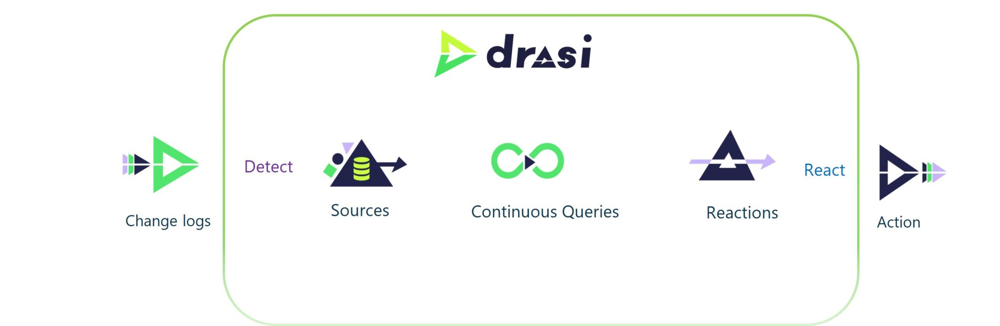
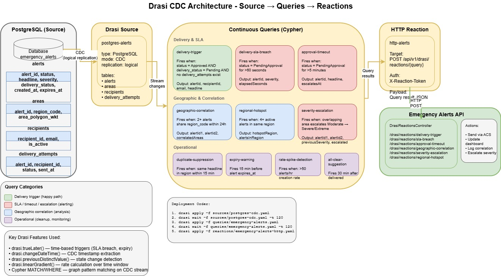

Today, we are going to look at building an Emergency Alert System on Azure using Drasi for reactive data processing. This proof of concept explores how change-driven architecture can power real-time alert workflows - from operator creation through approval to delivery.

The United Kingdom (UK) government has an [open-code policy](https://github.com/alphagov), where a lot of code is published publicly. It's a great resource to discover how solutions are built and what's possible with automation. It's definitely been a resource I have leveraged previously as a reference point, even for non-government services I have worked on.

I came across an Emergency Alert System repository, and indications seemed to point to the fact this system ran on (or had some dependencies with) AWS. So I thought to myself - what could this look like if it ran on Azure? I built a proof of concept to find out.

{/* truncate */}

:::tip Source Code
The complete solution is available on GitHub: [lukemurraynz/EmergencyAlertSystem](https://github.com/lukemurraynz/EmergencyAlertSystem)
:::



While the proof of concept doesn't include broadcast functionality, I did consider [Azure Notification Hubs](https://learn.microsoft.com/azure/notification-hubs/notification-hubs-push-notification-overview?WT.mc_id=AZ-MVP-5004796). I linked it to Azure Communication Services to send emails for any approved alert:



This system follows the [Common Alerting Protocol (CAP)](https://en.wikipedia.org/wiki/Common_Alerting_Protocol) for events. A key differentiator is the [Drasi](https://drasi.io/) integration, intended to showcase a more proactive approach to alert management. Let's take a closer look at the context of this solution.

:::info
This is a proof of concept intended to demonstrate architectural patterns - it's not production-ready. Authentication is mocked, and there's no actual broadcast functionality to mobile devices.
:::

## Solution Overview



Operators connect to a frontend (running React with Fluent UI) where they can see a list of all current alerts - whether approved for delivery or already delivered. They also have the ability to create new alerts based on a geographical area through the selection of a polygon. The official CAP schema supports this, including geocode. The map is delivered through [Azure Maps](https://learn.microsoft.com/azure/azure-maps/about-azure-maps?WT.mc_id=AZ-MVP-5004796) to the frontend and stored in a PostgreSQL + PostGIS database.


### Continuous Queries with Drasi

The PostgreSQL database becomes the source for Drasi, which runs continuous queries for changes in events such as:

- Geographic Correlation - Multiple alerts occurring in the same region within 24 hours
- Approval Timeout - Alerts awaiting approval for more than 5 minutes (escalation)
- Duplicate Suppression - Detecting duplicate alerts with same headline in same region within 15 minutes
- Approver Workload Monitor - Detecting high workload on individual approvers (5+ decisions/hour)
- Delivery Success Rate - Monitoring when delivery success rate drops below 80%
- Delivery SLA Breach - Alerts stuck in PendingApproval status exceeding 60 seconds

Once these continuous queries detect matching conditions, Drasi triggers HTTP Reactions that call back to the Emergency Alerts API. The API can then notify operators of concentrated emergency activity. You could easily extend this to run additional workflows - for example, redistributing approval queues, alerting supervisors, or escalating alerts to secondary approvers. The queries handle most of the logic here.

Once an alert is approved, it sends notifications to recipients. In my case, this is email via Azure Communication Services, but you could expand this. The delivery settings are held in [Azure Application Configuration](https://learn.microsoft.com/azure/azure-app-configuration/overview?WT.mc_id=AZ-MVP-5004796), allowing me to change recipients on the fly without modifying the backend or frontend code.

### Alert Lifecycle

Alerts follow a defined state machine that enforces valid transitions and prevents race conditions. The lifecycle looks like this:

```
Create → PendingApproval → Approved → Delivered
                ↓              ↓
            Rejected      Cancelled
                               ↓
                            Expired
```



**State Transitions:**

- **PendingApproval** - Initial state when an operator creates an alert with headline, description, severity, channel, geographic areas, and expiry time
- **Approved** - An approver reviews and approves the alert for delivery
- **Rejected** - An approver rejects the alert with a mandatory reason
- **Delivered** - The alert has been successfully sent to recipients via Azure Communication Services
- **Cancelled** - An operator cancels an approved or delivered alert to stop further processing
- **Expired** - The alert has passed its expiry time and is no longer active

The domain model enforces these transitions. For example, you can only approve an alert that's in `PendingApproval` status and hasn't expired. Cancel operations require a valid ETag header to prevent race conditions - if another user has modified the alert since you loaded it, the cancel will fail with a `409 Conflict`.

:::note
The state machine pattern is critical here - Drasi watches for state transitions, not just data changes. This is what enables the reactive workflows.
:::

This state machine is what Drasi watches. When an alert transitions to `Approved` with `DeliveryStatus = Pending`, the `delivery-trigger` query fires. When an alert sits in `PendingApproval` for too long, the `delivery-sla-breach` query kicks in. The state machine and Drasi work together to drive the workflow.

## Azure Infrastructure



Deployed via GitHub Actions, the proof of concept runs everything on a single [Azure Kubernetes Service](https://learn.microsoft.com/azure/aks/what-is-aks?WT.mc_id=AZ-MVP-5004796) cluster, which at the time of writing was required for Drasi.

### Kubernetes Namespaces

The workloads are separated by namespaces:

**emergency-alerts namespace**:

- Frontend (React SPA with Fluent UI 9) - 2 replicas with HPA scaling to 5, served via NGINX
- API (ASP.NET Core on .NET 10) - 3 replicas with HPA scaling to 10 based on CPU/Memory
- ServiceAccount (emergency-alerts-sa) with OIDC token projection for Workload Identity
- NetworkPolicy configured as default-deny with explicit allow rules for frontend→API and drasi-system→API communication

**drasi-system namespace**:

- [Source](https://drasi.io/concepts/sources/) (postgres-cdc) - CDC replication from PostgreSQL Flexible Server
- [Continuous Queries](https://drasi.io/concepts/continuous-queries/) (11) - Monitoring delivery triggers, SLA breaches, approval timeouts, geographic correlations, regional hotspots, severity escalations, duplicate suppression, area expansion suggestions, all-clear suggestions, expiry warnings, and rate spike detection
- [Reactions](https://drasi.io/concepts/reactions/) (HTTP) - Calling back to the API's `/api/v1/drasi/reactions/{query}` endpoints when query conditions match

### External Azure Services

The following Azure services are used external to AKS:

- [PostgreSQL Flexible Server](https://learn.microsoft.com/azure/postgresql/overview?WT.mc_id=AZ-MVP-5004796) - PostGIS enabled, logical replication configured for Drasi CDC
- [Azure Container Registry (ACR)](https://learn.microsoft.com/azure/container-registry/container-registry-intro?WT.mc_id=AZ-MVP-5004796) - Hosting API and Frontend container images
- [App Configuration](https://learn.microsoft.com/azure/azure-app-configuration/overview?WT.mc_id=AZ-MVP-5004796) - Feature flags, CORS settings, email configuration, Maps config
- [Key Vault](https://learn.microsoft.com/azure/key-vault/general/overview?WT.mc_id=AZ-MVP-5004796) - Database passwords, API keys
- [Azure Communication Services](https://learn.microsoft.com/azure/communication-services/overview?WT.mc_id=AZ-MVP-5004796) - Email-based alert delivery
- [Azure Maps (Gen2)](https://learn.microsoft.com/azure/azure-maps/about-azure-maps?WT.mc_id=AZ-MVP-5004796) - Map tiles via SAS tokens
- [User-Assigned Managed Identity](https://learn.microsoft.com/entra/identity/managed-identities-azure-resources/overview?WT.mc_id=AZ-MVP-5004796) - Federated via Workload Identity for secretless Azure access by GitHub

## Deep Dive into Drasi

[Drasi](https://drasi.io/) is an open-source data processing platform from Microsoft designed for change-driven, reactive applications. Instead of the traditional approach of polling a database every few seconds asking "has anything changed?", Drasi flips this on its head - it watches for changes and only reacts when something actually happens.

The architecture follows a simple flow: **Source → Queries → Reactions**



### How It Works in This Solution



- **Source**: Drasi connects to PostgreSQL via CDC (Change Data Capture) using logical replication. This means every INSERT, UPDATE, and DELETE on the monitored tables streams into Drasi in real-time. In my case, I'm watching the `alerts`, `areas`, `recipients`, and `delivery_attempts` tables.
- **Continuous Queries**: This is where the magic happens. Drasi uses Cypher - the same graph query language used by Neo4j - to define what patterns you're looking for. These queries run continuously against the stream of changes, not against point-in-time snapshots.
- **Reactions**: When a query's conditions are met, Drasi triggers a reaction. In my case, HTTP callbacks to the API, but Drasi supports other reaction types like Azure Event Grid, SignalR, and Dataverse.

### Continuous Queries in Use

**Delivery & SLA** (the happy path and escalations):

- `delivery-trigger` - Fires when an alert is Approved AND delivery_status is Pending with no existing delivery attempts
- `delivery-sla-breach` - Fires when an alert has been stuck in PendingApproval for more than 60 seconds
- `approval-timeout` - Fires when an alert awaits approval for more than 5 minutes, triggering escalation

**Geographic & Correlation** (pattern analysis):

- `geographic-correlation` - Fires when 2+ alerts share the same region code within 24 hours
- `regional-hotspot` - Fires when 4+ active alerts exist in the same region
- `severity-escalation` - Fires when overlapping areas see alerts escalate from Moderate to Severe/Extreme

**Operational** (monitoring and cleanup):

- `duplicate-suppression` - Fires when the same headline appears in a region within 15 minutes
- `expiry-warning` - Fires 15 minutes before an alert's expiry time
- `rate-spike-detection` - Fires when alert creation rate exceeds 50/hour
- `all-clear-suggestion` - Fires 30 minutes after delivery, prompting operators to consider an all-clear

### Temporal Query Capabilities

What makes Drasi particularly powerful for this use case is its temporal query capabilities:

- `drasi.trueLater()` - Time-based triggers. "Fire this query when condition X has been true for Y duration." This is how the SLA breach and approval timeout queries work - they don't just check the current state, they track how long that state has persisted.
- `drasi.changeDateTime()` - Extracts when the CDC change occurred, letting you calculate elapsed time since an event.
- `drasi.previousDistinctValue()` - Detects state transitions. The severity-escalation query uses this to know when an alert has genuinely escalated, not just been updated.
- `drasi.linearGradient()` - Rate calculation over a time window. The rate-spike-detection query uses this to detect unusual increases in alert creation.

### Handling Reactions

When a continuous query matches, Drasi fires an HTTP POST to my API at `/api/v1/drasi/reactions/\{query-name\}` with a JSON payload containing the query results. The `DrasiReactionsController` receives these callbacks and routes them to the appropriate handler - whether that's sending an email via Azure Communication Services, updating the dashboard via SignalR, logging a correlation event, or escalating severity.

The reactions are authenticated using an `X-Reaction-Token` header, with the token stored as a Kubernetes secret and validated by the API.

:::tip
Using this approach, you can easily add more complex workflows and data change triggers to escalate and push alerts out. Consider integrating with Azure Logic Apps or Power Automate for no-code workflow extensions.
:::

## Real-time Dashboard with SignalR

The dashboard doesn't poll the API for updates. Instead, it maintains a persistent SignalR connection that receives push notifications whenever something interesting happens. When a Drasi reaction fires, the API doesn't just process it - it also broadcasts the event to all connected dashboard clients.

The `AlertHub` supports 10+ distinct event types:

**Alert Events:**

- `AlertStatusChanged` - Fires when an alert transitions between states (approved, rejected, delivered, etc.)
- `AlertDelivered` - Fires when an alert is successfully sent to recipients

**SLA & Operational Events:**

- `SLABreachDetected` - Fires when an alert has been stuck in PendingApproval for more than 60 seconds
- `SLACountdownUpdate` - Live countdown showing seconds remaining until SLA breach - this is the predictive side of Drasi, not just reactive
- `ApprovalTimeoutDetected` - Fires when an alert has been awaiting approval for more than 5 minutes
- `ApproverWorkloadAlert` - Fires when an approver has made 5+ decisions in the last hour (potential burnout or bottleneck)

**Correlation Events:**

- `CorrelationEventDetected` - Fires for geographic clusters, regional hotspots, severity escalations, duplicate suppression suggestions, and area expansion suggestions

**Delivery Health:**

- `DeliveryRetryStormDetected` - Fires when an alert has 3+ failed delivery attempts (something's wrong with the recipient or channel)
- `DeliverySuccessRateDegraded` - Fires when overall delivery success rate drops below 80%
- `DashboardSummaryUpdated` - Fires for rate spike detection (50+ alerts/hour)

Clients subscribe to the dashboard group on connect, and can optionally subscribe to specific alerts for detailed updates. The SignalR hub uses strongly-typed client interfaces, so the event contracts are enforced at compile time rather than relying on magic strings.

This real-time approach means operators see SLA countdowns ticking down, correlation events appearing as they're detected, and delivery failures surfacing immediately - rather than refreshing the page and hoping something changed.

## Security Considerations

**Workload Identity** - No secrets stored in pods. The AKS cluster uses OIDC federation with a User-Assigned Managed Identity. This means the pods authenticate to Azure services (Key Vault, App Configuration, Communication Services, etc.) using federated tokens rather than connection strings or API keys baked into environment variables or mounted secrets.

**NetworkPolicy** - Default-deny with explicit allow rules. The API pods only accept ingress from:

- The NGINX ingress controller (external traffic)
- Frontend pods (internal SPA→API calls)
- The drasi-system namespace (reaction callbacks)

Egress is similarly locked down - pods can only reach Azure services (40.0.0.0/8 CIDR range), DNS, and the PostgreSQL server. No arbitrary internet access.

**Key Vault** - All secrets (database passwords, API keys) live in Key Vault, accessed via the Managed Identity. The pods never see the actual secret values at deployment time - they're retrieved at runtime.

**RBAC throughout** - Azure RBAC roles are scoped to the minimum required:

- Key Vault Secrets User (not Contributor)
- App Configuration Data Reader
- AcrPull for the kubelet identity
- Azure Maps Data Reader
- Communication Services Email Sender

:::note
For a production deployment, you would also want to implement Microsoft Entra ID authentication for the frontend and API, with proper Operator and Approver roles enforced at the application layer.
:::

## Infrastructure as Code

All infrastructure is deployed using [Bicep](https://learn.microsoft.com/azure/azure-resource-manager/bicep/overview?tabs=bicep&WT.mc_id=AZ-MVP-5004796) with a modular structure. The main deployment orchestrates 17 modules covering every Azure resource:

### Bicep Module Structure

```
infrastructure/bicep/
├── main.bicep              # Orchestration - subscription-scoped deployment
└── modules/
    ├── managed-identity.bicep          # User-Assigned Managed Identity
    ├── keyvault.bicep                  # Key Vault with auto-generated secrets
    ├── maps-account.bicep              # Azure Maps Gen2 account
    ├── appconfig.bicep                 # App Configuration store
    ├── postgres-flexible.bicep         # PostgreSQL Flexible Server (PostGIS + CDC)
    ├── acs.bicep                       # Azure Communication Services
    ├── acr.bicep                       # Azure Container Registry
    ├── aks.bicep                       # Azure Kubernetes Service cluster
    ├── workload-identity-federation.bicep  # OIDC federation for AKS pods
    ├── aks-acr-pull.bicep              # ACR pull permissions for kubelet
    ├── acs-rbac.bicep                  # Communication Services RBAC
    ├── emailservice-rbac.bicep         # Email sender role assignment
    ├── resource-role-assignment.bicep  # Generic resource-scoped RBAC
    ├── rg-role-assignment.bicep        # Resource group-scoped RBAC
    ├── appconfig-email-sender.bicep    # Populate App Config via deployment script
    └── schema-init.bicep               # Optional database schema initialisation
```

The main.bicep file deploys at subscription scope, creating the resource group first, then deploying all modules with proper dependency ordering. For example, the Workload Identity federation depends on both the Managed Identity and AKS cluster outputs:

```bicep
module workloadIdentityFederation 'modules/workload-identity-federation.bicep' = {
  scope: rg
  name: 'workloadIdentityFederation-${uniqueString(rg.id)}'
  params: {
    managedIdentityName: managedIdentity.outputs.identityName
    aksOidcIssuerUrl: aks.outputs.oidcIssuerUrl
    kubernetesNamespace: kubernetesNamespace
    serviceAccountName: kubernetesServiceAccountName
    federatedCredentialName: federatedCredentialName
  }
}
```

### CI/CD Pipeline

The GitHub Actions workflow handles the full deployment lifecycle with OIDC authentication (no stored credentials):

1. **Validate** - Bicep syntax validation and what-if analysis on pull requests
2. **Deploy Infrastructure** - Creates/updates all Azure resources via `az deployment sub create`
3. **Run Migrations** - EF Core migrations against PostgreSQL (retrieves password from Key Vault)
4. **Build & Push** - Docker images for API and frontend pushed to ACR
5. **Deploy to AKS** - Kubernetes manifests with environment variable substitution
6. **Deploy Drasi** - Installs Drasi CLI, configures sources, queries, and reactions

The pipeline extracts outputs from Bicep deployment (ACR name, PostgreSQL FQDN, API URL) and passes them between jobs, ensuring the frontend is built with the correct API endpoint and Kubernetes manifests receive the right image tags.

### Kubernetes Manifests

The application layer uses standard Kubernetes manifests with placeholder substitution at deploy time:

```
infrastructure/k8s/
├── deployment.yaml                         # API + Frontend deployments & services
├── rbac.yaml                               # ServiceAccount with workload identity
├── network-policy-fixed.yaml               # Default-deny + explicit allow rules
├── emergency-alerts-api-allow-frontend.yaml # Frontend→API network policy
├── ingress.yaml                            # NGINX ingress with TLS (cert-manager)
└── secrets.yaml                            # Template for Kubernetes secrets
```

The `deployment.yaml` uses environment variables like `${ACR_NAME}`, `${IMAGE_TAG}`, and `${MANAGED_IDENTITY_CLIENT_ID}` which get substituted by the CI/CD pipeline using `sed` before `kubectl apply`.

### Drasi Configuration as Code

Drasi resources are also defined declaratively and applied via the Drasi CLI:

```
infrastructure/drasi/
├── sources/
│   └── postgres-cdc.yaml      # PostgreSQL CDC source configuration
├── queries/
│   ├── emergency-alerts.yaml  # Core delivery and approval queries
│   ├── geo-correlation-v2.yaml
│   └── operational-analytics.yaml
└── reactions/
    └── emergency-alerts-http.yaml  # HTTP callbacks to the API
```

This approach means the entire infrastructure - from Azure resources to Kubernetes workloads to Drasi queries - is version controlled and reproducible.

## Conclusion and Future Improvements

This was a fun proof of concept fuelled by a few late nights, exploring how an Emergency Alert System might look on Azure. To take this further, I would look at:

- [Azure Notification Hubs](https://learn.microsoft.com/azure/notification-hubs/notification-hubs-push-notification-overview?WT.mc_id=AZ-MVP-5004796) for actual push notifications to mobile devices
- Proper authentication with Microsoft Entra ID (currently anonymous/mock for demo purposes) with Operator and Approver roles
- Better observability and monitoring

:::info
You can find the code for the Emergency Alert System on GitHub: [lukemurraynz/EmergencyAlertSystem](https://github.com/lukemurraynz/EmergencyAlertSystem).
:::
