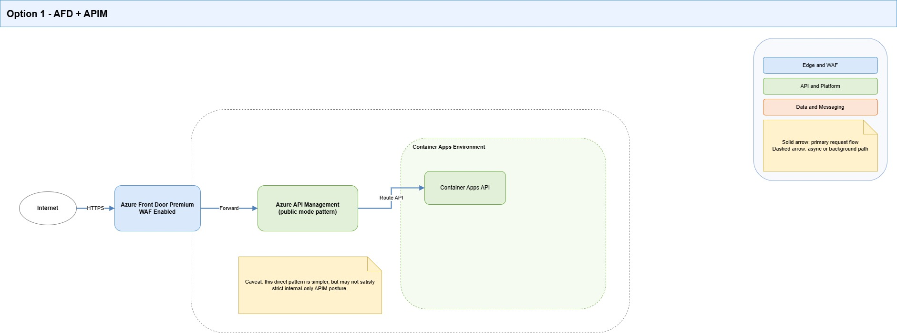
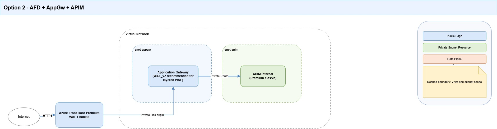
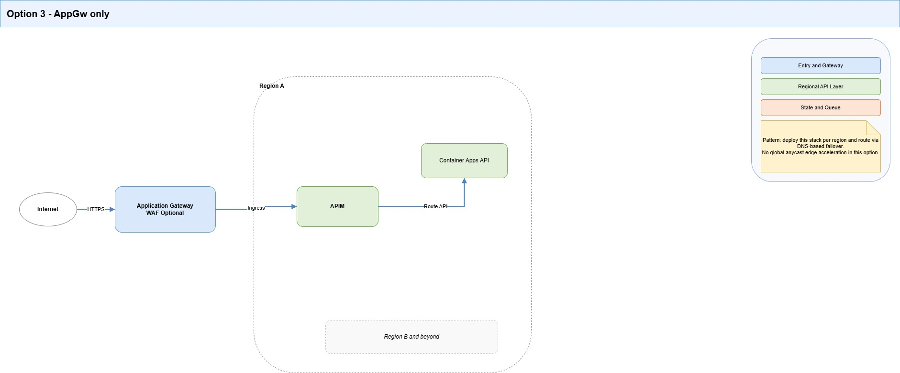
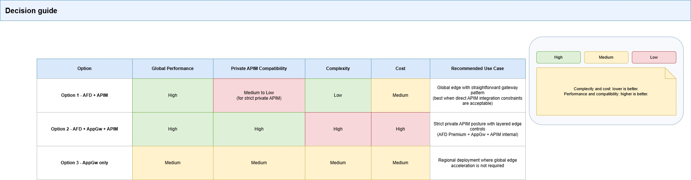

Today, we are going to look at ingress and edge design decisions for [Azure API Management (APIM)](https://learn.microsoft.com/azure/api-management/api-management-key-concepts?WT.mc_id=AZ-MVP-5004796).

This post captures the tradeoffs between three patterns:

1. **[Azure Front Door (AFD)](https://learn.microsoft.com/en-us/azure/frontdoor/front-door-overview?WT.mc_id=AZ-MVP-5004796) + [WAF](https://learn.microsoft.com/azure/web-application-firewall/afds/afds-overview?WT.mc_id=AZ-MVP-5004796) -> [Azure API Management (APIM)](https://learn.microsoft.com/azure/api-management/api-management-key-concepts?WT.mc_id=AZ-MVP-5004796)**
2. **[Azure Front Door (AFD)](https://learn.microsoft.com/en-us/azure/frontdoor/front-door-overview?WT.mc_id=AZ-MVP-5004796) + [WAF](https://learn.microsoft.com/azure/web-application-firewall/afds/afds-overview?WT.mc_id=AZ-MVP-5004796) -> [Application Gateway (AppGw)](https://learn.microsoft.com/azure/application-gateway/overview?WT.mc_id=AZ-MVP-5004796) -> [Azure API Management (APIM)](https://learn.microsoft.com/azure/api-management/api-management-key-concepts?WT.mc_id=AZ-MVP-5004796) (internal)**
3. **[Application Gateway (AppGw)](https://learn.microsoft.com/azure/application-gateway/overview?WT.mc_id=AZ-MVP-5004796) -> [Azure API Management (APIM)](https://learn.microsoft.com/azure/api-management/api-management-key-concepts?WT.mc_id=AZ-MVP-5004796)**

The goal here is not architectural purity. It is to pick a pattern that survives real operations: DNS behavior, health probes, private-link approval flow, certificate lifecycle, and failure domains.

{/* truncate */}

## Scope and assumptions

- [Azure API Management (APIM)](https://learn.microsoft.com/azure/api-management/api-management-key-concepts?WT.mc_id=AZ-MVP-5004796) is the API gateway and policy control plane.
- Workloads run in private-first Azure networking patterns.
- We need a secure public ingress with predictable operations.
- We care about a clear blast radius when things fail.

## The options we are comparing today:

| Option                                    | Best for                             | Main benefits                                                                    | Main costs and risks                                                                    |
| ----------------------------------------- | ------------------------------------ | -------------------------------------------------------------------------------- | --------------------------------------------------------------------------------------- |
| **AFD + WAF -> APIM**                     | Global edge with fewer components    | Global anycast edge, strong DDoS posture, edge WAF, easier failover pattern      | Can conflict with strict private APIM posture depending on tier and ingress constraints |
| **AFD + WAF -> AppGw -> APIM (internal)** | Strict private APIM with global edge | Preserves global edge and WAF, keeps APIM internal, supports private hop pattern | Highest complexity, more probe/policy coordination, higher cost                         |
| **AppGw (+ optional WAF) -> APIM**        | Regional ingress use cases           | Simpler than dual-edge, strong regional ingress control                          | No global POP acceleration, no native global failover orchestration                     |

## SKU boundaries that matter

| Service             | SKU                      | What matters                                                    | Caveat                                                              |
| ------------------- | ------------------------ | --------------------------------------------------------------- | ------------------------------------------------------------------- |
| Azure Front Door    | Standard                 | Global edge, routing, rules engine, custom domain TLS           | Private Link to origins is not supported in Standard                |
| Azure Front Door    | Premium                  | Private Link to supported origins, WAF, bot protection          | Public and private origins cannot be mixed in the same origin group |
| Application Gateway | Standard_v2              | L7 routing, autoscale, static VIP                               | No WAF policy enforcement                                           |
| Application Gateway | WAF_v2                   | Standard_v2 + WAF policy                                        | Needs active tuning to reduce false positives                       |
| APIM (classic)      | Developer                | Internal VNet mode for dev/test                                 | No SLA, not for production                                          |
| APIM (classic)      | Premium                  | Internal VNet injection, private endpoint support, multi-region | Higher cost and ops overhead                                        |
| APIM (v2)           | Standard v2 / Premium v2 | Faster deployment/scaling, modernized platform                  | Multi-region currently unavailable in v2 tiers                      |

### APIM + Front Door private-link caveat

Current guidance for **Front Door Premium -> APIM via Private Link** has two constraints that matter here:

- It is **not supported with APIM Premium v2**.
- In the referenced guidance for classic tiers, APIM is expected in **public mode** (not internal VNet mode).

For strict private APIM posture, **AFD Premium -> AppGw (Private Link) -> APIM internal** remains the safer and more operable pattern.

## Zone redundancy (ZRS/AZ) and multi-region context

This part matters because "high availability" means different things depending on the service.

### [Azure Front Door (AFD)](https://learn.microsoft.com/en-us/azure/frontdoor/front-door-overview?WT.mc_id=AZ-MVP-5004796)

- Front Door is a global edge service by design (POP-based), so you don't configure regional ZRS for Front Door in the same way as regional services.
- Resiliency is mostly achieved through **origin design**: multiple origins, health probes, and priority/weight routing.
- If using Private Link origins, include **region-level redundancy** in origin design to reduce dependency on a single regional path.

### [Application Gateway (AppGw) v2](https://learn.microsoft.com/azure/application-gateway/overview-v2?WT.mc_id=AZ-MVP-5004796)

- App Gateway v2 is a **regional** service.
- In regions with Availability Zones, it supports **zone-redundant deployment** (or zonal pinning if explicitly configured).
- This improves intra-region resiliency, but it does **not** replace cross-region design.

### [Azure API Management (APIM)](https://learn.microsoft.com/azure/api-management/api-management-key-concepts?WT.mc_id=AZ-MVP-5004796)

- **Classic Premium** supports multi-region deployment.
- **v2 tiers** currently do **not** support multi-region deployment.
- Premium v2 supports modern platform capabilities, but if a strict APIM multi-region is required today, classic Premium remains the stronger fit.

### Design implications for this architecture

If your target is both:

1. strict private APIM posture, and
2. strong regional plus cross-region resilience,

Then the practical pattern remains:

- Front Door for global ingress and failover orchestration,
- per-region App Gateway (zone-redundant where available), and
- APIM in a tier/topology that matches the required multi-region behavior.

This is why topology decisions here are tightly coupled to SKU capabilities and lifecycle constraints.

## What I learned when attempting various architectures

### 1. Complexity concentrates at the private boundary

The hardest part was not APIM policy authoring. It was making ingress topology and private-network behavior line up under real-world conditions.

Most failure patterns occurred around:

- DNS alignment
- private endpoint approval and propagation timing
- health probe and host-header mismatches
- certificate subject/SAN assumptions

### 2. To keep APIM private while still allowing public API access, use the architecture standard: AFD -> AppGw -> APIM (internal)

This gives clear separation of concerns:

- **AFD** = global edge + edge WAF + internet entry
- **AppGw** = regional ingress bridge into private network
- **APIM** = API governance and policy enforcement

### 3. Probe and host-header design must be explicit

Most 5xx incidents we saw were traceable to a probe path/protocol mismatch, a host-header mismatch, or a TLS name-check mismatch.

In this pattern, probe design is an architecture concern, not a post-deployment tweak.

### 4. Operational sequencing is not optional

Private endpoint approval and control-plane propagation timing can block otherwise-correct configurations.

Pipelines should include checks and retries for pending approvals, health state, and staged route transitions.

## Decision guidance

### Choose AFD + APIM when

- You need a global edge and WAF.
- APIM does not need a strict internal-only posture.
- Your selected APIM tier/topology supports your direct Front Door integration path.
- You want fewer moving parts.

### Choose AFD + AppGw + APIM (internal) when

- APIM must remain private/internal.
- You still need global edge entry and WAF.
- You want stronger network boundary control.
- Your team accepts higher operational complexity.

### Choose AppGw-only when

- The system is mainly regional.
- Global edge acceleration and failover are not requirements.
- Simpler operations are more valuable than global edge capability.

## Security, reliability, and cost implications

### Security

- AFD WAF gives early filtering at the global edge.
- AppGw adds regional boundary control (and optional second WAF layer with WAF_v2).
- APIM remains policy authority (authN/authZ, quotas, transformations, governance).

### Reliability

- AFD improves global client experience and failover orchestration.
- AppGw introduces another health domain (more control, more misconfiguration surface).
- Internal APIM increases isolation but requires disciplined DNS and connectivity operations.

### Cost and complexity (general)

- **AFD + APIM**: lower complexity than dual-hop.
- **AFD + AppGw + APIM**: highest control, highest ops overhead.
- **AppGw-only**: lower global capability, often lower cost than dual-hop.

## TLS and certificate decisions

### Does Front Door manage certificates?

Yes, for **Front Door frontend custom domains**.

- Azure-managed certs are supported and auto-rotated when validation conditions are met.
- BYOC is supported through Key Vault-backed secrets.
- BYOC can auto-rotate when configured to use `Latest` secret version.

Important boundary: Front Door-managed certificates do **not** manage certificates on downstream hops.

### Certificate ownership by hop

- **Client -> Front Door**: AFD managed cert or BYOC
- **Front Door -> AppGw**: AppGw origin cert must be valid and host-name aligned
- **AppGw -> APIM**: backend cert trust chain and host validation must align
- **APIM -> backend**: backend-owned certificates and validation remain backend-side

## mTLS decisions

### Client -> Front Door

Front Door Standard/Premium does not support client mTLS at the edge.

### Client -> APIM

APIM supports client certificate validation via policy (`validate-client-certificate`) and is the right enforcement point when certificate identity is required.

### APIM -> backend

Use certificate-based controls where a stronger service-to-service identity is needed.

Tradeoff: mTLS increases certificate operations overhead but provides stronger identity assurance than token-only patterns.

## Practical policy for an Integration platform

- Use Front Door-managed certificates by default for edge domains where suitable.
- Use BYOC when strict CA control, wildcard, or certificate pinning requirements exist.
- Keep HTTPS on all hops.
- Introduce mTLS at APIM ingress for partner/system integrations requiring certificate identity.
- Treat probe host headers, DNS records, and certificate subjects/SANs as one design unit, and validate them together per environment.

## Recommendation

Use **AFD + WAF -> AppGw -> APIM (internal)** as the default production pattern while a strict private APIM posture remains a requirement.

Keep APIM as the single API governance control plane, and AppGw as the private ingress bridge.

If requirements change and strict internal APIM is no longer required, re-evaluate to reduce the number of layers and operational overhead.

## References

- [Connect Azure Front Door Premium to an Azure Application Gateway with Private Link](https://learn.microsoft.com/azure/frontdoor/how-to-enable-private-link-application-gateway?WT.mc_id=AZ-MVP-5004796)
- [Integrate API Management in an internal virtual network with Application Gateway](https://learn.microsoft.com/azure/api-management/api-management-howto-integrate-internal-vnet-appgateway?WT.mc_id=AZ-MVP-5004796)
- [Web Application Firewall (WAF) on Azure Front Door](https://learn.microsoft.com/azure/frontdoor/web-application-firewall?WT.mc_id=AZ-MVP-5004796)
- [Quickstart: Create an Azure Front Door using Azure CLI](https://learn.microsoft.com/azure/frontdoor/create-front-door-cli?WT.mc_id=AZ-MVP-5004796)
- [Domains in Azure Front Door (certificate requirements)](https://learn.microsoft.com/azure/frontdoor/domain#certificate-requirements?WT.mc_id=AZ-MVP-5004796)
- [TLS encryption with Azure Front Door](https://learn.microsoft.com/azure/frontdoor/end-to-end-tls?WT.mc_id=AZ-MVP-5004796)
- [Configure HTTPS on an Azure Front Door custom domain](https://learn.microsoft.com/azure/frontdoor/standard-premium/how-to-configure-https-custom-domain?WT.mc_id=AZ-MVP-5004796)
- [Validate client certificate policy (APIM)](https://learn.microsoft.com/azure/api-management/validate-client-certificate-policy?WT.mc_id=AZ-MVP-5004796)
- [Secure your origin with Private Link in Azure Front Door Premium](https://learn.microsoft.com/azure/frontdoor/private-link?WT.mc_id=AZ-MVP-5004796)
- [Azure Front Door tier/service comparison](https://learn.microsoft.com/azure/frontdoor/standard-premium/tier-comparison?WT.mc_id=AZ-MVP-5004796)
- [What is Azure Application Gateway v2?](https://learn.microsoft.com/azure/application-gateway/overview-v2?WT.mc_id=AZ-MVP-5004796)
- [What is Azure Web Application Firewall on Application Gateway?](https://learn.microsoft.com/azure/web-application-firewall/ag/ag-overview?WT.mc_id=AZ-MVP-5004796)
- [Feature-based comparison of Azure API Management tiers](https://learn.microsoft.com/azure/api-management/api-management-features?WT.mc_id=AZ-MVP-5004796)
- [Azure API Management v2 tiers overview](https://learn.microsoft.com/azure/api-management/v2-service-tiers-overview?WT.mc_id=AZ-MVP-5004796)
- [Connect Azure Front Door Premium to Azure API Management with Private Link](https://learn.microsoft.com/azure/frontdoor/standard-premium/how-to-enable-private-link-apim?WT.mc_id=AZ-MVP-5004796)
