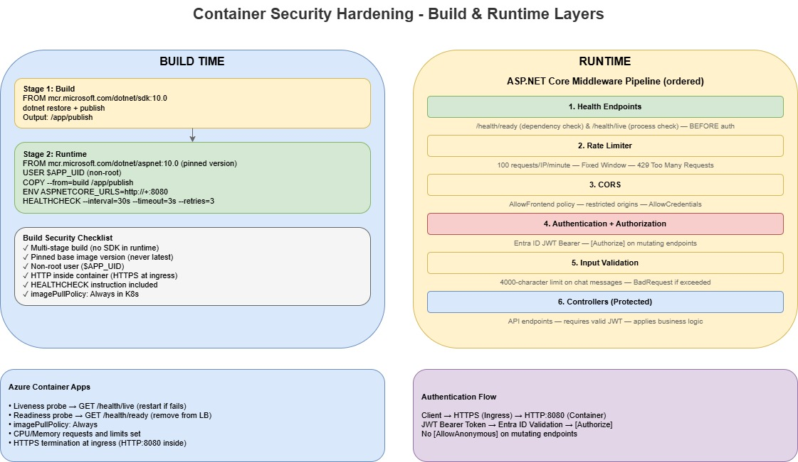

Every time I see a production container running as root, I wince.

It is one of those things that is easy to fix but gets overlooked because the app "works fine" without it. But container security is not just about non-root users. It is about the full stack: image build, runtime configuration, network policy, input validation, and rate limiting.

In this post, I will walk through a checklist I used to harden a .NET project running on [Azure Container Apps](https://learn.microsoft.com/azure/container-apps/?WT.mc_id=AZ-MVP-5004796).

{/* truncate */}



## 1. Non-root containers

Running as root inside a container means that if an attacker exploits a vulnerability in your application, they inherit root privileges within the container. In some scenarios, that can be leveraged for container escape.

The fix is straightforward. In your Dockerfile:

```dockerfile
FROM mcr.microsoft.com/dotnet/aspnet:10.0 AS runtime
WORKDIR /app

COPY --from=build /app/publish .

ENV ASPNETCORE_HTTP_PORTS=8080
EXPOSE 8080

# Switch to non-root user
USER $APP_UID

HEALTHCHECK --interval=30s --timeout=3s --start-period=10s --retries=3 \
    CMD curl -f http://localhost:8080/health/ready || exit 1

ENTRYPOINT ["dotnet", "App.ControlPlane.Api.dll"]
```

Key points:

- For [official Microsoft .NET **Linux** images (.NET 8+)](https://devblogs.microsoft.com/dotnet/securing-containers-with-rootless/?WT.mc_id=AZ-MVP-5004796), you do **not** need to create your own user. The images already include a non-root `app` user.
- Use `USER app` or `USER $APP_UID` (`$APP_UID` is UID `1654`). I prefer `USER $APP_UID` because it also works cleanly with Kubernetes `runAsNonRoot` checks.
- The image is **non-root capable**, but it is not automatically non-root unless you set `USER` explicitly.
- Place `USER` after `COPY` so the app files are copied first and then executed as non-root.
- Use port `8080` (not 80/443). Non-privileged ports avoid root requirements, and moving back to port `80` means you cannot run as non-root.

:::warning
If you are using a base image that does **not** provide a non-root user (or you have custom filesystem write paths), create/chown a dedicated runtime user for those paths before switching away from root.
:::

## 2. Multi-stage builds

Multi-stage Docker builds keep build tools (SDK, compilers, npm dev dependencies) out of the runtime image. This reduces the attack surface and image size.

```dockerfile
# Build stage — SDK and build toolchain
FROM mcr.microsoft.com/dotnet/sdk:10.0 AS build
WORKDIR /src
COPY . .
RUN dotnet restore src/Api/App.ControlPlane.Api.csproj
RUN dotnet publish src/Api/App.ControlPlane.Api.csproj -c Release -o /app/publish /p:UseAppHost=false

# Runtime stage — minimal runtime only
FROM mcr.microsoft.com/dotnet/aspnet:10.0 AS runtime
```

For frontend workloads, the pattern is similar:

```dockerfile
# Build stage with Node.js
FROM node:20-alpine AS build
# ... npm ci, vite build

# Runtime stage with production dependencies only
FROM node:20-alpine AS runtime
RUN npm ci --only=production
```

:::tip
Use `--only=production` (or `--omit=dev` in npm 9+) in runtime stages so TypeScript, ESLint, Vite, and other dev tooling are not shipped to production.
:::

## 3. Pin base image versions

Never use `latest` in production images.

❌ Bad — unpredictable

```dockerfile
FROM mcr.microsoft.com/dotnet/aspnet:latest
```

✅ Good — deterministic and reproducible

```dockerfile
FROM mcr.microsoft.com/dotnet/aspnet:10.0
```

Pinning to major.minor gives you a solid balance between stability and patch cadence. If you need strict reproducibility, pin to an image digest.

## 4. Health probes that bypass auth

Health endpoints should bypass authentication middleware. If readiness requires a JWT, the platform cannot accurately determine service health.

```csharp
app.MapGet("/health/ready", () => Results.Ok(new
{
    Status = "Healthy",
    Timestamp = DateTime.UtcNow,
    Service = "app-control-plane-api",
    Version = "1.0.0"
}));

app.MapGet("/health/live", () => Results.Ok(new
{
    Status = "Alive",
    Timestamp = DateTime.UtcNow
}));
```

In practice, map these endpoints before strict authorization rules, or explicitly bypass auth for `/health/*`.

:::note
Configure both liveness and readiness. Liveness answers "is the process alive?" Readiness answers "Can it safely receive traffic?"
:::

## 5. Rate limiting

The API uses [ASP.NET Core rate limiting middleware](https://learn.microsoft.com/aspnet/core/performance/rate-limit?view=aspnetcore-10.0&WT.mc_id=AZ-MVP-5004796) with a fixed-window policy:

```csharp
builder.Services.AddRateLimiter(options =>
{
    options.GlobalLimiter = PartitionedRateLimiter.Create<HttpContext, string>(httpContext =>
        RateLimitPartition.GetFixedWindowLimiter(
            partitionKey: httpContext.Connection.RemoteIpAddress?.ToString() ?? "anonymous",
            factory: _ => new FixedWindowRateLimiterOptions
            {
                PermitLimit = 100,
                Window = TimeSpan.FromMinutes(1),
                QueueProcessingOrder = QueueProcessingOrder.OldestFirst,
                QueueLimit = 0
            }));

    options.RejectionStatusCode = StatusCodes.Status429TooManyRequests;
});
```

This gives a clear policy: 100 requests per minute per IP, fail fast with `429`, and no queuing.

:::warning
In multi-replica environments (including Azure Container Apps), in-memory rate limiting is per instance. For true global limits across replicas, use a distributed store such as [Azure Cache for Redis](https://learn.microsoft.com/azure/azure-cache-for-redis/cache-overview?WT.mc_id=AZ-MVP-5004796).
:::

## 6. Input validation at the API boundary

Input validation should happen at the edge of the API, before expensive processing.

```csharp
// Validate input length to prevent abuse
const int MaxMessageLength = 4000;
if (userMessage.Length > MaxMessageLength)
{
    // Return 400 Bad Request with specific error
}
```

This is a small change that helps with:

- Prompt injection attempts using oversized payloads
- Resource exhaustion from unbounded request bodies
- Token/cost control for downstream AI calls

## 7. Authentication with Entra ID JWT bearer

If you have a system, such as an API use [Microsoft Entra ID](https://learn.microsoft.com/entra/identity-platform/?WT.mc_id=AZ-MVP-5004796) bearer tokens for authentication:

```csharp
builder.Services.AddAuthentication(JwtBearerDefaults.AuthenticationScheme)
    .AddMicrosoftIdentityWebApi(builder.Configuration.GetSection("AzureAd"));
```

Authorization policies then control operation-level access:

```csharp
[Authorize(Policy = "AnalysisRead")]
public async Task AgentChat([FromBody] AgentChatRequest request, ...)
```

Mutating endpoints are authenticated. Health probes remain the only unauthenticated paths.

## 8. Restrictive CORS

Configure Cross-Origin Resource Sharing (CORS) for known frontend origins only:

```csharp
builder.Services.AddCors(options =>
{
    options.AddPolicy("AllowFrontend", policy =>
    {
        policy.WithOrigins(allowedOrigins)
              .AllowAnyHeader()
              .AllowAnyMethod()
              .AllowCredentials();
    });
});
```

:::tip
If allowed origins are sourced from config, remember most apps load this at startup. Update config and restart the deployment to apply changes.
:::

## 9. HTTPS termination at ingress (not inside container)

For Azure Container Apps, TLS is terminated at ingress. Your container should listen on HTTP internally:

```dockerfile
ENV ASPNETCORE_HTTP_PORTS=8080
EXPOSE 8080
```

If you force HTTPS in-container (`https://+:443`) without mounting certificates, startup failures are expected.

## Practical hardening checklist

Use this in PR reviews:

| Check                                    | Status |
| ---------------------------------------- | ------ |
| Non-root user in Dockerfile              | ✅     |
| Multi-stage build (no SDK in runtime)    | ✅     |
| Pinned base image version (not `latest`) | ✅     |
| Health probes bypass auth                | ✅     |
| Liveness and readiness probes configured | ✅     |
| Rate limiting enabled                    | ✅     |
| Input validation at API boundary         | ✅     |
| Entra ID JWT authentication              | ✅     |
| CORS restricted to known origins         | ✅     |
| HTTP (not HTTPS) inside container        | ✅     |
| `imagePullPolicy: Always` in manifests   | ✅     |
| No secrets in Dockerfile or image layers | ✅     |
| `HEALTHCHECK` instruction in Dockerfile  | ✅     |

## Final thoughts

Container security is not a single switch.

It is a set of patterns that compound: non-root containers, deterministic builds, probe hygiene, rate limiting, input validation, and clear auth boundaries. Applied together, they significantly reduce risk for workloads running on Azure Container Apps.

> And don't forget [Azure Container Registry Continuous Patching](https://learn.microsoft.com/azure/container-registry/key-concept-continuous-patching?WT.mc_id=AZ-MVP-5004796) and [Containers Supply Chain Framework](https://learn.microsoft.com/azure/security/container-secure-supply-chain/articles/container-secure-supply-chain-implementation/containers-secure-supply-chain-overview?WT.mc_id=AZ-MVP-5004796).

If you want to map this to broader platform guidance, review the [Security pillar of the Azure Well-Architected Framework](https://learn.microsoft.com/azure/well-architected/security/?WT.mc_id=AZ-MVP-5004796).
