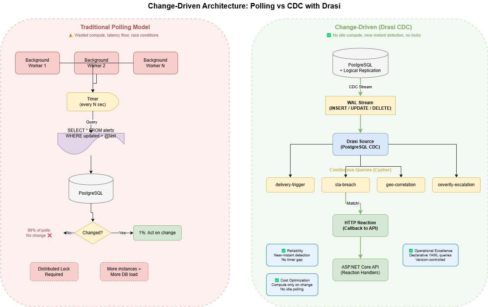
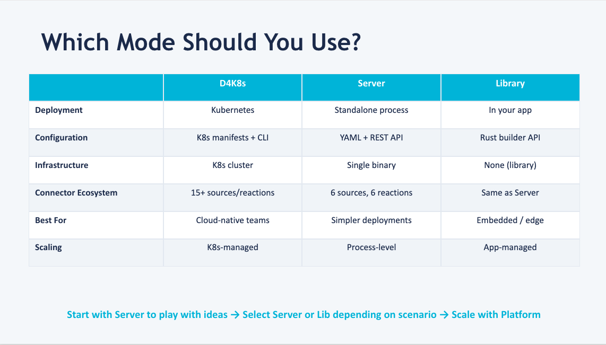

Today, we are going to look at change-driven architecture on Azure using [Drasi](https://drasi.io/), and why it matters from a [Well-Architected](https://learn.microsoft.com/azure/well-architected?WT.mc_id=AZ-MVP-5004796) perspective.

If you have ever built a system that polls a database every few seconds asking, "has anything changed?" — this one is for you.

> I recently built an [Emergency Alert System](https://github.com/lukemurraynz/EmergencyAlertSystem) and [Santa Digital Workshop](https://github.com/lukemurraynz/SantaDigitalShowcase25) and [Automate Azure Bastion with Drasi Realtime RBAC Monitoring](https://luke.geek.nz/azure/drasi-bastion-rbac-automation/) proof of concepts on Azure that uses Drasi for reactive data processing. One of the most interesting things I discovered was how change-driven architecture fundamentally shifts the way you think about reliability, cost, and operational efficiency.

:::info
This article explores architectural patterns from a proof of concept. The patterns are production-applicable, but the implementation itself is a learning exercise.
:::

## The Polling Problem

Most event-driven systems I have worked on follow the same pattern: a background service queries the database on a timer, checks for changes, and then acts on them.

It works, but it has some well-known problems:

- **Wasted compute** — 99% of polls return "nothing changed"
- **Latency** — you only detect changes at the poll interval (1 second? 5 seconds? 30 seconds?)
- **Race conditions** — if multiple instances poll simultaneously, you need distributed locks
- **Scaling challenges** — more instances means more database load, not faster detection

From a [Well-Architected Cost Optimization](https://learn.microsoft.com/azure/well-architected/cost-optimization/?WT.mc_id=AZ-MVP-5004796) perspective, polling is paying for compute that mostly does nothing.

From a [Reliability](https://learn.microsoft.com/azure/well-architected/reliability/?WT.mc_id=AZ-MVP-5004796) perspective, poll intervals create a detection floor — you simply cannot react faster than your timer.

## Enter Change Data Capture

[Change Data Capture (CDC)](https://learn.microsoft.com/azure/postgresql/flexible-server/concepts-logical?WT.mc_id=AZ-MVP-5004796) flips this model. Instead of asking the database if something changed, the database tells you when something changes.

PostgreSQL Flexible Server _(just one of [Drasi sources](https://drasi.io/concepts/sources/))_ supports logical replication natively, which streams every `INSERT`, `UPDATE`, and `DELETE` as it happens.

Drasi sits on top of this CDC stream and runs [continuous queries](https://drasi.io/concepts/continuous-queries/) — written in Cypher — that evaluate incoming changes against patterns you define. When a pattern matches, Drasi fires a reaction _(in my case, an HTTP callback to a API)_.

The architecture follows a simple flow: **Source → Queries → Reactions**.



```yaml
# Drasi CDC Source Configuration
apiVersion: v1
kind: Source
name: postgres-alerts
spec:
  kind: PostgreSQL
  properties:
    host: ${POSTGRES_HOST}
    port: ${POSTGRES_PORT}
    user: ${POSTGRES_USER}
    password: ${POSTGRES_PASSWORD}
    database: ${POSTGRES_DATABASE}
    ssl: true
    tables:
      - emergency_alerts.alerts
      - emergency_alerts.areas
      - emergency_alerts.recipients
      - emergency_alerts.delivery_attempts
      - emergency_alerts.approval_records
      - emergency_alerts.correlation_events
      - emergency_alerts.area_signals
      - emergency_alerts.weather_observations
      - emergency_alerts.road_maintenance
```

This source watches nine tables. Every change to any of these tables flows into the continuous query engine.

## Which Drasi Mode Should You Use?

One useful design decision early on is picking the right Drasi runtime for your workload. Drasi is available in three forms with the same core model (**Sources → Continuous Queries → Reactions**), but different operational trade-offs.



- **[Drasi for Kubernetes (D4K8s)](https://drasi.io/drasi-kubernetes/)** — best for production-scale, cloud-native platforms where you want Kubernetes-native scaling, observability, and operational controls.
- **[Drasi Server](https://drasi.io/drasi-server/)** — best for local development, Docker Compose, edge, and non-Kubernetes environments where you still want full Drasi capabilities in a single process/container.
- **[drasi-lib](https://drasi.io/drasi-lib/)** — best when building a Rust app and you want in-process change detection with no separate Drasi infrastructure.

A practical path I have found useful: start with **Server** to iterate quickly, move to **D4K8s** as reliability/scale requirements grow, and choose **drasi-lib** when your change logic should live directly inside a Rust service.

## Continuous Queries — The Logic Layer

Here is where it gets interesting.

A continuous query is not a one-off SQL statement. It is a standing query that continuously evaluates against the stream of changes _(it also could be one or across multiple different sources)_.

For example, the delivery trigger query fires when an alert transitions to `Approved` with a `Pending` delivery status:

```yaml
apiVersion: v1
kind: ContinuousQuery
name: delivery-trigger
spec:
  mode: query
  sources:
    subscriptions:
      - id: postgres-alerts
        nodes:
          - sourceLabel: alerts
  query: |
    MATCH (a:alerts)
    WHERE a.status = 'Approved' AND a.delivery_status = 'Pending'
    RETURN
      a.alert_id AS alertId,
      a.headline AS headline,
      a.severity AS severity,
      a.sent_at AS approvedAt,
      drasi.changeDateTime(a) AS triggeredAt
```

No polling. No timers.

The moment a row changes in the `alerts` table and matches these conditions, Drasi fires the reaction.

## The Well-Architected Impact

### Reliability

Change-driven architecture eliminates the detection gap.

In a polling model, if your timer runs every 5 seconds, a critical SLA breach might sit undetected for up to 5 seconds. With CDC, detection is near-instantaneous.

In my proof of concept, I run 15+ continuous queries simultaneously — including SLA breach detection at 60 seconds, approval timeouts at 5 minutes, correlation across regions, and severity escalation tracking.

Each query runs independently, and if one fails, the others continue operating. This aligns with the Well-Architected [failure mode analysis](https://learn.microsoft.com/azure/well-architected/reliability/failure-mode-analysis?WT.mc_id=AZ-MVP-5004796) guidance — decompose your detection logic so a failure in one area does not cascade.

### Cost Optimization

No idle compute cycles polling an unchanged database.

The compute only activates when data actually changes. For workloads with bursty change patterns _(like an emergency alert system)_, this can significantly reduce steady-state cost compared to a fleet of polling workers.

### Operational Excellence

Each continuous query is a declarative YAML file, version-controlled alongside the infrastructure.

Adding a new detection pattern means writing a new query file and deploying it — no code changes to the application, no new background services, no additional infrastructure.

```text
infrastructure/drasi/queries/
├── sla-monitoring/
│   ├── delivery-sla-breach.yaml
│   ├── approval-timeout.yaml
│   └── expiry-warning.yaml
├── risk-detection/
│   ├── geographic-correlation.yaml
│   ├── regional-hotspot.yaml
│   ├── severity-escalation.yaml
│   └── duplicate-suppression.yaml
└── recommendations/
    ├── delivery-trigger.yaml
    ├── all-clear-suggestion.yaml
    └── area-expansion-suggestion.yaml
```

## When to Use This Pattern

Change-driven architecture is a good fit when:

- **Low-latency detection matters** — SLA monitoring, fraud detection, security alerts
- **Multiple detection rules run in parallel** — you need 10+ independent queries watching the same data
- **The write-to-read ratio is low** — changes happen infrequently relative to how often you would poll
- **You already use PostgreSQL or another source containing CDC** — CDC comes free with logical replication

It is less suited for:

- **High-frequency OLTP** — if every row changes every second, you are essentially processing the full table continuously
- **Simple CRUD** — if you just need "notify me when a row is inserted," a database trigger or Event Grid integration might be simpler
- **Teams unfamiliar with Cypher** — the learning curve for graph-style queries is real

## Getting Started

If you want to try this pattern, you need:

1. [Azure Kubernetes Service (AKS)](https://learn.microsoft.com/azure/aks/what-is-aks?WT.mc_id=AZ-MVP-5004796) — Drasi currently runs on Kubernetes _(or a local KIND cluster you can run in a devcontainer for testing)_
2. [PostgreSQL Flexible Server](https://learn.microsoft.com/azure/postgresql/flexible-server/overview?WT.mc_id=AZ-MVP-5004796) with logical replication enabled
3. The [Drasi CLI](https://drasi.io/drasi-server/getting-started/) installed in your cluster

The Drasi documentation covers installation well. The key Azure-specific step is enabling logical replication on your PostgreSQL Flexible Server — set `wal_level = logical` and configure `max_replication_slots` for the number of sources you plan to run.

> **TIP**
> If you are using Bicep to deploy PostgreSQL Flexible Server, set `azure.extensions = postgis` as a server parameter if you need spatial queries. The CDC source does not require PostGIS, but if your queries reference spatial data, the extension needs to be present before running migrations.

## Wrapping Up

Change-driven architecture addresses several Well-Architected concerns simultaneously:

- It reduces wasted compute (**Cost Optimization**)
- It eliminates detection gaps (**Reliability**)
- It keeps detection logic declarative and version-controlled (**Operational Excellence**)

Drasi makes this pattern accessible on Azure without writing custom CDC consumers or managing Kafka/Debezium infrastructure yourself.

The shift from "ask the database" to "let the database tell you" is subtle, but the architectural implications are significant.

> You can find the full proof of concept on GitHub: [lukemurraynz/EmergencyAlertSystem](https://github.com/lukemurraynz/EmergencyAlertSystem).
