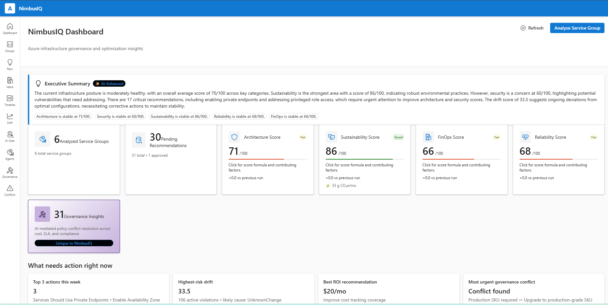
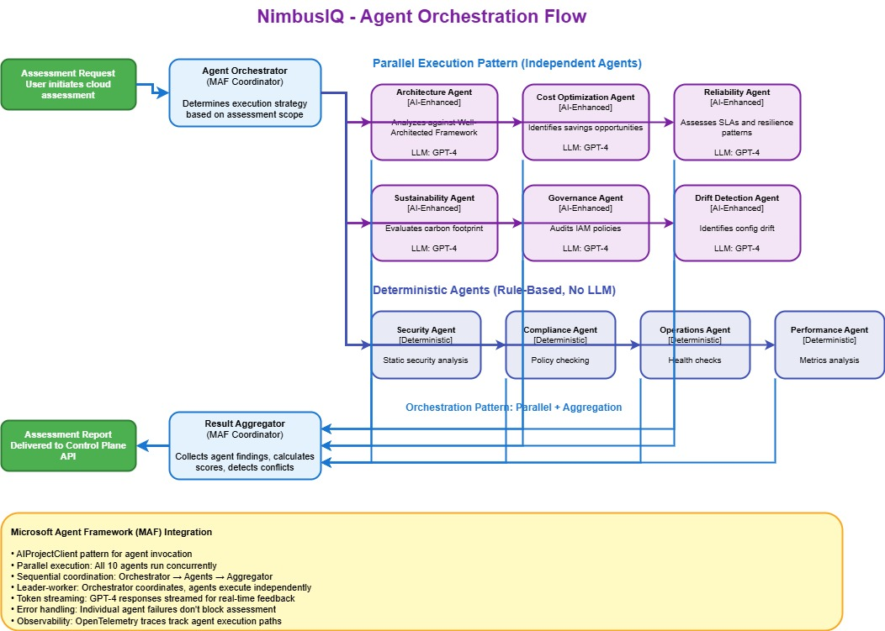

As the AI Dev Days Hackathon comes to an end, I want to share my submission.

Today, I want to walk through something I have been building over the last wee while - a project called **NimbusIQ**. It is my submission for the [AI Dev Days Hackathon](https://developer.microsoft.com/en-us/reactor/events/26647/), and it sits across the **Best Multi-Agent System** and **Best Enterprise Solution** categories - NimbusIQ.

{/* truncate */}



I spend some time working with Azure environments - helping teams understand their estates, finding configuration drift, catching orphaned resources, and figuring out what to fix first. If you have done any of that work, you will know the pain. Azure gives you no shortage of signals: [Azure Advisor](https://learn.microsoft.com/azure/advisor/advisor-overview?WT.mc_id=AZ-MVP-5004796), [Azure Resource Graph](https://learn.microsoft.com/azure/governance/resource-graph/overview?WT.mc_id=AZ-MVP-5004796), [Cost Management](https://learn.microsoft.com/azure/cost-management-billing/costs/overview-cost-management?WT.mc_id=AZ-MVP-5004796), [PSRule for Azure](https://azure.github.io/PSRule.Rules.Azure/), [Azure Quick Review](https://azure.github.io/azqr/docs/), Policy, Monitor - the list goes on. The problem is not a lack of data. The problem is that all of these signals live in different dashboards, different exports, and different tools. Nobody is joining them up.

So I thought to myself: what if I could build something that does the bit that currently requires a human cloud architect? Not the detection - Azure already does that well enough - but the reasoning, prioritisation, and remediation planning that happens after detection - scoped per Azure Service Group.

> That is what NimbusIQ aimed to do.

## What is NimbusIQ?

In short, NimbusIQ is a multi-agent AI platform that continuously discovers your Azure estate, detects drift and policy violations, reasons across cost, reliability, sustainability, and governance signals, and produces remediation plans that a human can review and approve before anything gets applied.

It uses:

- [Microsoft Agent Framework](https://learn.microsoft.com/en-us/agent-framework/overview/?pivots=programming-language-csharp&WT.mc_id=AZ-MVP-5004796) for agent orchestration
- [Microsoft Foundry](https://learn.microsoft.com/en-us/azure/foundry/what-is-foundry?WT.mc_id=AZ-MVP-5004796) (GPT-4) for the reasoning and narrative generation
- [Azure MCP](https://learn.microsoft.com/en-us/azure/developer/azure-mcp-server/overview?WT.mc_id=AZ-MVP-5004796) for grounded Azure capability discovery
- [Azure Container Apps](https://learn.microsoft.com/azure/container-apps/overview?WT.mc_id=AZ-MVP-5004796), PostgreSQL, Key Vault, managed identity, and OpenTelemetry for the runtime

:::tip[View the source]
The full source code is on GitHub: **[github.com/lukemurraynz/NimbusIQ](https://github.com/lukemurraynz/NimbusIQ)** - feel free to explore, fork, or open PRs.
:::

:::warning
This was created purely for the Hackathon, with a fair amount of hypervelocity engineering effort, although I have done my best to wrap production logic - ie security and resilience/circuit breakers/fallback endpoints etc. It is missing Entra ID authentication and various other functions - and of course support so use at your own risk.
:::

The whole thing deploys with `azd up`.


## The problem I was trying to solve

If you manage Azure estates at any sort of scale, you have probably lived this loop:

1. Gather evidence from multiple Azure tools
2. Interpret what actually changed and whether it matters
3. Decide whether cost, reliability, compliance, or architecture should take priority
4. Draft a remediation plan
5. Route it through approval
6. Hope the action actually improved things

That loop is manual, slow, and happens in spreadsheets or meeting rooms. The tools tell you **what** is wrong, but very few of them can tell you **why** it matters for a specific workload, **what** you should fix first, **how** to remediate it safely, or **whether** the change you made actually delivered value.

NimbusIQ automates that decision-support loop.

## How NimbusIQ differs from existing tools

I want to be clear - NimbusIQ is not a replacement for Azure Advisor, PSRule for Azure, or Azure Quick Review. Those are solid detection and standards tools, and NimbusIQ actually uses their rule sets internally. What NimbusIQ adds is the orchestration and decision-support layer that sits above them.

| Capability                                | Azure Advisor | PSRule         | Azure Quick Review | NimbusIQ                 |
| ----------------------------------------- | ------------- | -------------- | ------------------ | ------------------------ |
| Detect configuration violations           | ✓             | ✓              | ✓                  | ✓                        |
| Continuous drift trending                 | ✗             | ✗              | ✗                  | ✓                        |
| AI-powered reasoning across signals       | ✗             | ✗              | ✗                  | ✓ (6 LLM agents)         |
| Workload-scoped analysis                  | ✗             | ✗              | ✗                  | ✓ (Azure Service Groups) |
| Generate deployable IaC (Bicep/Terraform) | ✗             | ✗              | ✗                  | ✓                        |
| Dual-control approval workflow            | ✗             | ✗              | ✗                  | ✓                        |
| Explain WHY issues exist                  | ~Basic        | ~Pattern-based | ~Checklist-based   | ✓ (AI narrative)         |
| Track value realisation                   | ✗             | ✗              | ✗                  | ✓                        |
| Auditable agent-to-agent lineage          | ✗             | ✗              | ✗                  | ✓ (A2A tracing)          |

The way I think about it: if Azure Advisor is a dashboard, NimbusIQ is a cloud architect in the loop.

## The architecture

NimbusIQ has three services:

1. **Frontend** - React with [Fluent UI v9](https://storybooks.fluentui.dev/react/), showing a service graph, recommendations, approval workflow, and drift timeline
2. **Control Plane API** - ASP.NET Core (.NET 10) handling service groups, analysis runs, decisions, and RFC 9457 error responses
3. **Agent Orchestrator** - a .NET 10 background worker that runs the multi-agent pipeline using [Microsoft Agent Framework](https://learn.microsoft.com/en-us/agent-framework/overview/?pivots=programming-language-csharp&WT.mc_id=AZ-MVP-5004796)

All three run on Azure Container Apps with managed identity everywhere. No secrets in config files - just `DefaultAzureCredential` and RBAC.

```
┌──────────────────────────────────────────────────────────────────┐
│  Frontend (React + Fluent UI v9)                                  │
│  Service graph · Recommendations · Approval workflow · Timeline   │
└─────────────────────────┬────────────────────────────────────────┘
                          │ REST / JWT (Entra ID - planned, not yet implemented)
┌─────────────────────────▼────────────────────────────────────────┐
│  Control Plane API (.NET 10 / ASP.NET Core)                       │
│  Service groups · Analysis runs · Decisions · RFC 9457 errors     │
└──────────┬──────────────────────────────┬────────────────────────┘
           │ PostgreSQL (EF Core)          │ Agent messages
┌──────────▼──────────────────────────────▼────────────────────────┐
│  Agent Orchestrator (.NET 10 background worker)                   │
│                                                                   │
│  DiscoveryWorkflow ──► MultiAgentOrchestrator (Microsoft MAF)    │
│    Resource Graph        │                                        │
│    Cost Management       ├─ ServiceIntelligenceAgent              │
│    Log Analytics         ├─ BestPracticeEngine (700+ rules)      │
│                          ├─ DriftDetectionAgent                   │
│                          ├─ WellArchitectedAssessmentAgent       │
│                          ├─ FinOpsOptimizerAgent                 │
│                          ├─ CloudNativeMaturityAgent             │
│                          ├─ ArchitectureAgent                    │
│                          ├─ ReliabilityAgent                     │
│                          ├─ SustainabilityAgent                  │
│                          └─ GovernanceNegotiationAgent           │
│                                                                   │
│  IacGenerationWorkflow (Foundry-powered Bicep/Terraform)         │
└──────────────────────────────────────────────────────────────────┘
           All on Azure Container Apps + PostgreSQL Flexible Server
           Managed Identity · OpenTelemetry · Key Vault
```


## The ten agents

This is the bit I am most pleased with. NimbusIQ runs ten specialised agents, each with a distinct responsibility. Six of them use Microsoft Foundry (GPT-4) for reasoning; four are deterministic rule-based evaluators.



Here is how they are wired up using [Microsoft Agent Framework](https://learn.microsoft.com/en-us/agent-framework/overview/?pivots=programming-language-csharp&WT.mc_id=AZ-MVP-5004796)'s `WorkflowBuilder`:

```csharp
WorkflowBuilder builder = new(executorBindings[0]);
builder.WithName("nimbusiq-sequential");
builder.WithDescription(
    "NimbusIQ multi-agent orchestration workflow powered by Microsoft Agent Framework.");

for (var index = 0; index < executorBindings.Count - 1; index++)
{
    builder.AddEdge(executorBindings[index], executorBindings[index + 1]);
}

builder.WithOutputFrom(executorBindings[^1]);
var workflow = builder.Build(validateOrphans: true);

await using Run run = await InProcessExecution.RunAsync(
    workflow, executionState, session.SessionId, cancellationToken);
```

Each agent is registered with a clear name and purpose:

```csharp
_agents = new Dictionary<string, AIAgent>
{
    ["ServiceIntelligence"] = CreateDeterministicAgent(
        "service-intelligence-agent",
        "Service Intelligence",
        "Calculates service-group intelligence scores.",
        (context, _, _) => Task.FromResult<object>(
            serviceIntelligenceAgent.CalculateScores(context.Snapshot))),

    ["BestPractice"] = CreateDeterministicAgent(
        "best-practice-agent",
        "Best Practice",
        "Evaluates best-practice rules against discovered resources.",
        async (context, _, ct) =>
            await bestPracticeEngine.EvaluateAsync(context.Snapshot, ct)),

    ["DriftDetection"] = CreateDeterministicAgent(
        "drift-detection-agent",
        "Drift Detection",
        "Detects drift across service resources and best-practice violations.",
        async (context, _, ct) =>
            await driftDetectionAgent.AnalyzeDriftAsync(context.Snapshot, null, ct)),

    // ... WellArchitected, FinOps, CloudNative, Architecture,
    //     Reliability, Sustainability, Governance agents follow
};
```

The `BestPracticeEngine` sits at the heart of the deterministic layer. It packages over 700 rules sourced from Azure Well-Architected Framework, PSRule for Azure, Azure Quick Review, and the Azure Architecture Centre. The AI agents then reason over those normalised results rather than making things up from scratch.

:::info Why hybrid?
I deliberately kept four agents as pure rule-based evaluators. Not everything needs an LLM - drift scoring, cloud-native maturity checks, and best-practice rule evaluation are deterministic operations where you want consistent, reproducible results. The AI agents handle the subjective bits: explaining trade-offs, generating narratives, and producing remediation code.
:::


## Drift detection

One of the features I spent the most time on is continuous drift detection. NimbusIQ does not just compare two ARM templates - it evaluates the current state of your resources against the full rule set and produces a severity-weighted score.

The scoring works like this:

| Severity | Weight |
| -------- | ------ |
| Critical | 10     |
| High     | 5      |
| Medium   | 2      |
| Low      | 1      |


Each analysis run produces a drift snapshot with a score, category breakdown, and trend direction (`stable`, `degrading`, or `improving`). The dashboard shows those trends over time, so you can see whether your estate is getting better or worse.

## IaC generation

When a recommendation is approved, NimbusIQ calls Microsoft Foundry with structured context - the action type, target SKU, cost impact, and confidence - and generates Bicep or Terraform code. A rollback plan is generated alongside every change.


If Foundry is unavailable (because these things happen), it falls back to built-in code templates rather than failing silently. Every generated plan goes through the dual-control approval workflow before anything is applied.

:::warning
NimbusIQ generates IaC and presents it for review. It does not apply changes automatically. Every remediation requires explicit human approval through an idempotent state machine. This is a deliberate design choice - enterprise governance requires that a human is always in the loop for infrastructure changes.
:::

## Observability

The entire agent pipeline is instrumented with [OpenTelemetry](https://learn.microsoft.com/azure/azure-monitor/app/opentelemetry-overview?WT.mc_id=AZ-MVP-5004796). Every agent step, every Foundry call, every MCP tool invocation gets a trace with correlation IDs. You get traces that look like this:

```
atlas-control-plane-api
    └── AnalysisRun: Execute (3200ms)
         ├── Atlas.AgentOrchestrator.MultiAgent: RunAnalysis (2800ms)
         │    ├── ServiceIntelligence: CalculateScores (45ms)
         │    ├── BestPractice: Evaluate (320ms)
         │    ├── DriftDetection: AnalyzeDrift (180ms)
         │    ├── WellArchitected: Assess (520ms)
         │    │    └── Atlas.AgentOrchestrator.Azure.AIFoundry: GenerateNarrative (340ms)
         │    ├── FinOps: Analyze (410ms)
         │    └── Governance: Negotiate (290ms)
         └── Atlas.AgentOrchestrator.DriftPersistence: PersistSnapshot (15ms)
```

That level of visibility matters. When an agent produces a questionable recommendation, you can trace exactly what data it saw, what rules fired, and what the LLM was asked.

## Deployment

The whole thing deploys with [Azure Developer CLI](https://learn.microsoft.com/azure/developer/azure-developer-cli/overview?WT.mc_id=AZ-MVP-5004796):

```bash
azd init
azd env set NIMBUSIQ_POSTGRES_ADMIN_PASSWORD "YourSecurePassword123!"
azd up
```

The infrastructure is defined in Bicep using [Azure Verified Modules](https://azure.github.io/Azure-Verified-Modules/) where available. It provisions:

- Azure Container Apps (all three services)
- Azure Container Registry
- PostgreSQL Flexible Server
- Key Vault
- Microsoft Foundry with GPT-4 deployment
- Log Analytics workspace
- Managed identities with least-privilege RBAC
- Optional VNet integration and Network Security Perimeter

:::tip
If you want to try it yourself, clone the repo and run `azd up`. You will need an Azure subscription, Docker Desktop, .NET 10 SDK, and Node.js 20+. The deployment takes about 15–20 minutes.
:::

## What I learned building this

A few things stood out:

**Microsoft Agent Framework is genuinely useful for orchestration.** The `WorkflowBuilder` pattern gives you a clean way to compose agents with explicit edges and validation. The `InProcessExecution` runner handles the lifecycle well. I would not want to build this kind of multi-agent pipeline without it.

**Microsoft Foundry works well when you scope it tightly.** The key is not giving the LLM free rein - it is providing structured context (rule results, resource metadata, cost data) and asking it to reason over that context. When you do that, the outputs are useful. When you do not, you get platitudes.

**Grounding through Azure MCP makes a real difference.** Without MCP, the LLM would be making recommendations based on its training data, which might be months out of date. With Azure MCP and Learn MCP, the agents can check current Azure capabilities and documentation before recommending changes.


**Managed identity simplifies everything.** No connection strings, no key rotation, no secrets in environment variables. Just `DefaultAzureCredential`, RBAC role assignments in Bicep, and everything wires up. This is how Azure services should be connected.

## Wrapping up

NimbusIQ is my attempt at building the thing I wish existed when I am helping teams sort out their Azure estates. Not another dashboard with red/amber/green indicators, but something that actually reasons across the signals, explains what matters and why, and generates remediation plans that a human can review and approve.

> The code is on GitHub: **[github.com/lukemurraynz/NimbusIQ](https://github.com/lukemurraynz/NimbusIQ)**

If you have questions or want to chat about the architecture, feel free to reach out.
