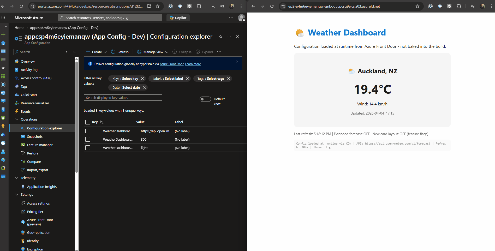
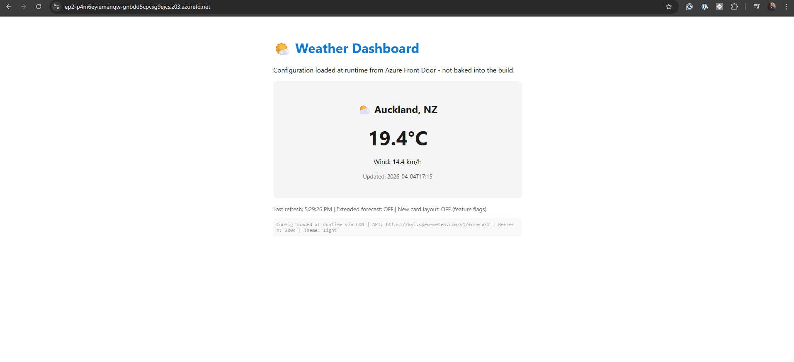
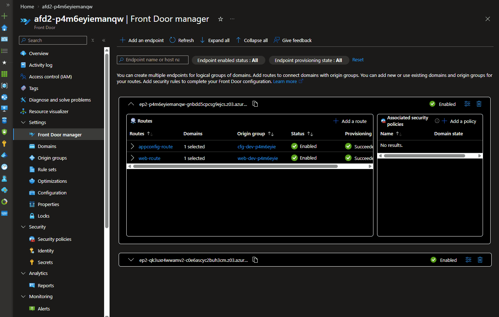
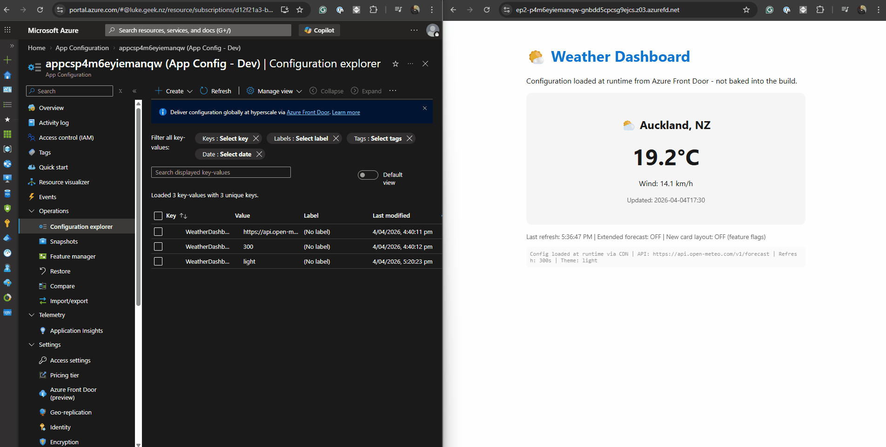

Today, we are going to look at a preview feature that solves one of the most common pain points in SPA deployments - build-time environment variable injection - using [Azure App Configuration](https://learn.microsoft.com/azure/azure-app-configuration/overview?WT.mc_id=AZ-MVP-5004796) with [Azure Front Door](https://learn.microsoft.com/azure/frontdoor/front-door-overview?WT.mc_id=AZ-MVP-5004796).

If you have ever had to rebuild a React or Vue app just because the API URL changed between staging and production, this one is for you.

{/* truncate */}

:::info
This article walks through a proof of concept using preview SDKs. The pattern is production-applicable, but the Azure Front Door integration for App Configuration is currently in [public preview](https://learn.microsoft.com/azure/azure-app-configuration/concept-hyperscale-client-configuration?WT.mc_id=AZ-MVP-5004796). SDK versions and APIs may change before GA.
:::

## The Problem Everyone Has Hit

Every Vite, React, Next.js, or Vue developer knows this pattern:

```dockerfile
# Build stage - config is compiled INTO the JavaScript
ARG VITE_API_URL
ENV VITE_API_URL=$VITE_API_URL
RUN npm run build
```

Vite replaces `import.meta.env.VITE_API_URL` with the literal string value at build time. The output JavaScript file contains `"https://api-staging.example.com"` as a hardcoded constant. To point at production, you rebuild the entire application.

This causes real problems:

- **One build per environment** - staging, UAT, production each need their own Docker image or pipeline run
- **Leaked URLs** - a staging API hostname baked into a production bundle is a common incident
- **CI/CD coupling** - your frontend pipeline needs to know infrastructure details at build time
- **No runtime changes** - updating a feature flag or API version requires a full rebuild and redeploy

Because of this issue, I developed my own Copilot skill dedicated entirely to diagnosing `ERR_NAME_NOT_RESOLVED` errors caused by incorrect build-time URLs. The fact that this needs its own troubleshooting guide tells you something about how often it goes wrong.

## What Changed

In late 2025, Azure App Configuration added [Azure Front Door integration](https://learn.microsoft.com/azure/azure-app-configuration/concept-hyperscale-client-configuration?WT.mc_id=AZ-MVP-5004796). The idea is straightforward: serve your configuration through a CDN endpoint that browsers can call directly, without authentication.

The architecture shift looks like this:

**Before (build-time injection):**

```text
Build Pipeline → injects VITE_API_URL → npm run build → baked into JS bundle
                                                              ↓
                                              One artifact per environment
```

**After (runtime fetch via CDN):**

```text
npm run build → single artifact (no config baked in)
                         ↓
Browser loads app → JS calls Front Door CDN endpoint (HTTPS GET, no auth)
                         ↓
Front Door → (managed identity) → App Configuration store → returns JSON
                         ↓
App receives { "ApiUrl": "https://api-prod.example.com", "Theme": "dark" }
```

The built JavaScript bundle is identical across dev, staging, and production. Configuration arrives as an HTTP response at runtime, not as compiled constants.



_Runtime config and feature flags are delivered at request time via Front Door, not compiled into the bundle._

## Why Front Door? Can I Just Use App Configuration Directly?

This is the first question I had. Azure App Configuration already has a JavaScript SDK (`[@azure/app-configuration](https://learn.microsoft.com/javascript/api/overview/azure/app-configuration-readme?view=azure-node-latest&WT.mc_id=AZ-MVP-5004796)`). Why add Front Door in the middle?

> The answer is authentication. App Configuration requires credentials to access - either a connection string or a Microsoft Entra ID token. An SPA running in a browser cannot securely hold either of these. You cannot embed a connection string in JavaScript that ships to the client. And you cannot run `DefaultAzureCredential` in a browser - there is no managed identity context.

Front Door solves this by acting as an authentication proxy:

|                          | App Configuration Direct               | App Configuration + Front Door           |
| ------------------------ | -------------------------------------- | ---------------------------------------- |
| **Client auth required** | Yes (connection string or Entra token) | No (unauthenticated HTTPS GET)           |
| **Works in browser/SPA** | No (cannot hold secrets)               | Yes                                      |
| **Works server-side**    | Yes (managed identity)                 | Yes (but overkill)                       |
| **CDN caching**          | No                                     | Yes (global edge, DDoS protection)       |
| **Scoped exposure**      | N/A (full access with credentials)     | Yes (only configured key filters served) |
| **Feature flags**        | Yes                                    | Yes                                      |
| **Cost**                 | App Config only                        | App Config + Front Door Standard/Premium |

**The rule is simple:** server-side apps (APIs, Functions, background workers) use App Configuration directly with managed identity. Client-side apps (SPAs, mobile) that cannot hold secrets use App Configuration through Front Door.

This is not a replacement for server-side App Configuration. It is the missing piece for browser-based clients that previously had no safe way to consume runtime configuration.

## Does This Work on Azure Static Web Apps?

Yes. This is one of the strongest use cases.

[Azure Static Web Apps](https://learn.microsoft.com/azure/static-web-apps/overview?WT.mc_id=AZ-MVP-5004796) serves pre-built static files from a global CDN. There is no server-side runtime to inject environment variables at request time. Today, if you need a different config per environment (staging vs production), you either:

1. Rebuild the app per environment with different `VITE_*` build args
2. Use a workaround like a `/config.json` file served from the API backend
3. Use Static Web Apps [environment variables](https://learn.microsoft.com/azure/static-web-apps/application-settings?WT.mc_id=AZ-MVP-5004796) injected at build time (same rebuild problem)

With App Configuration + Front Door, none of this is needed. The built JavaScript makes an HTTPS `fetch()` call to the Front Door CDN endpoint when the app loads. It works the same way whether the app is hosted on Static Web Apps, Blob Storage with a CDN, or Nginx in a container. The hosting platform does not matter because the config fetch is a standard browser HTTP request.



_In this demo, accessing via the Front Door endpoint is the intended path; the direct Static Web App hostname is intentionally not the runtime-config path._

The deployment flow becomes:

```text
GitHub Actions → npm run build → deploy to Static Web App (once)
                                        ↓
              The same artifact serves staging AND production
              Config values differ per App Configuration store/labels
```

No rebuild per environment. No pipeline secrets leaking into static assets.

## The Scenario

To demonstrate this, I built a simple weather dashboard SPA. It has three settings that traditionally would be build-time environment variables:

If you want the full deployable implementation (Vite app + Bicep + `azd` workflows), the companion repository is here: [lukemurraynz/appconfig-frontdoor-spa-demo](https://github.com/lukemurraynz/appconfig-frontdoor-spa-demo).

| Setting                                   | Purpose                | Traditional Approach                 |
| ----------------------------------------- | ---------------------- | ------------------------------------ |
| `WeatherDashboard:ApiUrl`                 | Backend API endpoint   | `VITE_API_URL` build arg             |
| `WeatherDashboard:RefreshIntervalSeconds` | Data refresh frequency | Hardcoded or `VITE_REFRESH_INTERVAL` |
| `WeatherDashboard:Theme`                  | UI theme (light/dark)  | `VITE_THEME` or CSS variable         |

It also has a feature flag - `WeatherDashboard.ExtendedForecast` - that toggles an extended forecast section on and off without a code change or redeploy. This is the kind of thing you would normally hardcode or gate behind a build-time flag.

With App Configuration + Front Door, all three settings and the feature flag become runtime-fetched values that can be changed in the Azure portal without touching the deployed application.

## Setting Up the Azure Resources

You need two Azure resources: an App Configuration store and an Azure Front Door profile.

### Step 1: Create the App Configuration Store

```bash
az appconfig create \
  --name appconfig-weather-demo \
  --resource-group rg-appconfig-demo \
  --location australiaeast \
  --sku Standard
```

:::note
The Free tier works for testing, but Standard is required for production workloads (replicas, Private Link, higher request limits).
:::

### Step 2: Add Configuration Values

```bash
az appconfig kv set --name appconfig-weather-demo \
  --key "WeatherDashboard:ApiUrl" \
  --value "https://api.open-meteo.com/v1/forecast" -y

az appconfig kv set --name appconfig-weather-demo \
  --key "WeatherDashboard:RefreshIntervalSeconds" \
  --value "300" -y

az appconfig kv set --name appconfig-weather-demo \
  --key "WeatherDashboard:Theme" \
  --value "light" -y
```

I am using the [Open-Meteo API](https://open-meteo.com/) here because it is free, requires no API key, and returns real weather data. This keeps the demo self-contained with no additional service dependencies.

#### Add a Feature Flag

```bash
az appconfig feature set --name appconfig-weather-demo \
  --feature "WeatherDashboard.ExtendedForecast" \
  --description "Show extended 3-day forecast section" -y

az appconfig feature enable --name appconfig-weather-demo \
  --feature "WeatherDashboard.ExtendedForecast" -y
```

Feature flags in App Configuration are stored as key-values with a reserved prefix (`.appconfig.featureflag/`). When you configure the Front Door endpoint, the **Key of feature flag filter** field controls which flags are exposed. Set it to `WeatherDashboard.*` to match our flag.

### Step 3: Connect Azure Front Door

In the Azure portal:

1. Navigate to your App Configuration store
2. Under **Settings**, select **Azure Front Door (preview)**
3. Select **Create new** profile
4. Configure:
   - **Profile name**: `afd-weather-config`
   - **Pricing tier**: Standard
   - **Endpoint name**: `weather-config`
   - **Origin host name**: select your App Configuration store
   - **Identity type**: System-assigned managed identity
   - **Cache Duration**: 10 minutes
   - **Key filter**: `WeatherDashboard:*`
   - **Feature flag filter**: `WeatherDashboard.*`

5. Select **Create & Connect**

The portal automatically assigns the **App Configuration Data Reader** role to the managed identity.

:::warning

The key filter you configure on the Front Door endpoint must **exactly match** the selector in your application code. If your app requests `WeatherDashboard:*` but Front Door is configured for `Weather:*`, the request will be rejected. This is the most common setup mistake.

:::

After creation, note your Front Door endpoint URL from the **Existing endpoints** table. It looks like: `https://weather-config-xxxxxxxxx.z01.azurefd.net`

### What This Looks Like in IaC (from my demo repo)

The demo also codifies the App Configuration-to-Front Door relationship in Bicep, so it is reproducible across environments. I had to reverse engineer the ARM template here: [App Configuration integration with Azure Front Door](https://github.com/azure/azure-quickstart-templates/tree/master/quickstarts/microsoft.appconfiguration/app-configuration-afd).

**1. App Configuration resource linked to Front Door profile** (`infra/main.bicep`):

```bicep
resource appConfig 'Microsoft.AppConfiguration/configurationStores@2025-06-01-preview' = {
  name: appConfigName
  location: location
  sku: {
    name: 'standard'
  }
  properties: {
    azureFrontDoor: {
      resourceId: frontDoorProfileRef.id
    }
  }
}
```

**2. AFD managed identity auth scope for App Configuration origin** (`infra/modules/frontdoor-environment.bicep`):

```bicep
resource configOriginGroup 'Microsoft.Cdn/profiles/originGroups@2025-06-01' = {
  parent: frontDoorProfile
  name: configOriginGroupName
  properties: {
    authentication: {
      type: 'SystemAssignedIdentity'
      scope: 'https://appconfig.azure.com/.default'
    }
  }
}
```

That `scope` value is the AFD token audience for App Configuration. Combined with `App Configuration Data Reader` role assignment, Front Door can fetch config on behalf of the browser while keeping credentials out of client code.



_This is the live outcome: runtime values and feature flags can differ by environment without rebuilding the SPA._

If you want to deploy exactly this setup, use the repo's `azd up` flow and scripts documented in [the demo README](https://github.com/lukemurraynz/appconfig-frontdoor-spa-demo/blob/main/README.md).

## Building the Weather Dashboard

The demo is a vanilla TypeScript application built with Vite. No framework dependencies beyond what I needed to demonstrate the pattern.

### Project Setup

```bash
npm create vite@latest weather-dashboard -- --template vanilla-ts
cd weather-dashboard
npm install
npm install @azure/app-configuration-provider@2.3.0-preview.1
npm install @microsoft/feature-management
```

### The Configuration Loader

Create `src/config.ts`:

```typescript
import { loadFromAzureFrontDoor } from "@azure/app-configuration-provider";
import {
  FeatureManager,
  ConfigurationMapFeatureFlagProvider,
} from "@microsoft/feature-management";

export interface AppConfig {
  apiUrl: string;
  refreshIntervalSeconds: number;
  theme: "light" | "dark";
  featureManager: FeatureManager;
}

const AFD_ENDPOINT =
  import.meta.env.VITE_AFD_ENDPOINT ??
  "https://weather-config-xxxxxxxxx.z01.azurefd.net";

export async function loadConfig(): Promise<AppConfig> {
  const settingsMap = await loadFromAzureFrontDoor(AFD_ENDPOINT, {
    selectors: [{ keyFilter: "WeatherDashboard:*" }],
    featureFlagOptions: { enabled: true },
    refreshOptions: {
      enabled: true,
      refreshIntervalInMs: 60_000,
    },
  });

  const featureManager = new FeatureManager(
    new ConfigurationMapFeatureFlagProvider(settingsMap),
  );

  return {
    apiUrl:
      settingsMap.get("WeatherDashboard:ApiUrl") ??
      "https://api.open-meteo.com/v1/forecast",
    refreshIntervalSeconds: parseInt(
      settingsMap.get("WeatherDashboard:RefreshIntervalSeconds") ?? "300",
      10,
    ),
    theme:
      (settingsMap.get("WeatherDashboard:Theme") as "light" | "dark") ??
      "light",
    featureManager,
  };
}
```

Two things to notice:

1. `featureFlagOptions: { enabled: true }` tells the provider to load feature flags alongside key-values. Feature flags use the reserved `.appconfig.featureflag/` prefix, which the provider handles automatically.
2. `ConfigurationMapFeatureFlagProvider` wraps the settings map so `FeatureManager` can evaluate flags. You then use `featureManager.isEnabled("WeatherDashboard.ExtendedForecast")` anywhere in your app.

The only "baked in" value is the Front Door endpoint URL itself. This URL is stable per environment and rarely changes, unlike API endpoints, feature flags, and display settings. You could also inject it as a single build arg or serve it from a `/config.json` on the same host.

The feature flag evaluation happens at runtime on every refresh cycle. Toggle `WeatherDashboard.ExtendedForecast` on or off in the Azure portal, and the extended forecast section appears or disappears on the next refresh - no rebuild, no redeploy.

## Running It

Open the deployed website. You should see:

1. A brief "Loading configuration from Azure Front Door..." message
2. The weather card populated with real Auckland weather data
3. A footer showing the config source: `Config loaded at runtime via CDN | API: https://api.open-meteo.com/v1/forecast | Refresh: 300s | Theme: light`

Now go to the Azure portal and try two things:

1. Change `WeatherDashboard:Theme` from `light` to `dark` - the app switches themes on the next refresh
2. Disable the `WeatherDashboard.ExtendedForecast` feature flag - the 3-day forecast section disappears

Both changes take effect without a rebuild or redeploy. The status bar shows the feature flag state so you can confirm it is working.

## The Docker Build - One Artifact, Every Environment

Here is where the value becomes concrete. The Dockerfile no longer needs environment-specific build args:

```dockerfile
FROM node:22-alpine AS build
WORKDIR /app
COPY package*.json .
RUN npm ci
COPY . .
RUN npm run build

FROM nginx:alpine
COPY --from=build /app/dist /usr/share/nginx/html
EXPOSE 80
```

No `ARG VITE_API_URL`. No `ENV VITE_API_URL`. The same image runs in dev, staging, and production.

The only environment-specific value is the Front Door endpoint URL, which you can inject via a single environment variable or serve from a static `/config.json` on the same origin. Everything else - API URLs, refresh intervals, themes, feature flags - comes from App Configuration through Front Door at runtime.



_One artifact, multiple environments: shared Front Door profile, separate endpoints/stores, isolated runtime config._

## Security Considerations

The Front Door endpoint is unauthenticated. Any browser (or `curl`) can hit it. This is the same threat model as any public CDN asset.

**What is safe to serve through this channel:**

- UI themes and display strings
- Public API base URLs (these are already visible in your JS bundle today)
- Feature flags for non-sensitive features
- Version numbers and refresh intervals

**What should never go through this channel:**

- API keys, tokens, or connection strings
- Internal service URLs that reveal infrastructure
- Business-critical pricing or logic config that competitors should not see

Sensitive configuration stays server-side with managed identity authentication. The Front Door channel is for config that is already effectively public in your shipped JavaScript bundle.

## Gotchas I Found

**Filter matching is character-exact.** The `keyFilter` in your JavaScript must match the filter configured on the Front Door endpoint character-for-character. `WeatherDashboard:*` in code with `WeatherDashboard*` (no colon) in Front Door equals a rejected request with no useful error message.

**No sentinel key refresh.** Unlike server-side App Configuration, you cannot use a sentinel key to trigger refresh. The SDK uses "monitor all selected keys" mode, which checks all keys for changes on the refresh interval.

**Cache TTL matters.** Front Door caches responses. If you set a 10-minute cache TTL, config changes take up to 10 minutes to reach clients. Setting it too low increases origin requests and risks throttling your App Configuration store.

**Language support is limited.** As of April 2026, only JavaScript (`@azure/app-configuration-provider` v2.3.0-preview) and .NET (`Microsoft.Extensions.Configuration.AzureAppConfiguration` v8.5.0-preview) have Front Door support. Java, Python, and Go are listed as "work in progress."

## When to Use This Pattern

This pattern makes sense when:

- You deploy the same SPA to multiple environments and are tired of rebuilding per environment
- You want to change feature flags or display settings without a CI/CD run
- Your SPA currently uses `VITE_*` or `NEXT_PUBLIC_*` build args for configuration that changes between environments
- You need CDN-level performance for config delivery (global latency, DDoS protection)

It is less suited for:

- Server-rendered applications (use server-side App Configuration with managed identity instead)
- Apps with only one or two config values that genuinely never change
- Configurations containing secrets (these must stay server-side)

## Wrapping Up

Build-time environment variable injection for SPAs is a pattern that works until it does not. The moment you need multiple environments, runtime config changes, or deploy the same artifact across regions, the rebuild-per-environment model becomes a liability.

Azure App Configuration with Front Door moves SPA configuration from compile-time constants to runtime-fetched data, delivered through a CDN. The trade-off is clear: you accept eventual consistency (cache TTL) and a public endpoint (no per-client auth) in exchange for a single build artifact and runtime configuration changes.

The feature is still in preview, and the SDK support is limited to JavaScript and .NET. But the architectural pattern - fetch config as data, not compile it as code - is sound and worth exploring now.

> Want to deploy this exact walkthrough end-to-end? Start with the companion repo: [lukemurraynz/appconfig-frontdoor-spa-demo](https://github.com/lukemurraynz/appconfig-frontdoor-spa-demo) (includes Bicep, `azd` provisioning, and runtime config/feature-flag demo scripts).
>
> You can also check the official Microsoft samples on GitHub: [JavaScript SPA sample](https://github.com/Azure-Samples/appconfig-javascript-clientapp-with-afd) (a full React chatbot with A/B testing across LLM models) and [.NET MAUI sample](https://github.com/Azure-Samples/appconfig-maui-app-with-afd).
