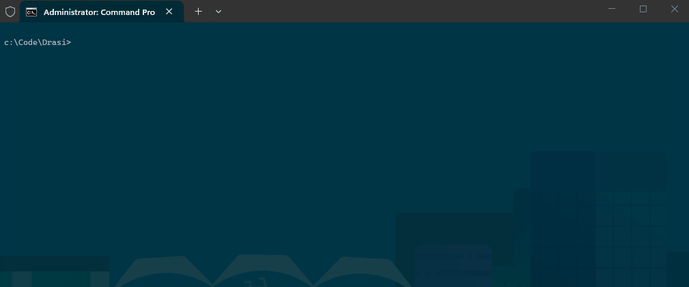
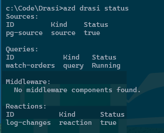
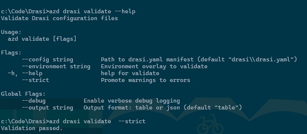
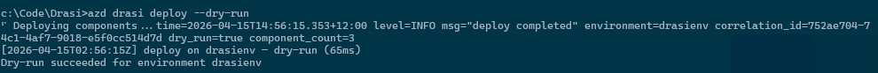
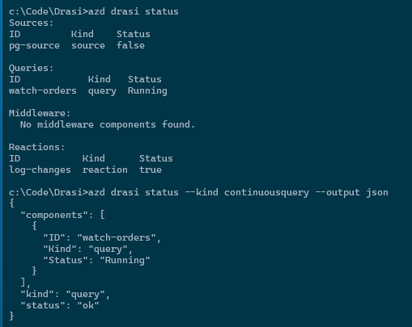
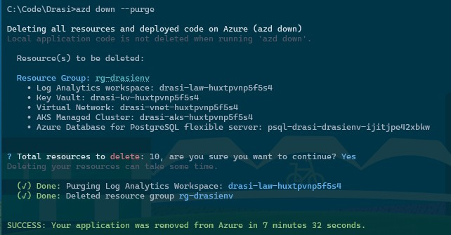

I have deployed [Drasi](https://drasi.io/) enough times now to know exactly where the pain shows up: too much manual scaffolding, inconsistent post-provision steps, and "it worked in one environment but not the other" cluster setup drift.

So I built a custom [Azure Developer CLI extension](https://learn.microsoft.com/azure/developer/azure-developer-cli/extensions/overview?WT.mc_id=AZ-MVP-5004796) for [AZD](https://learn.microsoft.com/azure/developer/azure-developer-cli/overview?tabs=windows&WT.mc_id=AZ-MVP-5004796) called `azure.drasi` to standardize that workflow end-to-end.

It gives you a clean, repeatable way to:

- Scaffold [Drasi](https://drasi.io/) projects from templates
- Validate config before touching infrastructure
- Provision [AKS](https://learn.microsoft.com/azure/aks/what-is-aks?WT.mc_id=AZ-MVP-5004796) + supporting Azure resources in one flow
- Deploy sources, queries, middleware, and reactions in dependency order
- Operate and troubleshoot Drasi workloads with native `azd` commands

{/* truncate */}

## Why I Built This

Drasi deployments are not just "deploy app and move on". You normally need to coordinate:

- Azure Kubernetes Service (AKS) configuration (including Workload Identity)
- Namespace/runtime setup
- Managed identity + Key Vault + diagnostics plumbing
- Correct deployment order for Drasi components

This is exactly the kind of process that becomes fragile if left to handwritten, ad hoc scripts per repo.

The extension wraps those moving parts into a consistent set of AZD commands, so your Drasi workloads feel like any other `azd` project lifecycle.

## What the Extension Covers

The current `azure.drasi` extension supports:

- Project scaffolding templates:
  - `blank`
  - `blank-terraform`
  - `cosmos-change-feed`
  - `event-hub-routing`
  - `query-subscription`
  - `postgresql-source`

### Supported Template Matrix

| Template | Best for | Typical use case |
| --- | --- | --- |
| `blank` | Starting from scratch | Build a custom Drasi topology with your own sources/queries/reactions |
| `blank-terraform` | Infra-first teams | Use Terraform-based provisioning workflows with Drasi project scaffolding |
| `cosmos-change-feed` | Change data capture scenarios | React to Azure Cosmos DB changes and project updates downstream |
| `event-hub-routing` | Streaming/event routing | Ingest from Event Hubs and route/filter events with Drasi queries |
| `query-subscription` | Read model/materialized view patterns | Attach subscribers to query outputs for downstream processing |
| `postgresql-source` | Relational CDC demos/POCs | Capture PostgreSQL changes and validate end-to-end Drasi flow quickly |

- **These templates are starting points, not rigid blueprints.** Before you run `azd drasi provision`, you can modify infrastructure settings (for example VM sizes/SKUs, PostgreSQL sizing, networking, and environment parameters) to fit your subscription limits, region availability, and production standards.

- Offline validation of Drasi config before deployment
- Infrastructure provisioning for AKS, Key Vault, UAMI, and Log Analytics
- Ordered Drasi component deployment with health checks
- Operations commands for status, logs, and diagnostics
- Safe teardown and runtime upgrade actions



## Installation

Install the extension from my GitHub Releases registry:

```bash
azd extension source add -n drasi-lukemurray-azdext -t url -l "https://github.com/lukemurraynz/azd.extensions.drasi/releases/latest/download/registry.json"
azd extension install azure.drasi -s drasi-lukemurray-azdext
```

Verify:

```bash
azd drasi --help
azd drasi version
```


You can upgrade the extension with the latest upstream version from my repo using:

```bash
azd extension upgrade azure.drasi
```

## Quick Start (First Run)

This is the fast path from an empty folder to deployed Drasi components:

```bash
mkdir my-drasi-app && cd my-drasi-app
azd init --minimal -force
azd drasi init --template postgresql-source
azd env new drasienv
azd drasi validate --strict
azd auth login
az login
azd drasi provision
azd drasi deploy
azd drasi status
```

> **Cost note:** `azd drasi provision` can create billable resources (especially AKS and Log Analytics). Use a dedicated dev/test subscription or budget guardrails for experimentation. The following are example costs only to give a view of cost; Azure Developer CLI shines with the removal and redeployment of entire environments.

The `postgresql-source` template baseline (SKUs as defined in the Bicep: 2× `Standard_D2s_v5` AKS nodes, `Standard_B1ms` PostgreSQL, Standard NAT Gateway + Public IP) — estimated USD, pay-as-you-go, 24 h/day:

**newzealandnorth**

| Resource | SKU | 1 day | 7 days | 30 days |
|---|---|---:|---:|---:|
| AKS nodes ×2 | Standard_D2s_v5 | $6.05 | $42.34 | $181.44 |
| PostgreSQL compute | Standard_B1ms (Burstable) | $0.66 | $4.59 | $19.66 |
| NAT Gateway | Standard | $1.08 | $7.56 | $32.40 |
| Public IP | Standard Static | $0.12 | $0.84 | $3.60 |
| **Total** | | **$7.90** | **$55.32** | **$237.10** |

_Key Vault (Standard) and Log Analytics are consumption-based: Key Vault is negligible for dev use; Log Analytics adds $3.51/GB (NZ North) above the 5 GB/day free allowance. VNet and managed identities are free._

> **Region note:** If a SKU/offer is restricted in your default location, set a supported region before provisioning. For example:

```bash
azd env set AZURE_LOCATION australiaeast
azd drasi provision
```

This flow is intentionally opinionated: validate early, provision once, then deploy in a known order.




## Common Scenarios

These are the scenarios I hit most often when building demos and internal proofs-of-concept.

### 1. Scaffold and Start with a Known Pattern

When you want to get moving quickly with a real source/reaction shape, start from a template:

```bash
azd drasi init --template event-hub-routing
azd drasi validate
```

This avoids copy/paste YAML drift and gives you a repeatable baseline across contributors.

### 2. Validate in CI Before Provision/Deploy

If you want fast feedback on pull requests:

```bash
azd drasi validate --strict
```



Because validation runs offline, you can fail quickly without needing cluster access.

### 3. Dry-Run Before a Live Deploy

Useful when you want confidence in component changes:

```bash
azd drasi deploy --dry-run
```



Think of this as your safety rail before touching a shared environment.

### 4. Multi-Environment Deployments

Use overlays and environment targeting for dev/stage/prod separation:

```bash
azd drasi provision --environment dev
azd drasi deploy --environment dev

azd drasi provision --environment prod
azd drasi deploy --environment prod
```

This is where the extension helps prevent "prod got dev settings" moments.

### 5. Operate and Troubleshoot a Running Deployment

```bash
azd drasi status
azd drasi status --kind continuousquery --output json
azd drasi logs --kind continuousquery --component order-changes
azd drasi diagnose
```

The `diagnose` command is especially useful when something is failing across auth, cluster connectivity, or runtime dependencies.



### 6. Teardown with Guardrails

```bash
# Components only
azd drasi teardown --force

# Components + infrastructure
azd drasi teardown --force --infrastructure
```

> **Cleanup note:** If infrastructure remains provisioned, AKS and Log Analytics can continue incurring cost. Use `azd drasi teardown --force --infrastructure` (or `azd down` when applicable) to clean up fully.


This is force-gated by design so you are less likely to accidentally wipe an environment.

And a normal `azd down` works:



## Day-2 Operations Notes

Some practical notes after using this in repeated demo cycles:

- Prefer `--environment` consistently, even in dev, so context switching is explicit.
- Use `--output json` in automation jobs where you need a machine-readable state.
- Keep secrets in Key Vault references and out of repo config.
- Use `validate --strict` as a pre-deploy gate in CI.

## Gotchas I Found

**Kube context confusion still happens.** If your local context points at the wrong cluster, operations commands can surprise you. Prefer explicit environment targeting where possible.

**Validation is not a replacement for live diagnostics.** `validate` catches config-level issues early, but connectivity/auth/runtime checks still belong to `diagnose` on a live target.

**Teardown is intentionally friction-filled.** You must use `--force`, and that is a good thing.

## Who This Is For

This extension is useful if you:

- Deploy Drasi repeatedly across multiple environments
- Want a reusable bootstrap path for sources/queries/reactions
- Need cleaner team handover (same commands, same flow)
- Prefer AZD-native workflows over custom one-off scripts

If you only run one tiny local experiment once, this may feel like overkill. For anything beyond that, consistency pays for itself quickly.

## Wrapping Up

The main goal of `azure.drasi` is simple: remove the repetitive plumbing and make Drasi delivery predictable.

Instead of rebuilding the same script stack every time, you can use one AZD extension workflow to scaffold, validate, provision, deploy, operate, and clean up.

I will add more walkthrough GIFs and scenario demos over time, but the extension is already usable today for practical Drasi workflows.

> Code: [lukemurraynz/azd.extensions.drasi](https://github.com/lukemurraynz/azd.extensions.drasi)

If you try `azure.drasi`, I’d love your feedback:

- Issues: [Report bugs or request features](https://github.com/lukemurraynz/azd.extensions.drasi/issues)
