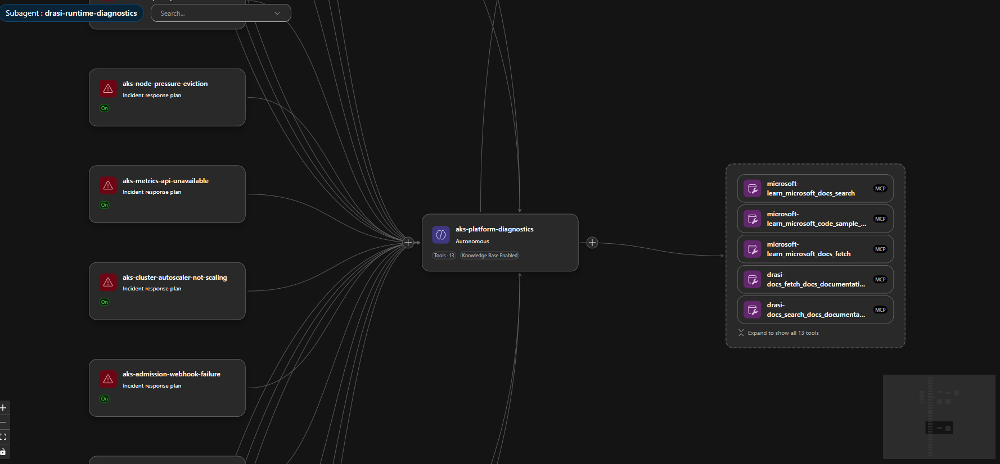

I have been spending time with [Azure SRE Agent](https://learn.microsoft.com/azure/sre-agent/overview?WT.mc_id=AZ-MVP-5004796) and wanted to see how far I could take it beyond the "click around the portal" experience.

The goal was simple: build a public, repeatable blueprint that deploys an Azure SRE Agent for [AKS](https://learn.microsoft.com/azure/aks/what-is-aks?WT.mc_id=AZ-MVP-5004796) and [Drasi](https://drasi.io/) operations with:

- infrastructure deployed through [Azure Developer CLI](https://learn.microsoft.com/azure/developer/azure-developer-cli/overview?WT.mc_id=AZ-MVP-5004796)
- custom SRE subagents
- skills and runbooks
- Azure Monitor response plans
- scheduled health checks
- MCP connectors for Microsoft Learn and Drasi docs
- fault-injection tests for AKS and Drasi failure modes

The result is an [Azure SRE Agent with support for Drasi on AKS](https://github.com/lukemurraynz/drasi-aks-sre-agent/) that can be deployed with `azd up` using an AVM-style (Azure Verified Modules) Bicep module and PowerShell.

{/* truncate */}

[Azure SRE Agent Operations Hub](images/AzureSREAgent_AKSDrasiOperationsHubOverview.png)

## Why I Built This

[Drasi](https://drasi.io/) is a good workload for this pattern because it sits right on the boundary between application runtime and platform reliability.

When a Drasi query is stale or a source is not delivering changes, the root cause might be Drasi itself.

But it might also be:

- an AKS scheduling problem
- a missing metrics API
- a broken admission webhook
- a node under pressure
- a stopped cluster
- a DCR or DCRA problem
- a private-cluster operations path issue.

That is where [SRE Agent](https://learn.microsoft.com/azure/sre-agent/overview?tabs=task&WT.mc_id=AZ-MVP-5004796) becomes interesting. I had a lot of fun setting this up, and the mind boggles at what this can do!

The Azure SRE Agent can receive an incident from Azure Monitor, route it to a specialist agent, collect evidence, reason through likely causes, and either propose or execute a remediation depending on the response plan mode.

The trick is giving it enough structure so it does not treat every symptom as 'restart the app' - and go through appropriate troubleshooting and evidence gathering steps.

## What this Blueprint Deploys

The [lukemurraynz/drasi-aks-sre-agent](https://github.com/lukemurraynz/drasi-aks-sre-agent/) repository can help you deploy the resources for SRE Agent with Bicep and wire the agent configuration through a post-provision script.

```text
drasi-aks-sre-agent/
├── infra/
│   ├── main.bicep
│   ├── drasi-sre-agent.bicep
│   └── drasi-sre-agent-rbac.bicep
├── avm/
│   └── res/app/agent/main.bicep
├── scripts/
│   └── setup-sre-agent.ps1
├── sre-config/
│   ├── agents/
│   ├── skills/
│   ├── response-plans/
│   ├── scheduled-tasks/
│   └── testing/
└── azure.yaml
```

At a high level, `azd up` gives you:

- `Microsoft.App/agents` Azure SRE Agent
- managed identity for resource operations
- Application Insights
- Log Analytics workspace integration
- Azure Monitor incident platform
- Azure Monitor, Log Analytics, Application Insights, Microsoft Learn, and Drasi docs connectors
- response plans for AKS and Drasi incidents
- scheduled health probes and daily resilience summaries
- scoped RBAC for the Drasi resource group and AKS cluster

[Azure Deployed Resources](images/AzureSREAgent_AzureDeployedResourceOverview.png)

## Agent Design

I split the agent capability into four custom agents:

| Agent                       | Purpose                                                                                             |
| --------------------------- | --------------------------------------------------------------------------------------------------- |
| `drasi-incident-triage`     | First responder. Classifies the incident and routes by failure phase.                               |
| `aks-platform-diagnostics`  | Handles AKS, node, networking, autoscaler, metrics, admission, and upgrade issues.                  |
| `drasi-runtime-diagnostics` | Handles Drasi sources, continuous queries, reactions, Dapr, Redis, Mongo, and Drasi rollout issues. |
| `drasi-remediation-review`  | Reviews proposed fixes for evidence, risk, rollback, and validation.                                |

I did not want the Drasi runtime agent to debug a cluster-wide scheduling issue. I also don't want the AKS agent deleting Drasi resources when a query or source isn't working.

So the response plans route by failure phase first:

| Failure phase                                                 | Prefer this route                                           |
| ------------------------------------------------------------- | ----------------------------------------------------------- |
| Pod creation fails                                            | Admission webhook, workload identity, policy, or API server |
| Pod is pending                                                | Scheduler, node capacity, autoscaler, subnet, or quota      |
| HPA/KEDA is blind                                             | Metrics API or external metrics API                         |
| Broad `kubectl` and controller timeouts                       | API server, konnectivity, node/network health               |
| Only Drasi resources are unhealthy after source/query changes | Drasi lifecycle diagnostics                                 |

[Azure SRE Agent - Agent Canvas View](images/AzureSREAgent_DrasiAKS_AgentCanvas_TableView.gif)

## Built-In Skills Still Matter

One thing I tested was whether custom skills replaced the built-in skills.

They should not.

For [Azure Kubernetes Service (AKS)](https://learn.microsoft.com/azure/aks/what-is-aks?WT.mc_id=AZ-MVP-5004796), the built-in `aks_general` skill is still useful for generic Kubernetes operations. The custom `aks-platform-diagnostics` skill I added contains the more local context for Drasi, known false-positive patterns, and our route-specific evidence bundles.

The setup script only upserts custom skills and agents. It does not overwrite the built-in SRE Agent skills.

That distinction matters because future platform improvements should continue to flow through the built-in skill set.

## Custom Skills

Skills are the runbooks that tell each agent what to collect, what to query, and how to reason before proposing a fix.

I wrote three custom skills for this blueprint:

| Skill | Attached to | Evidence bundle |
| --- | --- | --- |
| `aks-platform-diagnostics` | `aks-platform-diagnostics` agent | Node status, pod events, admission webhook health, metrics API availability, konnectivity tunnel state, SNAT stats |
| `drasi-runtime-diagnostics` | `drasi-runtime-diagnostics` agent | Drasi source and query status, Dapr sidecar health, Redis and Mongo connectivity, resource-provider logs |
| `drasi-remediation-review` | `drasi-remediation-review` agent | Evidence completeness checklist, risk classification, rollback path verification, validation steps |

The setup script applies them on every `azd up` without touching the built-in skills.

I kept each evidence bundle deliberately narrow. The Drasi runtime skill, for example, always checks source status before looking at any continuous query — because a stale-looking query usually has a source connection problem behind it. If I left that ordering to the model, it would take longer and sometimes go the wrong way.

[Azure SRE Agent - Skills View](images/AzureSREAgent_DrasiAKS_SkillsView.gif)

## Connector Lesson: Connected Does Not Always Mean Enabled

The first issue I hit was with the Microsoft Learn and Drasi docs MCP connectors.

The connector status was healthy, but the tools were not active for the agent. In the portal, they showed up as connected but with zero active tools.

:::warning
A healthy connector status does not mean the tools are active for your agent. Always verify the tool assignment in the portal, not just the connector health indicator.
:::

The fix was to configure both the connector metadata and the agent tool assignment:

```powershell
Enable-AgentTools -ToolNames @(
  'microsoft-learn_microsoft_docs_search',
  'microsoft-learn_microsoft_code_sample_search',
  'microsoft-learn_microsoft_docs_fetch',
  'drasi-docs_fetch_docs_documentation',
  'drasi-docs_search_docs_documentation',
  'drasi-docs_search_docs_code',
  'drasi-docs_fetch_generic_url_content'
)
```

After that, the agent had access to current Microsoft documentation and live Drasi docs during investigations.

[Azure SRE Agent Tools](images/AzureSREAgent_DrasiAKS_ToolsView.gif)

## Response Plans

The repo includes direct routes for common [Azure Kubernetes Service (AKS)](https://learn.microsoft.com/azure/aks/what-is-aks?WT.mc_id=AZ-MVP-5004796) and [Drasi](https://drasi.io/) incidents.

For [Azure Kubernetes Service (AKS)](https://learn.microsoft.com/azure/aks/what-is-aks?WT.mc_id=AZ-MVP-5004796):

- cluster stopped
- CoreDNS unavailable
- node pressure
- image pull failures
- pod scheduling failures
- storage mount failures
- Dapr system faults
- Cilium/network faults
- Azure Monitor agent faults
- admission webhook failures
- autoscaler stuck or capped
- metrics API unavailable
- SNAT port exhaustion
- API server overload
- konnectivity tunnel faults
- AKS upgrade blockers
- namespace or PVC stuck terminating

For [Drasi](https://drasi.io/):

- platform fault
- source unavailable
- query staleness
- reaction unavailable
- Redis/Mongo/Dapr state store faults
- partial upgrade or failed rollback
- source bootstrap race
- source dependency break

Most routes stay in **Review** mode. One route is intentionally **Autonomous**:

```json
{
    "id": "aks-cluster-stopped",
    "handlingAgent": "aks-platform-diagnostics",
    "agentMode": "autonomous"
}
```

If the cluster is stopped, the agent is allowed to start the same AKS cluster _(if you grant it permissions to the resource through the User Assigned managed identity to do so)_ otherwise, you can have this notify you through email/teams, and you can elevate the permissions _(as long as you yourself have access to do so)_:

```bash
az aks start -g <resource-group> -n <aks-cluster-name>
```

That is a bounded, reversible-enough action for my use case. It does not authorize node-pool scale-out, upgrades, networking changes, add-on changes, or cluster recreation.

:::warning
Autonomy should be route-specific. Do not make the entire agent autonomous, as a single remediation is sufficient for your environment.
:::

[Azure SRE Agent - Stopped Cluster](images/AzureSREAgent_DrasiAKS_ShutdownStartupClusterTest.gif)

The Alert then changed to Acknowledged, and the Agent will output a Kepner-Tregoe problem management table _(i.e., IS vs IS NOT)_.

We can even have a look at the Trace of the process, to see the steps it took, this can help us improve the Agents and their Skill calling:

[Azure SRE Agent - Stopped Cluster Trace](images/AzureSREAgent_DrasiAKS_ShutdownStartupClusterTestTrace.gif)

## Session Insights

Every incident creates an investigation session that you can open in the portal. I found these worth going back and reading properly after each test run.

Each session shows you:

- the triggering alert and incident metadata
- Which response plan and subagent handled the route
- every tool call made during the investigation (Log Analytics queries, `kubectl` commands, Azure REST calls, MCP doc lookups)
- the evidence collected and how the agent reasoned about it
- the proposed or executed remediation
- a Kepner-Tregoe IS / IS NOT table where the agent produced one

That last part is worth calling out. It is not just tidy output — it forces the agent to be explicit about what is not broken, which is often as useful as knowing what is.

[Azure SRE Agent - Session Insights](images/AzureSREAgent_DrasiAKS_SessionInsights.gif)

Because the blueprint wires in Application Insights as a connector, you can query the agent's own telemetry directly:

```kusto
dependencies
| where cloud_RoleName == "sre-agent"
| where timestamp > ago(1h)
| project timestamp, name, duration, success
| order by timestamp desc
```

That helps surface slow tool calls or failed skill invocations that the session view does not always make obvious.

After a real incident, I would go through the session and:

1. Check which tools fired and in what order.
2. Look for tool calls that did not make it into the reasoning — wasted round-trips.
3. Look for places where the agent guessed at evidence rather than retrieved it.
4. Update the skill to tighten the evidence bundle for that route.

:::tip
Sessions are the fastest way to improve your agent over time. One review after a real incident is worth more than ten synthetic tests.
:::

The Trace view shows the order of skill calls and subagent handoffs. If a route touched three agents before finding the right one, the triage logic in `drasi-incident-triage` needs to be adjusted.

## Scheduled Tasks

Azure SRE Agent scheduled tasks are useful for proactive reliability checks. The Microsoft docs describe them as scheduled natural-language checks that create a conversation thread, query data sources, reason about findings, and return an actionable summary.

This blueprint adds:

| Task                            | Purpose                                       |
| ------------------------------- | --------------------------------------------- |
| `drasi-health-probe-15m`        | Recurring AKS and Drasi health probe          |
| `drasi-daily-resilience-report` | Daily operational risk and resilience summary |

The 15-minute task checks the cluster power state before trying any Kubernetes command. If the cluster is stopped, it reports that directly and avoids wasting time on failed `kubectl` calls.

The daily report is more architectural: recurring risks, noisy components, failed remediations, and follow-up work.

[Azure SRE Agent - Scheduled Tasks](images/AzureSREAgent_DrasiAKS_ScheduledTasks.gif)

But you could use this for cost analysis reporting, configuration drift, and more.

## Fault Injection

I wanted this to be testable without breaking a shared AKS cluster, so the repo includes a fault-injection matrix and synthetic route validation.

For destructive or noisy cases, use synthetic alerts:

```bash
az monitor metrics alert create \
  --resource-group <resource-group> \
  --name sre-e2e-aks-admission-webhook-failure \
  --scopes <aks-cluster-resource-id> \
  --description "Synthetic route validation. Expected route: aks-admission-webhook-failure" \
  --severity 3 \
  --evaluation-frequency 1m \
  --window-size 5m \
  --condition "avg kube_node_status_allocatable_cpu_cores > 0" \
  --action <sre-agent-action-group-resource-id> \
  --auto-mitigate false
```

That alert intentionally fires without damaging the cluster. The important part is the route ID in the alert name and description.

The Bicep also supports this with an opt-in flag:

```bicep
param deploySyntheticRouteValidationAlerts bool = false
```

Keep it off by default. Turn it on only for validation windows.

:::danger
Always-firing synthetic alerts that run permanently will trigger autonomous or review-mode agent runs continuously, burning through tokens and tools. Deploy them, validate them, then delete or disable them.
:::

[Synthetic Incidents](images/AzureSREAgent_DrasiAKS_Synthetic_Incidents.gif)



## Real Finding: Container Insights Was Broken

One useful outcome from testing was that the SRE Agent surfaced a real platform issue.

The AKS monitoring add-on was enabled, and `ama-logs` pods were running, but Log Analytics had no recent rows in:

- `KubePodInventory`
- `ContainerLogV2`
- `Heartbeat`
- `InsightsMetrics`

The `ama-logs` pod logs showed DCR parsing errors, and there were no Data Collection Rules or DCR associations.

That is a perfect example of why you need platform routes before application routes. If Drasi looks unhealthy but your AKS telemetry pipeline is broken, the first incident is not "restart Drasi". It is "fix monitoring".

I added a baseline alert for that:

```kusto
KubePodInventory
| where TimeGenerated > ago(30m)
| summarize CurrentRows=count()
| where CurrentRows == 0
```

This routes to:

```text
aks-monitoring-agent-fault
```

The SRE Agent correctly diagnosed the missing DCR/DCRA path and proposed re-onboarding Container Insights. That is a sensible fix, but it changes AKS monitoring configuration, so the remediation review skill keeps it as a human approval path.

[Azure SRE Agent - Container Insights Incident](images/AzureSREAgent_DrasiAKS_ContainerInsightsMissingTest.gif)

## Drasi Example: Source and Query Issues

Drasi has its own failure modes that are not generic Kubernetes failures.

One route in the blueprint handles a documented lifecycle case: creating a Source and then immediately creating a dependent Continuous Query before the Source has connected cleanly.

The response plan is:

```text
drasi-source-bootstrap-race
```

The correct remediation is not to restart the cluster. It is:

1. Confirm the Source is healthy.
2. Inspect the Continuous Query status and resource-provider logs.
3. Delete and recreate only the affected Continuous Query if the bootstrap failed.

That is the kind of domain-specific behavior that belongs in a Drasi runtime skill, not a generic AKS skill.

[Drasi source fix](images/AzureSREAgent_DrasiAKS_DrasiIncidentFix.gif)

## The Deployment Flow

To deploy, the flow is:

```bash
git clone https://github.com/lukemurraynz/drasi-aks-sre-agent.git
cd drasi-aks-sre-agent

azd auth login
az login

azd env new drasi-sre-dev
azd env set DRASI_RESOURCE_GROUP_NAME <drasi-resource-group>
azd env set DRASI_AKS_CLUSTER_NAME <aks-cluster-name>
azd env set DRASI_LOG_ANALYTICS_WORKSPACE_NAME <workspace-name>
azd env set AZURE_RESOURCE_GROUP <agent-resource-group>
azd env set AZURE_SRE_AGENT_NAME <agent-name>

azd up
```

> Refer to my previous blog article [Deploy Drasi Faster with the Azure Developer CLI Extension](https://luke.geek.nz/azure/drasi-azd-extension/) if you want to get Drasi running on AKS using an AZD extension.

The first run provisions the agent and then applies the data-plane configuration:

- custom agents
- skills
- response plans
- scheduled tasks
- MCP tool enablement

The reason for the post-provision step is pragmatic: not every SRE Agent object is cleanly portable through ARM in every tenant yet, so the repo uses Bicep for infrastructure and the SRE Agent data-plane API for operational content.

## Lessons Learned

A few things stood out.

### 1. Route by failure phase before the product

- Creation-time failures usually mean admission, workload identity, policy, or API-server health.
- Pending-time failures usually mean scheduling, capacity, subnet, or autoscaler.
- Metrics blindness usually means the metrics API or the monitoring pipeline.

Only after those are clean should the Drasi specialist take over.

### 2. Autonomous should be boring

Starting a stopped AKS cluster is boring enough for my environment.

Recreating Container Insights, changing DCRs, scaling node pools, changing webhooks, deleting finalizers, or modifying networking is not.

Those remain approval-gated.

### 3. Synthetic alerts are useful, but dangerous if left on

Always-firing metric alerts are great for response-plan validation.

They are terrible as a permanent baseline.

Deploy them behind a flag, run the validation, capture the evidence, and delete them.

### 4. "Connected" is not the same as "usable."

MCP connectors can be connected and remain healthy even when their tools are not active for the agent.

Check the actual tool assignment, not just connector health.

### 5. Observability needs its own alert

If Container Insights stops sending inventory, many AKS alerts become blind.

That is a reliability incident in its own right.

## Where This Fits in Well-Architected

From a [Well-Architected Reliability](https://learn.microsoft.com/azure/well-architected/reliability/?WT.mc_id=AZ-MVP-5004796) perspective, this is about reducing detection and diagnosis time without blindly increasing the risk of automation.

From an Operational Excellence perspective, it gives you:

- version-controlled runbooks
- repeatable deployment
- consistent incident routing
- explicit approval boundaries
- scheduled operational review
- post-incident feedback loops

From a Cost Optimization perspective, it also matters because noisy autonomous agents can quickly burn through tokens and tools. Route narrowly, scope tools, and keep high-impact flows in Review until you have real evidence.

## Final Thoughts

[Azure SRE Agent](https://learn.microsoft.com/azure/sre-agent/overview?tabs=task&WT.mc_id=AZ-MVP-5004796) is most useful when you treat it like an operational platform, not a chatbot.

The value comes from the structure around it:

- focused agents
- route-specific response plans
- current documentation tools
- scoped RBAC
- review-mode safety gates
- scheduled checks
- fault-injection evidence

For AKS and Drasi, that structure matters even more because the symptoms overlap. A Drasi issue can look like a Kubernetes issue, and a Kubernetes issue can make Drasi look broken, but hopefully this gives you enough of a view and scaffold to fit your own purposes.

That is exactly the kind of ambiguity SRE Agents can help with, as long as we give them the right guardrails.

## References

- [Azure SRE Agent overview](https://learn.microsoft.com/azure/sre-agent/overview?WT.mc_id=AZ-MVP-5004796)
- [Azure SRE Agent incident platforms](https://learn.microsoft.com/azure/sre-agent/incident-platforms?WT.mc_id=AZ-MVP-5004796)
- [Azure SRE Agent response plans](https://learn.microsoft.com/azure/sre-agent/incident-response-plans?WT.mc_id=AZ-MVP-5004796)
- [Azure SRE Agent scheduled tasks](https://learn.microsoft.com/azure/sre-agent/scheduled-tasks?WT.mc_id=AZ-MVP-5004796)
- [Azure SRE Agent custom agents](https://learn.microsoft.com/azure/sre-agent/sub-agents?WT.mc_id=AZ-MVP-5004796)
- [Azure SRE Agent connectors](https://learn.microsoft.com/azure/sre-agent/connectors?WT.mc_id=AZ-MVP-5004796)
- [Monitor Azure Kubernetes Service](https://learn.microsoft.com/azure/aks/monitor-aks?WT.mc_id=AZ-MVP-5004796)
- [Enable monitoring for AKS clusters](https://learn.microsoft.com/azure/azure-monitor/containers/kubernetes-monitoring-enable?WT.mc_id=AZ-MVP-5004796)
- [Troubleshoot container log collection](https://learn.microsoft.com/azure/azure-monitor/containers/container-insights-troubleshoot?WT.mc_id=AZ-MVP-5004796)
- [Azure Developer CLI `azd up` workflow](https://learn.microsoft.com/azure/developer/azure-developer-cli/azd-up-workflow?WT.mc_id=AZ-MVP-5004796)
- [Drasi documentation](https://drasi.io/)
