Hospital operations run on a web of concurrent signals. Theatre lists change throughout the day. PACU bays fill and empty. Sterile tray queues build up. Discharge blockers cascade into bed shortages. None of these individually defines a risk _(it's the combination that matters)_, and the window to act is often under an hour.

A traditional response is a coordinator checking spreadsheets, chasing phone calls, and making judgement calls with incomplete information. A common response to using AI for this kind of scenario, would be to route the problem through a chat assistant and hope the prompt captures enough context. In this kind of operational workflow, that is not enough on its own: the system needs an audit trail, grounding in historical outcomes, and a clear boundary between what it can decide autonomously and what needs a human to approve.

I wanted to see if a different approach was feasible:

> One where AI agents can produce evidence-backed recommendations grounded in historical patterns, high-impact actions always require human approval, every decision is recorded for audit and replay, and the detection logic is deterministic and testable _(not buried in a prompt)_.

This post covers the Proof of Technology I built to validate an **Agentic Operations Lakehouse** style pattern \_(and to be frank, it was a good chance for some fun, tieing these technologies together).

Three Azure/hero technologies each own a distinct part of the problem:

> **[Drasi](https://drasi.io/)** for live risk detection
> **[Microsoft Agent Framework](https://learn.microsoft.com/agent-framework/overview/?pivots=programming-language-csharp&WT.mc_id=AZ-MVP-5004796)** for governed agent reasoning
> **[Microsoft Fabric](https://learn.microsoft.com/fabric/fundamentals/microsoft-fabric-overview?WT.mc_id=AZ-MVP-5004796)** for operational memory.

To do this, we will use a healthcare scenario using entirely synthetic data _(no real patient data, clinical records, or live hospital systems at any point)_, and the full source is in the [AgenticLakehousePoT repository](https://github.com/lukemurraynz/AgenticLakehousePoT).

> **The short version.** Drasi runs continuous queries that detect risk signals deterministically _(in my scenario its multiple tables in Azure Postgres and Event Hub sources, but it could be from multiple different sources)_. Microsoft Agent Framework runs a 14-stage workflow _(5 LLM calls, 9 deterministic stages)_ that reasons about the event and produces a recommendation. In the [source implementation](https://github.com/lukemurraynz/AgenticLakehousePoT), the LLM cannot write directly to storage or bypass the action routing table, and every decision is recorded in Fabric for audit. High-impact actions require human approval.

:::note
The full implementation is in the [AgenticLakehousePoT repository](https://github.com/lukemurraynz/AgenticLakehousePoT) on GitHub. Everything in this post deploys from that repo with `azd up`. Feel free to fork, review etc.
:::

## The architecture in one sentence

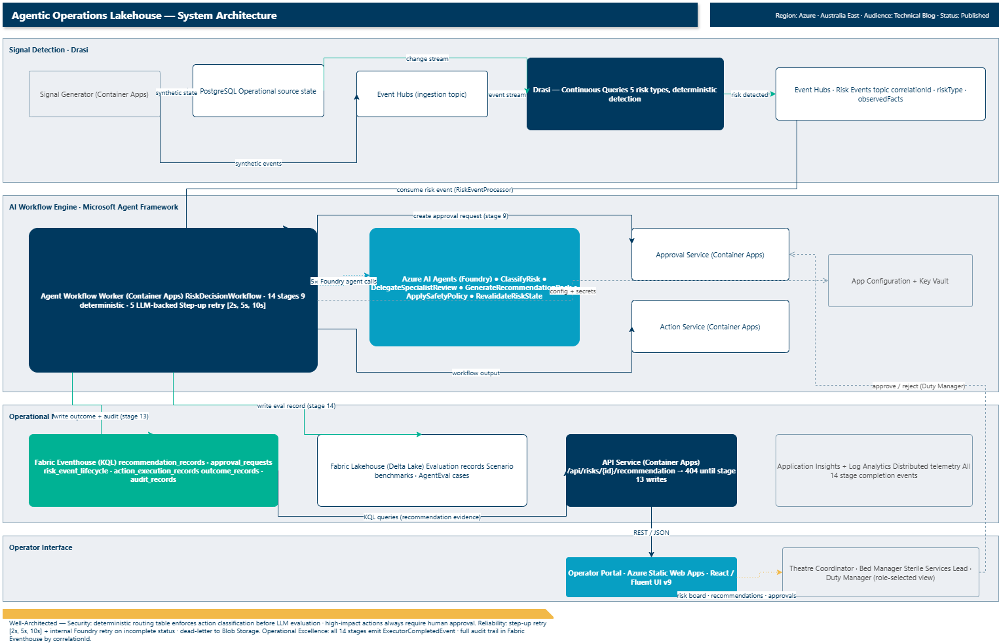
_Full system architecture: Drasi detects risks from PostgreSQL and Event Hubs; the 14-stage MAF workflow reasons over them using Microsoft Foundry agents; Microsoft Fabric stores every outcome; the React operator portal surfaces recommendations and approvals to role-selected operators._

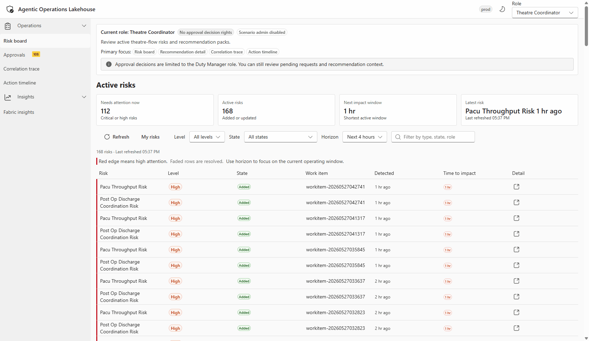
_Live walkthrough of the operator portal: risk events detected by Drasi appearing as recommendations, with role-based access and action approval flow visible in the UI._

Drasi detects that a risk exists. Microsoft Agent Framework reasons about it and produces a recommendation. Fabric stores the evidence. Humans approve or reject. The workflow records everything. It is straightforward when you break it down, but the interesting part is how these three pieces fit together (and what each one is not allowed to do).

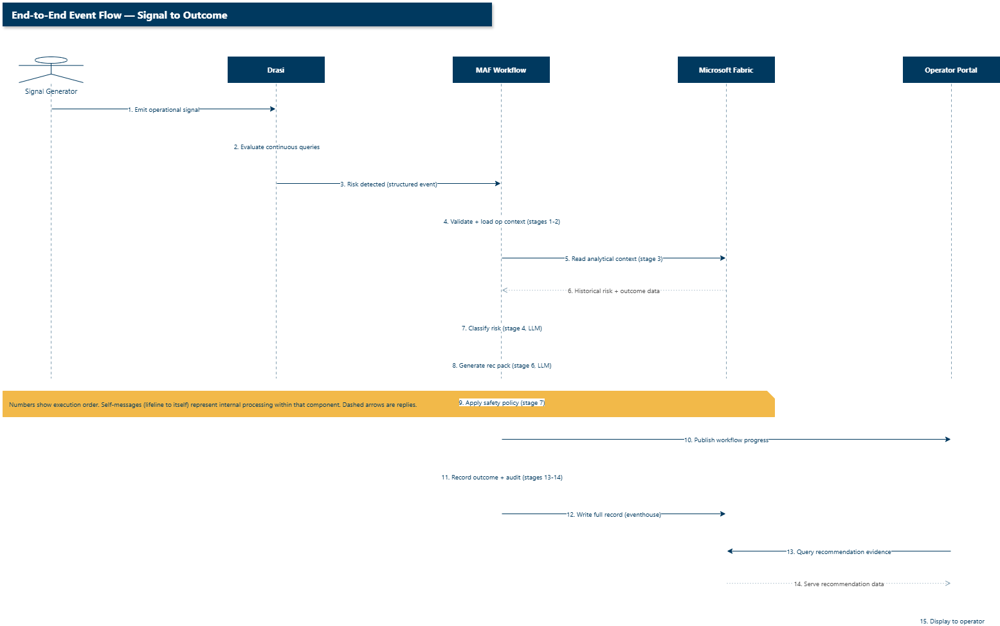
_Temporal ordering of the full pipeline: synthetic signals trigger Drasi detection, which kicks off the MAF workflow, which reads and writes Fabric context, ultimately serving the operator portal. Self-messages show internal processing; dashed arrows are replies._

## The split that actually matters

The design principle that sets this apart from "put everything in a prompt" is the agentic/deterministic boundary. In this implementation, there are fourteen workflow stages: five invoke a Foundry LLM agent, the other nine are deterministic _(schema validation, database queries, KQL reads, static routing lookups, API calls, and Fabric writes)_.

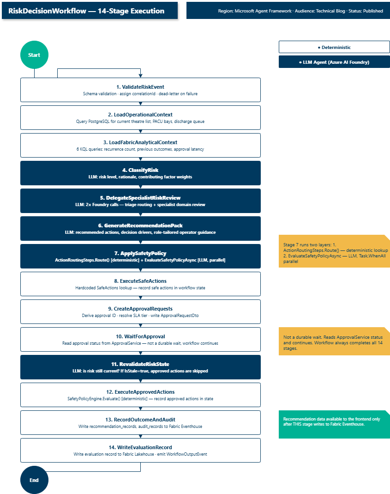
_All 14 stages in execution order. Navy fill = LLM-backed (Azure AI Foundry agent). White fill = fully deterministic. Stage 7 (ApplySafetyPolicy) runs both layers._

The LLM handles the parts that need contextual reasoning _(classifying a risk, routing to the right specialist, producing a recommendation for a specific operator role, checking whether a risk is still live)_. The deterministic code handles the parts that need repeatability and safety enforcement _(validation, state queries, the action routing table, SLA policy resolution, and Fabric writes)_.

If an agent returns unexpected output, the deterministic stages either catch it _(the `decisionDrivers` validation)_, ignore it _(the routing lookup blocks unknown actions)_, or record it for audit without acting on it. The LLM cannot bypass the routing table or write to Fabric directly.

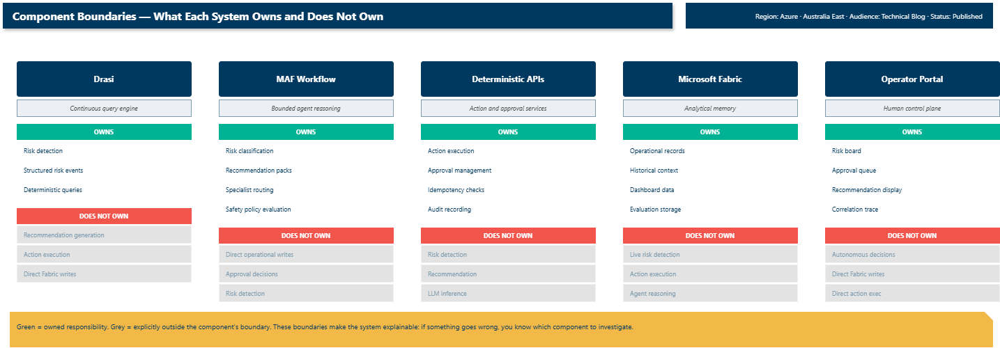
_Each component's explicit boundary: green = owned responsibility, grey = explicitly excluded. When something goes wrong, you know exactly which component to investigate._

## Drasi keeps detection honest

First design question: who decides that a risk exists? The answer is not the AI agent. It is [Drasi](https://drasi.io/).

Drasi is an open-source project from Microsoft and a Sandbox project on the CNCF (Cloud Native Computing Foundation) that runs continuous queries over live operational state. When source state changes (a new theatre entry, a PACU bay becoming unavailable, a discharge flag being set), Drasi re-evaluates its queries and emits structured change events. I wrote one query per risk type. Each query defines the signal combination that constitutes a risk. The bed capacity query, for example:

```yaml
apiVersion: v1
kind: ContinuousQuery
name: healthcare-bed-capacity-risk
spec:
  mode: query
  queryLanguage: Cypher
  sources:
    subscriptions:
      - id: aol-operational-postgres
        nodes:
          - sourceLabel: surgical_cases
          - sourceLabel: ward_bed_forecasts
  query: >
    MATCH (c:surgical_cases)
    MATCH (w:ward_bed_forecasts)
    WHERE
      c.ScenarioRunId = w.ScenarioRunId
      AND c.CorrelationId = w.CorrelationId
      AND w.StateValue = 'blocked'
    RETURN
      c.Id AS workItemId,
      'bed-capacity-risk' AS riskType,
      'high' AS riskLevel,
      'Post-op bed forecast indicates blocked capacity' AS observedFact,
      'human-approval-required' AS approvalRequirement
```

It watches two PostgreSQL tables (`surgical_cases`, `ward_bed_forecasts`), matches them on a correlation ID, and when a ward forecast flips to `blocked` it emits a structured risk event. The output feeds directly into the MAF _(Microsoft Agent Framework)_ workflow as the `observedFacts` you see in the code samples.

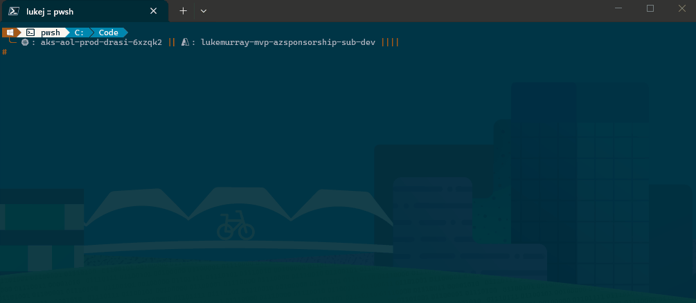
_Drasi continuous query containers deployed on Azure Kubernetes Service, listing running pods across the cluster namespace._

Detection is testable\_(a Drasi query is a declarative expression you can write unit tests against and replay historical events through - if detection logic were inside an agent prompt, testing it would mean evaluating LLM outputs). Detection is observable (Drasi emits structured events with correlation IDs, observed facts, and lifecycle state. When an operator asks "why was this risk flagged?", the answer comes from structured output, not from reconstructing what a model was thinking). And detection is separated from recommendation (if the recommendation is wrong, you can tell whether the agent misread the situation or simply gave bad advice). Drasi hands the MAF workflow a structured, verifiable risk event, and that separation is the important design boundary.

## The workflow is the product, not the chat

Once Drasi emits a risk event, the MAF workflow runs. For this pattern, a single LLM call is the wrong boundary because waiting for human approval, checkpointing state for restart, and separating contextual reasoning from structural routing need explicit workflow state. The 14-stage workflow makes each concern an explicit, auditable stage with a clear input, output, and responsibility.

### Role-aware recommendations

The bed manager wanted discharge-blocker advice. The theatre coordinator wanted case-sequencing language. I had to map the risk type to a role before the recommendation prompt made sense to its reader. The fix was a lookup that derives the primary operator role from the risk type and injects it into the context:

```csharp
private static (string Role, string Context) MapRoleFromRiskType(string? riskType) => riskType switch {
    "bed-capacity-risk" or "post-op-discharge-coordination-risk" =>
        ("Bed Manager",
         "Responsible for ward capacity and patient discharge flow..."),
    "pacu-throughput-risk" or "theatre-turnover-risk" =>
        ("Theatre Coordinator",
         "Responsible for theatre list execution and perioperative flow..."),
    _ => ("Operational Manager", "...")
};
```

Before I added this, the `operatorGuidance` field read like generic advice. After adding the role name and one sentence of role context, it started using domain vocabulary. A single string addition to the prompt context.

The prompts themselves are versioned artefacts stored in [Azure App Configuration](https://learn.microsoft.com/azure/azure-app-configuration/overview?WT.mc_id=AZ-MVP-5004796), not hardcoded in the worker. They're loaded at startup by `PromptLibrary.LoadFromAppConfigurationAsync` with a version label and cached with a configurable TTL so the 14-stage workflow doesn't hit App Configuration on every stage call. Updating an agent's instructions means updating an App Configuration key-value pair, not redeploying the service.

### Handling transient Foundry failures

A number of the early PACU throughput risk runs hit an `incomplete` status from the Foundry agent on the first attempt (a transient infrastructure failure with no error detail). The initial code threw immediately, which restarted the entire 14-stage workflow from scratch. The fix was an internal retry within `RunAgentAsync` on `incomplete` status, before escalating to the workflow-level retry:

```csharp
const int MaxAttempts = 2;
for (int attempt = 1; attempt <= MaxAttempts; attempt++) {
    PersistentAgentThread thread = await agentsClient.Threads.CreateThreadAsync(...);
    try {
        if (run.Status != RunStatus.Completed) {
            bool isIncomplete = string.Equals(run.Status.ToString(), "incomplete", ...);
            if (isIncomplete && attempt < MaxAttempts) { continue; }
            throw new InvalidOperationException(...);
        }
        return result;
    }
    finally {
        await agentsClient.Threads.DeleteThreadAsync(thread.Id, ...);
    }
}
```

The workflow session stays alive, no stale-progress UX, and the workflow-level retry stays as a safety net for other failure modes.

## Fabric as operational memory

Every record the workflow produces is written to Fabric. Every record the next run needs is read from Fabric. That bidirectional relationship is what makes recommendations grounded rather than speculative. When the agent generates a recommendation, it can see how many times this risk type has occurred historically, what the typical escalation latency looks like, and which actions have been effective. The Fabric context is fed directly into the generation prompt as structured data.

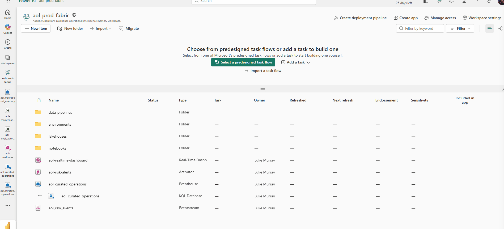
_The Fabric workspace hosting the Eventhouse that stores risk events, recommendations, and approval records (the operational memory layer)._

The operational memory lives in a Fabric Eventhouse. Risk events stream in from Drasi, the MAF workflow writes recommendation records directly, and the operator portal reads the current state through KQL queries. The Eventhouse schema was designed around three core tables: risk events, recommendation records, and action outcomes.

The KQL schema was the first thing I built and it stayed stable through the whole PoT _(Proof of Technology)_. I changed it three times and each change required updating the write path, read path, and API contract simultaneously — so I froze it and worked around the constraints instead.

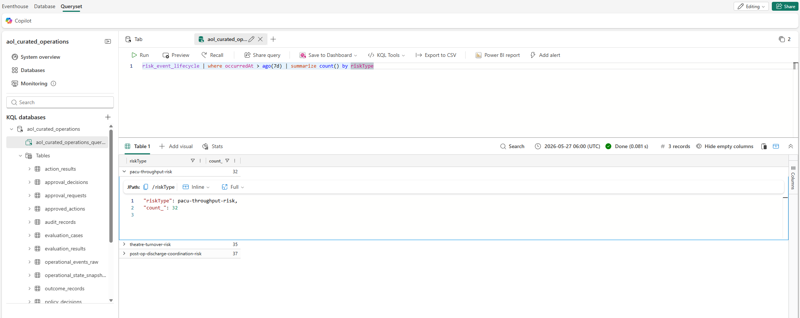
_KQL query showing risk event lifecycle data aggregated over a seven-day window. Answers the question "how many risks did I detect, and what happened to each one?"_

This query is the one I reached for most when testing. It tells you at a glance whether the pipeline is healthy - if new risk events are arriving, if recommendations are being produced, and if they're reaching the operator portal.

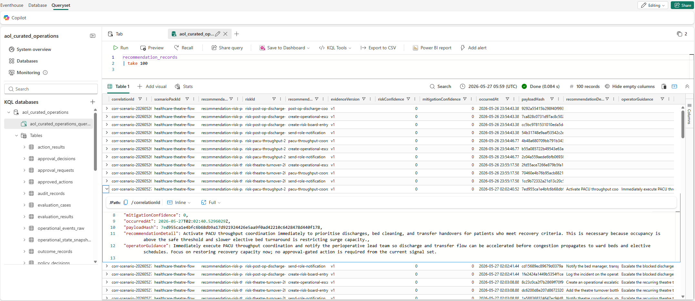
_Querying the top 100 recommendation records in Eventhouse. Each record captures the full decision chain: risk event, agent recommendation, safety policy evaluation, and human approval outcome._

The recommendation records are the audit trail. Every decision (agentic and human) is captured in a single row you can trace from the risk event through to the outcome. This was important to me from the start - if someone asks "what happened with this risk?", there is one place to look.

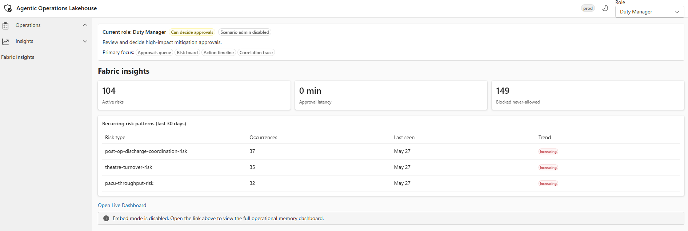
_Fabric insights surfaced in the operator portal, giving operators real-time visibility into the health and throughput of the operational memory layer._

A design decision that surprised me: the frontend polls for recommendations and gets nothing until stage 13 (seven stages after the recommendation is generated at stage 6). The recommendation lives in workflow state from stage 6. Fabric only sees it after stage 13, when the complete record (including approval decisions and policy evaluations) is written. This is by design, but operators will see "checking again" for 30-60 seconds. I had to make this explicit in the frontend (Fluent on React).

## Three layers of safety

Every recommended action is classified before it reaches the operator portal:

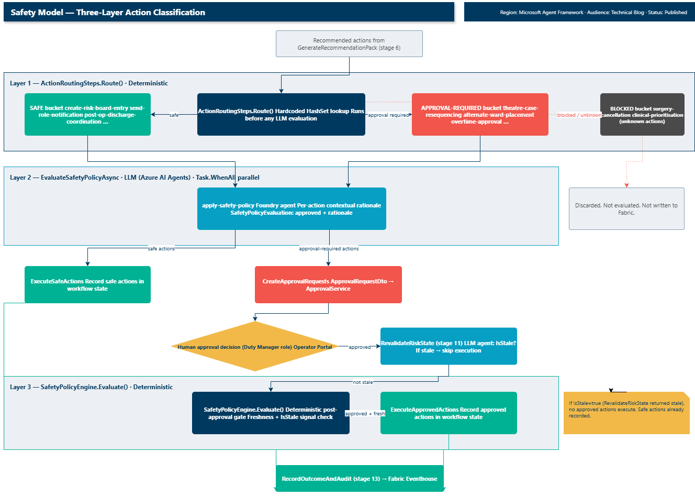
_Layer 1: deterministic routing table. Layer 2: LLM policy evaluation (parallel). Layer 3: deterministic post-approval gate. Only Layer 2 invokes a Foundry agent._

**Layer 1 - deterministic routing.** `ActionRoutingSteps.Route()` classifies each action against hardcoded lookup sets: `SafeActions`, `ApprovalRequiredActions`, and a blocked bucket. This runs before any LLM evaluation. An unknown action goes to blocked, regardless of what the agent recommended.

**Layer 2 - LLM policy evaluation.** `EvaluateSafetyPolicyAsync` calls the Foundry agent for each action in parallel to produce contextual rationale. The LLM provides the explanation, the routing table provides the enforced classification.

**Layer 3 - deterministic final gate (post-approval).** After the human approves, `SafetyPolicyEngine.Evaluate()` runs again with freshness signals (no LLM). If the risk has gone stale, no approved actions execute.

| Class                   | Actions                                                                                         | Behaviour                        |
| ----------------------- | ----------------------------------------------------------------------------------------------- | -------------------------------- |
| Safe-automated          | create-risk-board-entry, send-role-notification, pacu-throughput-coordination                   | Recorded immediately             |
| Approval-required       | theatre-case-resequencing, alternate-ward-placement, overtime-approval, duty-manager-escalation | Approval request to Duty Manager |
| Blocked (never-allowed) | surgery-cancellation, clinical-prioritisation, any unknown action                               | Blocked before LLM evaluation    |


_Operator view of a recommendation technical detail blade, showing the risk event summary, agent-generated recommendation, applied safety policy classification, and the approval action buttons for the Duty Manager role._

## What I learned

These were not obvious up front. I hit each of them the first time I ran a full scenario end-to-end.

**The `incomplete` status from Foundry is a retry problem, not a workflow problem.** I initially threw immediately on the first `incomplete` return, which restarted all 14 stages from scratch. The fix was an internal retry loop inside `RunAgentAsync` — operators never saw the stall once I hid it behind the call-level retry. The workflow-level retry is still there as a safety net for everything else.

**The recommendation is not visible in Fabric until stage 13, even though stage 6 generates it.** This surprised me the first time I watched the operator portal — the screen looked like it was doing nothing for 30-60 seconds after a risk appeared. I had to add a stage-start event so operators see "running..." instead of a frozen UI. Make this explicit in the portal from the start.

**The KQL schema was the first thing I built and it stayed stable.** I changed it three times and each change required updating the write path, read path, and API contract simultaneously. I froze it and worked around the constraints. That was the right call — locking the schema early kept those contracts stable through the rest of the PoT.

## The reusable pattern

The healthcare scenario is one instance of a general pattern. The same architecture applies anywhere live signals create operational risk, humans need evidence-backed recommendations, and high-impact actions need approval.

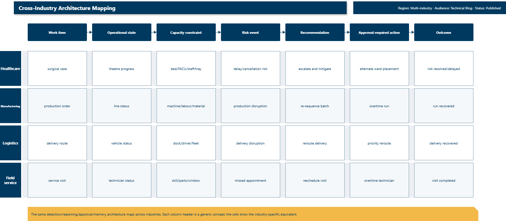
_The same architecture pattern maps across healthcare, manufacturing, logistics, and field service. Each industry has its own work item, capacity constraint, and risk event, but the detection/reasoning/approval/memory structure stays the same._

The repository includes three scenario packs (healthcare, manufacturing, and a manufacturing stub). The stub is the quickest way to understand the pattern - it implements `IScenarioPack` with inline comments mapping each healthcare concept to its manufacturing equivalent. Adding a new industry means implementing that same interface: define risk types, actions, roles, and synthetic data rules. The cross-industry mapping document covers utilities and emergency management as worked examples.

## Open source

The full implementation is on GitHub under MIT licence in the [AgenticLakehousePoT repository](https://github.com/lukemurraynz/AgenticLakehousePoT). It includes all five microservices, both full scenario packs, Fabric workspace item definitions, Drasi continuous query definitions, the React/Fluent UI operator portal, and eight test projects covering domain logic, integration, safety policy, and agent evaluation (AgentEval) for .NET/MAF agent evaluation.

Clone the repo, run the deployment script, and try it with your own risk types. The manufacturing stub is a good starting point - walk through the inline comments and you can see how the full detection-to-approval flow maps to a different industry. If you build on this pattern for a new industry, I would like to hear about it.

## References

- [Agentic Operations Lakehouse on GitHub](https://github.com/lukemurraynz/AgenticLakehousePoT)
- [Drasi: open-source continuous query engine](https://drasi.io)
- [Microsoft Agent Framework documentation](https://learn.microsoft.com/agent-framework/overview/?pivots=programming-language-csharp&WT.mc_id=AZ-MVP-5004796)
- [Microsoft Fabric Eventhouse documentation](https://learn.microsoft.com/fabric/real-time-intelligence/eventhouse?WT.mc_id=AZ-MVP-5004796)
- [Microsoft Foundry](https://learn.microsoft.com/azure/foundry/what-is-foundry?tabs=python&WT.mc_id=AZ-MVP-5004796)
- [Architecture overview](https://github.com/lukemurraynz/AgenticLakehousePoT/blob/main/docs/architecture/overview.md)
- [Healthcare theatre-flow walkthrough](https://github.com/lukemurraynz/AgenticLakehousePoT/blob/main/docs/scenarios/healthcare-theatre-flow.md)
- [Approval and action system](https://github.com/lukemurraynz/AgenticLakehousePoT/blob/main/docs/approval-action-system.md)
- [Cross-industry mapping](https://github.com/lukemurraynz/AgenticLakehousePoT/blob/main/docs/cross-industry-mapping.md)
- [Safety boundaries](https://github.com/lukemurraynz/AgenticLakehousePoT/blob/main/docs/safety-boundaries.md)
- [AgentEval: .NET-native evaluation for AI agents](https://agenteval.dev)
