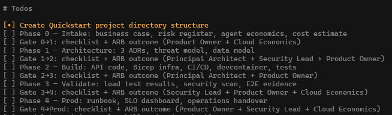
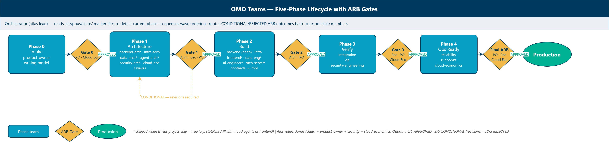
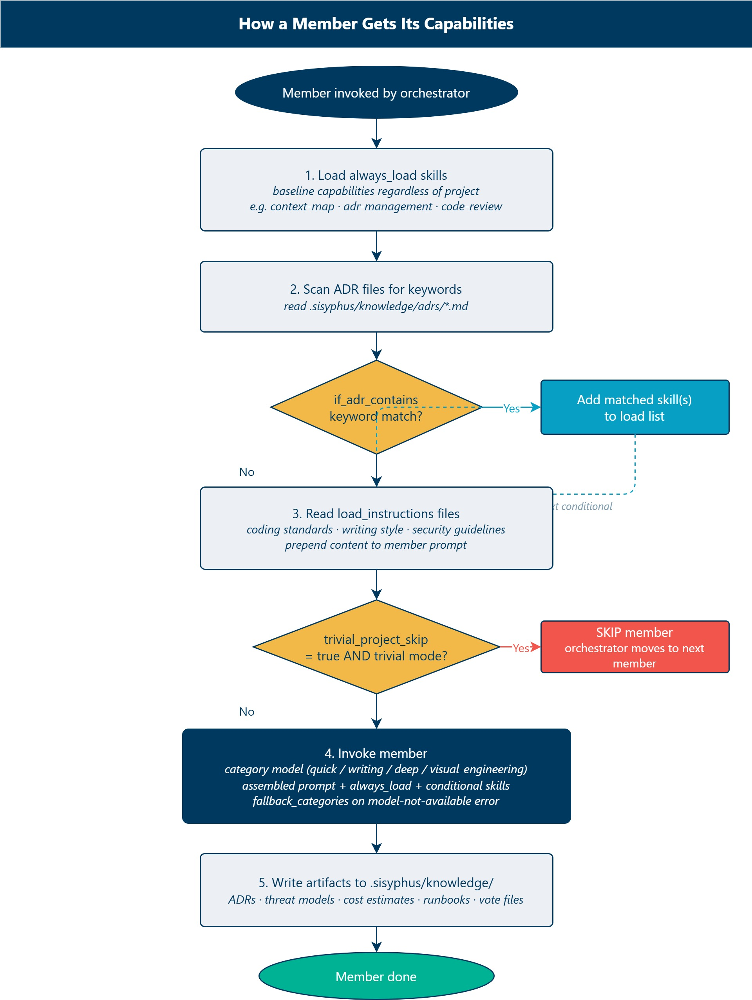
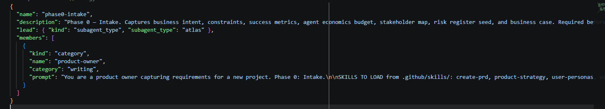

I've spent the last year building AI agent workflows for Azure projects, and I kept running into the same problem. The agents were useful in isolation - writing code, reviewing PRs, checking security - but there was no structure connecting them. No governance. No audit trail. No one could tell me who approved what and why.

So I built some Teams, using the [Oh My OpenAgent Team Mode](https://omo.dev/docs#team-mode) using the opensource [OpenCode](https://opencode.ai/) harness.

The idea is simple: five phases, each with a dedicated team of AI agents, and an Architecture Review Board (ARB) gate between them. The gate has real voters, real quorum rules, and a real escalation path when things deadlock. Every decision gets committed as a Markdown file - essentially governance as code.

And because I believe in eating your own dog food, I used OMO Teams to build the OMO Teams Quickstart. This post walks through what happened.



{/* truncate */}

## The five-phase model

The lifecycle covers everything from intake to production. Each phase has a different voter set because the decisions at each gate are different.

| Phase                  | Voters                                            | What they're signing off                             |
| ---------------------- | ------------------------------------------------- | ---------------------------------------------------- |
| Phase 0 - Intake       | Product Owner, Cloud Economics                    | Is the business case sound? Is the budget real?      |
| Phase 1 - Architecture | Principal Architect, Security Lead, Product Owner | Are the ADRs correct? Is the threat model complete?  |
| Phase 2 - Build        | Principal Architect, Product Owner                | Does the code match the architecture?                |
| Phase 3 - Validate     | Security Lead, Product Owner, Cloud Economics     | Do the tests pass? Are there open security findings? |
| Phase 4 - Prod         | Product Owner, Security Lead, Cloud Economics     | Are the runbooks ready? Has DR been tested?          |

The voters are defined in a YAML config file that gets fed into a tally python script. The script reads individual vote files, checks quorum, and writes an immutable outcome. No dashboards, no ticket systems, no approval workflows in a SaaS tool. Just Markdown and a Python script.



## How the teams are wired

Before walking through what happened, it helps to understand how these teams actually get their capabilities.

Each team is a JSON config file in `.omo/teams/`. A team has a **lead** (always the `atlas` subagent type, which acts as the phase coordinator) and a list of **members**. Every member has two things: an `always_load` skill list and a `conditional_load` list.

`always_load` gives the member its baseline capabilities - skills that load regardless of the project. `conditional_load` is where it gets interesting: the orchestrator scans the ADR files for keywords and loads additional skills only when they match. A backend architect working on a Cosmos DB project gets `cosmos-db-nosql-patterns` loaded automatically. One working on Postgres gets `postgresql-npgsql` instead. The member prompts stay generic; the skills carry the domain depth.



```json
"always_load": ["context-map", "adr-management", "azure-container-apps"],
"conditional_load": [
  { "if_adr_contains": ["networking", "vnet", "private endpoint"],
    "load": ["private-networking", "azure-network-security-perimeter"] },
  { "if_adr_contains": ["managed identity"], "load": ["identity-managed-identity"] }
]
```

Members also consume `load_instructions` - paths to instruction files (coding standards, writing style guides, data sovereignty rules) that get prepended to the member's prompt before it runs. A backend builder picks up C# and ASP.NET Core standards automatically. An infra builder picks up Bicep conventions. The knowledge lives in the instruction files, not duplicated across every member prompt.

Members can also declare `trivial_project_skip: true`. For a simple stateless API like LinkSnap, the orchestrator reads a trivial-project-mode marker and skips members that aren't relevant - the data architect, agent architect, frontend builder, and MCP server builder all sat out. That's not a limitation; it's the teams adapting to project scope.

The orchestrator detects the current phase by reading `.sisyphus/state/` - a set of marker files that gate progression. No state variable in memory, no database. Just files on disk. `phase1-gate-approved.md` exists → Phase 2 can start. It doesn't exist yet → ARB Gate 1 must run first.

## The project: LinkSnap

The application itself is deliberately boring. It's a URL shortener API built with FastAPI, deployed on Azure Container Apps, with Cosmos DB for NoSQL. About 200 lines of Python and 60 lines of Bicep. I wanted the product to be simple enough that nobody would mistake it for the interesting part. The interesting part is the process.

## Phase 0: intake

Phase 0 is a single-member team: the **product-owner** agent, running on a `writing` category model with `quick` as fallback.



The product-owner carries a substantial always_load skill set:

- `create-prd` - structures the project requirements document
- `business-case-investment-justification` - formalises the financial case
- `stakeholder-map` - identifies who needs to be in the room
- `risk-register` - Likelihood × Impact matrix
- `agent-economics` - estimates token spend across all five phases before a single line of code is written
- `identify-assumptions`, `pre-mortem`, `prioritize-features`, `value-proposition`, `naming-strategist`, `user-stories`

That last one matters: running the `agent-economics` skill at intake means the ARB gate voters know what the agent budget is before they approve anything. It's not just infrastructure cost - it's a budget for the agents doing the work.

The output gate requires six documents to exist before the ARB will even convene: problem statement, success metrics, budget constraints, compliance scope, risk register, and stakeholder map. If any are missing, the gate blocks.

For LinkSnap, the product-owner ran a discovery session on the project brief. The output was a risk register with seven items, a cost estimate showing $60/month, and an agent economics budget of around $18 in total token spend across all five phases.

The risk register is worth a closer look because it shows the kind of thing that usually gets missed until it becomes a problem.

```text
R01 - Team has no production experience with ACA secrets
      Likelihood: High, Impact: High
      Mitigation: Spike on managed identity + Key Vault in Phase 1

R06 - No DR plan for single-region ACA deployment
      Likelihood: Low, Impact: High
      Acceptance: Document in runbook as known gap
```

R01 turned out to be prescient. More on that later.

Gate 0 to 1 passed unanimously. Product Owner approved the business case. Cloud Economics signed off on the $60 monthly estimate with a 20% variance clause. The Quickstart had a green light.

## Phase 1: architecture

Phase 1 is the most complex team: six members running in three sequential waves, each wave gated by artifacts from the previous one.

**Wave 1 - backend-arch and infra-arch run in parallel.** Neither needs the other's output to start.

The **backend-arch** member uses a `quick` model and always loads `context-map`, `adr-management`, `dotnet-backend-patterns`, `typespec-api-design`, `observability-monitoring`, and `azure-well-architected-assessment`. Its job is to produce the backend API ADR (REST style, Problem Details, versioning), an async/event strategy ADR, an OpenAPI contract, and an observability design. For LinkSnap, `cosmos-db-nosql-patterns` loaded conditionally because the word "cosmos" appeared in the project brief.

The **infra-arch** member always loads `azure-container-apps`, `azd-deployment`, `azure-deployment-preflight`, `finops`, and `azure-well-architected-assessment`. It produces the hosting platform ADR with a cost estimate, a secret management ADR, a deployment toolchain ADR, and a DR strategy ADR. For LinkSnap, `identity-managed-identity` loaded conditionally from the `key vault, secret` match.

**Wave 2 - data-arch and agent-arch** require at least two ADRs to already exist before they run. They self-report missing prerequisites by writing a `*-waiting.md` file and stopping. The orchestrator's pre-flight scan catches these waiting files at the start of each invocation and runs the blocker first. Both members have `trivial_project_skip: true` - they sat out for LinkSnap entirely.

**Wave 3 - security-arch and cloud-economics** need at least four ADRs plus a data model before they start.

The **security-arch** member always loads `threat-modelling`, `api-security-review`, and `risk-register`. It writes a STRIDE threat model, an OWASP security review, and updates the risk registry with any high or critical findings. For agentic projects it picks up `owasp-agentic` and `agent-governance-toolkit` conditionally.

The **cloud-economics** member always loads `finops`, `cost-optimization`, `agent-economics`, and `azure-cost-calculator`. It produces the Azure cost estimate and an agent economics phase report. The exit gate requires at least six ADRs before the ARB can convene.

For LinkSnap: three ADRs got written. ACA hosting (ADR-001), Cosmos DB partition key on `tenant_id` (ADR-002), and managed identity for all Azure resource authentication (ADR-003). The backend-arch member reviewed the ADRs and confirmed the Cosmos partition key choice was correct. The infra-arch member approved the hosting and secret management approach.

Then the security ARB voter flagged a conditional.

The managed identity ADR said "use managed identity" but didn't say how local development would authenticate. The security lead's point was fair: without a documented local auth path, someone would inevitably drop a connection string into a `.env` file and commit it. Two mandatory revisions came out of it: document the DefaultAzureCredential fallback path, and decide whether Cosmos DB would use a private endpoint or public access with IP firewall.

| Voter               | Vote        | Why                                       |
| ------------------- | ----------- | ----------------------------------------- |
| Principal Architect | Approved    | ADRs are solid                            |
| Security Lead       | Conditional | Need local auth path and network decision |
| Product Owner       | Approved    | Conditions are manageable                 |

The gate passed as CONDITIONAL. Phase 2 couldn't start until both revisions were committed. It took about an hour to resolve. That's the whole point of a gate - catch it before it becomes code.

## Phase 2: build

Phase 2 has six members and runs in two waves. The first wave produces contracts; the second wave builds everything.

**Wave 1 - contracts only.** The **backend** member writes the OpenAPI spec to `api-contracts/openapi.yaml`, a contract summary, and a `backend-contracts-ready.md` state marker, then stops. The **mcp-server** member (if not skipped) writes tool schemas to `tool-contracts/tools.json` and stops. Wave 2 can't start until the contracts exist - the frontend and AI engineer members check for their contract files and write a `*-waiting.md` file if they're missing.

For LinkSnap, both `mcp-server` and `frontend` had `trivial_project_skip: true`, so Wave 1 was just the backend producing its OpenAPI contract.

**Wave 2 - full implementation.** Four members ran for LinkSnap (two were skipped):

The **backend** member uses a `deep` category model - the highest compute tier in the team. Its always_load includes `dotnet-backend-patterns`, `observability-monitoring`, and `code-review`. The `identity-managed-identity` and `azure-role-selector` skills loaded conditionally from the managed identity ADR. It built the FastAPI app with three endpoints (`/health`, `POST /links`, `GET /links/{short_code}`), managed identity auth to Cosmos DB, and a container image pinned to a specific Python 3.12-slim digest. It then ran `code-review` on its own output before declaring done.

The **infra** member always loads `azd-deployment`, `azure-container-apps`, `azure-defaults`, `code-review`, and `azure-deployment-preflight`. The `identity-managed-identity` and `azure-role-selector` skills loaded from the managed identity and RBAC ADR keywords. It built the Bicep template: Container Apps environment, Cosmos DB in serverless mode, ACR registry, and the RBAC assignment wiring the ACA managed identity to Cosmos read/write. No connection strings anywhere. It also ran `code-review` on its own output.

The **data-engineer** and **ai-engineer** members both had `trivial_project_skip: true` for a stateless API demo.

Code review caught a hardcoded ACR URL in the CI pipeline. Security scan flagged a base image with no SHA pin - fixed before merge. Both issues got resolved in the same PR. That's the advantage of having agents that review as you build rather than finding these things in a production incident post-mortem.

Gate 2 to 3 passed clean. Code matched the ADRs, tests passed, CI pipeline was green.

## Phase 3: validate

Phase 3 has three members, all running without trivial project skips.

The **integration** member always loads `code-review` and `azure-well-architected-assessment`. It verifies integration points match the ADRs and runs a WAF assessment. For Cosmos-based projects it picks up `cosmos-db-nosql-patterns` conditionally. Results go to `evidence/phase3/integration/test-results.md`.

The **qa** member has no always_load skills - it picks everything up conditionally. Performance testing? `azure-performance-resilience-validation`. E2E tests? `playwright-testing`. Deployment pipeline? `github-actions-ci-cd`. For LinkSnap the load was light: just functional test verification. Results go to `evidence/phase3/qa/test-results.md`.

The **security-engineering** member always loads `threat-modelling` and `api-security-review`. It reads the threat model from Phase 1, implements all mitigations, checks for committed secrets, and addresses OWASP Top 10. For agentic projects it picks up `owasp-agentic` conditionally. Results go to `evidence/phase3/security/hardening-evidence.md`.

The exit gate requires all three evidence files to exist before the ARB convenes.

For LinkSnap: load test ran with 50 concurrent users against a staging revision. Average response time was 180ms for writes and 45ms for reads. ACA scaled from one to two replicas during the test. Cosmos DB serverless handled the load without throttling.

Trivy scan found zero critical or high vulnerabilities. pip-audit found zero known advisories in the dependency tree. The two accepted gaps from the threat model - no auth and no rate limiting - were documented in the runbook as known v1 limitations.

Security Lead approved. Product Owner approved. Cloud Economics confirmed no cost overrun.

## Phase 4: production

Phase 4 has three members. Entry requires the Phase 3 evidence directory to exist.

The **reliability** member always loads `observability-monitoring`. It picks up `dr-design`, `chaos-engineering`, `azure-sre-agent`, and `azure-safe-deployment-practices` conditionally based on ADR keywords. It writes SLOs to `reliability/slos.md` and produces dashboards, alerts, and DR validation evidence.

The **runbooks** member uses a `writing` category model and always loads `docs-style`. It picks up `azure-troubleshooting`, `release-notes`, `post-mortem`, and `adr-management` conditionally. It also consumes writing-style and markdown instruction files from `load_instructions`, so the runbook prose matches the project's documentation standards. Outputs: deployment runbook and incident response guide.

The **cloud-economics** member always loads `finops`, `cost-optimization`, `agent-economics`, and `azure-cost-calculator`. It writes the final variance report comparing actuals against the Phase 1 estimates, and a phase-4 agent economics summary.

The exit gate requires SLOs, the deployment runbook, and the incident response guide to all exist before the final ARB convenes.

For LinkSnap: the runbook covers health checks, log queries, scaling commands, escalation contacts, and the known gaps. DR is documented as a single-region best-effort arrangement with manual redeployment as the recovery path. Realistic for a Quickstart. Wouldn't fly for a production customer workload, but it's honest about what it is.

The final gate passed unanimously. Five phases, five gates, one shipped application.

## The ARB team

Every gate invokes the same `arb-review` team. It has four members.

**Janus** is the chair. Janus always loads `governance-gate`, `azure-well-architected-assessment`, `pressure-test`, and `risk-register`. Janus runs the evidence inventory using the governance-gate checklist, writes a WAF assessment, assembles the gate checklist, collects the three votes, and tallies the outcome. The quorum rule: 4/5 = APPROVED, 3/5 = CONDITIONAL (mandatory revisions), 2+/5 = REJECTED (phase must be redone). If the ARB deadlocks, Janus writes `escalated.md` and surfaces to a human arbiter.

The three voters are **product-owner**, **security**, and **cloud-economics** - each reading their relevant artifacts and writing a vote file to `arb/{phase}-gate/votes/`.

The product-owner voter always loads `pressure-test` and votes on alignment with business intent, success metrics, budget, and scope.

The security voter always loads `threat-modelling` and votes on whether threats are mitigated or accepted, OWASP findings addressed, and compliance met. For agentic projects it picks up `owasp-agentic`, `responsible-ai-operating-model`, and `agent-governance-toolkit` conditionally.

The cloud-economics voter always loads `cost-optimization`, `agent-economics`, and `azure-cost-calculator` and votes on whether cost is within budget, agent economics are within baseline, and variance is acceptable.

Every vote file, every checklist, and every outcome is committed to `.sisyphus/knowledge/arb/{phase}-gate/`. The audit trail is the repository.

## What the gates caught

The CONDITIONAL at Gate 1 was the most valuable outcome of the entire process. The security ARB voter's two revisions forced a decision that would have been painful to retrofit. The local dev auth path is the kind of thing that gets deferred until someone commits a key. The network perimeter decision is the kind of thing that gets deferred until a compliance audit finds a public Cosmos endpoint.

The earlier you catch these, the cheaper they are to fix. That's not a new insight. What's new is that the ARB gate made it structural rather than depending on someone happening to ask the right question in a meeting.

## What the economics looked like

One thing I tracked across all five phases was the agent token budget. The `agent-economics` skill, loaded by both the Phase 0 product-owner and the Phase 1 cloud-economics member, allocated 510,000 tokens across the lifecycle, split by model tier. Phase 1 (architecture) used the heaviest models (Opus for lead, Sonnet for members). Phase 2 (build) had the highest raw token count because of all the code generation and review loops - the backend member runs on the `deep` category, which is the costliest tier.

The actuals came in under budget. Phase 0 used 14,200 tokens against a 20,000 budget. Phase 1 used 72,000 against 80,000. Phase 2 was the tightest at 185,000 against 200,000 - the code review loops chewed up more iterations than expected. The total across all five phases was about 460,000 tokens, which at current API pricing works out to roughly $16. The cheapest governance process I've ever run.

## Lessons learned

Three things stood out from running this end to end.

First, the conditional gate was the most valuable outcome. If every gate had passed unanimously, I'd be writing a different post - one about how governance is easy when nothing goes wrong. The security ARB voter's conditional at Gate 1 proved the system works. It caught something real, produced a concrete revision list, and the team resolved it in an hour.

Second, the skill-loading design means the teams adapt to the project. For LinkSnap, four of the six Phase 2 members were skipped entirely via trivial project mode, and the remaining two picked up exactly the skills they needed (Cosmos patterns, managed identity) from the ADR keyword matching. A more complex project with AI agents, a frontend, and a data layer would activate all six members and load the relevant skills for each domain. The same config file, different capability surface.

Third, the artifact trail is the killer feature. Every approval, every condition, every rejection rationale is committed as a Markdown file. If someone asks six months from now who approved the Cosmos partition key decision, the answer is in `.sisyphus/knowledge/adrs/ADR-002-cosmos-partition-key.md` with a signed-off vote from the Principal Architect. No digging through Teams messages or email threads.

## The Quickstart

:::note Quick link
Browse the full implementation in the [OMO Teams Quickstart repository](https://github.com/lukemurraynz/omo-teams-quickstart).
:::

The full Quickstart repo is at `lukemurraynz/omo-teams-quickstart` if you want to see all the artifacts. Every ADR, every vote file, every gate outcome, every risk register entry, and the full application code. The README walks through how to deploy it yourself.

If you're running AI agents on Azure projects and wondering where the governance is, this is a pattern you can adapt. Start with the five-phase model, pick your voters, and run your first gate.

## References

- [OpenCode](https://opencode.ai/)
- [Oh My OpenAgent](https://omo.dev/)
- [OMO Teams Quickstart repo](https://github.com/lukemurraynz/omo-teams-quickstart)
- [Azure Container Apps documentation](https://learn.microsoft.com/azure/container-apps/?WT.mc_id=AZ-MVP-5004796)
- [Cosmos DB for NoSQL serverless](https://learn.microsoft.com/azure/cosmos-db/serverless/?WT.mc_id=AZ-MVP-5004796)
