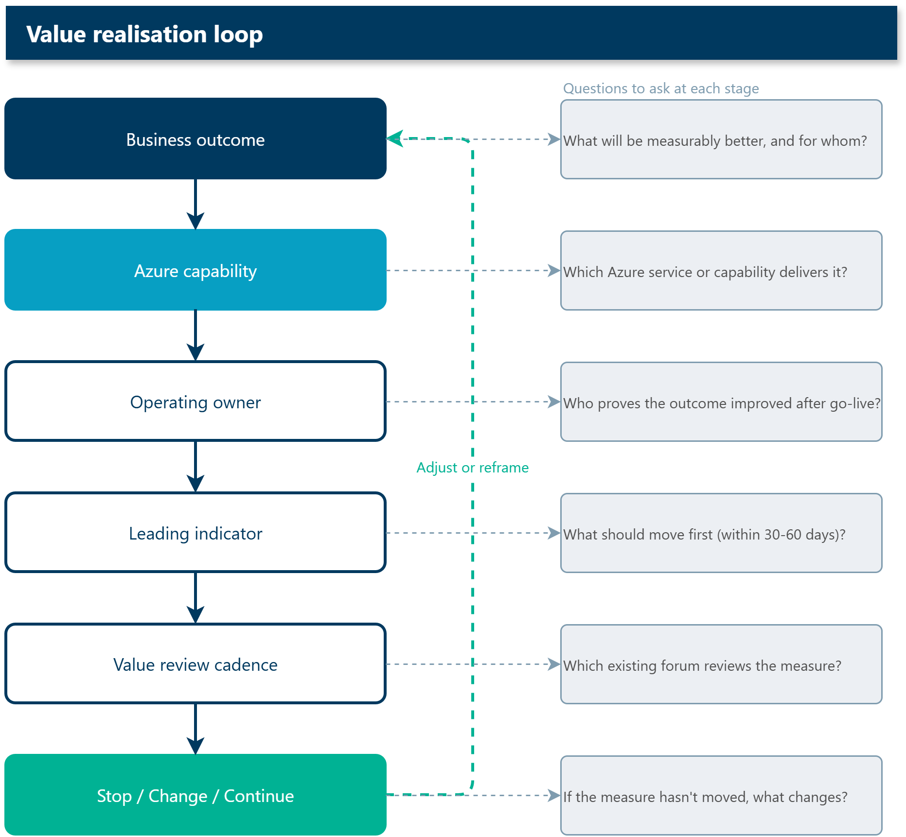

A lot of Azure programmes can answer one question pretty quickly: what did we deploy?

Landing zone. Done.  
Workloads migrated. Done.  
Monitoring enabled. Done.  
Tags and budgets configured. Done.  
Security baseline applied. Done.

Those are all useful things, and I am not downplaying them. They are part of getting cloud adoption right. But they are not the whole story.

The harder question is usually this one:

> What is measurably better because we adopted Azure?

That is where the conversation shifts from cloud adoption to value realisation.

{/* truncate */}

## Adoption is not the finish line

The [Microsoft Cloud Adoption Framework](https://learn.microsoft.com/azure/cloud-adoption-framework/overview?WT.mc_id=AZ-MVP-5004796) gives us a really useful way to think about the cloud journey. Strategy, Plan, Ready, Adopt, Govern, Secure, and Manage all have a place, and they are not only technical activities.

That matters because cloud adoption is not just moving workloads or deploying services. It is integrating cloud into the way the organisation works.

The trap I see is that teams often treat the Adopt phase as the finish line.

A workload is migrated.  
A platform is available.  
A dashboard exists.  
A new service is live.

Then the project closes, and everyone moves to the next thing.

That is where value can quietly leak out of the programme. The technical delivery might be successful, but the outcome is left assumed rather than managed.

A simple way I think about it is:

| Cloud adoption asks             | Value realisation asks                         |
| ------------------------------- | ---------------------------------------------- |
| Did we move or build the thing? | Did the organisation get better because of it? |
| Is the platform ready?          | Can teams use it safely and consistently?      |
| Is monitoring enabled?          | Are decisions improving from the signals?      |
| Do we have cost visibility?     | Is spend changing behaviour?                   |
| Did we migrate the workload?    | Did we retire cost, risk, or friction?         |

Cloud adoption creates the conditions for value. It does not automatically realise it.

## The familiar pattern

This is a pattern I have seen a few times, in different shapes.

A business case gets approved. The platform team does the right thing and builds the Azure foundation properly. Workloads move. Governance is applied. Azure Monitor starts collecting useful data. Microsoft Defender for Cloud is switched on. Cost Management reports are available.

The project is technically successful.

Then, six months later, someone asks:

> What did we get for the investment?

And the answer is harder than it should be.

Not because Azure failed. Usually the platform did exactly what it was asked to do.

The gap is that nobody kept ownership of the value after go-live. The original benefit owner moved on, the review cadence became operational only, and the measures that justified the work were not carried into the run state.

The team can show that the workload is healthy. They can show that it is patched, monitored, backed up, and policy-compliant. But they cannot easily show whether the business outcome improved.

That is the bit worth fixing.

## Start with the outcome, not the service

This is where Azure roadmaps need a bit of discipline.

If the roadmap item says:

> Migrate application X to Azure.

That is not wrong, but it is incomplete.

A better version is closer to:

> Migrate application X to Azure so that recovery time improves, platform risk reduces, can make use of additional functionality, and the legacy hosting contract can be retired by Q4.

That second version gives you more to work with. It names the technical move, but it also names the expected value.

Some examples:

| Azure activity               | Better value framing                                                                         |
| ---------------------------- | -------------------------------------------------------------------------------------------- |
| Deploy an Azure landing zone | Teams can launch compliant workloads faster, with inherited security and governance controls |
| Migrate virtual machines     | Legacy infrastructure risk reduces, recovery improves, and old hosting costs can be retired  |
| Build a Fabric data platform | Decision latency reduces because trusted data is available at the right cadence              |
| Roll out Copilot or Azure AI | A named workflow improves, with human review, quality thresholds, and support ownership      |
| Enable Azure Monitor         | Teams can act before users are impacted, not only after an incident is raised                |

The technical activity still matters. It just needs to sit inside a value story.

## Four questions before calling an Azure roadmap done

These are the questions I like to ask before treating an Azure roadmap item as ready.

### What business outcome should change?

Be specific.

Not "modernise infrastructure".  
Not "improve reporting".  
Not "adopt AI".

Better outcomes sound like:

- reduce time to recover from a priority incident
- reduce manual reporting effort for the finance team
- improve release confidence for a customer-facing workload
- reduce audit preparation effort
- improve cost visibility by product, team, or service
- reduce dependency on unsupported infrastructure

If the outcome is hard to name, the roadmap item may still be a technical task rather than a value item.

That is fine, but call it what it is.

### Who owns the value after go-live?

This is a big one.

The delivery owner is not always the value owner.

A platform team might own the Azure landing zone. An application team might own the workload. But the value might belong to operations, finance, risk, customer service, or a product owner.

If nobody owns the value after go-live, the value probably will not be reviewed.

For each roadmap item, I want to know:

| Role              | Question                                            |
| ----------------- | --------------------------------------------------- |
| Delivery owner    | Who gets it live?                                   |
| Operational owner | Who runs it after go-live?                          |
| Value owner       | Who proves whether it was worth doing?              |
| Decision owner    | Who can change course if the measure does not move? |

Those roles might be the same person in a small organisation. In larger environments, they often are not.

### What should move first?

Lagging measures are useful, but they can arrive too late.

If the only measure is annual cost reduction, customer satisfaction, or revenue growth, you might wait months before you know whether the change is working.

A leading indicator gives you an earlier signal.

For example:

| Outcome               | Early signal                                                             |
| --------------------- | ------------------------------------------------------------------------ |
| Faster release cycle  | Deployment frequency or lead time changes within 30-60 days              |
| Better reliability    | Incident volume, alert quality, or mean time to restore starts improving |
| Better reporting      | Manual report preparation time reduces                                   |
| Better cost ownership | Teams review cost by workload or product each month                      |
| Better adoption       | Repeat usage grows after the first training wave                         |

Azure gives us a lot of telemetry. [Azure Monitor](https://learn.microsoft.com/azure/azure-monitor/fundamentals/overview?WT.mc_id=AZ-MVP-5004796), [Application Insights](https://learn.microsoft.com/azure/azure-monitor/app/app-insights-overview?tabs=webapps&WT.mc_id=AZ-MVP-5004796), [Log Analytics](https://learn.microsoft.com/azure/azure-monitor/logs/log-analytics-overview?tabs=simple&WT.mc_id=AZ-MVP-5004796), [Cost Management](https://learn.microsoft.com/azure/cost-management-billing/costs/overview-cost-management?WT.mc_id=AZ-MVP-5004796), [Defender for Cloud](https://learn.microsoft.com/azure/defender-for-cloud/defender-for-cloud-introduction?WT.mc_id=AZ-MVP-5004796), and [Azure Policy](https://learn.microsoft.com/azure/governance/policy/overview?WT.mc_id=AZ-MVP-5004796) can all provide useful signals.

The trick is connecting those signals to the outcome the organisation cares about.

### What gets retired?

One of the cleanest ways to realise value is to stop paying for, supporting, or working around something.

Cloud programmes sometimes add the new thing but keep the old thing alive.

- New platform, old process.
- New dashboard, old spreadsheet.
- New cloud environment, old hosting contract.
- New automation, old manual approval path.
- New governance model, old exception process.

That is how cost and complexity grow together - someone once told me:

> "Cloud is not where you work, it's how you work."

For each Azure roadmap item, ask:

> What do we stop, retire, reduce, or simplify if this works?

That could be:

- a legacy server or hosting contract
- a manual reporting process
- an old integration path
- duplicate tooling
- a support burden
- a recurring security exception
- a governance meeting that no longer adds value

If nothing gets retired or simplified, the organisation might still choose to proceed, but it should do so with eyes open.

## A few field learnings

None of these are tied to a specific customer. They are patterns I have seen often enough that I now look for them early.

### A landing zone without a first workload is hard to explain

Azure landing zones are important. I am a **big fan** of doing the foundation properly: identity, network, management groups, policy, logging, security baseline, subscription structure, and deployment patterns.

But a landing zone by itself can be a hard thing for a business sponsor to value.

The value becomes clearer when it is tied to the first workload or product team that uses it - and I generally try to push for 'what is the business strategy, that the platform can also help to support to ensure alignment'.

Instead of saying:

> We deployed the landing zone.

Try to get to:

> The first product team can now deploy into a governed subscription without a custom security review every time.

That moves the conversation from foundation delivered to friction removed.

### Cost visibility is not the same as cost ownership

I have seen teams build good Azure Cost Management views, dashboards, tags, and budgets, then wonder why spend behaviour does not change.

The missing part is usually ownership.

If a team can see cost but cannot change architecture, scale settings, licensing, retention, or product priority, then visibility becomes reporting rather than management.

The FinOps conversation needs at least three groups in the room:

| Group                     | What they bring                             |
| ------------------------- | ------------------------------------------- |
| Finance                   | Budget, forecast, and commercial discipline |
| Engineering or platform   | Technical options and trade-offs            |
| Business or product owner | Value judgement and prioritisation          |

If one of those is missing, the conversation usually turns into either "cut spend" or "explain spend", neither of which is enough. I do feel [Azure Service Groups](https://learn.microsoft.com/azure/governance/service-groups/overview?WT.mc_id=AZ-MVP-5004796) will help here — they provide a way to group and govern resources across subscriptions by business context, making it easier to align cost visibility with the workloads and products that own the spend. I have started including them in all deliverables for that reason.

### Monitoring has to produce a decision

Azure Monitor, Application Insights, and Log Analytics can give you a lot of useful telemetry.

The trap is building dashboards that nobody uses to make a decision.

For each dashboard or workbook, I like to ask:

- who looks at this?
- how often?
- what decision can they make from it?
- what action happens when the number is red?
- what gets ignored because it is noise?

If the answer is "we might need it someday", the dashboard is probably an archive, not an operational tool.

### AI pilots need a boring operating model

AI pilots are exciting, but the value usually comes from the boring bits around them.

Who owns the workflow?
Who reviews the output?
What quality threshold is acceptable?
What happens when the model is wrong?
Who pays for run cost if usage grows?
Who supports users after the demo?

Those questions are less flashy than the demo, but they are usually what decides whether the pilot becomes useful.

### The old thing has a habit of surviving

One of the easiest value leaks to miss is the old thing staying alive.

The old report. The old server. The old approval process. The old spreadsheet. The old vendor contract. The old incident workaround.

Sometimes there is a good reason. Maybe the migration is phased, the risk is too high, or the replacement has not proven itself yet.

But if the old thing survives because nobody owns the retirement decision, the business case quietly weakens.

I now try to make retirement part of the roadmap item, not an afterthought.

## Value needs a review cadence

A value measure without a review cadence is mostly decoration.

The cadence does not need to be heavy. In fact, it is better if it isn't.

A few examples:

| Cadence                      | Useful for                                                         |
| ---------------------------- | ------------------------------------------------------------------ |
| Monthly service review       | Operational health, incidents, support, adoption, cost anomalies   |
| Quarterly value review       | Outcome progress, roadmap adjustment, benefit tracking             |
| FinOps iteration             | Spend, optimisation, forecasting, unit economics                   |
| Well-Architected review      | Workload risk, trade-offs, quality improvement                     |
| Product or platform steering | Priorities, ownership, funding, and stop/change/continue decisions |

This is where the [Cloud Adoption Framework](https://learn.microsoft.com/azure/cloud-adoption-framework/overview?WT.mc_id=AZ-MVP-5004796) and [Well-Architected Framework](https://learn.microsoft.com/azure/well-architected/?WT.mc_id=AZ-MVP-5004796) complement each other nicely.

CAF helps shape the adoption and operating model. Well-Architected helps you keep improving workload quality across reliability, security, cost optimisation, operational excellence, and performance efficiency.

FinOps adds another important lens: cost decisions need to be connected to business value, not just lower spend.

To be frank, that is where some cloud cost conversations go sideways. Saving money is good, but the better question is whether the spend is producing enough value for the workload, product, or service it supports.

## A simple value realisation loop

The model I keep coming back to is:

The six steps are:

1. **Define the business outcome** — name what should improve, not just what gets built
2. **Identify the Azure capability** — the service, pattern, or platform that enables it
3. **Assign ownership** — delivery, operational, and value owners, not just a project lead
4. **Set the leading indicator** — the earliest signal that the outcome is moving
5. **Review on cadence** — a scheduled checkpoint where the measure is actually looked at
6. **Stop, change, or continue** — a decision trigger so the work stays accountable

Nothing clever there, but it forces the right conversation.

If an item cannot make it through that loop, it is probably not ready to be called a strategic roadmap item yet. It might still be necessary technical work, but you need to be aware of it.

## A practical example

Take a simple migration example.

Weak framing:

> Migrate the claims application to Azure.

Better framing:

> Migrate the claims application to Azure so that recovery time improves, unsupported infrastructure risk is removed, deployment lead time reduces, and the legacy hosting arrangement can be retired.

The value realisation loop might look like this:

| Element              | Example                                                                                                                                                    |
| -------------------- | ---------------------------------------------------------------------------------------------------------------------------------------------------------- |
| Outcome              | Claims platform is more resilient and cheaper to operate                                                                                                   |
| Azure capability     | Azure landing zone, workload migration, Azure Monitor, Azure Backup, policy baseline                                                                       |
| Operating owner      | Application owner plus platform operations                                                                                                                 |
| Leading indicator    | Restore test completes within RTO target within 30 days; deployment lead time drops from days to hours within 60 days; support tickets down 20% by month 3 |
| Review cadence       | Monthly service review for 3 months post go-live, then quarterly                                                                                           |
| Stop/change/continue | Continue if recovery and deployment measures improve; revisit scope if legacy hosting contract cannot be confirmed for retirement by end of Q3             |

The point is not the table itself — it is that the team now has something to look at together at the monthly review, rather than only tracking whether the workload is green.

## Where this fits for Azure teams

For Azure architects and platform teams, this does not mean turning every technical task into a business case.

Some work is foundational. Some work is hygiene. Some work is risk reduction. Not everything needs a dramatic value story.

But the bigger the investment, the more important this becomes.

If you are asking for funding, executive attention, delivery capacity, migration downtime, security exceptions, or behaviour change, then value ownership matters.

At minimum, each major Azure roadmap item (I would do this as an Epic in Agile) should have:

- a named outcome
- a value owner
- one leading indicator
- one lagging measure if available
- a review cadence
- a clear statement of what gets retired, reduced, or simplified
- a stop/change/continue trigger

That is enough to move the conversation from "we adopted Azure" to "Azure helped us improve something that mattered."

## Final thoughts

The best Azure roadmap is not the one with the most services on it.

It is the one where every platform decision traces to an outcome, every outcome has an owner, every owner has a measure, and every measure is reviewed after go-live.

Adoption gets you into Azure. Value realisation proves Azure was worth adopting.

Hopefully, this helps you look at your next Azure roadmap with a slightly sharper lens.

Before approving the next wave, ask:

> What will be measurably better 90 days after this goes live, and who owns proving it?

## References

- [Microsoft Cloud Adoption Framework for Azure](https://learn.microsoft.com/azure/cloud-adoption-framework/overview?WT.mc_id=AZ-MVP-5004796)
- [Prepare your organisation for the cloud](https://learn.microsoft.com/azure/cloud-adoption-framework/plan/prepare-organization-for-cloud?WT.mc_id=AZ-MVP-5004796)
- [Document your cloud adoption plan](https://learn.microsoft.com/azure/cloud-adoption-framework/plan/document-cloud-adoption-plan?WT.mc_id=AZ-MVP-5004796)
- [Ready your Azure cloud operations](https://learn.microsoft.com/azure/cloud-adoption-framework/manage/ready-cloud-operations?WT.mc_id=AZ-MVP-5004796)
- [Azure Well-Architected Framework](https://learn.microsoft.com/azure/well-architected/what-is-well-architected-framework?WT.mc_id=AZ-MVP-5004796)
- [Operational Excellence design principles](https://learn.microsoft.com/azure/well-architected/operational-excellence/principles?WT.mc_id=AZ-MVP-5004796)
- [What is FinOps?](https://learn.microsoft.com/cloud-computing/finops/overview?WT.mc_id=AZ-MVP-5004796)
- [Quantify business value with FinOps](https://learn.microsoft.com/cloud-computing/finops/framework/quantify/quantify-business-value?WT.mc_id=AZ-MVP-5004796)
