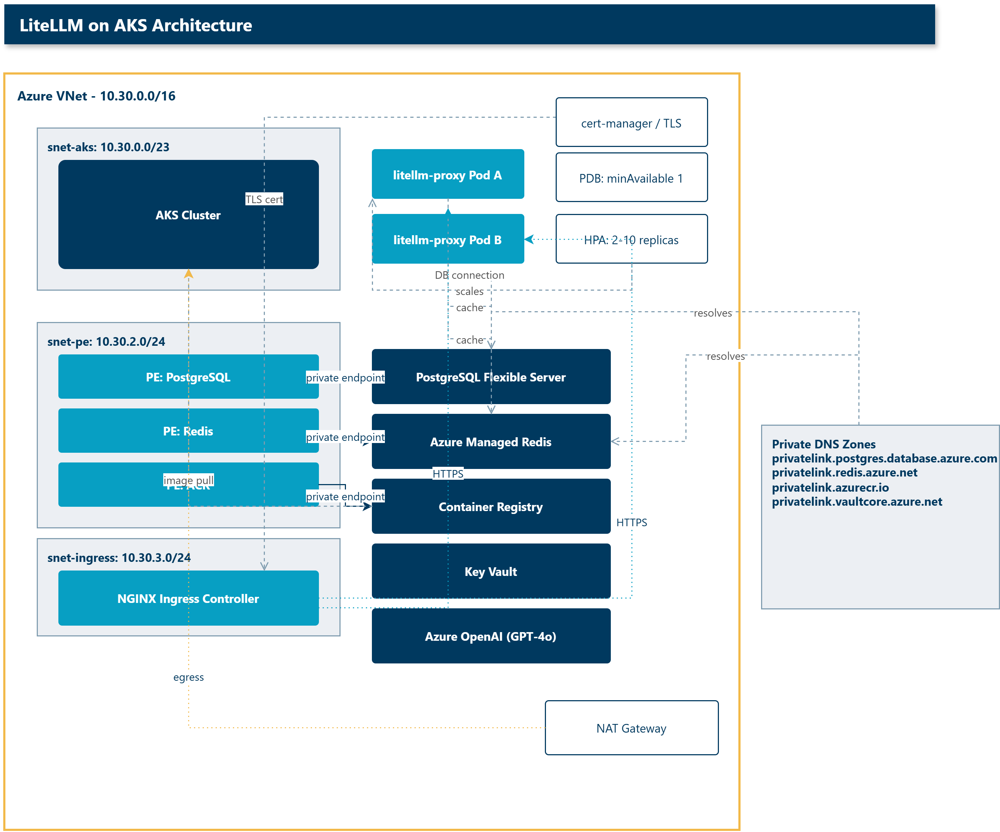
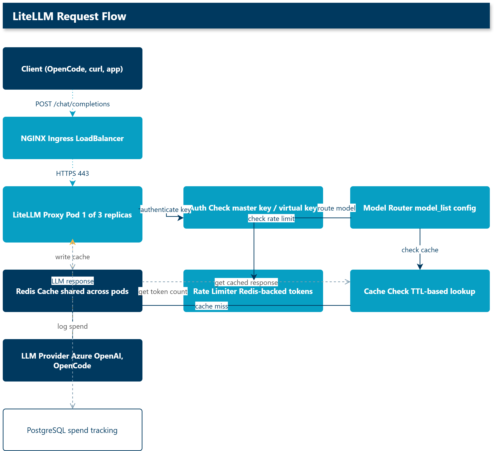
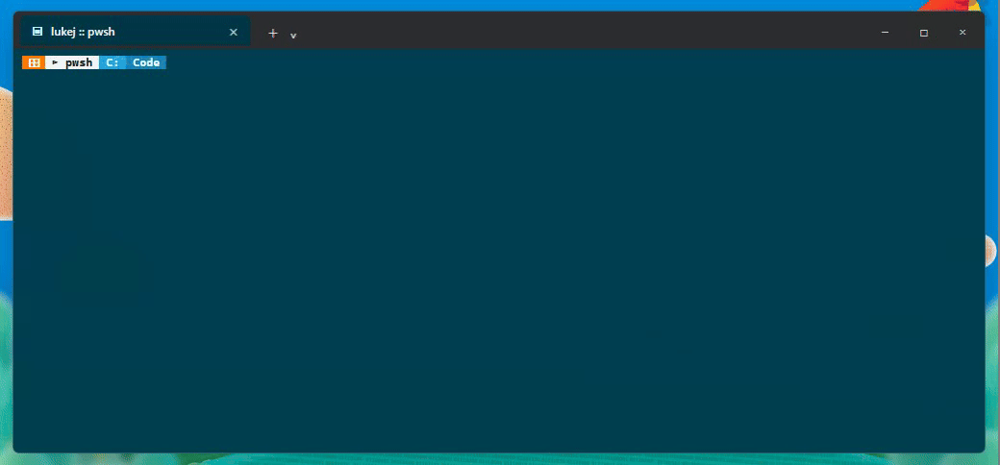
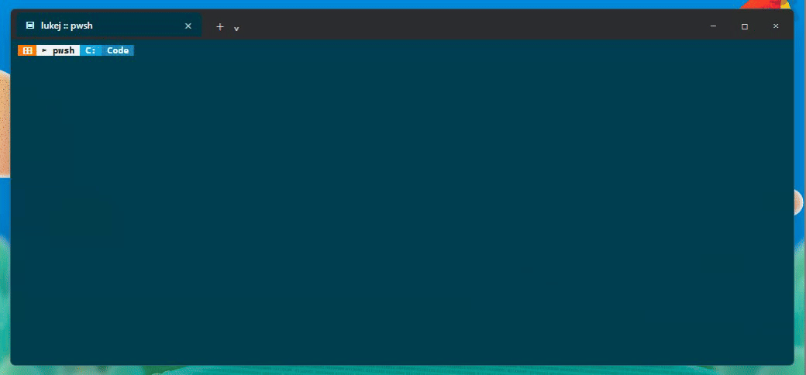
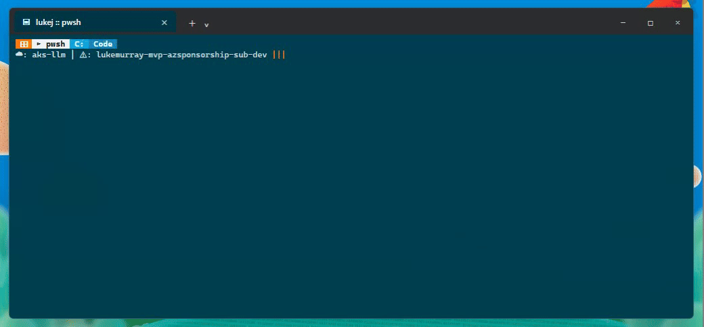

I've been spending time with [LiteLLM](https://litellm.ai) and wanted to see how far I could take it as a self-hosted LLM gateway on Azure Kubernetes Service. The goal was simple: build a deployment that you can spin up with a single `azd up` command, with all the production bits - private networking, Redis caching, PostgreSQL for spend tracking, and a proper ingress with automatic TLS.

Turns out it works pretty well. Here's what I built and what I found.

{/* truncate */}

## What LiteLLM does

LiteLLM is an open-source proxy that sits between your applications and the LLM providers they call. You hit a single OpenAI-compatible endpoint, and LiteLLM routes to whatever backend you've configured - Azure OpenAI, Anthropic, OpenAI, or any of the 100+ providers it supports.

The useful bit for me was having a single place to manage authentication, rate limiting, caching, and spend tracking across all the models our team uses. Rather than distributing API keys for every provider, the team gets a virtual key from LiteLLM and I control which models they can access and what their budget is.

## The deployment

I wanted to deploy this on AKS with everything managed through Infrastructure as Code. I used the Azure Developer CLI (`azd`) with Bicep for the infrastructure, with deployment lifecycle handled by PowerShell hooks.

:::note
The full source is at [lukemurraynz/LiteLLM.AKSGateway](https://github.com/lukemurraynz/LiteLLM.AKSGateway) if you want to skip the walkthrough and just deploy it.
:::

### Infrastructure

The Bicep template provisions a greenfield environment in a single resource group:

| Resource                   | Purpose                                                      |
| -------------------------- | ------------------------------------------------------------ |
| AKS cluster                | Standard tier, system + user node pools, Azure CNI Overlay   |
| Azure Container Registry   | Stores the LiteLLM Docker image                              |
| PostgreSQL Flexible Server | Spend tracking, virtual key storage, user management         |
| Azure Managed Redis        | Distributed caching and rate limiting across replicas        |
| Key Vault                  | Managed by the proxy for credential storage                  |
| Azure OpenAI               | GPT-4o model deployment                                      |
| VNet with 3 subnets        | AKS nodes, private endpoints, and a dedicated ingress subnet |
| NAT Gateway                | Outbound connectivity for the AKS cluster                    |
| Private DNS zones          | Private endpoint resolution for all PaaS services            |

Every data service (PostgreSQL, Redis, ACR, Key Vault) is configured with private endpoints. No public IPs on the data plane. The AKS cluster uses Azure CNI Overlay with Azure Network Policy for pod-level segmentation.

### Network design

The VNet is split into three subnets. The CIDR blocks are defined in `infra/core/networking.bicep`:

| Subnet         | CIDR           | Purpose                                                 |
| -------------- | -------------- | ------------------------------------------------------- |
| `snet-aks`     | `10.30.0.0/23` | AKS node pool (system + user)                           |
| `snet-pe`      | `10.30.2.0/24` | Private endpoints for PostgreSQL, Redis, ACR, Key Vault |
| `snet-ingress` | `10.30.3.0/24` | Reserved for the NGINX ingress controller               |

Outbound connectivity uses a NAT Gateway attached to the AKS subnet via a dedicated public IP (`pip-nat-vnet-`). The AKS cluster uses `userAssignedNATGateway` as its outbound type, which avoids the SNAT port exhaustion that can happen with `loadBalancer` outbound type at scale.

Private endpoint DNS resolution uses four Azure Private DNS zones, each linked to the VNet:

```text
privatelink.postgres.database.azure.com
privatelink.redis.azure.net
privatelink.azurecr.io
privatelink.vaultcore.azure.net
```

These zones are created in the Bicep template and linked automatically. Pods resolve private endpoint IPs through the CoreDNS split-DNS patch (more on that later).

The public ingress path is separate: the NGINX ingress controller gets a public LoadBalancer IP, and cert-manager handles the Let's Encrypt TLS certificate through the HTTP-01 challenge. The DNS A record is managed through the `sync-public-dns.ps1` hook, or created manually if you prefer.





### The `azd` lifecycle

`azd up` runs through several stages, each with a PowerShell hook:

1. **Preprovision** - generates random secrets for the PostgreSQL admin password, LiteLLM master key, and salt key. Also installs `kustomize` via Winget if it is not present.

2. **Provision** - deploys the Bicep template to Azure. This takes about 10-15 minutes and creates the full environment.

3. **Postprovision** - gets the AKS credentials, patches CoreDNS with a split-DNS configuration (Google DNS for public resolution, Azure DNS for private endpoint resolution), deploys the Kubernetes manifests via kustomize, and sets up the ingress controller.

4. **Postdeploy** - refreshes the Kubernetes secret with the latest connection strings and keys, restarts the deployment, and syncs the public DNS A record.

One thing I hit early on - the Bicep output `aksClusterName` was captured by azd as an environment variable, but `azure.yaml` was referencing `${AZURE_AKS_CLUSTER_NAME}` which did not exist. A quick fix to `${aksClusterName}` and the deployment ran clean.



## The LiteLLM config

The proxy is configured through a ConfigMap that kustomize applies to the cluster. The config file defines the models, authentication, caching, and routing.

```yaml
model_list:
  - model_name: azure-gpt-4o
    litellm_params:
      model: azure/gpt-4o
      api_base: os.environ/AZURE_OPENAI_ENDPOINT
      api_key: os.environ/AZURE_OPENAI_KEY
      api_version: "2024-10-21"

general_settings:
  master_key: os.environ/LITELLM_MASTER_KEY
  database_url: os.environ/DATABASE_URL
  database_connection_pool_limit: 10
  proxy_batch_write_at: 60
  allow_requests_on_db_unavailable: true

litellm_settings:
  cache: true
  cache_params:
    type: redis
    host: os.environ/REDIS_HOST
    port: os.environ/REDIS_PORT
    password: os.environ/REDIS_PASSWORD
    ssl: true
```

## Adding OpenCode Zen and Go models

Once the Azure OpenAI model was working, I also wanted to see whether LiteLLM could front the OpenCode models I use day to day. The answer is yes. OpenCode Zen exposes an OpenAI-compatible endpoint at `https://opencode.ai/zen/v1`, and OpenCode Go exposes one at `https://opencode.ai/zen/go/v1` for the OpenAI-compatible Go models.

That let me put Azure OpenAI, OpenCode Zen, and OpenCode Go behind the same LiteLLM endpoint:

| Model group                        | Example models                                           | Upstream base URL                  |
| ---------------------------------- | -------------------------------------------------------- | ---------------------------------- |
| Azure OpenAI                       | `azure-gpt-4o`                                           | `os.environ/AZURE_OPENAI_ENDPOINT` |
| OpenCode Zen                       | `big-pickle`, `deepseek-v4-flash-free`, `mimo-v2.5-free` | `https://opencode.ai/zen/v1`       |
| OpenCode Go (OpenAI-compatible)    | `glm-5.1`, `kimi-k2.6`, `deepseek-v4-pro`                | `https://opencode.ai/zen/go/v1`    |
| OpenCode Go (Anthropic-compatible) | `minimax-m2.5`, `qwen3.7-plus`                           | `https://opencode.ai/zen/go`       |

The last row is the small gotcha. For the Anthropic-compatible Go models, LiteLLM's Anthropic provider appends `/v1/messages` automatically. If you set the base URL to `https://opencode.ai/zen/go/v1`, LiteLLM sends the request to `/v1/v1/messages`, and OpenCode quite correctly returns a `404`. Setting the base URL to `https://opencode.ai/zen/go` fixes it.

The single proxy now exposes 19 models. A few of the Go subscription models currently return a `GoUsageLimitError` because my Go monthly limit is exhausted, but that still proved the routing path was correct. The free Zen models, including `big-pickle`, are available through the same proxy key.

The UI is useful once the proxy is running. I recorded this walkthrough after logging in (the login step is deliberately not captured so the master key never appears in the recording). It shows the live dashboard moving through the current configuration: Models + Endpoints, MCP Servers, and Virtual Keys.


I also tested the virtual key path from the API. The flow below creates a scoped key, uses it for a chat completion, and records the follow-up issue I saw when trying to delete it.


## Production settings from the LiteLLM docs

The [LiteLLM production best practices page](https://docs.litellm.ai/docs/proxy/prod) had a few things worth picking up.

The Redis config was the one that surprised me most - using `host`/`port`/`password` separately rather than a `redis_url` string is measurably faster (about 80 RPS according to their benchmarks). I had originally used the URL format and switched it after reading that.

The database settings are less surprising but worth noting. `proxy_batch_write_at: 60` batches spend updates every 60 seconds rather than writing on every request, which makes a meaningful difference to PostgreSQL write load. I paired that with `database_connection_pool_limit: 10` - with 3 replicas and 4 workers each that's 120 total connections, sitting comfortably inside PostgreSQL's defaults.

The other two I'd put in any production gateway: `allow_requests_on_db_unavailable: true` keeps the proxy serving requests even if PostgreSQL is momentarily unreachable (useful when you're in a private VNet and the database briefly hiccups during a scale event), and `LITELLM_MODE: "PRODUCTION"` disables the `load_dotenv()` call that would otherwise look for a `.env` file inside the container at startup.

## Testing multi-replica behaviour

One of the main reasons to use AKS is that you can run multiple replicas for high availability. I wanted to verify that the Redis-backed caching works across pods.

I split the capture into three shorter GIFs so each one shows a specific test. The values in these captures are from the live AKS deployment, with API keys redacted.

First, the proxy health and model catalogue:



Then the completion and cache checks:



I tested a few things through the public endpoint:

| Test              | Result                                                       |
| ----------------- | ------------------------------------------------------------ |
| Readiness         | `{"status":"healthy","db":"connected"}`                      |
| Model count       | `19` models                                                  |
| Azure OpenAI call | `azure-gpt-4o`, `0.153s`, response `Hello!`                  |
| OpenCode Zen call | `big-pickle`, `0.155s`, response `4`, `150` reasoning tokens |
| Redis cache       | `0.448s` miss, `0.132s` hit                                  |

Then I ran a cross-pod cache test against two different LiteLLM pods:


```
Pod A: litellm-proxy-9b9d6dffd-p2qqg on aks-userpool-12527619-vmss000001
Pod B: litellm-proxy-9b9d6dffd-qjfkr on aks-userpool-12527619-vmss000000

Pod A cache miss: 1.040s
Pod B cache hit:  0.636s
```

Pretty basic test case, but it proves the important bit: the response was cached by one replica and then served by another replica from Azure Managed Redis. That is the behaviour I wanted before trusting horizontal scale-out.

I also tested a shorter prompt through the public ingress:

```
Cache miss: 0.448s
Cache hit:  0.132s
Response:   Blue green
```

The NGINX ingress controller distributes requests across the pods transparently, and the Redis cache serves cached responses regardless of which pod handles the request.

## AKS configuration for LiteLLM

A few settings in `k8s/litellm-deployment.yaml` are worth calling out.

### Rolling updates and pod lifecycle

The deployment uses `maxUnavailable: 0` and `maxSurge: 1`, so Kubernetes never drops below the desired replica count during a rollout. A new pod starts, passes its readiness probe, gets added to the service, and only then does an old pod get terminated.

The readiness probe hits `/health/readiness` with a 30-second initial delay. LiteLLM won't pass that probe until Prisma has finished running `migrate deploy`, which matters because on first deploy it runs schema migrations before it's ready for traffic. The liveness probe is separate - `/health/liveliness` with a 60-second initial delay and 15-second period, so three failures in a row trigger a restart.

Graceful shutdown uses `terminationGracePeriodSeconds: 620` and a 5-second `preStop` sleep. The grace period is deliberately longer than LiteLLM's 600-second request timeout so in-flight requests can finish. The preStop sleep gives the load balancer a moment to deregister the pod before SIGTERM lands.

```yaml
terminationGracePeriodSeconds: 620
lifecycle:
  preStop:
    exec:
      command: ["sh", "-c", "sleep 5"]
```

### Autoscaling and disruption budget

The HPA targets 60% CPU and 80% memory, scaling between 2 and 10 replicas. The PodDisruptionBudget sets `minAvailable: 1`, so `kubectl drain` during node maintenance can't terminate the last running pod. Worth having, especially in a two-node user pool.

### Read-only root filesystem

The container runs with `readOnlyRootFilesystem: true`, `runAsNonRoot: true`, and all capabilities dropped. LiteLLM needs a few writable directories - Prisma writes binaries to a cache directory, migrations state needs somewhere to live, and the UI needs writable paths for assets and logos. I used `emptyDir` volumes at `/app/cache`, `/app/migrations`, `/app/var/litellm/ui`, `/app/var/litellm/assets`, and `/tmp`.

The `LITELLM_NON_ROOT=true` environment variable adjusts the default UI paths to point into `/app/var/litellm` rather than trying to write into the container root.

## Some things I learned

The CoreDNS split-DNS thing caught me early. AKS pods resolve DNS through CoreDNS, which by default forwards everything to the node's resolver - Azure DNS at 168.63.129.16. That works fine for private DNS zones (PostgreSQL, Redis, ACR all resolve correctly through private endpoints), but it breaks for public internet lookups. cert-manager's Let's Encrypt HTTP-01 challenge needs to resolve public domains, and with the default config it can't. The fix is a CoreDNS ConfigMap patch that sends public queries to 8.8.8.8 while keeping Azure private zones on 168.63.129.16 - the `postprovision` hook applies this automatically, but it's worth understanding why it's there.

Related to that: the first deploy I did, cert-manager started the Let's Encrypt flow before the DNS A record had fully propagated. The challenge timed out and left a stale `cm-acme-http-solver` pod sitting in the namespace. Deleting the `Certificate` and `CertificateRequest` objects forced a fresh attempt once the DNS was actually ready.

Kubernetes secrets don't hot-reload - worth remembering. When I added the OpenCode Go API key I updated the secret in the cluster, but the running pods still had the old environment because `envFrom` secrets are only loaded at pod startup. A force delete of the pods fixed it.

The virtual key deletion path still needs a closer look. Creating a scoped key and using it for completions worked fine, but the delete step surfaced a Redis cluster `MOVED` error during auth cache invalidation. The key disappeared from the list so it seems functionally gone, but I wouldn't call that clean. Left it as a follow-up rather than pretending it didn't happen.

## Operational checklist

Once the proxy is deployed, here is how I validate it is working:

```powershell
# AKS cluster state
az aks show -g rg-llm -n aks-llm --query provisioningState -o tsv
kubectl get nodes
kubectl get pods -n litellm -o wide
kubectl get hpa -n litellm

# LiteLLM health and model catalogue
curl https://litellm.headinthecloud.co.nz/health/readiness
curl https://litellm.headinthecloud.co.nz/models -H "Authorization: Bearer <key>"

# Test a completion
curl -X POST https://litellm.headinthecloud.co.nz/chat/completions \
  -H "Content-Type: application/json" \
  -H "Authorization: Bearer <key>" \
  -d '{"model":"azure-gpt-4o","messages":[{"role":"user","content":"hello"}]}'

# Test Redis cache by repeating the same request
curl -X POST https://litellm.headinthecloud.co.nz/chat/completions \
  -H "Content-Type: application/json" \
  -H "Authorization: Bearer <key>" \
  -d '{"model":"azure-gpt-4o","messages":[{"role":"user","content":"hello"}]}'

# Check Prometheus metrics
curl https://litellm.headinthecloud.co.nz/metrics | Select-String "litellm_"

# Check ingress TLS certificate
kubectl get certificate -n litellm -o wide
```

The test suite in `scripts/test-litellm.ps1` runs 26 checks across health, models, keys, chat, spend, metrics, and security. It cleans up generated test keys at the end.

```powershell
./scripts/test-litellm.ps1 -BaseUrl https://litellm.headinthecloud.co.nz -MasterKey <key>
```

### Cost and cleanup

This is not a free deployment. AKS Standard tier with two D4s_v3 node pools, Azure Managed Redis Balanced_B0, and PostgreSQL Standard_B2ms runs roughly $400-$500 per month in Australia East. The Azure OpenAI gpt-4o deployment adds pay-per-token cost.

To tear down the whole environment:

```powershell
azd down --purge
```

The `predown` hook deletes the `litellm` Kubernetes namespace before the resource group removal starts, so there are no dangling load balancer resources. If you want to keep data for later, export the PostgreSQL database first and store the `LITELLM_SALT_KEY` somewhere safe - you will need it to decrypt stored credentials when you restore.

## Wrapping up

Hopefully this gives you a starting point for running LiteLLM on AKS. The `azd` template handles the full deployment lifecycle, and the production configuration covers caching, rate limiting, spend tracking, and high availability out of the box.

I had a lot of fun setting this up. The mind boggles at what you could do with the MCP Gateway features on top of this - wiring up Microsoft Learn documentation tools or GitHub MCP servers through the same proxy. Something for the backlog.

## References

**LiteLLM:**

- [LiteLLM documentation](https://docs.litellm.ai)
- [LiteLLM production best practices](https://docs.litellm.ai/docs/proxy/prod)
- [LiteLLM on GitHub](https://github.com/BerriAI/litellm)
- [LiteLLM MCP Gateway](https://docs.litellm.ai/docs/proxy/mcp)

**Azure Infrastructure & Deployment:**

- [Azure Developer CLI](https://learn.microsoft.com/en-us/azure/developer/azure-developer-cli/?WT.mc_id=AZ-MVP-5004796)
- [AKS network concepts and security](https://learn.microsoft.com/en-us/azure/aks/concepts-network?WT.mc_id=AZ-MVP-5004796)
- [Bicep language overview](https://learn.microsoft.com/en-us/azure/azure-resource-manager/bicep/overview?WT.mc_id=AZ-MVP-5004796)
- [HTTPS ingress on AKS with cert-manager](https://learn.microsoft.com/en-us/azure/aks/ingress-tls?WT.mc_id=AZ-MVP-5004796)

**Networking & Private Connectivity:**

- [Azure Private Link and Private Endpoints](https://learn.microsoft.com/en-us/azure/private-link/private-endpoint-overview?WT.mc_id=AZ-MVP-5004796)
- [Azure NAT Gateway overview](https://learn.microsoft.com/en-us/azure/nat/nat-overview?WT.mc_id=AZ-MVP-5004796)
- [Workload Identity on AKS](https://learn.microsoft.com/en-us/azure/aks/workload-identity-overview?WT.mc_id=AZ-MVP-5004796)

**Data Services:**

- [Azure Cache for Redis with private endpoints](https://learn.microsoft.com/en-us/azure/azure-cache-for-redis/cache-how-to-premium-vnet?WT.mc_id=AZ-MVP-5004796)
- [PostgreSQL Flexible Server networking](https://learn.microsoft.com/en-us/azure/postgresql/flexible-server/concepts-networking?WT.mc_id=AZ-MVP-5004796)
