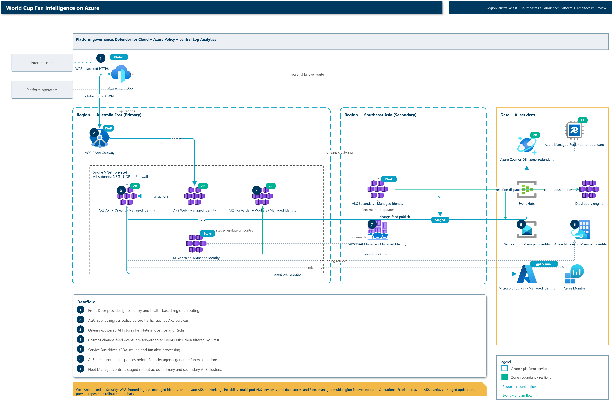
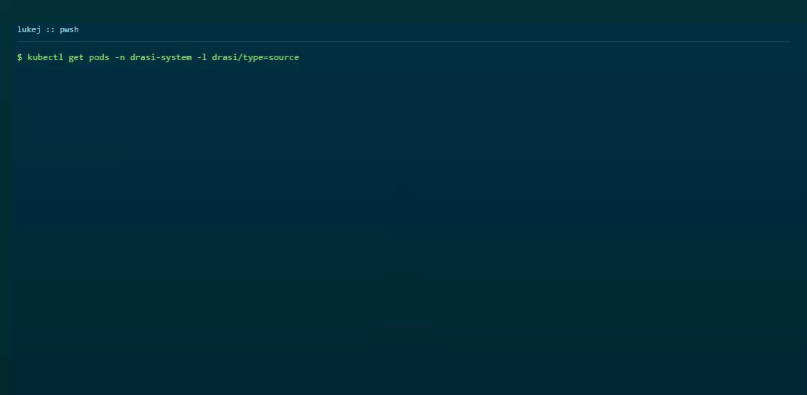
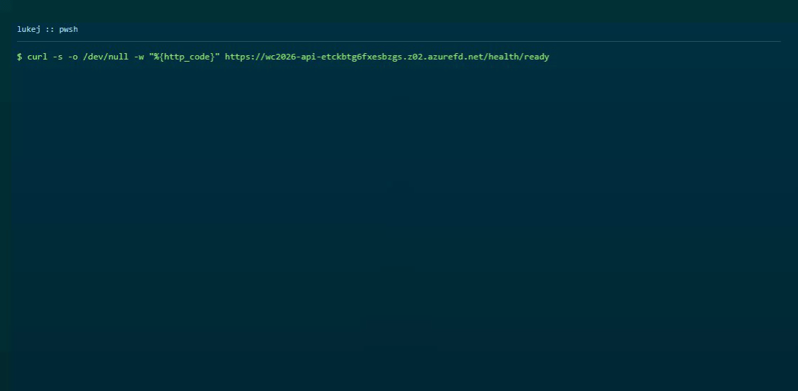
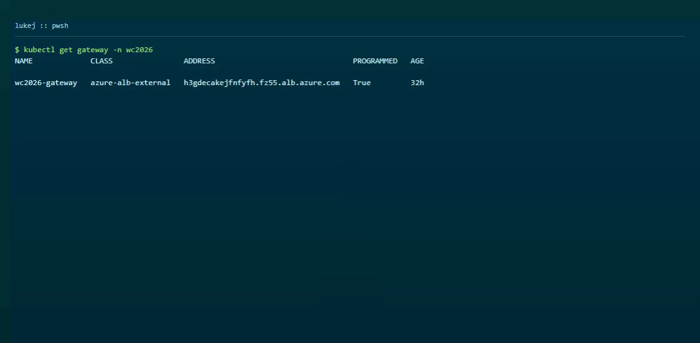
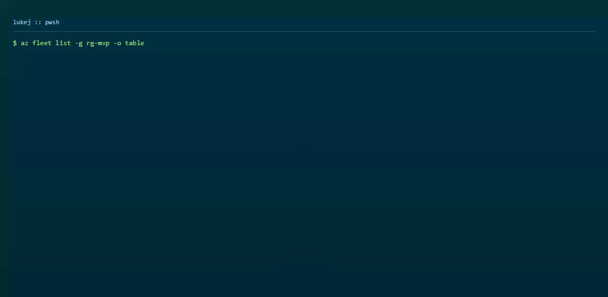
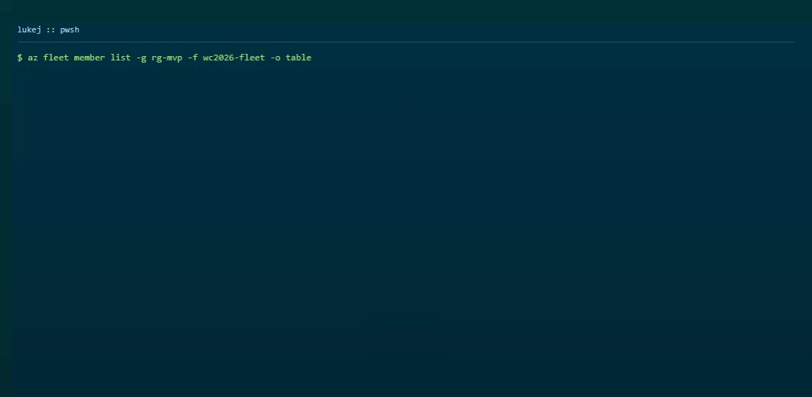

With the FIFA World Cup 2026 underway, I thought it would be a good chance to develop a World Cup 2026 fan intelligence platform in a regional deployment stamp pattern, but could also be scaled globally across other regions and locales.

This blog articles, covers the architecture, the 12 AI agent types, the Drasi event pipeline, the AKS configuration, that I used! This solution is also open source and you can deploy/modify and learn it from it all from scratch with `azd` _(note it won't be cheap to run due to the resources deployed and needed, I was aiming for full production sizing and resourcing vs small proof of concept)_.

{/* truncate */}

:::info
The full codebase is open source and available at [lukemurraynz/WC2026_FanIntelligence](https://github.com/lukemurraynz/WC2026_FanIntelligence) on GitHub. You can explore the source, deploy your own instance, and modify it for your own use cases.
:::

## Quick start

```powershell
# Prerequisites: Azure CLI, azd 1.26+, kubectl, .NET 10 SDK
azd auth login
azd config set alpha.aks.kustomize on
azd env new wc2026 --subscription <subscription-id> --location australiaeast

# Deploy everything
azd up
```

After deployment, verify:

```powershell
kubectl get pods -n wc2026
# Expect: 2 api, 2 web, 2 cosmos-forwarder -- all Running

kubectl exec -n wc2026 deploy/fanintelligence-api -- curl -s http://localhost:8080/health/ready
# Expect: Healthy
```


## Architecture overview



The platform has five layers:

1. **Ingress** -- Azure Front Door Premium routes global traffic to the nearest region's Application Gateway for Containers (AGC).
2. **Compute** -- AKS cluster `wc2026-fanintel-aks` running three services:
   - **API** (.NET 10, Orleans 10) -- stateful grains for fan profiles, match state, notifications, and AI agent orchestration
   - **Web** (React 19, TypeScript, Vite) -- fan-facing frontend
   - **CosmosForwarder** -- reads Cosmos DB change feed and forwards to Event Hubs
3. **Data** -- Cosmos DB (`wc2026-mvp-cosmos`), Azure Managed Redis Enterprise (`wc2026-redis`), and Azure AI Search (`wc2026-search`) for tournament grounding.
4. **Event pipeline** -- Cosmos DB change feed -> Event Hubs -> Drasi continuous queries -> Service Bus -> KEDA-scaled workers. Five Drasi source pods and one reaction pod handle the streaming.
5. **AI** -- Microsoft Foundry with `gpt-5-mini` deployment. Twelve agent types provide fan-facing explanations.

:::tip Quick primer on key technologies
New to some of these? Here's what each enables:

- **[Orleans](https://learn.microsoft.com/en-us/dotnet/orleans/overview?pivots=orleans-10-0&WT.mc_id=AZ-MVP-5004796)**: Stateful virtual actors that hold fan state _(preferences, history, rate limits)_ in memory across requests — eliminates distributed cache races and throttling when thousands of goal events fire simultaneously.
- **[Drasi](https://drasi.io/)**: Continuous Cypher queries that detect only _meaningful_ changes (goals, status shifts) rather than every state update — cuts noise by 90% and routes events to the right AI agent.
- **[PostDaprPubSub](https://drasi.io/drasi-kubernetes/how-to-guides/configure-reactions/configure-post-pubsub-reaction/)**: A Drasi reaction that publishes deltas to Service Bus without custom code — keeps the event pipeline declarative.
- **[AKS](https://learn.microsoft.com/azure/aks/intro-kubernetes?WT.mc_id=AZ-MVP-5004796)**: Managed Kubernetes cluster that runs the API, web, and event-processing workloads — handles rolling updates, KEDA autoscaling, and workload identity so you don't manage VMs.
- **[AKS Fleet Manager](https://learn.microsoft.com/azure/kubernetes-fleet/?WT.mc_id=AZ-MVP-5004796)**: Control plane for multi-region Kubernetes clusters — stages updates across regions and provides a single pane of glass for health and rollout progress.
:::

Skip the details if you're familiar; the architecture works the same. These choices just solve specific pain points (state races, event noise, custom processors, regional orchestration) that show up at tournament scale.
:::

### Key architectural decisions

| Decision        | Choice                            | Rationale                                                       |
| --------------- | --------------------------------- | --------------------------------------------------------------- |
| Compute         | AKS + Orleans                     | Stateful grains eliminate distributed-cache races for fan state |
| Event detection | Drasi continuous queries          | Cypher-based change detection with `drasi.previousValue()`      |
| AI model        | gpt-5-mini _(GlobalStandard)_     | Smallest model that meets quality bar with grounding            |
| Event bridge    | Dapr PostDaprPubSub               | Native Drasi reaction, no custom bridge service                 |
| Deployment      | azd + Kustomize + Flux            | Single `azd deploy` for all services, GitOps for production     |
| State storage   | Cosmos DB _(Session consistency)_ | Multi-region writes, grain directory persistence                |

## Agentic AI capabilities with Microsoft Agent Framework

The platform has 12 generative AI agents, orchestrated with Microsoft Agent Framework and implemented as Orleans grain-backed handlers:

| Agent                   | What it does                    | How to trigger                   |
| ----------------------- | ------------------------------- | -------------------------------- |
| Goal Explainer          | Plain-language goal description | Select match + "Why it mattered" |
| Daily Briefing          | Personalised match summary      | "Get my briefing" button         |
| Match Narrative         | Rolling story of live match     | "Run Match Narrative"            |
| Bracket Projection      | Knockout bracket prediction     | "Run Bracket Projection"         |
| Multi-turn Companion    | Conversational Q&A with memory  | "Run Multi-turn Companion"       |
| Upset Detection         | Identifies unexpected results   | "Run Upset Detection"            |
| Travel Advisor          | Fan travel recommendations      | Based on team preferences        |
| Player Insight          | Player performance analysis     | Based on match events            |
| Qualification Scenarios | Group advancement projection    | Via /qualification/scenarios API |
| Watch Party Host        | Watch party coordination        | Web UI                           |
| Rivalry Context         | Head-to-head history            | Match context panel              |
| Safety Checker          | Content safety evaluation       | Runs on every agent output       |

Each agent follows the same pattern: structured prompt template -> Azure AI Search grounding -> Foundry model -> safety filter -> output validation -> fallback if grounding score < 0.7.


### Live Agent Hub flow

When a fan runs an agent from the Agent Hub:

1. The frontend calls the selected agent endpoint.
1. Microsoft Agent Framework routes to the configured Foundry-backed agent implementation.
1. Grounding, confidence, and safety checks validate the response.
1. Deterministic fallback text is returned if the AI response does not pass validation.

This model keeps the experience predictable while still giving fans rich AI explanations for matches, brackets, and qualification outcomes.

## Drasi event pipeline

The event pipeline processes live match data in real time:

```yaml
# Drasi continuous query: goal-scored
MATCH (m:Match)
WHERE m.status = 'Live'
AND (m.homeScore <> coalesce(drasi.previousValue(m.homeScore), -1)
OR m.awayScore <> coalesce(drasi.previousValue(m.awayScore), -1))
RETURN m.matchId, m.homeTeamCode, m.awayTeamCode, m.homeScore, m.awayScore
```

The `drasi.previousValue()` function detects changes between document revisions. Three queries run: `goal-scored`, `match-status-change`, and `schedule-changed`. Results flow through Dapr to Service Bus, then to KEDA-scaled API workers.

### Data flow that drives the agentic experience

1. **Match data changes** in Cosmos DB _(`Matches` container)_.
2. **CosmosForwarder** publishes those changes to Event Hubs.
3. **Drasi** evaluates continuous queries and emits only meaningful deltas (goal, status, schedule).
4. **PostDaprPubSub + Service Bus** fan out those deltas as reliable work items.
5. **API workers + Orleans grains** map each event to the right Microsoft Agent Framework capability.
6. **Foundry + grounding + safety gates** generate fan-facing outputs (briefings, goal explanations, travel updates).

| Event signal from Drasi | Agent capability that activates                           | Fan-visible outcome                                                   |
| ----------------------- | --------------------------------------------------------- | --------------------------------------------------------------------- |
| `goal-scored`           | Goal Explainer, Match Narrative, Daily Briefing refresh   | "Why this goal mattered" updates and refreshed match story            |
| `match-status-change`   | Daily Briefing, Qualification Scenarios, Watch Party Host | Updated briefings, qualification implications, and watch party timing |
| `schedule-changed`      | Travel Advisor, Multi-turn Companion context refresh      | Revised travel guidance and updated answers in follow-up questions    |

This flow is what keeps the AI useful during live tournaments. Drasi removes noisy state churn, Orleans applies fan context, and Agent Framework routes each event to the capability that can produce an immediate fan-facing action.

The Drasi reaction pod is running and healthy:

```powershell
kubectl logs -n drasi-system deploy/forward-to-servicebus-reaction --tail=3
# Starting PostDaprPubSub reaction
# Dapr sidecar is available.
# Validated query configurations.
```



## AKS configuration

The AKS cluster runs three services with specific configurations:

**API pods** -- Orleans silos with Redis clustering, Cosmos grain persistence:

```yaml
strategy:
  rollingUpdate:
    maxSurge: 1
    maxUnavailable: 0
securityContext:
  runAsNonRoot: true
  seccompProfile:
    type: RuntimeDefault
```

**KEDA autoscaling** -- scales API pods on Service Bus queue depth:

```yaml
minReplicaCount: 2
maxReplicaCount: 10
triggers:
  - type: azure-servicebus
    queueName: match-events
```

**Workload Identity** -- every pod authenticates to Azure services via managed identity, no connection strings:

```yaml
metadata:
  labels:
    azure.workload.identity/use: "true"
```



## Platform operations capabilities: AGC, Drasi, AKS, and Fleet Manager

The solution's operations model is built around four platform capabilities that map directly to reliability and scale outcomes:

1. **Front Door + AGC** gives controlled ingress with health-probed routing and a single global endpoint. WAF and DDoS controls are at Front Door, while AGC handles Kubernetes Gateway API routing.
2. **Drasi** turns Cosmos change-feed events into actionable queue messages without custom stream processors.
3. **AKS** runs the API/web/forwarder workloads with rolling updates, KEDA, and workload identity.
4. **AKS Fleet Manager** provides a control plane for multi-cluster operations with staged update groups across regions.





## Deployment model

The platform uses `azd` with `host: aks` and Kustomize overlays. Each service has its own overlay directory, so `azd deploy api` deploys only the API.

```yaml
services:
  api:
    project: ./src/FanIntelligence.Api
    language: dotnet
    host: aks
    k8s:
      kustomize:
        dir: ../../infra/k8s/overlays/azd-api
```

The hook pipeline adds validation gates:

1. **preprovision** -- validates Bicep syntax
2. **postprovision** -- configures Entra app, Flux GitOps, AI Search
3. **predeploy** -- runs tests, validates Kubernetes manifests
4. **postdeploy** -- verifies Orleans health, canary endpoints

## Tradeoffs and decisions

### Why Orleans over stateless APIs

Stateless APIs with Redis for deduplication hit a wall during goal storms -- every event triggered Cosmos subscriber queries that throttled under load. Orleans grains own per-fan state in memory, so rate limits, preferences, and notification history are a local lookup, not a distributed query.

### Why Drasi over custom stream processing

Drasi's `drasi.previousValue()` lets us detect changes in Cypher rather than writing custom stream processors. The tradeoff is that Drasi is pre-1.0 CNCF -- the API surface changes between releases, and some reaction providers aren't bundled (PostDaprPubSub needs `externalImage: true`).

### Why gpt-5-mini over larger models

Larger models didn't improve explanation quality once grounding was in place. The smaller model is faster, cheaper, and the grounding score threshold catches the edge cases where it doesn't have enough context.

### Why Front Door over direct AKS ingress

Front Door provides global routing, WAF, and DDoS protection without managing multiple ingress controllers per region. The tradeoff is that the AGC integration has a version coupling issue between the managed Gateway API add-on and the ALB controller _(another post is coming)_.

Hopefully this gives you a working blueprint for building event-driven AI platforms on AKS. Make sure to check out the Orleans on AKS and Drasi documentation for deeper dives into stateful orchestration and continuous query patterns, I had a lot of fun building this, hopefully it helps showcase how you could build that next solution!

## References

- [Azure Developer CLI](https://learn.microsoft.com/azure/developer/azure-developer-cli/?WT.mc_id=AZ-MVP-5004796)
- [Orleans overview](https://learn.microsoft.com/dotnet/orleans/overview?pivots=orleans-10-0&WT.mc_id=AZ-MVP-5004796)
- [Microsoft Foundry](https://learn.microsoft.com/azure/foundry/what-is-foundry?tabs=python&WT.mc_id=AZ-MVP-5004796)
- [Drasi](https://drasi.io)
- [Azure Managed Redis](https://learn.microsoft.com/azure/azure-cache-for-redis/managed-redis/managed-redis-overview?WT.mc_id=AZ-MVP-5004796)
- [AKS Workload Identity](https://learn.microsoft.com/azure/aks/workload-identity-overview?WT.mc_id=AZ-MVP-5004796)
- [AKS Fleet Manager](https://learn.microsoft.com/azure/kubernetes-fleet/?WT.mc_id=AZ-MVP-5004796)
