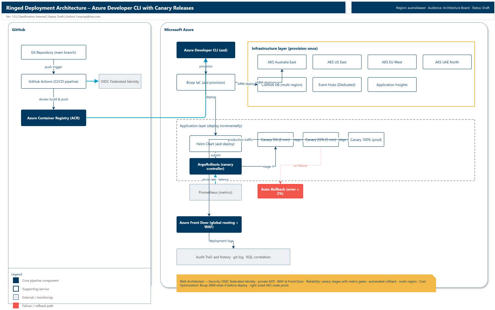
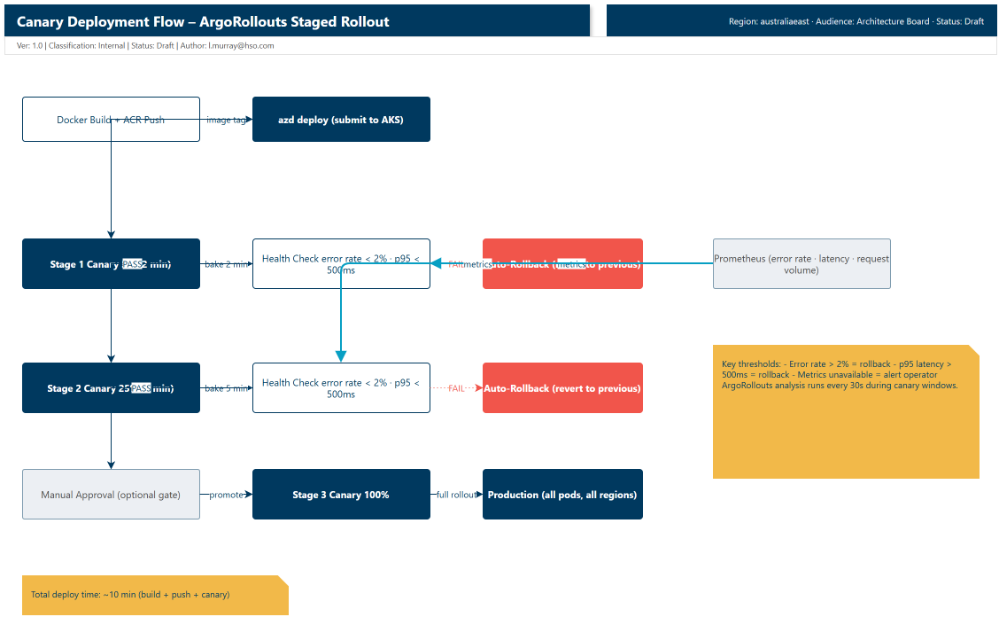
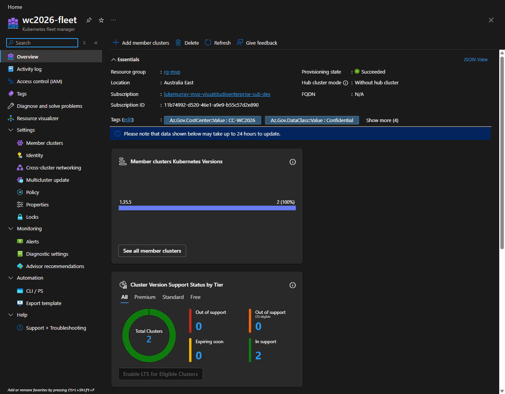
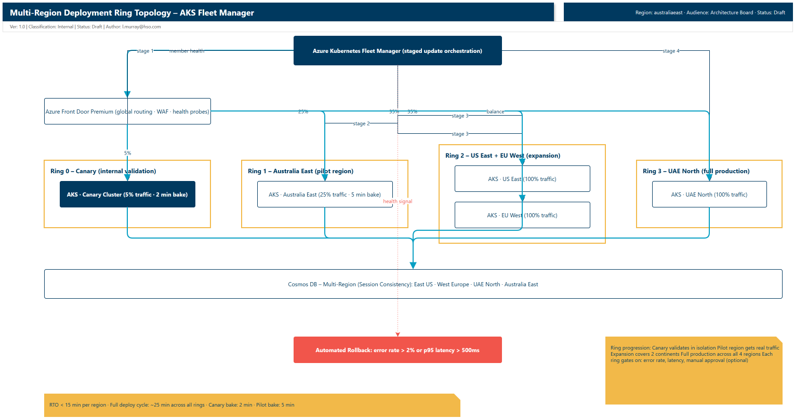

I have been building out a fan intelligence platform for the FIFA World Cup 2026, and one of the things I wanted to get right from the start was the deployment model. When you have millions of fans receiving real-time notifications during a live match, the last thing you want is a bad deploy taking down a region.

The default approach for a lot of Kubernetes projects is `kubectl apply` and hoping for the best. That works for a dev cluster. It does not work when your RTO is measured in minutes and your blast radius spans multiple continents.

This post covers the ringed deployment pipeline I landed on: Azure Developer CLI (azd) for infrastructure and app deployment, Bicep for the infrastructure layer, Helm for the application layer, and ArgoRollouts for canary releases. Zero manual kubectl commands, automated rollback on error spikes, and a full audit trail from commit to running pods.



{/* truncate */}

## The problem with manual deployments

The MVP deployment flow for most Kubernetes projects looks something like this:

1. Developer pushes to `main`
2. GitHub Actions builds a Docker image, pushes it to ACR
3. Someone runs `kubectl apply -f manifests/` against the AKS cluster
4. Someone does a manual smoke test: "did the thing work?"
5. If something breaks: manual `kubectl rollout undo deployment/api`

This falls apart at scale for a few reasons:

- **Forgotten image tags.** A developer updates the code but forgets to bump the image tag in the manifest. The old version keeps running, nobody notices until the alert fires.
- **Partial deploys.** A network blip during `kubectl apply` leaves the cluster in a half-deployed state. Some pods are new, some are old, and the behaviour is unpredictable.
- **No automated rollback.** If an error spikes, someone has to notice, investigate, and manually roll back. At 2am during a match, that someone might be asleep.
- **No audit trail.** When something goes wrong, correlating errors to a specific commit means digging through git history, container logs, and deployment timestamps.

I wanted a pipeline where a developer runs one command, the deployment rolls out gradually, health checks gate each stage, and if anything goes wrong the system rolls back on its own.

## The approach: azd + Bicep + canary releases

Here is the flow I landed on:

```
Git (main branch)
    ↓
azd provision (infra)  [once per region]
    ↓
azd deploy (app)       [incremental updates]
    ↓
Bicep → ARM Deploy → AKS (infrastructure provisioned)
    ↓
Docker image → ACR → Helm chart → ArgoRollouts (canary)
    ↓
Canary 5% → Health check (2 min)
    ↓
Canary 25% → Health check (5 min)
    ↓
Canary 100% → Production
    ↓
Automated rollback if error rate exceeds threshold
```

The key separation is between infrastructure and application. Infrastructure (AKS clusters, Cosmos DB, Event Hubs) is provisioned once with `azd provision`. The application (Docker images, Helm values, canary configuration) is deployed incrementally with `azd deploy`. You can redeploy the application a hundred times without touching the infrastructure layer.

### Infrastructure as code with Bicep

The Bicep layer defines the resources that change rarely. Here is a trimmed version of what that looks like:

```bicep
param environment string = 'prod'
param location string = 'australiaeast'

resource aksCluster 'Microsoft.ContainerService/managedClusters@2024-05-02' = {
  name: 'aks-fanintel-${environment}-${location}'
  location: location
  sku: {
    name: 'Automatic'
  }
  properties: {
    kubernetesVersion: '1.31'
    networkProfile: {
      networkPlugin: 'azure'
      serviceCidr: '10.0.0.0/16'
      dnsServiceIP: '10.0.0.10'
    }
    addonProfiles: {
      omsagent: {
        enabled: true
        config: {
          logAnalyticsWorkspaceResourceID: logAnalyticsWorkspace.id
        }
      }
    }
  }
}

resource appInsights 'Microsoft.Insights/components@2020-02-02' = {
  name: 'ai-fanintel-${environment}'
  location: location
  kind: 'web'
  properties: {
    Application_Type: 'web'
    WorkspaceResourceId: logAnalyticsWorkspace.id
  }
}
```

Run it once per region using separate azd environments:

```bash
# Provision each region as its own environment
azd env new australiaeast
azd provision -l australiaeast

azd env new useast
azd provision -l eastus

azd env new euwest
azd provision -l westeurope

azd env new uaenorth
azd provision -l uaenorth
```

:::note
Each region gets its own azd environment so you can deploy to them independently. The `azure.yaml` stays the same across all environments — only the location and environment-specific variables differ.
:::

All infrastructure is in place across four regions. The application layer deploys on top of this.

### Helm charts for the application layer

The Helm chart defines what runs and how it scales:

```yaml
# values.yaml
replicaCount: 10
image:
  repository: fanintelacr.azurecr.io/api
  tag: latest
  pullPolicy: IfNotPresent

service:
  type: LoadBalancer
  port: 80

resources:
  requests:
    cpu: 500m
    memory: 512Mi
  limits:
    cpu: 1000m
    memory: 1Gi

autoscaling:
  enabled: true
  minReplicas: 10
  maxReplicas: 100
  targetCPUUtilizationPercentage: 70
```

With azd's `host: aks` mode, the image tag is handled for you — azd builds the container, pushes it to ACR, and injects the correct tag into the Kubernetes manifest at deploy time. No more forgotten tag bumps.

### Canary deployment with ArgoRollouts

This is where the safety rails come in. Instead of a blind cutover, ArgoRollouts stages the deployment:

```yaml
# rollout.yaml
apiVersion: argoproj.io/v1alpha1
kind: Rollout
metadata:
  name: api-rollout
spec:
  replicas: 10
  strategy:
    canary:
      steps:
      - setWeight: 5
      - pause:
          duration: 2m
      - setWeight: 25
      - pause:
          duration: 5m
      - setWeight: 100
      analysis:
        interval: 30s
        threshold: 5
        metrics:
        - name: error-rate
          query: |
            sum(rate(http_requests_total{status=~"5.."}[5m]))
            /
            sum(rate(http_requests_total[5m]))
          successCriteria: "< 0.02"
        - name: latency
          query: |
            histogram_quantile(0.95,
              sum(rate(http_request_duration_seconds_bucket[5m])) by (le))
          successCriteria: "< 0.5"
```

The deployment goes through three stages:

1. **Canary 5% (2 min):** One out of every twenty pods runs the new version. ArgoRollouts monitors error rate and p95 latency. If either metric crosses the threshold, it rolls back automatically.
2. **Canary 25% (5 min):** Five out of twenty pods run the new version. Same health checks. You can gate this behind a manual approval if the change is high-risk.
3. **Canary 100%:** All pods run the new version.

The full deploy time is roughly ten minutes (build + push + canary stages). For a live-event platform, that is fast enough to ship a hotfix between matches.

:::tip
The two-minute canary window is deliberate. During a live match, goal events fire every ten to fifteen minutes on average. A two-minute window gives ArgoRollouts enough time to detect an error spike without overlapping the next goal storm.
:::



## Rollback: one command, or none at all

If you catch an issue manually, ArgoRollouts gives you a one-command undo:

```bash
kubectl argo rollouts undo api-rollout
```

That reverts to the previous known-good revision within thirty seconds. No hunting for the right `kubectl rollout` revision.

Better still, let ArgoRollouts handle it. If the error rate crosses 2% or p95 latency exceeds 500ms during any canary stage, the rollout aborts and reverts automatically. The SRE does not need to be awake.

## Audit trail: from commit to pod

Every deployment is traceable. Use git to correlate commits to deployments:

```bash
# What changed between the last two deploys
git log v1.2.2..v1.2.3 --oneline

# abc123 feat: Fix duplicate notification bug
# abc122 test: Add integration test for goal storm
```

ArgoRollouts also records each revision with a revision number, so you can see the progression:

```bash
kubectl argo rollouts history api-rollout

# REVISION  CURRENT-STEP  STATUS      AGE
# 3        -              Healthy     10m
# 2        -              Degraded    15m  (rolled back)
# 1        -              Healthy     1h
```

When an incident happens, you can correlate the deployment version to the error spike:

```kusto
AzureDiagnostics
| where TimeGenerated > ago(1h)
| where CustomDimensions.DeploymentVersion == "v1.2.3"
| where ResultDescription contains "error"
| summarize ErrorCount = count() by CustomDimensions.DeploymentVersion
| where ErrorCount > 100
```

And trace that version back to the exact commit:

```bash
git log v1.2.2..v1.2.3 --oneline
# abc123 feat: Fix duplicate notification bug
```

No guessing what changed. The commit, the deployment, and the error are all linked.

## A few things I hit along the way

**Canary window sizing.** My first canary stage was ten minutes. That was way too long. It slowed deployments to a crawl, and during a match window you cannot afford a fifteen-minute deploy cycle. Two minutes turned out to be enough to catch error spikes while keeping the overall deploy time reasonable.

**Helm chart image tag drift.** Before switching to azd's `host: aks` mode, I kept forgetting to bump the image tag in `values.yaml`. The pipeline built a new image with a new tag, pushed it to ACR, and then the Helm chart deployed the old tag. With `host: aks`, azd handles the image reference injection so the tag in the manifest stays in sync with what was built. One less manual step, one less thing to forget.

**Metrics query flakiness.** ArgoRollouts occasionally could not reach Prometheus during a canary window. When that happened, the metrics were not evaluated and the rollout stalled. I added a fallback that surfaces the metric collection failure as an alert and lets the operator decide whether to promote manually. Worth building this in from the start if you are running Prometheus in-cluster.



## Pre-match dry runs

Before going live, run through the full deployment and rollback flow in each region:

```bash
# Preview infra changes before applying (Bicep what-if)
azd provision --preview

# Deploy to a single region first, verify canary stages
azd env select australiaeast
azd deploy

# Test rollback via ArgoRollouts
kubectl argo rollouts undo api-rollout

# Test Cosmos DB regional failover (runbook verification)
az cosmosdb failover-priority-change \
  --name cosmos-fanintel \
  --resource-group rg-fanintel \
  --failover-policies "westeurope=0 eastus=1 uaenorth=2 australiaeast=3"
```

If it does not work in the dry run, it will not work during the match. Run through it at least twice.



## Reproducible evidence on a live deployment

You can adapt this pattern for any AKS + GitOps setup. Keep the core loop: stage, observe, promote or rollback.

```powershell
$resourceGroup = "<your-resource-group>"
$clusterName = "<your-aks-cluster>"
$namespace = "<your-k8s-namespace>"

az aks get-credentials --resource-group $resourceGroup --name $clusterName --overwrite-existing
kubectl get kustomizations.kustomize.toolkit.fluxcd.io -n flux-system
kubectl get deployment api -n $namespace -o wide
kubectl rollout history deployment/api -n $namespace
```

What good looks like:
- Flux reconciliation is healthy, and the target deployment revision is clear
- Replica sets and rollout history show staged progression, not a blind cutover
- The health endpoint stays stable while the rollout is progressing

If you are also using AKS Fleet for staged cross-cluster rollout:

```powershell
az fleet updaterun list \
  --resource-group "<your-resource-group>" \
  --fleet-name "<your-fleet-name>" \
  --output table
```

## Wrapping up

Manual deployments do not scale to millions of concurrent users. Ringed deployments with canary stages, automated health checks, and instant rollback give you the safety rails that live-event platforms need.

With azd, Bicep, Helm, and ArgoRollouts, the pipeline gives you:

- **Zero manual kubectl.** One command deploys to all regions.
- **Audit trail from commit to pod.** Full traceability when something goes wrong.
- **Automated rollback on error spikes.** No SRE manual intervention needed.
- **RTO under 15 minutes for any region.** Fast recovery from regional outages.
- **Canary safety.** Gradual rollout with metric gates at every stage.

I had a lot of fun building this, and the mind boggles at what you can do once the deployment pipeline is a solved problem. Hopefully this gives you a working pattern for your own AKS deployments. I built this for a World Cup platform, but the same approach works anywhere you want to ship with confidence and sleep through the night.

Make sure to check out the full fan intelligence platform post if you want to see how this deployment model fits into the broader architecture, and the [azd documentation](https://learn.microsoft.com/azure/developer/azure-developer-cli/?WT.mc_id=AZ-MVP-5004796) for the full feature set.

## References

- [Azure Developer CLI documentation](https://learn.microsoft.com/azure/developer/azure-developer-cli/?WT.mc_id=AZ-MVP-5004796)
- [AKS documentation](https://learn.microsoft.com/azure/aks/?WT.mc_id=AZ-MVP-5004796)
- [Azure Kubernetes Fleet Manager](https://learn.microsoft.com/azure/kubernetes-fleet/?WT.mc_id=AZ-MVP-5004796)
- [ArgoRollouts documentation](https://argoproj.github.io/argo-rollouts/)
- [Azure Deployment Stacks](https://learn.microsoft.com/azure/azure-resource-manager/bicep/deployment-stacks?WT.mc_id=AZ-MVP-5004796)
- [Fan Intelligence for World Cup 2026](https://luke.geek.nz/azure/fan-intelligence-world-cup-2026)
