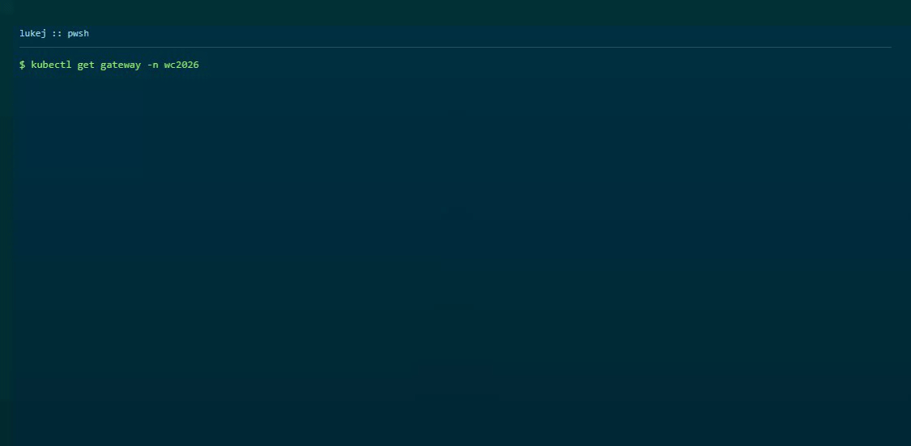

I was setting up Application Gateway for Containers (AGC) as the ingress layer for a project cluster. The AKS add-on makes it look straightforward in Bicep - enable it, deploy your Gateway and HTTPRoute manifests, done. What I ran into instead was a version deadlock between two managed add-ons that left the Gateway stuck at `PROGRAMMED: Unknown` for twelve hours and Front Door returning 504 the whole time.

This is what happened, why, and how I got out of it.

> **Update (2026-07-23):** Microsoft has clarified the add-on behavior and support matrix. If you use the AKS add-on path, ALB controller versions are pinned by cluster version + Managed Gateway API bundle support. See the official matrix: [Supported Kubernetes versions for Gateway API bundle versions](https://learn.microsoft.com/azure/aks/managed-gateway-api?WT.mc_id=AZ-MVP-5004796#supported-kubernetes-versions-for-gateway-api-bundle-versions).

{/* truncate */}

## What I saw



```powershell
kubectl get gateway -n wc2026
# NAME             CLASS                ADDRESS   PROGRAMMED   AGE
# wc2026-gateway   azure-alb-external             Unknown      12h
```

Front Door endpoint returning 504:

```powershell
curl -s -o /dev/null -w "%{http_code}" https://wc2026-api-etckbtg6fxesbzgs.z02.azurefd.net/health/ready
# 504
```

The gateway existed. The AGC traffic controller was provisioned, but the ALB controller had never reconciled the Gateway resource - it was sitting there doing nothing.

## Incident timeline (original run)

The sequence below is the exact chronology from my original incident run.

The deployment sequence looked fine on paper:

```text
1. Deploy AGC traffic controller via Bicep -- succeeds
2. Deploy Gateway API + HTTPRoute manifests -- applied
3. Enable ALB controller add-on: az aks update --enable-application-load-balancer
4. Error: Preview feature ApplicationLoadBalancerPreview not registered
5. Register feature, propagate provider -- add-on installs
6. ALB controller pods crash-loop:
   "no matches for kind 'ReferenceGrant' in version 'gateway.networking.k8s.io/v1'"
7. Root cause in my install path: ALB controller (v1.11.1) expected newer Gateway API CRDs
  than what my managed Gateway API install exposed at the time
8. AKS managed Gateway API add-on bundle on my cluster lagged the controller expectations
9. Try to upgrade CRDs manually -- denied:
   "managed Gateway API disallows modifying Gateway CRDs"
10. Try to disable managed Gateway API to install CRDs manually -- denied:
    "Application Load Balancer add-on requires managed Gateway API"
```

That last step is where it locks up completely. The ALB controller needs newer CRDs than the managed Gateway API provides. The managed Gateway API blocks you from upgrading the CRDs yourself. And you cannot remove the managed Gateway API because the ALB controller add-on depends on it.

Every door was closed.

## What I did

The only exit for this cluster was to pull both managed add-ons out and own the installation via Helm:

```powershell
# Disable both managed add-ons
az aks update --resource-group rg-mvp --name wc2026-fanintel-aks \
  --disable-application-load-balancer
az aks update --resource-group rg-mvp --name wc2026-fanintel-aks \
  --disable-gateway-api

# Install Gateway API CRDs v1.5.1 manually
kubectl apply -f https://github.com/kubernetes-sigs/gateway-api/releases/download/v1.5.1/standard-install.yaml

# Install ALB controller via Helm
helm install alb-controller oci://mcr.microsoft.com/application-lb/charts/alb-controller \
  --version 1.11.3 \
  --set cluster.name=wc2026-fanintel-aks \
  --set cluster.resourceGroup=rg-mvp
```

With the right CRD version in place, the controller installed cleanly and started reconciling the Gateway resource straight away.

This Helm path is supported (not a hack) when you want ALB controller + Gateway API versions independent of cluster-version-based add-on pinning.

## After the fix

```powershell
kubectl get pods -n azure-alb-system
# alb-controller-*   Running

kubectl get gateway -n wc2026
# wc2026-gateway   azure-alb-external   <ip>   Programmed   True

curl -s -o /dev/null -w "%{http_code}" https://wc2026-api-etckbtg6fxesbzgs.z02.azurefd.net/health/ready
# 200
```

Gateway programmed, Front Door responding. The tradeoff is that you are now managing the ALB controller version yourself - no automatic add-on upgrades, and you lose the managed identity wiring the add-on configures for you. Worth keeping in mind when you plan upgrades.

## Post-update clarification (2026-07-23)

Microsoft has now clarified that when you use the AKS add-on path, you should not have to manually manage Gateway API/ALB controller compatibility matrices. Add-on versions are pinned by cluster Kubernetes version and Managed Gateway API bundle support.

Correction from Microsoft PM: ALB Controller `v1.11.x` targets Gateway API `v1.5.1`, and `v1.5.1` CRDs are recommended with `v1.11+` for full functionality. Latest mappings are published in the ALB controller release notes.

Practical guidance:

- If you want managed lifecycle and automatic compatibility pinning, use AKS add-ons and follow the documented support matrix.
- If you want the latest Gateway API + ALB controller independent of cluster version, Helm is a supported self-managed path.

## What I learned

The core failure mode in my incident was managed-component version coupling during rollout timing. The key lesson for me is to choose the operating model early:

- Managed add-ons for lifecycle simplicity and built-in compatibility pinning.
- Helm for independent version control, with explicit ownership of upgrades and identity wiring.

Hopefully this saves you a few hours of digging through crash loops and error messages.

## References

- [Application Gateway for Containers documentation](https://learn.microsoft.com/azure/application-gateway/for-containers/overview?WT.mc_id=AZ-MVP-5004796)
- [ALB controller Helm installation](https://learn.microsoft.com/azure/application-gateway/for-containers/quickstart-deploy-application-gateway-for-containers-alb-controller-helm?tabs=azure-cli%2Cinstall-helm-windows&WT.mc_id=AZ-MVP-5004796)
- [ALB controller release notes](https://learn.microsoft.com/azure/application-gateway/for-containers/alb-controller-release-notes?WT.mc_id=AZ-MVP-5004796)
- [Managed Gateway API support matrix](https://learn.microsoft.com/azure/aks/managed-gateway-api#supported-kubernetes-versions-for-gateway-api-bundle-versions?WT.mc_id=AZ-MVP-5004796)
- [Gateway API CRDs](https://gateway-api.sigs.k8s.io/)
