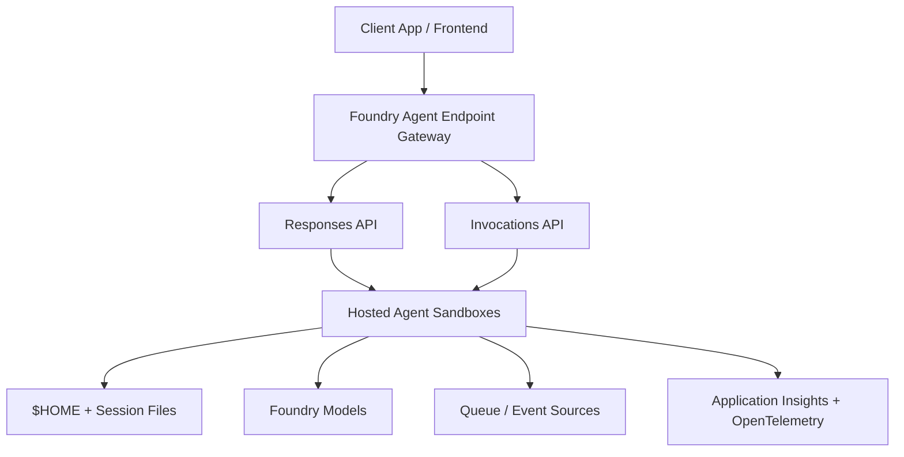

Agent workloads can sometimes be an awkward fit for the compute we would usually reach for. They can be bursty (a synthesis run spikes, then nothing for an hour), some of them are cadence-driven (a follow-up agent that wakes every 30 days), and a few run long enough that a request-response timeout is meaningless. Put that on always-on container replicas and you pay for a lot of idle.

[Microsoft Foundry Hosted Agents](https://learn.microsoft.com/azure/foundry/agents/concepts/hosted-agents?WT.mc_id=AZ-MVP-5004796) went generally available in July 2026, and it is built for that shape.

I built a service (product) that takes standard methodologies and frameworks, then supports them with agents (without giving away too much, I will keep this general). Six agents ran on Microsoft Foundry Hosted Agents, and one ran in a sidecar container.

This post is about the hosting decisions, protocol choices, and what I learnt while building that service, where the agents were built with Microsoft Agent Framework in Python.

It also builds on a few related posts: [Get Ahead with Self-Hosted Agents and Container Apps Jobs](https://luke.geek.nz/azure/hosted-agents-container-apps-job/), [Getting Started with Azure Developer CLI (azd)](https://luke.geek.nz/azure/azure-developer-cli), and [Running Azure SRE Agent for AKS and Drasi Operations](https://luke.geek.nz/azure/azure-sre-agent-aks-drasi/).

In short: this is a production story about choosing the right compute and protocol for each agent shape, not a generic tour of features.

## TL;DR

- Hosted Agents are excellent for bursty or scheduled workloads.
- Use Responses only when you genuinely need conversation history.
- Most task-oriented agents are better suited to Invocations.
- Size compute per agent rather than per application.
- Agents designed around in-process callbacks will not migrate cleanly.

{/* truncate */}

## What Microsoft Foundry hosted agents give you

The model is a VM-isolated sandbox created per session, on demand. It runs for the life of the session, then tears down. Two numbers define the economics:

- **15-minute idle timeout.** Compute is deprovisioned after 15 minutes of inactivity, and there is no cost while an agent is not serving requests.
- **30-day maximum session lifetime.** Long-running work is a first-class case, not something you fight the platform over.

The part that makes the idle timeout usable is that session contents survive it. Files written under `$HOME` are preserved when compute is deprovisioned and restored when the session resumes, so an idle gap is not a cold start from nothing.

The identity story is the bit I liked the most for this solution - the platform creates a dedicated Microsoft Entra agent identity for each hosted agent at deploy time, as a service principal the running container uses to call models and tools. You do not wire managed identities by hand. It can reach model inferencing and session storage by default, and for anything external (ie your own storage account) you can assign RBAC to that agent's identity. Six agents means six identities, which shrinks the blast radius of any one of them considerably.

:::info Why this matters
Six hosted agents means six Microsoft Entra identities.

If one agent is compromised, it cannot automatically access permissions granted to another.
:::

Telemetry is on by default too. The platform injects an Application Insights connection string and OpenTelemetry tracing without custom wiring, alongside a set of reserved variables:

| Variable                                | Purpose                                |
| --------------------------------------- | -------------------------------------- |
| `FOUNDRY_PROJECT_ENDPOINT`              | Foundry project endpoint URL           |
| `FOUNDRY_PROJECT_ARM_ID`                | Foundry project ARM resource ID        |
| `FOUNDRY_AGENT_NAME`                    | Name of the running agent              |
| `FOUNDRY_AGENT_VERSION`                 | Version of the running agent           |
| `FOUNDRY_AGENT_SESSION_ID`              | Session ID for the current request     |
| `APPLICATIONINSIGHTS_CONNECTION_STRING` | Application Insights connection string |

The `FOUNDRY_` prefix is reserved, and you should not redeclare any of these in your own configuration.

## Pick your protocol, and pick it on interaction shape

Containers can talk to the Foundry gateway through a protocol library, and this is where my original plan was wrong.

| Protocol                | Python library                     | Endpoint          | Best for                                                            |
| ----------------------- | ---------------------------------- | ----------------- | ------------------------------------------------------------------- |
| Responses               | `azure-ai-agentserver-responses`   | `/responses`      | Conversational, streaming, multi-turn with platform-managed history |
| Invocations             | `azure-ai-agentserver-invocations` | `/invocations`    | Webhook receivers, non-conversational processing, async workflows   |
| Invocations (WebSocket) | `azure-ai-agentserver-invocations` | `/invocations_ws` | Bidirectional streaming, real-time voice, interactive media         |

Both protocol libraries are in preview (the hosting platform itself is GA). They work, but the API surface can still change between beta releases.

I initially mapped all six Agents to Responses, because "agent" and "chat" are easy to conflate. That was wrong for half of them. `synthesis`, `simulation`, and `board-export` specific Agents were more controlled and structured: typed JSON in, typed JSON out, it had no conversation and no history to manage. So I moved to Invocations, along with a cadence-driven `follow-up`. Only a `conversational-qa` genuinely needed the Responses protocol.

> A useful heuristic: choose on interaction shape, not an "agent". If there is no multi-turn history worth the platform managing, Invocations is simpler, a single container can expose more than one protocol by declaring them in the `protocols` field, so this is not a one-way door.

:::tip Architecture at a glance



:::

:::tip
Containers serve on port **8088** locally, and the protocol libraries expose a `/readiness` endpoint for platform health checks automatically, so you do not implement it yourself. That means you can `POST http://localhost:8088/responses` and exercise the exact endpoint shape you get in production before you deploy anything.
:::

## Sizing is per agent

Compute is allocated per agent as a CPU and memory pair, so sizing is an agent-by-agent decision rather than a platform-wide one. This is how mine looked:

| Agent               | Allocation       | Why                                                                  |
| ------------------- | ---------------- | -------------------------------------------------------------------- |
| `conversational-qa` | 0.5 vCPU / 1 GiB | Retrieval-augmented Q&A, high idle time between user bursts          |
| `follow-up`         | 0.5 vCPU / 1 GiB | Lightweight cadence agent on a 30/60/90 schedule                     |
| `synthesis`         | 1 vCPU / 2 GiB   | Multi-step reasoning with tool orchestration and a human handoff     |
| `board-export`      | 1 vCPU / 2 GiB   | Orchestrates the export; heavy rendering stays in a separate service |
| `simulation`        | 2 vCPU / 4 GiB   | Deterministic rules engine, heaviest per invocation                  |

> Because compute scales to zero, the sizing decision is about the shape of a single invocation, not about what you are willing to pay to leave running!

Note the `board-export` line. I deliberately kept PDF and PowerPoint rendering (which is what this particular agent was helping with) out of the agent container and in a separate service, so the agent stays inside a modest allocation and the rendering can scale on its own terms.

## The one agent I could not host

There was one agent I wasn't able to host in Foundry Hosted Agents: a pre-mortem agent.

It used a `run()` method that takes a `cycle_runner: Callable[[int], Mapping]`, a Python callback the loop invokes on each cycle. That works fine in-process. It cannot work across the Hosted Agent RPC boundary, because you cannot serialise a Python callable and send it over the wire. The agent had to be reworked into an event-driven model, with cycle steps published through a queue or a change-detection reaction, before it can be hosted at all.

:::warning Migration blocker pattern
If your agent entry point accepts callables, open handles, shared in-memory objects, or live connections, it is implicitly assuming in-process execution.

Across an RPC boundary, those assumptions break.
:::

The general form of this: an agent that accepts a function as a parameter is quietly assuming it shares a process with its caller. That assumption is invisible in an architecture diagram, and it survives every unit test, right up until the agent becomes a container behind an RPC boundary. If you are planning a move to hosted compute, make sure to check your agent entry-points first and look for anything that is a callable, an open handle, a live connection, or a shared in-memory object. Those are your migration blockers, and they are much cheaper to find in an afternoon of reading than in a sprint of rework!

## Deploying with azd

I use [Azure Developer CLI](https://learn.microsoft.com/azure/developer/azure-developer-cli/install-azd?tabs=winget-windows%2Cbrew-mac%2Cscript-linux&pivots=os-windows&WT.mc_id=AZ-MVP-5004796) heavily in my projects - especially personal projects like this one. If you want the wider AZD view, I covered that in [Getting Started with Azure Developer CLI (azd)](https://luke.geek.nz/azure/azure-developer-cli). It makes redeployment easy, helps reduce Azure spend by deploying only when needed, and is a good pressure test for what a workload actually needs.

A simple:

```bash
azd deploy
```

This can provision and deploy an entire workload. In my service, it also built container images remotely in Azure Container Registry (so I did not need local Docker), pushed them, created a hosted agent version, created the dedicated Entra agent identity, and assigned the RBAC that identity needed. Each deploy creates a new version, previous versions are preserved, and the latest is active by default. `azd ai agent show` prints the name, version, protocols, container resources, and environment variables.

Agents were declared as a service in `azure.yaml`:

```yaml
services:
  my-agent:
    host: azure.ai.agent
    env:
      MODEL_DEPLOYMENT_NAME: gpt-5-mini
      GITHUB_TOKEN: ${{connections.agent-secrets.credentials.github_token}}
```

That second variable is worth calling out. Rather than baking a secret into the image or the YAML, you can reference a Foundry project connection with a `${{connections.<name>.<path>}}` placeholder, and the platform resolves it at sandbox start. A GET on the agent version returns the literal `${{...}}` text, so the resolved secret never comes back through the management API.

A few things worth mentioning that will cost you an afternoon if you miss them:

- Images must be **x86_64 (linux/amd64)**. On Apple Silicon, build with `docker build --platform linux/amd64 .` or you will produce an image the platform cannot run.
- You need the **Foundry Project Manager** role at project scope to deploy (recently renamed from Azure AI Project Manager, so both names are still floating about).
- Putting the container registry behind a private endpoint only works for Foundry projects created after **25 June 2026**. Older projects need the registry reachable publicly so the platform can pull.
- For the SDK path, `azure-ai-projects` **2.3.0 or later**.

For me, I even used [Azure Linux 4 Beta](https://techcommunity.microsoft.com/blog/linuxandopensourceblog/announcing-azure-linux-4-0-purpose-built-for-azure-now-in-public-preview/4524267?WT.mc_id=AZ-MVP-5004796), mostly for one reason: `because I could`.

## Final thoughts

For bursty and cadence-driven agents, per-session scale-to-zero and a per-agent identity remove a real pile of undifferentiated work: replica counts, warm pools, and identity wiring you would otherwise need to own.

If you are evaluating Hosted Agents today, my recommendations are:

- Start with one task-oriented agent and validate end-to-end behavior in production-like traffic.
- Default to Invocations unless conversation history clearly adds value.
- Keep heavy rendering and binary processing outside the hosted container.
- Design agents around message contracts and events, not callbacks.
- Treat each agent as an independently deployable workload with its own identity and sizing.

Hopefully this helps if you're weighing up Hosted Agents for real workloads.

## References

- [Hosted agents in Foundry Agent Service](https://learn.microsoft.com/azure/foundry/agents/concepts/hosted-agents?WT.mc_id=AZ-MVP-5004796)
- [Deploy a hosted agent](https://learn.microsoft.com/azure/foundry/agents/how-to/deploy-hosted-agent?WT.mc_id=AZ-MVP-5004796)
- [Manage hosted agent sessions](https://learn.microsoft.com/azure/foundry/agents/how-to/manage-hosted-sessions?WT.mc_id=AZ-MVP-5004796)
- [Introducing the new hosted agents in Foundry Agent Service](https://devblogs.microsoft.com/foundry/introducing-the-new-hosted-agents-in-foundry-agent-service-secure-scalable-compute-built-for-agents/?WT.mc_id=AZ-MVP-5004796)
- [Azure Update 563546: Agent Harness GA](https://azure.microsoft.com/updates?id=563546)
