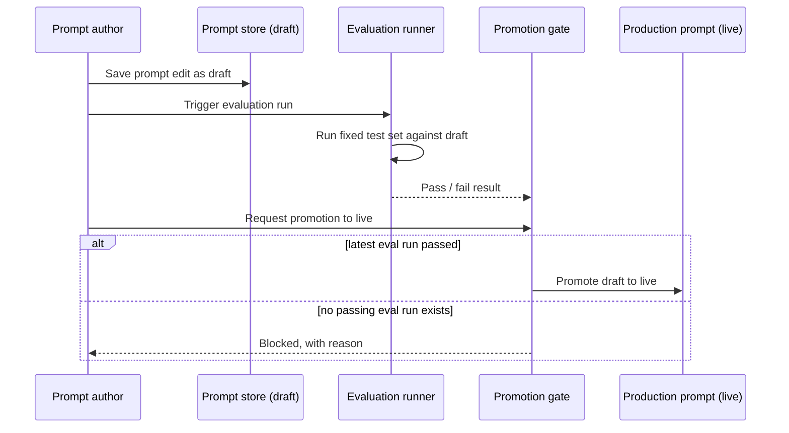

Most teams running LLM-backed features would never ship a code change without a test suite and a CI gate. Then they tweak a prompt, eyeball one output, and send it straight to production.

A prompt is still a dependency. Change it, and downstream behaviour can shift with no compiler warning, no failing build, and no obvious signal in the request pipeline.

<!-- truncate -->

## Why this fails quietly

A bad code change usually throws, times out, or fails a test. A bad prompt change degrades tone, drifts off format, starts hallucinating in a new way, or gets subtly less accurate, and every one of those failure modes returns a valid HTTP 200 with plausible-looking text. Nothing in a typical request/response cycle distinguishes a good prompt output from a degraded one. The only way to catch it is to check the output against something, before a customer does.

That is the gap an eval gate closes: a required check between "someone edited a prompt" and "that prompt is what production calls", in the same way CI sits between "someone pushed a commit" and "that commit is what is running".

## The pattern

A few design choices make this work rather than become theater:

- Fail closed: if no eval run exists yet for a prompt version, the gate blocks by default. "Assume it is fine because nobody checked" is exactly the failure mode this is meant to prevent.
- Check the latest run, not any run: a prompt that passed three edits ago does not get to ride on that old pass.
- Expose status without promotion: a read-only status check lets dashboards and operators inspect state without accidentally attempting promotion.
- Return an actionable reason: "Blocked" is not enough. "Blocked: latest eval failed on 3/40 factuality cases" gives the author somewhere to start.

## Where this sits on the maturity curve

This is one rung on a ladder, not the whole ladder:

1. **No process:** prompt changes go straight to production. Someone notices a regression from a support ticket or a screenshot.
2. **Manual review:** a second person reads the diff before it ships. Catches obvious problems, misses subtle ones, doesn't scale past a small team.
3. **Automated eval gate:** a fixed test set runs against every candidate prompt before promotion. Catches regressions against known cases, doesn't catch novel failure modes the test set doesn't cover.
4. **Continuous eval in production:** sample live traffic, run it back through evaluation, and feed regressions into the same test set that gates step 3. This is where the set gets stronger over time instead of freezing at whatever the team thought to write on day one.

Most teams building on [Microsoft Foundry](https://learn.microsoft.com/azure/foundry/what-is-foundry?WT.mc_id=AZ-MVP-5004796) or a similar platform are somewhere between 1 and 2 today. Getting to 3 doesn't need custom infrastructure. It needs wiring together pieces the platform already gives you.

## What steps 3 and 4 actually look like on Microsoft Foundry

The details matter here, because it is easy to overstate what is automatic.

Versioning is the unit of promotion, not the prompt text itself. Every save of a prompt-based agent in Foundry creates an immutable version. You route traffic to a specific version and roll back to a prior one if the new one misbehaves. Promotion is traffic moving from version N to N+1. Rollback is moving it back.

The evaluators are built in, not something you write from scratch. Foundry ships evaluators that map directly to common failure modes: Groundedness and Relevance for RAG-style factual drift, Coherence and Fluency for format and tone drift, Intent Resolution / Tool Call Accuracy / Task Adherence for agentic behaviour, and risk and safety evaluators (hate/unfairness, sexual, violence, self-harm, prompt injection) for the failure modes that matter far more than "the wording is a bit off".

The practical CI gate mechanism is a GitHub Action, and it is honest about uncertainty. The [`microsoft/ai-agent-evals` action (preview)](https://github.com/microsoft/ai-agent-evals) takes a candidate version and a baseline version in `agent-name:version` form, runs both against your dataset with the evaluators you name, and returns scores with confidence intervals and significance testing. That is the difference between "up by 0.02" (likely noise) and "significantly better at p&lt;0.05" (likely real).

The caveat is important: there is no single "promote" API that the platform automatically blocks on your own score threshold. Promotion in Foundry today is a human or CI decision informed by comparison output. So "fail closed" is still your pipeline logic. Do not merge, deploy, or re-route traffic unless the evaluation step passed.

Step 4, continuous evaluation, is largely an observability workflow, not a separate product build. Once a version is live, Foundry can sample production traffic and traces on a recurring schedule, then score with the same evaluators. Same regression question, now asked continuously.

## The trap worth naming: the gate becoming a bottleneck teams route around

A gate that is slow, opaque, or noisy on legitimate changes gets bypassed. Someone finds the emergency override, uses it "just this once", and six months later the override is the normal path and the gate is decoration. Three things help prevent that:

- Fast eval loops: if checking a candidate takes twenty minutes, people batch changes and avoid the gate. Minutes, not tens of minutes, for the common path.
- Clear failure output: a pass/fail flag with no detail teaches people to distrust the gate instead of fixing the prompt.
- An audited escape hatch: emergencies happen. The override should exist, but it should be logged, attributed, and visible.

## Treat the prompt like the artifact it is

Treat a prompt exactly like any other artefact that can change production behaviour without a compiler catching mistakes. Give it a test set, give it a gate, and default that gate to blocking until proven otherwise.

This gives you a practical path from manual review to repeatable evaluation gates, and catches the quiet regressions before customers do.
