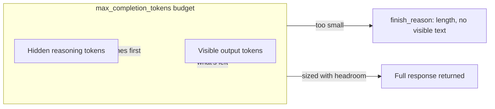

Swapping only the deployment name is not a safe change for reasoning-tier models. Even with the same endpoint and SDK, reasoning deployments (o-series, GPT-5+) can fail in at least four different ways, and you usually only see them under real traffic.

<!-- truncate -->

## 1. The API surface itself might change under you

Azure OpenAI currently has two versioning surfaces. The legacy route uses dated strings like `POST {endpoint}/openai/responses?api-version=2025-04-01-preview`. The newer route, `/openai/v1/responses`, is designed to remove that treadmill. In preview, it expects the literal `api-version=preview` rather than a date. At GA, `api-version` is no longer required.

If your client or agent framework moved to `/v1/` but your config still sends a dated legacy value, you get `400 API version not supported`. The value can look reasonable while still being wrong for that route.

Two checks matter here. First, rollout behavior is not fully uniform: some resources have accepted a specific dated preview value (`2025-11-15-preview`) instead of literal `preview`. Second, `/openai/v1/...` only exists when the "Next-generation APIs (v1 preview)" feature is enabled on the resource. If it is not enabled, you get a 404 instead of a version error.

## 2. Sampling parameters your code has always sent

Reasoning models don't accept the sampling parameters chat models take for granted:

- `temperature`
- `top_p`
- `presence_penalty`
- `frequency_penalty`
- `logprobs` / `top_logprobs`
- `logit_bias`
- `max_tokens` (superseded by `max_completion_tokens` or `max_output_tokens`, see below)

Code that hardcodes `temperature=0.7` because older deployments accepted it will fail against reasoning-tier models. There is no graceful fallback. The request errors.

The durable fix is to make sampling parameters conditional, not assumed. Send your normal set, and if the model rejects a non-essential field, drop it and retry.

## 3. Reasoning tokens draw from your visible-output budget

This is the most confusing trap because it usually does not error. It just returns nothing.

Reasoning models spend tokens on internal reasoning before they produce any visible output. Those hidden reasoning tokens count against the same budget as the answer text: `max_completion_tokens` on the Chat Completions API, or `max_output_tokens` on the Responses API. Microsoft's own docs put it directly: `max_completion_tokens` is "an upper bound for the number of tokens that can be generated for a completion, including visible output tokens and reasoning tokens."

If you size that budget like a non-reasoning model, you can get `finish_reason: "length"` with an empty response. The model spent the whole allowance reasoning and never emitted visible text. This looks like a timeout or parser issue, which makes root cause hard to spot unless you inspect `completion_tokens_details.reasoning_tokens`.

The fix is a floor, not a formula. Reserve materially more headroom than visible output needs, and treat that as a hard minimum for reasoning-tier deployments.

## 4. reasoning_effort is a real lever, and its defaults vary by model

`reasoning_effort` controls how long the model reasons before responding. Most reasoning models support `low`, `medium`, and `high`. GPT-5 models also add `minimal` for latency-sensitive paths. Check support per deployment:

- `gpt-5.1`, `gpt-5.2`, and `gpt-5.1-codex*` support `none`, which explicitly disables reasoning, but on `gpt-5.1` you have to pass it explicitly. Unlike earlier reasoning models, it does not default to any particular effort level.
- `gpt-5-pro` only supports `high`, and defaults to it even if you omit the parameter.
- `o1-mini` doesn't support `reasoning_effort` at all.
- Parallel tool calls aren't supported when `reasoning_effort="minimal"`, which matters if your agent framework relies on parallel tool invocation.

For latency-sensitive interactive paths, moving to `low` or `minimal` is often your largest latency lever. Set it explicitly per deployment rather than copying values across models in the same family.

## The timeout budget these interact with

Reasoning latency must fit inside the timeout budget in front of your endpoint. In Azure Container Apps, default (non-premium) ingress timeout is fixed at 240 seconds and is not configurable. If you need longer, the supported option is premium ingress, where you can raise idle timeout (`--request-idle-timeout`) up to 30 minutes, with a 4-minute minimum. This is an idle timeout (no-activity window), not a hard total-duration cap, but it is the practical control that decides whether high-effort reasoning calls survive.

Before increasing `reasoning_effort` on an interactive path, verify what sits in front of the endpoint and whether that timeout budget matches real latency at the new effort level.

## A short checklist before swapping in a reasoning-tier model

- Confirm which API surface your client or agent framework targets, and match `api-version` to that surface, not to habit.
- Strip `temperature` and the other unsupported sampling parameters from reasoning-model call paths, or make them conditional.
- Raise `max_completion_tokens` / `max_output_tokens` with explicit headroom for hidden reasoning tokens, and check `completion_tokens_details.reasoning_tokens` in a test call before assuming the budget is sized correctly.
- Set `reasoning_effort` deliberately per deployment rather than inheriting a value from a different model in the family, and check whether your target model supports the value you're setting.
- Check the ingress or gateway timeout in front of the endpoint against the latency a higher effort level will actually produce.

They are easy to miss because older deployments often tolerated defaults that reasoning-tier deployments reject.