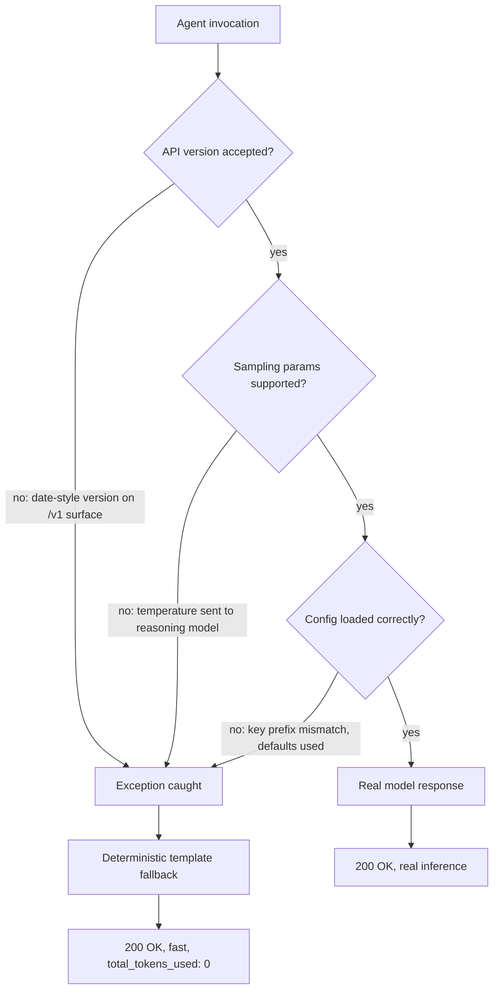

A system I was debugging had AI-generated content flowing through it for days. The responses came back fast. No errors in the logs. No alerts fired. Every single response was templated.

The fallback logic was intentional. If a model call failed, the system would return a deterministic template instead of showing the user an error. That works fine when failures are actually rare. But something had gone wrong. The fallback wasn't rare anymore - it was the only path that ever executed. And nobody was watching for it.

<!-- truncate -->

## The slow collapse

It wasn't one thing. There were three separate bugs, each independently harmless, each invisible on its own. Stack them together and everything breaks—but still looks fine from the outside.

**The API version thing:** Azure OpenAI migrated to a new request surface. The old path uses dated version strings like `api-version=2025-04-01-preview`. The new `/openai/v1/...` surface is different—it wants `api-version=preview` while it's in preview, and eventually the parameter goes away entirely. A client configured with the old dated string hitting the new surface gets a `400 API version not supported`. Except it doesn't fail loud. The exception gets caught and swallowed. The fallback fires.

**Then there was the parameter mismatch.** Reasoning models (o-series, GPT-5, future ones) drop support for `temperature`, `top_p`, `presence_penalty`, and a bunch of other sampling params. Code that hardcodes `temperature=0.7` because that was always safe breaks immediately when the deployment switches to one of these models. Again: the request fails, gets caught, fallback executes.

**The third one was the config issue.** The system used a prefix-trimming config loader. Useful feature: strip `App1/` off every key, so code queries `message` instead of the full `App1/message`. Except in this codebase, *every reader* was querying the full untrimmed key. So every read missed. Every read fell back to its hardcoded default. Model routing config, prompt versions, retry budgets—all silently reverted to defaults. No error, because a missing key with a default isn't treated as a failure.

Individually, any one would have been caught in testing. Together, they created a system that looked completely fine while doing none of what it was designed to do. The kind of bug you only catch by accident.

## How it stayed invisible

Each failure was caught and logged—at a verbosity level nobody monitors in production. The fallback was doing its job: catch the exception, return the template, keep the response flowing. From a monitoring dashboard, this looks perfect. 200s coming back, response times good, no error spikes.

Your observability is built to catch failures. Not wrongness. A system that breaks and admits it will get your attention. A system that breaks and lies will not.

## The one signal that mattered

Fast response time plus `total_tokens_used: 0` in the telemetry. That's the signature. Real inference against a reasoning model takes real time and burns real tokens. A lot of them. The model spends tokens on reasoning steps you never see. A fallback returns instantly and never touches the model. Zero tokens.

If you're logging token usage per request, this becomes a cheap way to distinguish "actual inference" from "template." Except you have to know to look.

Diagnosing this required getting into the running container and calling the agent manually with the prod credentials. The health check doesn't catch it. Once I fixed the API version problem and the actual model call went through, the system still wasn't working right. The config was still defaulting everything. That took another pass through the config loader to spot.

## What I'd do differently

**Validate at the config boundary.** Wherever your client config meets the SDK, actually check that the values are legal for the SDK you're using. Not just syntactically valid—actually accepted by this version of this model. A version mismatch should fail at startup, loudly, not hide inside exception handling in production.

**Make fallback usage visible.** Don't lump fallback executions into your generic error log. Emit a distinct counter every time it happens. Then alert on the *rate*. A system that falls back once a day is resilient. One that falls back 99% of the time and never mentioned it is busted.

**Log token usage and alert on zero.** If your SDK exposes usage metrics, log them with every response. Set an alert threshold on responses that used zero tokens (outside of intentional cache hits). It's one of the cheapest correctness checks you can add.

## What this changes about well-architected

The standard resiliency review checks whether your system degrades gracefully. Necessary. Not sufficient for LLM-backed systems. Graceful degradation and silent correctness failure look identical on a dashboard that only tracks uptime and latency.

Add this question instead: *can this system be wrong in a way that looks fine?* For AI systems, that means: when a model call fails, does the fallback emit a signal? Is anyone actually watching it? Because a monitored fallback is resilience. An unmonitored one is just a way to be confidently wrong.